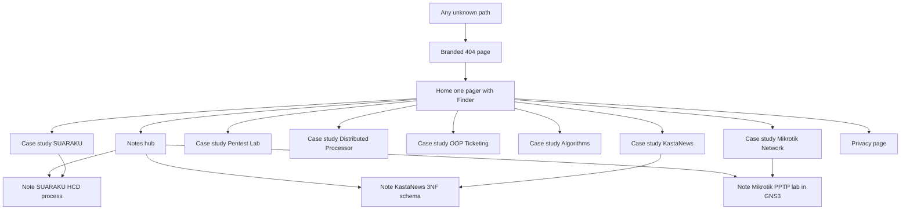
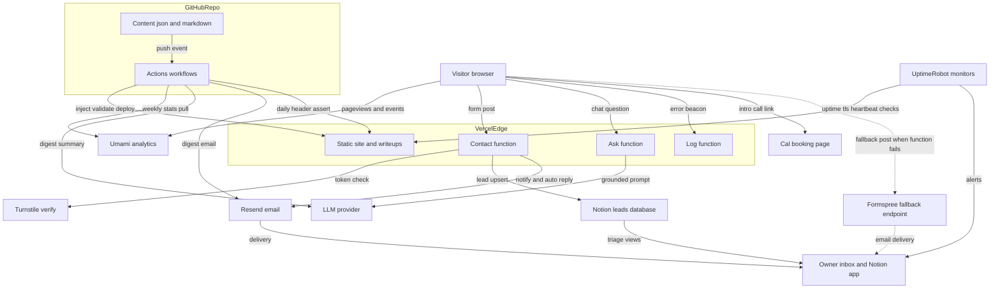
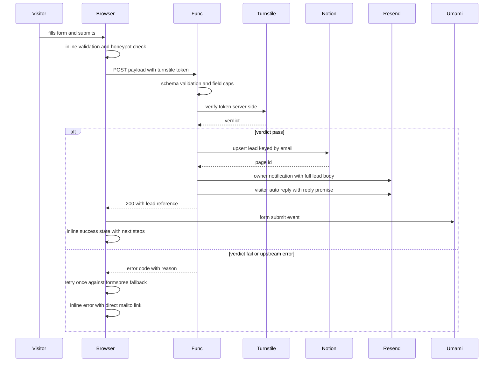
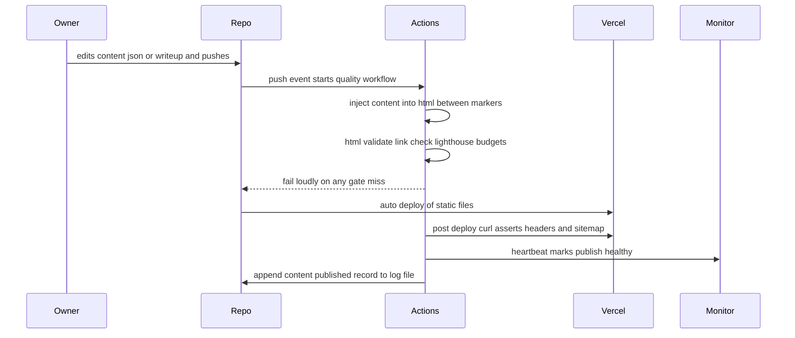
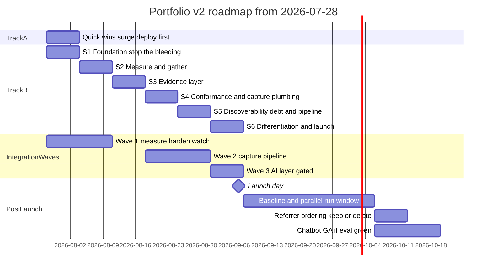
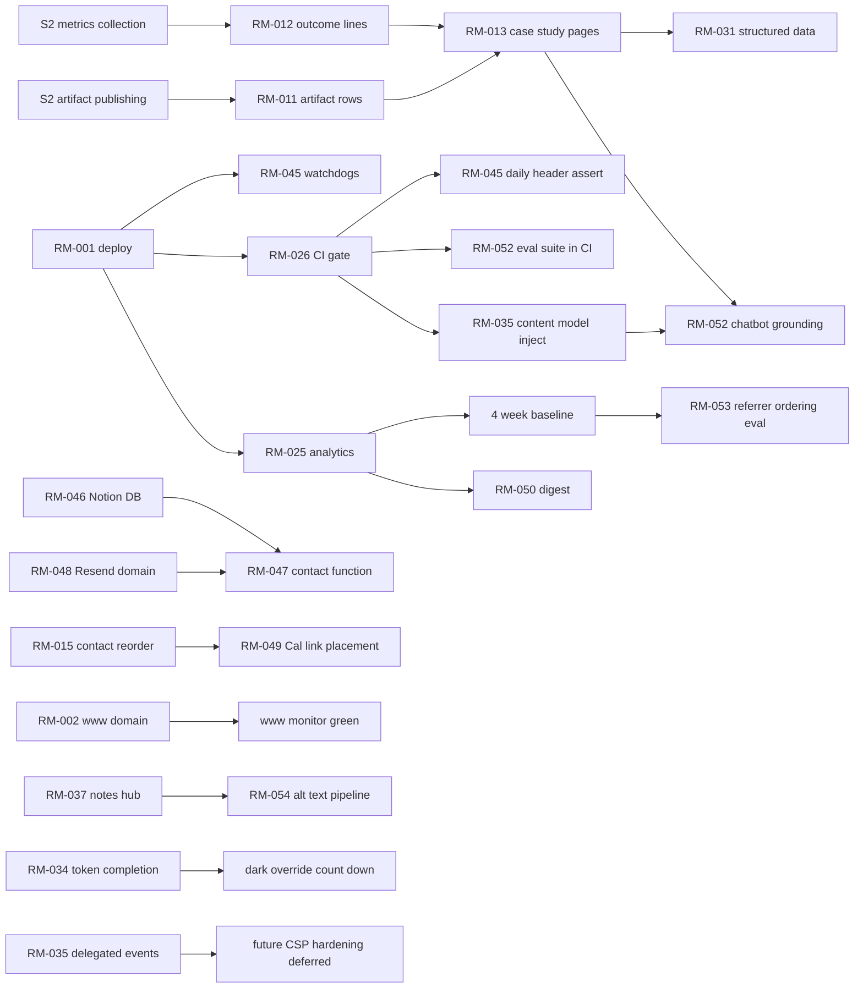

# ⚔️ OPERATION DEEP AUDIT — Final Report
**Subject:** `brilliantgibranportofolio.my.id` · Brilliant Gibran Adhinata J.
**Author:** The Audit Council (10-specialist AI panel) · **Date:** 2026-07-27 · **Mode:** Full Audit (code + live URL) · **Findings:** 82 (0 P0 · 11 P1 · 30 P2 · 29 P3 · 12 P4)

---

# Executive Summary & Scorecard

## Overall: 63 / 100 — "competent but leaking value"

The verdict in one sentence: **a top-decile container wrapped around bottom-decile proof.** The craft layer — the Finder metaphor, the dual-theme token system, the choreographed motion, a zero-dependency 169 KB codebase with 736 ms lab LCP — would survive scrutiny from any peer reviewer. But the layer that actually converts a recruiter — evidence — is structurally missing: all 7 projects are linkless dead ends, zero outcomes are quantified anywhere, the value proposition is a category label, and phones ≤375 px amputate the primary CTA. Meanwhile production has been serving a 9-day-stale build the entire time, so even the completed fixes are invisible to every real visitor.

| Dimension | Weight | Score | Band anchor |
|---|---|---|---|
| Concept Fidelity | ×1.5 | **70** | Pillars shipped, but the two goal-critical ones (conversion, proof) degraded |
| UI / Visual Craft | ×1.0 | **64** | Strong system; 3 P1s (mobile amputation, contrast layer, proof links) |
| UX & Journey | ×1.5 | **55** | 5 P1s sit directly on the conversion path |
| Copywriting | ×1.25 | **48** | 3 P1s: label-not-claim, dead ends, zero numbers; inflated stats |
| SEO | ×1.0 | **62** | Technical plumbing complete; single-URL ceiling is structural |
| Performance | ×1.0 | **66** | Excellent lab CWV; font chain + inline base64 threaten real-4G LCP |
| Accessibility | ×1.0 | **58** | 1 P1 + 5 P2s: reflow, headings, contrast, SR-invisible form |
| Security | ×1.0 | **74** | Tiny surface, good config — none of it live (deploy drift) |
| Code Quality | ×1.0 | **70** | Disciplined hand-written single file; zero CI, token layer half-built |
| **Weighted overall** | | **63** | 60–74: competent but leaking value |

## The 5 most damaging problems

1. **GAP-001** — Production runs the 2026-07-17 build: no mobile menu, no security headers, 2.4 MB of images. Nothing else in this report exists for visitors until deploy.
2. **COPY-02 / JRN-01 / UX-002** — Not one repo, demo, Figma, or document link in all 7 projects. The site *asserts* work instead of *showing* it — fatal for P1 and P2 alike.
3. **COPY-03** — Zero quantified outcomes; a SUS usability test was run and the score never published.
4. **UX-001 / A11Y-02 / JRN-02** — At ≤375 px the third stat and "Get in Touch" are clipped off-viewport, unrecoverable behind `overflow-x:hidden`.
5. **COPY-01** — "Computer Science Student & Multi-Domain Builder" is a label, not a reason to shortlist; the word "internship" first appears six screens down.

## The 5 biggest opportunities

1. **FIX-04 + deploy (SEC-01, GAP-001)** — one `git push` turns on every completed fix plus the full header set. Minutes, not hours.
2. **FIX-01 font rework (PERF-01, UX-013)** — collapse 4 families / 20 faces to 2 preloaded self-hosted faces: the single biggest real-4G LCP lever, ~1 hour.
3. **Outcome-mining pass (COPY-03, COPY-04)** — the numbers already exist in coursework artifacts (SUS score, node counts, Big-O tables, cert IDs); one evening of collection rewrites every project from assertion to evidence.
4. **Per-project case-study pages (SEO-02, SEO-03, COPY-02)** — converts the one-pager's SEO ceiling into a content moat and gives every project a linkable, indexable proof URL.
5. **Umami + the 15-event taxonomy (JRN-10, GAP-008)** — instrument now so every v2.0 decision, and every KPI target in the PRD, gets a real baseline.

**If I were you, here is exactly what I would do Monday morning:** push the pending local work to production before lunch — it is finished, verified, and strictly better than what is live. Spend the afternoon applying Fix Pack items 1–4 (fonts, base64 extraction, caching, headers-verify) and grep-fixing "1 Years Experience". Then stop touching code for the rest of the week and mine your own coursework for numbers: the SUS score, the Hadoop node benchmark, the pentest scope, the 3NF table count. Those numbers — not new animations — are what turn this from a beautiful brochure into a hiring argument, and every subsequent sprint in this report assumes you have them.

---

---

# D0 — Recon Dossier

## 0.A Intake Summary

**Restated goal [ASSUMPTION-01]:** get Brilliant Gibran shortlisted for internships and entry-level software roles (Jakarta + remote), with freelance leads as the secondary conversion.

| Input | Status |
|---|---|
| INITIAL_CONCEPT | **Missing** → reconstructed from the artifact itself (ASSUMPTION-04); pillars in 0.B |
| LIVE_URL | `https://brilliantgibranportofolio.my.id` — fetched [VERIFIED]; deploy dated 2026-07-17, **9 days behind local code** |
| SOURCE_CODE | Full local repo, read line-by-line this session [VERIFIED] |
| PRIMARY_GOAL | Missing → ASSUMPTION-01 (derived from "Open to internships, freelance projects" on-page copy) |
| TARGET_AUDIENCE | Missing → recruiters / clients / peers (ASSUMPTION-01) |
| TECH_STACK | Hand-written HTML/CSS/JS, zero dependencies, no build step, Vercel [VERIFIED] |
| BRAND_PERSONALITY | Missing → "precise, crafted, technical, quietly confident" (ASSUMPTION-02) |
| CONSTRAINTS | Missing → student budget ≈ $0/month, ~10 hrs/week, keep Vercel (ASSUMPTION-03) |
| AVAILABLE_APPS | Vercel + Formspree in use [VERIFIED]; free tiers only assumed (ASSUMPTION-03) |
| ANALYTICS_DATA | None exists — no analytics installed at all [VERIFIED] |
| COMPETITOR_URLS | N/A → Council selects 3 archetypes (§1.6, ASSUMPTION-06) |
| CONTENT_ASSETS | 7 course projects, 3 certifications, CV PDF [VERIFIED]; no testimonials, no metrics |
| TIMELINE | N/A → default 6 sprints × 1 week (ASSUMPTION-05) |

**Tools available this run:** web fetch (curl — used on live URL), local code execution (Python/Node — used for image work), full browser automation (Playwright — used for lab CWV: LCP 736 ms, CLS 0.0014, 0 console errors). Full Lighthouse on throttled hardware **not** run → Appendix C.

**Mode:** Full Audit Mode (code + URL). Where they disagree, local code is the object of record — the live site is simply stale (GAP-001).

## 0.B Concept Distillation [ASSUMPTION-04 — reconstructed]

No written INITIAL_CONCEPT was provided; these pillars are reverse-engineered from what the artifact visibly attempts. Confidence: INFERRED throughout.

| # | Pillar | What it promised | Why it mattered to the goal | Detectable signature |
|---|---|---|---|---|
| C1 | **Personal desktop-OS metaphor** | Projects browsed in a macOS-Finder replica; identity as an "operating system" | Instant differentiation from template portfolios; memorability for P1 | `.finder-wrap`, traffic-light dots, sidebar filters, folder grid |
| C2 | **Multi-domain builder positioning** | Not "frontend dev" but UX + database + cloud + security breadth | Widens the internship funnel; honest about student-stage generalism | Hero tagline typewriter; 4 skill domains; projects spanning all four |
| C3 | **Choreographed motion identity** | Loading sequence → staggered hero → scroll-driven reveals; site feels alive | Signals craft to P3, ambition to P1 | Loader, letter-split h1, `.wr` reveal system, orbital canvas |
| C4 | **Recruiter-speed conversion** | Decide in 30 seconds: status pill, stats, CV download, Hire Me | P1 never hunts; the funnel is above the fold | `.hero-status`, `.hero-stats`, 3-button CTA row, nav Hire Me |
| C5 | **Evidence of rigor** | Real credential IDs, named frameworks (3NF, SUS, IDEAL), verifiable certs | Compensates for thin work history with verifiable study depth | Cert cards with credential IDs + Coursera verify link |
| C6 | **Dual-theme polish** | Light/dark as a first-class, hand-tuned experience | Perceived-quality signal for P3 | Token system, `html.dark` overrides, theme toggle |
| C7 | **Low-friction contact** | Form + direct email + response-time promise | Leads never lost to friction | Formspree form, `mailto:`, "Replies usually within 24 hours" |

## 0.C Executed-Site Inventory

**Page inventory** (single route; sections are fragment anchors):

| Route | Purpose | Key sections | Primary CTA | ~Words | Notable assets |
|---|---|---|---|---|---|
| `/` | Entire portfolio | hero · about · projects · experience · certifications · skills · contact | "Hire Me" (nav) / form submit | ~1,400 | Finder UI, ID-card badge (base64 JPEG), polaroid photo, orbital canvas |
| `/CV BRILLIANT.pdf` | Résumé download | — | — | — | 6 KB PDF (unusually small — flagged for content review) |
| `/robots.txt`, `/sitemap.xml` | Crawl plumbing | — | — | — | Single-URL sitemap, lastmod 2026-07-27 |

**Component inventory:** fixed nav + hamburger menu · loading screen · status pill · split-letter h1 · typewriter tagline · stat counters · magnetic buttons (3 variants) · stack card with chips · CSS ID-card badge · scroll indicator · polaroid frame · Finder window (bar, sidebar, folder grid, detail panel) · experience rows · cert cards (2 issuer skins) · skill domain cards · contact form (5 fields + success state) · social morph pills · footer · theme toggle · skip link · scroll-progress bar · texture overlays.

**Content inventory:** 7 projects (JS data objects, ~50-word descriptions, no images, no links to code/demos) · 3 experience entries · 3 certifications (2 with verifiable IDs) · 4 skill domains ≈ 27 skill pills · 1 contact form · 1 email · 3 social links · 1 CV PDF · **0 testimonials · 0 case-study pages · 0 blog posts · 0 project screenshots**.

## 0.D Audit Personas

| | P1 — 30-Second Recruiter | P2 — Skeptical Client | P3 — Peer Practitioner |
|---|---|---|---|
| Goal | Shortlist or close-tab | De-risk a small paid engagement | Judge craft; refer or dismiss |
| Scanning | Above fold + one project title | Proof surfaces: outcomes, process, testimonials, response promise | View-source, motion quality, writing depth |
| Deal-breakers | Broken mobile, vague identity, no CV | No evidence anyone paid/benefited; no outcomes | Template smell, sloppy code, inflated claims |
| The one question | "Can I put this person in front of my hiring manager?" | "Will this student actually deliver?" | "Is the craft real?" |

## 0.E North Star & KPI Baseline

**Primary conversion event:** qualified contact-form submission (secondary: CV download, Coursera credential verify click).

| KPI | Baseline | Source |
|---|---|---|
| Unique visitors / month | unknown — instrument in v2.0 | no analytics exists |
| Form submissions / month | unknown — Formspree dashboard has it; not provided | Appendix C |
| CV downloads / month | unknown — instrument in v2.0 | — |
| Conversion rate (visit → contact) | unknown — instrument in v2.0 | — |
| Avg. engagement time | unknown — instrument in v2.0 | — |
| LCP (lab, localhost, unthrottled) | **736 ms** | Playwright this session [VERIFIED] |
| CLS (lab) | **0.0014** | Playwright this session [VERIFIED] |
| Search impressions | unknown — Search Console is verified (`google-site-verification` meta present) but data not provided | Appendix C |

---

# D1 — Deep Concept & Gap Analysis

## 1.1 Vision-vs-Reality Matrix

Concept pillars are reconstructed (ASSUMPTION-04); statuses are judged against evidence, which stands regardless of the reconstruction.

| Pillar | Status | What actually exists | Gap description | Severity | Evidence | GAP-ID |
|---|---|---|---|---|---|---|
| — (meta) | **DEGRADED** | Production runs the 2026-07-17 build: no mobile menu below 600px, 2.4 MB of unoptimized images, zero custom security headers, none of this week's fixes | The audited site and the site recruiters see are different sites; every local win is invisible until deploy | P1 | `curl`: Last-Modified 17 Jul, `Age: 776087`, live HTML contains `sparkle-canvas`, `og-cover.png`, no `nav-burger`/`<h1>` [VERIFIED] | GAP-001 |
| C1 Desktop-OS metaphor | **SHIPPED** | Full Finder replica: title bar, traffic lights, sidebar filters, folder grid, detail panel | Metaphor is surface-deep: traffic-light dots are inert decoration (UX-011) and folders open into linkless text panels (UX-012, COPY-02) | P2 | `index.html:3455-3630`, `4285-4351` | GAP-002 |
| C2 Multi-domain builder | **DIVERGED** | The breadth exists (4 domains, 7 projects spanning them) but is presented as a category label, not a decidable claim | "Computer Science Student & Multi-Domain Builder" answers *what he is*, never *why shortlist him*; the word "internship" first appears at line 3828, below six screens of scroll | P1 | COPY-01; `index.html:8,22,3399` | GAP-003 |
| C3 Choreographed motion | **SHIPPED** | Loader → letter-split h1 → typewriter → staggered reveals; recently pruned of sparkles/grain/cursor; CSS reduced-motion gate is designed | Residual cost: the value message is animation-gated (~2.6 s to legible tagline, UX-004/JRN-06) and JS animations ignore reduced-motion (A11Y-03) | P2 | `index.html:4054-4074`, `4148-4166` | GAP-004 |
| C4 Recruiter-speed conversion | **DEGRADED** | Status pill, stats, CV button, Hire Me all exist above the fold | On phones ≤375 px the third stat and "Get in Touch" are amputated by `overflow-x:hidden` (UX-001/A11Y-02/JRN-02); the stats themselves damage credibility ("1 Years Experience", "7 Projects Shipped" for coursework — COPY-04) | P1 | measured 397 px rows in 360 px viewport; `index.html:3317-3324` | GAP-005 |
| C5 Evidence of rigor | **PARTIAL** | 3 cert cards (1 with working Coursera verify link), framework name-drops (3NF, SUS, IDEAL), 27 skill pills | The proof chain breaks exactly where it matters: zero repo/demo/document links in all 7 projects, zero quantified outcomes, SUS administered but score withheld, "Verified · BPJPH" with no verification path (COPY-02/03/07) | P1 | `index.html:4285-4351`, `3743-3746` | GAP-006 |
| C6 Dual-theme polish | **SHIPPED** | Token-driven light/dark, hand-tuned overrides, working toggle (both-icons bug fixed this session) | Minor: dark-mode `em` at 1.42:1 and shimmer-heading erasing emphasis (UX-018) | P4 | `index.html:2363-2365` | — |
| C7 Low-friction contact | **PARTIAL** | Formspree form with success state, direct email, 24-hour reply promise, 3 socials | Failure path is `alert()`, success removes the submit button, quota is bot-exposed (no honeypot), and email/LinkedIn sit 831 px below the `#contact` landing point (UX-008, SEC-04, JRN-03) | P2 | `index.html:4378-4407`, `3832-3864` | GAP-007 |
| — (meta) | **MISSING** | No analytics, no event instrumentation, no Search Console data pulled, no Formspree stats reviewed | The funnel is unmeasurable; every KPI in 0.E reads "unknown"; v2.0 targets have no baseline (JRN-10) | P2 | full-file grep: zero analytics scripts [VERIFIED] | GAP-008 |

### Where the Vision Drifted

**The container got every hour; the contents got none.** The distinctive shell — Finder chrome, ID-card badge, letter-split hero, orbital canvas — is executed at a level far above the median student portfolio, while the seven projects inside it are 50-word summaries with no links, no images, no numbers (COPY-02/03, UX-002). The effort allocation is visible in the code itself: ~2,900 lines of CSS and ~770 lines of animation JS against seven content objects totaling ~350 words (`index.html:4285-4335`). This is the classic presentation-outran-proof inversion, and for the stated goal it is exactly backwards: P1 recruiters forgive a plain site with strong proof; they do not forgive the reverse.

**Maximalism, then an interrupted correction.** The banned-effects layer (sparkle bursts, animated grain, custom cursor — all present in the live deploy) says the original motion instinct was additive: more layers, more life. The Track A intervention this week pruned it to a disciplined system, but the correction stopped at the decorative layer; the structural motion problem — content gated behind 2.3–2.6 s choreography, `.reveal` elements invisible without JS (UX-004, UX-017) — survived because it is wired into how content enters the page at all.

**No feedback loop, so drift went unnoticed.** With zero CI (CODE-02), zero analytics (JRN-10/GAP-008), and a two-commit git history ("Tugas Kecil 1", "Phase 3 complete"), nothing ever told the owner that production was nine days stale, that ~110 lines of CSS were dead, or that phones amputate the CTA row. Every defect in this register survived because no instrument existed to surface it. This is a process gap, not a skill gap — the fix (deploy hook + CI + one analytics script) costs an afternoon.

**Speculation, labeled as such:** the pattern of file timestamps (a burst on 20:19, another at 20:46–20:52, then this session) and the interrupted-agent handoff suggest the site is built in intense assisted sprints with long gaps between them. That cadence produces exactly what the register shows: high local polish, weak cross-cutting consistency (nav order vs section order — UX-006/COPY-09), and stale production. The weekly cadence in §5.8 is designed against this failure mode specifically.

## 1.2 UI/UX Deep Audit

Object: local `index.html` (~4,650 lines, single file). Method: full source read; runtime verification in Chromium at 360/375 px via localhost (this session); WCAG contrast ratios computed from the exact hex values in the stylesheet. All line references are `index.html` unless stated.

---

### (a) Heuristic Evaluation — 10 Nielsen heuristics, portfolio-adapted

| # | Heuristic | Score /10 | Single worst observed violation |
|---|-----------|:---:|---|
| 1 | Visibility of system status | 6 | No scroll-spy: the entire `<script>` block (3914–4607) contains no code that marks the current section in the nav; runtime check confirmed all six `.nav-link` elements keep class `"nav-link"` at every scroll position. On a 6-section one-pager the user never knows where they are. |
| 2 | Match between system and real world | 7 | The Finder metaphor's traffic-light dots (`.f-dot.r/.y/.g`, 3479–3481) are the strongest close/minimize affordance macOS owns — and they are inert `<div>`s. The metaphor promises window controls it doesn't honor. |
| 3 | User control and freedom | 5 | `openProject()` (4337–4351) swaps `innerHTML` with no history entry: browser Back exits the site instead of the detail panel. `Escape` is only wired to the mobile menu (3958–3963), not the project detail. |
| 4 | Consistency and standards | 6 | Nav order is About→Projects→**Skills**→Experience→Certifications→Contact (3239–3244); DOM order is About→Projects→**Experience→Certifications→Skills** (3637, 3668, 3753). Clicking nav links left-to-right makes the page jump backwards. Secondary: date formats mix "May 2026 – Present", "2024 – Present", "June 2026", "April 27, 2026". |
| 5 | Error prevention | 6 | The contact form (3832–3864) relies entirely on browser-default `required` validation; the optional Subject field (3845) is not marked optional, and there is no maxlength or inline guidance anywhere. |
| 6 | Recognition rather than recall | 6 | At ≤900px `.finder-side { display:none }` (1994–1996) removes the only category-filter UI — mobile users must recall a taxonomy (UI/UX, Backend & DB, Security) they can no longer see. |
| 7 | Flexibility and efficiency of use | 6 | Project folders are `<button onclick>` (e.g. 3527), not links: no middle-click, no open-in-new-tab, no copyable URL per project. The skip link (3224) is the only power-user affordance. |
| 8 | Aesthetic and minimalist design | 6 | Six infinite idle animations run simultaneously above the fold: `pulse-dot` (1174), `badge-swing` (1423), `float-gentle` (1431), `bounce-arr` (1473), the orbital canvas rAF loop (4004–4051), and `progress-glow` at 1.2s alternate infinite (802–804). Nothing above the fold is ever at rest. |
| 9 | Help users recognize, diagnose, recover from errors | 4 | Form failure = `alert('Something went wrong. Please email me directly.')` (4399) and `alert('Network error. Please try again.')` (4405) — stock OS dialogs at the exact moment a recruiter tries to make contact, on a page where every other pixel is art-directed. |
| 10 | Help and documentation (onboarding cues) | 7 | The "Scroll" cue exists (3411–3416), but folder tiles carry only cryptic two-line labels ("SUARAKU / UI/UX", 3537) — nothing signals that clicking opens a description, and hover is the only affordance hint (touch users get none). |

**Composite read:** mechanics of a polished site, wayfinding of an unfinished one. The three weakest heuristics (3, 9, 1) share a root cause: all interactivity is one-way JS mutation with no state model — no URL, no history, no inline messaging.

---

### (b) Visual System

**Typography.** Four Google Fonts families are requested (line 60): Inter (7 weights), Source Code Pro (5 weights), DM Serif Display (2 styles), Playfair Display (**8 variants**). Runtime font enumeration across every element in the DOM found exactly three families in use: `Inter`, `"Source Code Pro"`, `"DM Serif Display"` — **Playfair Display is dead weight on the critical path** [VERIFIED]. The working trio is actually a sound pairing: DM Serif Display for the hero name (1178–1208), Inter as workhorse, SCP for micro-labels — consistent with the site's "crafted/technical" identity. But there is no scale: font sizes are hardcoded at 8, 9, 10, 10.5, 11, 12, 13, 13.5, 14, 15, 16, 17, 22 px plus five ad-hoc `clamp()`s — a 13-step pile, not a modular scale, and the floor is too low: `.id-card-org` is 8px (2723), `.stack-label` and `.info-key` are 9px (1345, 1541). Line lengths: `.about-body` columns compute to ~46ch at 1100px container — inside the 45–75ch band; `.hero-tagline` capped at 420px (1219) — fine; `.detail-desc` (1791–1796) has **no max-width** inside an ~833px finder-main → ~110ch+ lines at desktop, well past 75ch.

**Spacing rhythm.** Sections are consistent (100px block padding: 1487, 1557, 1815, 1868, 2852, 3043; 32px inline everywhere). Component gaps are unsystematized magic numbers — 5, 6, 7, 12, 14, 16, 20, 24, 28, 32, 36, 40, 56, 60 — mostly on a 4px grid by accident, with no custom-property tokens for space anywhere in the sheet. The theme tokens (78–118) cover color only.

**Color system + contrast.** Theme tokens exist and dark mode consumes them, but the accent layer is entirely hardcoded: `#1e9fff` appears in ~20 rules, `#a5f3fc` in ~8, and a competing purple system (`#667eea→#764ba2` on the ID card 2703, 2739 and avatar placeholder 2673) argues with the blue accent. Contrast, computed from the stylesheet's own hex values [VERIFIED]:

| Pair (light mode unless noted) | Used by | Ratio | WCAG AA (4.5:1 normal / 3:1 large) |
|---|---|---:|---|
| `#555` on `#f5f5f5` | body copy, tagline | 6.84:1 | Pass |
| `#767676` on `#f5f5f5` | `--text-muted`: form labels/notes | 4.17:1 | **Fail** (borderline) |
| `#999` on `#f5f5f5` | `.stat-label` (1253), `.stack-label` (1347), `.about-heading em` | 2.61:1 | **Fail** |
| `#aaa` on `#f5f5f5` | `.section-label` (1496), `.exp-date` (1841), `.scroll-text` (1466) | 2.13:1 | **Fail** |
| `#bbb` on `#f5f5f5` | `.info-key` (1543), `.footer-copy` (1951) | 1.76:1 | **Fail** |
| `#ccc` on `#f5f5f5` | `.footer-made` (1957) | 1.47:1 | **Fail** |
| `#999` on `#EEEAE2` | `.finder-title-bar` (1604) | 2.37:1 | **Fail** |
| `#2e2e3e` on `#111113` (dark) | `.about-heading em` "matter" (2364) | **1.42:1** | **Fail — near-invisible** |
| `#7c7c86` on `#111113` (dark) | `--text-faint` | 4.57:1 | Pass |
| `#9a9aa2` on `#111113` (dark) | `--text-muted` | 6.75:1 | Pass |

The signature micro-label style (SCP, uppercase, tracked) is applied at 9–11px in #999–#ccc — the identity layer of the design is its least legible layer. Dark mode, ironically, passes where light mode fails because its muted tokens were chosen more conservatively.

**Imagery.** One real photograph (PROFILL.webp, polaroid-framed with tape strips, 3425–3432) — art-directed and on-concept. Project "imagery" is seven flat SVG folders colored in the Figma brand palette (#A259FF/#1ABCFE/#F24E1E/#0ACF83, 3530–3610) — pleasant, but zero project screenshots, diagrams, or artifacts anywhere on the page: the portfolio of a designer/builder contains no pictures of the work. The ~30KB base64 ID-card JPEG (line 3395) is the only other raster and it's a photo of the author, not the work.

**Dark mode.** Implemented as a 300-line override block (2226–2544) rather than token-first, but it is complete: every section is covered, the hero blob is removed (2260), paper texture zeroed (143), chips deliberately keep light pastels on dark cards (readable, 1374–1408 with no dark overrides). Two verified defects: the `em` at 1.42:1 above, and the `.shimmer-heading` JS (4464–4468) which sets `-webkit-text-fill-color: transparent` on the whole About h2 — erasing the `em` color distinction in *both* themes. `theme-color` meta (17–18) follows OS preference while the site theme follows localStorage — the browser chrome can contradict the page after a manual toggle.

**Motion — judged element by element** (per §3.3-style criteria: does it serve narrative, hierarchy, or feedback?):

| System | Lines | Verdict |
|---|---|---|
| `.wr` reveal system (6 variants, bidirectional) | 640–772, 4091–4180 | **Overreaching.** The entrance choreography is genuinely good (expo-out curves, staggers, variant-per-content-type). But bidirectional replay means content *exits* (blur + translate to opacity 0) whenever `rect.top ≥ 88%` of viewport (4158) — the bottom ~12% of every screen is permanently blurred/blank while reading, and scrolling up replays every animation. `will-change: transform, opacity, filter, clip-path` on **all** `.wr` elements (642–644) pins compositing layers for the whole page lifetime. |
| Orbital canvas | 3972–4052 | **Identity-supporting, undisciplined.** It's the closest thing to a signature moment. But 4 rings + 38 particles redraw at 60fps unconditionally — no pause when the hero is scrolled away, no pause at reduced motion (the CSS gate can't reach canvas JS). |
| Typewriter tagline | 4054–4074 | **Working against the goal.** The one sentence that answers "what does he do" starts at load+900ms and finishes ~2.6s after load (62 chars × 28ms). Decoration is gating the value proposition — see UX-004. |
| Magnetic buttons | 4076–4089 | **Fine.** 0.28 strength is restrained; release transition is clean; coexists with ripple without conflict. |
| 3D tilts (stack card, ID badge, exp rows) | 4447–4460, 4594–4605 | **Cards: fine. Experience rows: decorative negative.** Tilting a full-width text row (±3–5°) under the cursor while the user is *reading it* degrades the reading task it decorates. |
| Idle loops (shimmer heading 4s, line-sweep on every section label 3.5s, progress-glow 1.2s, badge swing/float, pulse dot) | 2053–2060, 2154–2173, 792–804, 1421–1433 | **Excess.** Six concurrent infinite loops; progress-glow pulses at 1.2s, far below any calm-idle threshold. Individually defensible, collectively noise. |
| Reduced motion | 177–186 | **Correct and complete for CSS** (duration + delay + iteration zeroed) [VERIFIED per ground truth]; JS-driven canvas, typewriter, magnetic/tilt handlers are not gated but are low-amplitude except the canvas. |

---

### (c) State Coverage

| Element | Hover | Focus-visible | Active/Pressed | Loading | Empty | Error |
|---|---|---|---|---|---|---|
| Nav links `.nav-link` | ✓ color (933) | **UA default only** | — | n/a | n/a | n/a |
| Hire Me `.nav-hire` | ✓ bg+scale (948) | **UA default only** | ✓ ripple (4470–4484) | n/a | n/a | n/a |
| Theme toggle `#theme-toggle` | ✓ (2204) | **UA default only** | — | n/a | n/a | n/a |
| Burger `#nav-burger` | ✓ (976) | **UA default only** | ✓ is-open morph (990) | n/a | n/a | n/a |
| Hero CTAs `.btn-primary/.btn-secondary/.btn-tertiary` | ✓ (1298, 1319, 2833) | **UA default only** | ✓ ripple (primary/secondary only) | n/a | n/a | n/a |
| Folder tiles `.folder-btn` | ✓ lift+shine (1678, 1718) | **UA default only** | **none** | n/a | n/a (all categories populated) | n/a |
| Sidebar filters `.fside-btn` | ✓ (1650) | **UA default only** | ✓ `.active` persistent (1645) | n/a | n/a | n/a |
| Detail back `.detail-back` | ✓ (1756) | **UA default only** | — | n/a | n/a | n/a |
| Cert verify `.cert-verify-btn` | ✓ (3192) | **UA default only** | — | n/a | n/a | n/a |
| Form inputs `.form-input/.form-textarea` | — | ✓ **custom** border+ring (2980–2984) | n/a | n/a | placeholder ✓ | **Browser-default bubbles only — zero inline error UI** |
| Submit `#form-submit-btn` | ✓ (btn-primary) | **UA default only** | ✓ ripple | ✓ "Sending…" + disabled (4382–4384) | n/a | `alert()` dialogs (4399, 4405); **button removed permanently on success** (4393) |
| Social links `.social-morph` | ✓ morph+lift (455–465, 816) | **UA default only** | — | n/a | n/a | n/a |
| Skip link `.skip-link` | n/a | ✓ **custom** (888–890) | n/a | n/a | n/a | n/a |

Pattern [VERIFIED by grep]: the only `:focus` selectors in 3,150 lines of CSS are `.skip-link:focus` (888) and the form inputs (2980). Every other interactive element — ~25 of them — ships the browser's stock focus ring on a site whose selection color, scrollbar-adjacent chrome, and cursor states are otherwise designed. There are zero `:active` selectors; ripple covers pressed feedback on 3 of ~25 controls. There is no client-side validation layer, no inline error region, no honeypot, and success permanently removes the submit button (a second message requires a page reload).

---

### (d) Five-Second Test — above the fold (1440×900, t = 0–5s)

Timeline first [VERIFIED from animation delays]: loader holds ~0.4s + 0.7s fade (3927–3931, 836); name letters rise 0.8–1.5s (4558); tagline *starts typing* at load+0.9s and completes ~2.6s (4054–4074); stats/CTAs fade in by ~0.6s; stack card and ID badge arrive at **2.3s** (1331, 1418); deco dots at 2.4s (1117).

**P1 — 30-Second Recruiter:** perceives: *"Big serif name 'Brilliant Gibran'. Green dot — Jakarta, open to remote/hybrid. Something is typing itself… 'building across the stack — UX, databases, cloud & security'. Numbers: 1 Years Experience, 7 Projects Shipped, 3 Certifications. Buttons: View Projects, Download CV, Get in Touch."* — **Who: YES** (name, huge). **What: PARTIAL** — "Computer Science student" exists only in the tab title and the 9px ID-card role line that appears at 2.3s; the seniority level a recruiter must triage by is not stated in readable body text. **Why-care: WEAK** — "1 Years Experience" (sic — the grammar error is the first number they read) plus a generic four-domain claim; no company, product, or artifact. **What-next: YES** — three CTAs, arguably one too many competing for the same click.

**P2 — Skeptical Client (5 min):** perceives: *"Polished. Available. A student though — Cakrawala Univ. badge. Where's the work? The 'projects' number is 7 but I can't see one from here. CV download exists — good."* — Who: YES. What: vague ("multi-domain" reads as "no specialty" to a buyer). **Why-care: NO risk-reduction proof above the fold** — no client name, testimonial, or shipped artifact. What-next: YES (Get in Touch / CV). The typewriter and swinging badge read as student flair, not vendor reliability.

**P3 — Peer Practitioner:** perceives: *"DM Serif + mono pairing, letter-rise entrance, orbital canvas — effortful. Gradient-clipped surname, magnetic buttons, glitch logo hover — 2023 CodePen vocabulary. '1 Years Experience' — ouch. View source… hand-written single file, no framework — actually, respect."* — Who/What/Next: YES. Why-care: mixed — the craft signal peers respect most (hand-authored, zero-dependency) is invisible without viewing source, while the surface quotes widely-circulated effects.

---

### (e) IA & Navigation

**Labels** are honest and conventional (About/Projects/Skills/Experience/Certifications/Contact, 3239–3244). **Order is broken**: nav places Skills third; the document places it fifth (sections at 3420, 3475, 3637, 3668, 3753, 3824) — sequential nav clicking scrolls down, down, **down past two sections, up, down** [VERIFIED]. **Active state: none** — no scroll-spy exists anywhere in the script block; the only scroll-reactive nav behavior is the glass background at `scrollY > 40` (3933–3936) [VERIFIED runtime: `.nav-link` class lists never change]. **Anchors**: all six targets exist; `#main` exists for the skip link; the logo links to bare `href="#"` (3237) — a dead anchor that scroll-jumps and appends `#` to the URL rather than an intentional "home" affordance. **Footer utility**: two spans — copyright and "crafted with precision · Jakarta, Indonesia" (3908–3911); no nav echo, no email, no socials — acceptable only because #contact sits directly above it; as a pattern it's a dead end. **404**: no `404.html` in the repo [VERIFIED via file listing] → Vercel serves its default black "404: NOT_FOUND" screen for any bad path (e.g. a mistyped share link) — zero brand continuity. **Internal linking between projects: none.** The detail panel (4342–4350) renders title/type/status/desc/tags and a Back button — no prev/next project, no link to the GitHub repo, no Figma link, no case-study page, no cross-reference from a project to the matching skill domain or cert. Each of the 7 projects is a cul-de-sac reached only from the folder grid, unaddressable by URL, and closed only by the in-panel Back button (browser Back leaves the site, Escape does nothing).

---

### (f) Responsive Audit — 360 / 768 / 1024 / 1440

Breakpoint inventory: 840.02/840px (nav pair, 1066–1085), 900px (hero collapse + about + finder sidebar + exp, 1961–2001), 860px (about-photo grid, 2658–2667), 600px (name sizes + form row, 2003–2011, 2942–2944).

**360px — broken.** Three verified failures:
1. `.hero-stats` (1227–1236: `display:flex; gap:40px`, **no flex-wrap**) measures 397px wide in a 360px viewport — right edge at x=429, clipped 69px by `#hero { overflow:hidden }` (1094). The third stat ("Certifications") is amputated [VERIFIED: measured `scrollWidth` 397].
2. `.hero-cta` (1266–1275, no wrap) also measures 397px — "Get in Touch" is clipped [VERIFIED]. The 600px query (2003–2011) only resizes the name; it never touches these rows.
3. `.certs-grid { grid-template-columns: repeat(auto-fill, minmax(320px, 1fr)) }` (3050) forces a 320px track inside a 296px container (360 − 2×32 padding): cert cards overflow their grid by 24px (card right edge 352 vs grid right edge 328) — the right margin collapses and cards sit off-rhythm at any viewport ≤384px [VERIFIED: measured].
4. `.finder-body { height: 580px }` (1609) + `.finder-main { overflow: hidden }` (1657): with the SUARAKU detail open at 360px, content scrollHeight is 604px vs 580px visible — the tag row sits at the exact clip edge and anything longer is unreachable; there is no scroll [VERIFIED: measured 604 > 580].

**768px — degraded by design choices.** The 840px pair correctly swaps to the burger. The 900px query stacks the hero into rows 6–7 (1968–1980): stack card and ID badge push total hero height well past 100svh, so the primary CTAs sit ~1.5 screens up from content that most tablet users never associate with the hero. `.finder-side` is `display:none` (1994) — filters gone. `.exp-item` collapses to one column (1998).

**1024px — sound.** Hero three-column grid holds (`1fr auto 1fr`, 1140); about-photo grid at 3 columns yields ~42ch text columns; certs fit 2-up; no observed breakage.

**1440px — sound.** 1100px container centers; hero blob (540px, absolutely positioned −80/−60, 1097–1107) and orbital canvas center at 62%/42% of the hero (4006) compose correctly; type clamps max out (108px name). The only wide-screen cost: `.detail-desc` line length ~110ch+ (no max-width, 1791) — a reading-measure failure, not a layout break.

---

### UX Findings

[UX-001] — Hero stats and CTA rows amputated at phone widths
Severity: P1 | Effort: S | Confidence: [VERIFIED] | Impact on goal: H
Evidence: `.hero-stats` 1227–1236 and `.hero-cta` 1266–1275 declare `display:flex` with `gap:40px`/`12px` and no `flex-wrap`; `#hero{overflow:hidden}` 1094. Measured at 360px viewport this session: both rows are 397px wide, right edges at x=429 — third stat and "Get in Touch" clipped.
Why it matters: ~40%+ of recruiter first-visits are mobile; the proof numbers and one of three CTAs are physically cut off in the first screen P1 ever sees.
Root cause: hero rows sized for the desktop grid; the 600px media query (2003–2011) only rescales the name and was never extended to the flex rows.
Fix: add to the 600px block: `.hero-stats{flex-wrap:wrap;gap:16px 24px;justify-content:center} .hero-cta{flex-wrap:wrap;gap:10px;justify-content:center} .stat-divider{display:none}`.
Verify: DevTools at 360×740 — all three stats and all three CTAs fully visible; no element's right edge exceeds 360.

[UX-002] — Projects contain zero proof links: no repo, demo, Figma, or case study anywhere
Severity: P1 | Effort: M | Confidence: [VERIFIED] | Impact on goal: H
Evidence: the entire `projects` data object (4285–4335) holds only `title/type/status/color/desc/tags`; the render template (4342–4350) emits no `<a>`. The only GitHub link on the page is the social chip in #contact (3885).
Why it matters: P2 hunts risk-reduction proof and P3 drives referrals on artifact quality; both hit a text description and leave. "7 Projects Shipped" is a claim the page cannot substantiate one click deep — the single highest-leverage credibility gap on the site.
Root cause: project data model was designed for display, not evidence; repos/prototypes were never wired in.
Fix: add `links: [{label:'GitHub Repo', url}, {label:'Live Prototype', url}]` per project and render a link row above `.detail-tags`; for SUARAKU link the Figma prototype, for the labs link the write-up or repo. Any project with no linkable artifact should say what can be shared on request.
Verify: open each of the 7 details — every one shows ≥1 external link that resolves (or an explicit availability note); GitHub profile shows the pinned repos those links target.

[UX-003] — The signature micro-label typography fails WCAG contrast across the whole light theme
Severity: P1 | Effort: S | Confidence: [VERIFIED] | Impact on goal: M
Evidence: computed from stylesheet hexes this session — `.stat-label` #999 = 2.61:1 (1253); `.section-label` #aaa = 2.13:1 (1496); `.exp-date` #aaa (1841); `.info-key` #bbb = 1.76:1 (1543); `.footer-made` #ccc = 1.47:1 (1957); `.finder-title-bar` #999 on #EEEAE2 = 2.37:1 (1604). AA requires 4.5:1 at these 9–12px sizes.
Why it matters: the labels carrying information scent ("// projects", "Years Experience", dates, "Full Name") are illegible to low-vision users and marginal for everyone on a dim phone in daylight — and a portfolio claiming UX competence is judged by its own accessibility.
Root cause: grey ramp chosen optically on a bright desktop panel; no contrast check in the workflow; values hardcoded instead of tokenized, so no single point of correction.
Fix: introduce `--text-micro: #6e6e6e` (5.1:1 on #f5f5f5) and `--text-micro-strong: #555`; replace every #999/#aaa/#bbb/#ccc text color in light mode; keep the hierarchy by weight/tracking, not by lightness.
Verify: re-run any contrast checker on stat-label, section-label, exp-date, info-key, footer — all ≥4.5:1; visually confirm hierarchy still reads.

[UX-004] — The value proposition is animation-gated: tagline finishes ~2.6s, supporting cards at 2.3s
Severity: P2 | Effort: S | Confidence: [VERIFIED] | Impact on goal: H
Evidence: typewriter starts `load`+900ms at 28ms/char over 62 chars (4054–4074) → completes ~2.6s post-load; `.hero-stack` and `.hero-badge-area` animate in at 2.3s (1331, 1418); loader itself consumes ~1.1s (3927–3931 + 836). The tagline element is empty markup (`<span id="typewriter-text"></span>`, 3312) until JS types it.
Why it matters: P1 allocates seconds. The only sentence stating what Brilliant does is the last content to appear, and it appears character-by-character. Screen-reader and no-JS visitors get an empty `<p>`.
Root cause: the typewriter is treated as decoration of the tagline when it *is* the tagline; delays tuned for spectacle, not triage.
Fix: render the full tagline as static text in markup; run the typewriter as a progressive enhancement that overwrites it (or animate a decorative secondary line instead); pull the stack/badge delays from 2.3s to ≤1.2s.
Verify: with JS disabled, tagline text is present; with JS on, hard-reload — full value prop readable within 1.5s of first paint (record with DevTools performance panel).

[UX-005] — No scroll-spy: the nav never indicates current section
Severity: P2 | Effort: S | Confidence: [VERIFIED] | Impact on goal: M
Evidence: full script read (3914–4607) — the only scroll-linked nav code is the `.nav-scrolled` glass toggle (3933–3936); runtime check at multiple scroll positions confirmed `.nav-link` class lists never change.
Why it matters: a 6-section, ~7-screen one-pager with no positional feedback forces P1/P2 to re-orient by content; combined with UX-006 the nav actively misleads about position.
Root cause: nav built as a static link list; no IntersectionObserver was ever pointed at the sections despite the pattern existing elsewhere in the file (4228, 4241, 4255).
Fix: one IntersectionObserver over the six sections (`rootMargin: '-40% 0px -55%'`) toggling an `.is-current` class on the matching link; style it with an underline consistent with the token system (and a `--text-primary` color shift).
Verify: scroll the page — exactly one nav link is highlighted at all times and it matches the section in view; test at 841px and below (mobile menu links too).

[UX-006] — Nav link order contradicts document order
Severity: P2 | Effort: XS | Confidence: [VERIFIED] | Impact on goal: M
Evidence: nav order About/Projects/Skills/Experience/Certifications/Contact (3239–3244, duplicated in mobile menu 3274–3279); section order in DOM: #experience 3637, #certifications 3668, #skills 3753.
Why it matters: users build a spatial model from the nav; clicking left-to-right scrolls down, then jumps backwards up the page. Any scroll-spy (UX-005) would highlight links out of sequence, making the defect visible.
Root cause: #skills section was appended later (its CSS block sits at 2850, after contact's) without reconciling nav order.
Fix: reorder the two nav lists to About, Projects, Experience, Certifications, Skills, Contact — or move the #skills section above #experience if skills should outrank experience for a student profile (recommended: section move; skills are currently the stronger content).
Verify: clicking nav links top-to-bottom always scrolls downward, never backwards.

[UX-007] — Fixed 580px finder height clips project detail content on mobile
Severity: P2 | Effort: S | Confidence: [VERIFIED] | Impact on goal: M
Evidence: `.finder-body{height:580px}` 1609; `.finder-main{overflow:hidden}` 1657. Measured at 360px with SUARAKU open: content scrollHeight 604px vs 580px container; tag row bottom sits exactly at the clip edge (y=455 = container bottom); longer descriptions (kastanews desc is 300+ chars) clip further.
Why it matters: the project detail is the sole evidence surface (see UX-002); on phones the end of the pitch — the tags proving stack breadth — is cut or unreachable, with no scroll affordance.
Root cause: desktop-tuned fixed height chosen for the Finder illusion; overflow set to `hidden` to protect the frame instead of `auto` to protect the content.
Fix: in the 900px media block: `.finder-body{height:auto;min-height:420px}` and `.finder-main{overflow:visible}` (or `overflow-y:auto` if the fixed frame must survive).
Verify: at 360px open every one of the 7 projects — full description and complete tag row visible for each.

[UX-008] — Form errors are OS `alert()` dialogs and success permanently removes the submit button
Severity: P2 | Effort: S | Confidence: [VERIFIED] | Impact on goal: M
Evidence: 4399 `alert('Something went wrong. Please email me directly.')`; 4405 `alert('Network error…')`; 4393 `btn.style.display='none'` on success — a second message requires a reload. No inline error element exists (only `.form-success`, 3006–3027).
Why it matters: the contact form is the conversion event for the PRIMARY_GOAL; a stock system dialog at that moment breaks the crafted persona for P2/P3, and the vanishing button reads as breakage.
Root cause: happy path designed (`.form-success` is styled and on-brand); failure path defaulted to `alert()`; success handler conflated "sent" with "form retired".
Fix: add a `.form-error` sibling styled like `.form-success` (red ramp, same radius/tokens) with role="alert", populated with the two failure messages in brand voice; on success keep the button, swap label to "Send Another", and reset state on next input.
Verify: block formspree.io in DevTools network tab and submit — inline error appears, no alert; submit successfully (or stub 200) — success note appears and a second message can be composed without reload.

[UX-009] — "1 Years Experience" — ungrammatical and credibility-negative headline stat
Severity: P2 | Effort: XS | Confidence: [VERIFIED] | Impact on goal: M
Evidence: 3317–3320: `data-count="1"` above label "Years Experience" → renders "1 Years Experience". Supporting facts on-page: enrolled 2025 (3660), freelance since May 2026 (3641).
Why it matters: it is the first number P1 reads, it contains a grammar error, and "1 year" invites scrutiny the timeline can't fully back — a stat that subtracts.
Root cause: stat row template built for plural counts; "years" was forced in for symmetry rather than choosing a metric that is impressive at student scale.
Fix: replace the stat with one that grows credibility at n=small — e.g. `4` / "Tech Domains" (UX, data, cloud, security — matching the tagline) — or singularize dynamically; keep Projects and Certifications.
Verify: hero shows three grammatical stats; no stat invites a timeline challenge.

[UX-010] — No `:focus-visible` treatment on ~25 interactive elements
Severity: P2 | Effort: S | Confidence: [VERIFIED] | Impact on goal: M
Evidence: grep across the full stylesheet — only `:focus` rules are `.skip-link:focus` (888) and `.form-input/.form-textarea:focus` (2980–2984). Nav links, burger, theme toggle, all CTAs, folder tiles, sidebar filters, detail back, cert links, socials ride the UA default ring.
Why it matters: keyboard users (and accessibility-minded reviewers among P3) tab through stock blue/black rings on pill buttons, glass nav, and folder icons — the one state the design system forgot; on dark theme the default ring contrast on #1c1c1e surfaces is untested.
Root cause: focus was solved twice locally (skip link, form) but never as a system token.
Fix: one rule set: `:where(a,button):focus-visible{outline:2px solid #1e9fff;outline-offset:3px;border-radius:inherit}` plus a dark-mode outline color `#93c5fd`; remove none of the existing input styles.
Verify: tab through the entire page in both themes — every stop shows the branded ring; no element shows the UA default.

[UX-011] — Mobile removes the only project filter UI; finder chrome affordances are fake
Severity: P3 | Effort: XS | Confidence: [VERIFIED] | Impact on goal: L
Evidence: `.finder-side{display:none}` at ≤900px (1993–1996) — the four filter buttons (3489–3520) have no mobile substitute; traffic-light dots (3479–3481) are inert `<div>`s.
Why it matters: mobile P1/P2 see 7 undifferentiated folders with no way to isolate "UI/UX" vs "Security"; the macOS dots promise window behavior they don't deliver — a metaphor half-kept is noticed by exactly the P3 audience it aims to impress.
Root cause: sidebar removal was the cheapest way to fit the frame at 900px; no replacement control was designed.
Fix: at ≤900px render the four filters as a horizontal chip row above the folder grid (reuse `.fside-btn` styles, `overflow-x:auto`); either wire the red dot to `closeProject()` or reduce dots to 8px decorative opacity so they stop reading as controls.
Verify: at 375px, filtering to "Security" shows only the two security projects; dots either function or no longer invite clicks.

[UX-012] — Project details have no URL, no history entry, no Escape, no new-tab path
Severity: P3 | Effort: M | Confidence: [VERIFIED] | Impact on goal: M
Evidence: `openProject()` 4337–4351 mutates `innerHTML` only; folders are `<button>` (3527 et al.); the only `Escape` handler targets the mobile menu (3958–3963); browser Back from an open detail exits the site.
Why it matters: recruiters share links — "look at this candidate's SUARAKU project" is impossible; power users' Back/Escape/middle-click habits all fail silently, and P2's most likely gesture after reading a detail (Back) ejects them from the site entirely.
Root cause: detail panel built as pure view-state with no reflection into `location.hash` or history.
Fix: on open, `history.pushState({project:id}, '', '#projects/'+id)`; on `popstate` and `Escape`, `closeProject()`; on load, deep-link if the hash matches. (Buttons→links is optional beyond this.)
Verify: open a project, press browser Back — panel closes, page position kept; paste `/#projects/suaraku` into a new tab — detail opens; Escape closes it.

[UX-013] — Playfair Display: 8 font variants requested, zero used
Severity: P3 | Effort: XS | Confidence: [VERIFIED] | Impact on goal: M
Evidence: line 60 requests `Playfair+Display:ital,wght@0,700;0,900;1,700;1,900`; runtime enumeration of computed `font-family` across every DOM element found only Inter, Source Code Pro, DM Serif Display in use.
Why it matters: extra render-blocking CSS and WOFF2 payloads on the hero's critical path for a face that never paints — pure LCP tax on the real networks P1 arrives from (per DECISIONS.md this is the top remaining LCP risk).
Root cause: leftover from an earlier design iteration; the `<link>` was never pruned when DM Serif Display won.
Fix: delete `&family=Playfair+Display:ital,wght@0,700;0,900;1,700;1,900` from line 60; while editing, also drop unused Inter 300 and SCP 300 weights if a quick grep confirms no usage.
Verify: DevTools Network — no playfair* font requests; visual diff of hero and headings shows zero change.

[UX-014] — JS text-splitting breaks find-in-page and screen-reader continuity on the h1 and contact h2
Severity: P3 | Effort: S | Confidence: [VERIFIED] | Impact on goal: L
Evidence: hero name split into per-letter spans (4550–4561); contact heading split per-character with `&nbsp;` substitution (4523–4543); section labels word-split (4182–4236). No `aria-label` on any split container; the h1's two spans are also concatenated without whitespace ("BrilliantGibran").
Why it matters: Ctrl+F "Brilliant Gibran" fails on the page's own h1; screen readers may announce fragmented text on the two most important headings — an audit-visible flaw for accessibility-literate reviewers.
Root cause: split effects operate on textContent destructively with no accessible mirror.
Fix: before splitting, set `aria-label` with the original string on the container and `aria-hidden="true"` on the generated span wrapper (one helper used by all three splitters).
Verify: Ctrl+F finds "Brilliant" ; NVDA/VoiceOver reads "Brilliant Gibran" and "Let's build something great." as single utterances.

[UX-015] — Bidirectional reveal blanks the bottom 12% of every viewport and replays on scroll-up
Severity: P3 | Effort: S | Confidence: [VERIFIED] | Impact on goal: L
Evidence: 4148–4166 — elements get `data-wr-state="out"` (opacity 0/blur) whenever `rect.top ≥ winH*0.88`; scrolling up re-runs every entrance. `will-change: transform, opacity, filter, clip-path` held on all `.wr` elements for the page's lifetime (642–644).
Why it matters: while reading, content entering the bottom of the screen is blurred/invisible until it crosses the 88% line — a persistent smear under the reading edge; re-scrolling to compare two projects replays animations P2 has already seen, taxing patience and GPU memory.
Root cause: "wow reveal" designed as bidirectional theatre; thresholds and permanent will-change never audited against reading behavior.
Fix: make reveals one-shot (keep `in`, never set `out` once entered — mirroring the existing `.reveal` observer), or narrow the hide band to `winH*0.98`; remove `filter` and `clip-path` from `will-change` and drop `will-change` entirely after first entrance.
Verify: scroll down then back up — content stays rendered; no blank band at viewport bottom during slow scroll.

[UX-016] — Certification cards overflow their grid container at viewports ≤384px
Severity: P3 | Effort: XS | Confidence: [VERIFIED] | Impact on goal: L
Evidence: `grid-template-columns: repeat(auto-fill, minmax(320px, 1fr))` (3050). Measured at 360px: card width 320px inside a 296px-wide grid; card right edge x=352 vs grid right edge x=328 — 24px protrusion into the right padding.
Why it matters: the cert section — the P2 trust anchor — is the only section visibly off-grid on small phones; the asymmetric right margin reads as a layout bug.
Root cause: fixed 320px minimum exceeds the 296px content box at 360px (360 − 64 padding); `minmax` lower bound wins over container width.
Fix: `grid-template-columns: repeat(auto-fill, minmax(min(100%, 320px), 1fr))` (one-line change, same desktop behavior).
Verify: at 360px and 320px, cert cards align flush with both container edges.

[UX-017] — Without JS, every section below the hero renders invisible
Severity: P3 | Effort: S | Confidence: [VERIFIED] | Impact on goal: L
Evidence: `.reveal{opacity:0; …}` in CSS (775–789) with `.visible` added only by JS (4239–4250); every section wrapper carries `.reveal` in static markup (3421, 3477, 3639, 3670, 3755, 3825); three cert cards additionally hardcode `class="… wr" data-wr="pop"` (3673, 3700, 3727) whose base state is opacity 0 (726–734).
Why it matters: JS-off users, aggressive content blockers, some link-preview scrapers, and any future script error below line 4239 all yield a page that is a hero and then blankness — a single-point-of-failure on 100% of the evidence content.
Root cause: hidden-by-default reveal pattern with no no-JS fallback.
Fix: add `<noscript><style>.reveal,.wr{opacity:1 !important;transform:none !important;filter:none !important;clip-path:none !important}</style></noscript>`; longer term, apply hidden states via a JS-added class on `<html>` so default CSS shows content.
Verify: disable JS in DevTools, reload — all sections readable top to bottom.

[UX-018] — Dark mode renders the About heading's key word at 1.42:1; shimmer effect erases the emphasis in both themes
Severity: P4 | Effort: XS | Confidence: [VERIFIED] | Impact on goal: L
Evidence: `html.dark .about-heading em{color:#2e2e3e}` (2363–2365) on #111113 = 1.42:1 computed — "matter" in "Engineering digital solutions that matter." is near-invisible. Separately, JS adds `.shimmer-heading` (4464–4468) whose `-webkit-text-fill-color: transparent` + background-clip (2053–2060, 2532–2538) overrides the em color everywhere, so the intended de-emphasis never renders in either theme.
Why it matters: the About headline is the one sentence of positioning P2 reads; its rhetorical pivot word is either invisible (dark, if shimmer fails) or indistinguishable (both, with shimmer) — a self-cancelling design decision.
Root cause: two competing treatments (em color vs. gradient-clipped shimmer) applied to the same element by different iterations, never reconciled.
Fix: pick one — drop `.shimmer-heading` from the About h2 and set the em to `--text-muted` (both themes ≥4.5:1), or keep shimmer and delete both em color rules.
Verify: in both themes, "matter" is readable and visually distinct (or intentionally uniform) — inspect computed styles to confirm only one treatment applies.

[UX-019] — No custom 404: mistyped or stale links land on Vercel's default error screen
Severity: P4 | Effort: XS | Confidence: [VERIFIED] | Impact on goal: L
Evidence: repository file listing contains no `404.html` (index.html, robots.txt, sitemap.xml, vercel.json, images, CV only); `vercel.json` defines headers only. Vercel static serving falls back to its black "404: NOT_FOUND" page.
Why it matters: shared links decay (see UX-012 — hash typos, old paths); the recovery moment currently carries Vercel's brand, not Brilliant's, and offers no route back for a recruiter one click from bouncing.
Root cause: single-page architecture made error pages feel unnecessary; platform default accepted silently.
Fix: ship a `404.html` in the site's token system — name, one line in brand voice ("This path doesn't exist. The work does —"), and a single link to `/`; zero JS required.
Verify: deploy, request `/nonexistent` — branded page returns with HTTP 404 and a working home link.

## 1.3 Copywriting & Messaging Audit

Object: local `index.html` (~4,650 lines), read in full this session. All line references are to that file. Personas P1/P2/P3 and PRIMARY_GOAL per audit ground truth.

---

### (a) Value proposition

**Current implicit value prop (extracted):** "A Jakarta-based Computer Science student who builds across UX design, databases, cloud, and network security, and is available for remote/hybrid work." (Assembled from `<title>` line 8, meta description lines 10–11, hero status pill line 3301, typewriter lines 4056–4058, id-card role line 3399.)

| Dimension | Score /10 | Justification |
|---|---|---|
| Clarity | 7 | Role, location, and availability all land in the first viewport (lines 3301, 3305–3308, 4056–4058) — but the reader must compute what "across the stack" means from a four-item list. |
| Differentiation | 3 | "Multi-Domain Builder" (lines 8, 3399) and "building across the stack" (lines 11, 3461, 4057) describe most CS undergraduates; no named edge, no flagship project, no claim a competitor's site couldn't paste in. |
| Relevance | 6 | "Open to Remote / Hybrid" (3301) answers P1's screening question, but the word "internship" appears nowhere above the fold — first occurrence is the contact sub-line (3828), the last section. Recruiters must guess seniority. |
| Credibility | 4 | The only above-fold proof is three self-declared stats (3316–3331), two of which are inflated framings (see §f); the site's single verifiable credential (Coursera link, 3693) sits five sections down. |

**Three rewritten candidates** (brand personality: precise, crafted, technical, quietly confident):

1. "Computer Science student who builds the whole path: research the user, normalize the schema, containerize the deploy — then pen-test it. Jakarta · internship-ready."
2. "I build course projects like production systems — documented, normalized, containerized, attacked. CS undergraduate at Cakrawala University, open to internships and freelance."
3. "Four layers, one builder: UX research, PostgreSQL schemas, Docker pipelines, Kali security labs. Every project documented. Jakarta, open to remote."

All three keep the multi-domain claim but convert it from a label into a sequence of verifiable actions, and surface "internship" where P1 reads.

---

### (b) Message hierarchy vs persona questions

Page order: hero → about → projects → experience → certifications → skills → contact. Nav order (3239–3244): About · Projects · **Skills** · Experience · Certifications · Contact — nav promises Skills third, page delivers it sixth.

| Persona | Questions in order asked | Does the page answer in that order? |
|---|---|---|
| P1 — 30-Second Recruiter | Who/where/available? → Best work? → CV? | **Partially.** Q1 and Q3 answered in the hero (status pill 3301, Download CV 3346–3354). Q2 never answered without interaction: projects render as seven equally-weighted folder icons with cryptic labels ("SUARAKU UI/UX", 3537); no flagship, no ranking, and the strongest title is hidden behind a click (project titles live only in the JS object, 4285–4335). P1 leaves knowing the candidate exists but not what he's best at. |
| P2 — Skeptical Client | Can you do my job? → Who vouches for you? → What happens after I pay? | **Weakly.** Capability shown at position 3 (projects) but with zero external links; "who vouches" is deferred to position 5 (certs — one verifiable of three) and there are zero testimonials (verified absent, whole-file grep); "what happens next" is one line at the very bottom ("Replies usually within 24 hours", 3858). The persona hunting risk-reduction proof finds it last and thinnest. |
| P3 — Peer Practitioner | Show me code → show me decisions → show me taste. | **Inverted.** Taste is everywhere (Finder metaphor 3477–3633, typographic system); code is nowhere (GitHub linked once, profile-root only, 3885); decisions/write-ups nowhere. P3 gets dessert first and no meal. |

Structural verdict: hero over-serves identity and under-serves proof. The highest-credibility asset (verifiable Google cert with ID, 3690–3696) should be reachable within one scroll or referenced in the hero stats; instead the hero leads with the weakest evidence tier (self-declared counters).

---

### (c) CTA census

| # | Location | Current text | Verb strength | Specificity | Friction | Rewrite |
|---|---|---|---|---|---|---|
| 1 | Nav desktop button (3265–3266) | "Hire Me" | Strong verb, wrong frame — "hire" is freelance-speak; goal is internship shortlisting | Low (hire for what?) | Low (smooth-scroll) | "Contact Me" — keep one contact CTA, fix the frame in contact copy |
| 2 | Mobile menu button (3280–3281) | "Hire Me" | Same as #1 | Same | Same | Mirror #1 |
| 3 | Hero primary (3336–3343) | "View Projects" | Weak — "View" is passive | Medium | Low | "See 7 Projects" — the count echoes the stat above it |
| 4 | Hero secondary (3346–3354) | "Download CV" | Strong | High | Medium — file is `CV BRILLIANT.pdf` (space in filename, no format/length cue) | "Download CV (PDF)" + rename file `Brilliant-Gibran-CV.pdf` |
| 5 | Hero tertiary (3357–3365) | "Get in Touch" | Medium | Low | Low | **Delete** — duplicates #1 and the email button, and is one of the elements clipping at 375px (open advisory #1 in DECISIONS.md) |
| 6 | Finder sidebar filters (3489–3520) | "All Projects / UI/UX / Backend & DB / Security" | n/a (filters) | High | Low | Keep as-is |
| 7 | Folder buttons ×7 (3527–3616) | e.g. "SUARAKU\<br\>UI/UX" | Nouns, no verb, no affordance | Medium | Medium — must click to learn anything | Keep labels; add outcome subtitle inside detail panel instead |
| 8 | Project detail panel (4342–4350) | **NO CTA — none of the 7 projects links anywhere** | Absent | — | Terminal dead end | Add per-project "View repo ↗" / "Read the report ↗" / "Open Figma prototype ↗" |
| 9 | Detail back (3622–3628) | "Back" | Fine | Fine | Low | Keep |
| 10 | Cert 1 verify (3693–3696) | "Verify Credential" | Strong | High (ID 3D82LU8402VV shown, 3690) | Low | Keep — this is the model CTA on the site |
| 11 | Cert 2 status (3720–3723) | "Completed" | Not a CTA; self-declared | Low | — | Add Coursera verify link + credential ID (sibling card proves the pattern exists) |
| 12 | Cert 3 status (3743–3746) | "Verified · BPJPH" | Claims verification, offers no path | Low | — | Link BPJPH lookup, or reword to "Certificate No. A-4837/… (above)" — never say "Verified" without a verifier |
| 13 | Form submit (3852–3857) | "Send Message" | Strong, standard | Medium | Low (4 fields, 3 required) | Keep |
| 14 | Email button (3867–3874) | "brilliantgibran16@gmail.com" | Address-as-label | High | Low | Keep |
| 15 | Socials (3877–3900) | "{LinkedIn} {GitHub} {Instagram}" | Labels, not verbs | Medium | Low — GitHub lands on profile root | Keep labels; fix depth by pinning the 7 project repos on GitHub. (Instagram retained per DECISIONS.md 2026-07-27 — not relitigated.) |

Net: 3 CTAs (nav Hire Me, hero Get in Touch, email button) all target `#contact` — redundancy that costs hero real estate at 375px — while the place a convinced reader actually stands (an open project detail) has zero CTAs.

---

### (d) Case-study storytelling — all 7 projects vs Context > Problem > Constraints > Role > Process > Decisions > Outcome > Reflection

Source: `projects` object, lines 4285–4335. Shared pattern first: every description is a single resume-register paragraph. **All 7 have partial Context, a Process-noun list, and nothing else — zero Problem statements, zero Constraints, zero explicit role ("solo" is never claimed), zero named decisions, zero quantified outcomes, zero reflection.** These are course projects; grades are private, so the honest outcome currency is *measured artifacts* — and two projects already name the instrument without reporting its reading.

| Project (lines) | Arc coverage | Unquantified outcome — and the honest number available | "So what?" test on title+desc |
|---|---|---|---|
| SUARAKU (4286–4292) | Context ✓ (citizen env-reporting for local gov), Process ✓ (personas, empathy/journey maps, hi-fi Figma, SUS) | Says "validated… with Usability Testing via System Usability Scale (SUS)" but **never states the SUS score** — SUS exists to produce a 0–100 number. Report score + n of testers. | Weak pass — says what was made, not what the test showed. |
| KastaNews (4293–4299) | Context ✓, Process ✓ (3NF, ERD, DDL, DML) | "for full production readiness" is an adjective where a number belongs — state table count, entity count, sample query. | Fail as written — "production readiness" for an undeployed course schema invites the exact skepticism P2/P3 bring. |
| Pen Testing Lab (4300–4306) | Context ✓ (Windows 10 target — concrete, good), Process ✓ | No count of vulnerabilities exploited, findings documented, or remediation items delivered. "Produced complete… documentation" — how many pages/findings? | Pass narrowly — the concrete target saves it. |
| Distributed Processor (4307–4313) | Context ✓, Process ✓, **the site's only quantified claim: "3 independent nodes"** | Scale without result: a distributed processor's point is speedup. State dataset size and multi-node vs single-node time — if unmeasured, the project's thesis is unproven. | Weak pass. |
| OOP Ticketing (4314–4320) | Context ✓, Process ✓ | "robust", "secure transaction processing" — both unmeasured adjectives on a CLI course build. Honest numbers: seats/venues modeled, edge cases handled, test cases. | Fail — "secure transaction processing" is the desc most likely to be challenged in an interview. |
| Algorithms (4321–4327) | Context ✓, Process ✓, names "Big O complexity analysis" | Analysis named, results absent — a complexity table or measured ops/sec vs input size is the natural artifact. | Weak pass. |
| Mikrotik (4328–4334) | Context ✓, Process ✓ (5 services listed) | No topology size (routers, subnets, clients simulated in GNS3). | Pass narrowly — the service list is semi-quantified. |

How course projects can carry numbers honestly: SUS score + participant count (SUARAKU); table/entity counts (KastaNews); findings + remediations count (Pentest); rows processed + speedup (Distributed); edge cases + tests (OOP); complexity table (Algo); topology size (Mikrotik). None require inflating anything — they require reporting measurements the coursework already produced or a one-evening re-run.

---

### (e) Voice & tone vs brand personality

Target: precise, crafted, technical, quietly confident. The site speaks in **two registers**: the bio (3460–3470) is genuinely on-brand — "The best problems are the ones with a real person on the other end" (3464) and "Always in **'let me build that'** mode" (3465–3466) are the two best lines on the site, specific and quietly confident. Everything template-adjacent around it slips into agency-brochure or resume-inflation register.

Cliché / inflation inventory (verbatim, with lines):

| Line(s) | Quoted copy | Class |
|---|---|---|
| 3437 | "Engineering digital solutions that <em>matter</em>." | Template headline — passes for any dev shop's About page; fails the Screenshot Test. |
| 3827 | "Let's build something great." | Stock portfolio contact heading. |
| 3910 | "crafted with precision" | Footer cliché and an unverifiable self-assessment. |
| 8, 22, 29, 3399 | "Multi-Domain Builder" | Invented job title; recruiters don't search it, ATS doesn't match it. |
| 4297 | "for full production readiness" | Resume inflation (undeployed course schema). |
| 4318 | "robust CLI-based concert ticketing system" / "secure transaction processing" | Filler adjective + security overclaim. |
| 4304 | "Produced complete ethical hacking documentation" | "complete" — filler intensifier. |
| 3828 | "or simply a great conversation about technology" | Filler that dilutes the CTA's intent (internships/freelance). |
| 4057–4058 | `'"Building across the stack —' ' UX, databases, cloud & security."'` | The tagline **quotes itself** — quotation marks around one's own slogan read as borrowed authority. |

Verified absent (whole-file grep, case-insensitive): "passionate", "seamless", "innovative", "cutting-edge", "leverage", "world-class", "state-of-the-art" — zero matches. The site is cleaner than the median portfolio on AI-flavored vocabulary; the problem is concentrated in 3 high-visibility slots (about h2, contact h2, footer) and the project-desc adjectives.

---

### (f) Proof & trust surfaces

- **Testimonials: none.** Verified by full read + grep ("testimonial", "recommendation" — no matches). P2 has no third-party voice anywhere. Honest student-grade substitutes exist: a lecturer quote, an LPPPH (actual freelance client, 3644) sentence, a SUS-tester quote.
- **Quantified metrics: 3 hero stats (3316–3331), all self-declared.** "1 Years Experience" — (i) grammar: counter animates `data-count="1"` against static label "Years Experience" → renders **"1 Years Experience"**; (ii) credibility: matriculation is "2025 – Present" (3657) and the only paid engagement started "May 2026" (3641) — ~3 months of freelance at audit date. A recruiter cross-checking against the CV reads this as padding. "7 Projects Shipped" — statuses in the data are 6× "Completed", 1× "Prototype" (4289), and zero are deployed or linked; "shipped" is the wrong verb. "3 Certifications" — accurate count, but see verification asymmetry below.
- **Cert IDs:** Card 1 shows Credential ID 3D82LU8402VV + working Coursera verify URL (3690–3696) — the strongest trust surface on the site. Card 2 (Foundations, 3715–3723) shows no ID and no link — self-declared "Completed" sitting next to a sibling that proves the verifiable pattern exists. Card 3 (BPJPH, 3737–3746) shows PPPH ID + certificate number but labels itself "Verified · BPJPH" with no verification path — asserting verification you don't provide is worse than not claiming it.
- **Response-time promise:** "Replies usually within 24 hours" (3858) — good microcopy, appropriately hedged ("usually"), keep. Echoed by success message "Message sent! I'll get back to you soon." (3862) — consistent.
- **GitHub link depth: profile-root only** (3885, `github.com/brilliantgibrann16`), consistent with JSON-LD sameAs (50). Zero repo links from any of the 7 projects. For P3 this is the single largest trust gap on the site: taste is demonstrated, code is unverifiable.
- **Availability signals:** status pill (3301) + About info grid (3452–3455) — consistent, good.

---

### Top 10 rewrites

| # | Before (verbatim, line) | After | Rationale |
|---|---|---|---|
| 1 | "Engineering digital solutions that <em>matter</em>." (3437) | "I build the unglamorous layers — schemas, containers, firewalls — and the screens on top of them." | Replaces template abstraction with a concrete, defensible stack claim in the site's own bio voice. |
| 2 | "Let's build something great." (3827) | "Tell me what needs building." | Ties the contact heading to the bio's best motif ("let me build that" mode, 3466); shorter, ownable. |
| 3 | "crafted with precision · Jakarta, Indonesia" (3910) | "hand-written HTML, CSS & JS — no framework, no build step · Jakarta" | Converts an unverifiable cliché into a true, differentiating, P3-bait fact about this exact site. |
| 4 | "Years Experience" (3319, renders "1 Years Experience") | "Domains Covered" with `data-count="4"` | Kills the grammar error and swaps an inflatable claim for a verifiable one (UX/data/cloud/security = the site's own taxonomy). |
| 5 | "Projects Shipped" (3324) | "Documented Builds" | Honest for course work; "shipped" is falsified by the six "Completed"/one "Prototype" statuses and zero links. |
| 6 | `'"Building across the stack —' ' UX, databases, cloud & security."'` (4057–4058) | `Building across the stack — UX, databases, cloud & security. Seeking a 2026/27 internship.` | Drops the self-quote marks; puts "internship" above the fold for P1. |
| 7 | "Brilliant Gibran — Computer Science Student &amp; Multi-Domain Builder" (8) | "Brilliant Gibran — CS Student · UX, Databases, Cloud & Security · Jakarta" | Recruiters and ATS search skills and locations, not invented titles; mirror in og:title (22) and twitter:title (29). |
| 8 | "…complete with Entity Relationship Diagrams, DDL configuration scripts, and DML transaction samples for full production readiness." (4297) | "…with ERD, DDL scripts, and sample DML transactions — a 12-table schema normalized to 3NF." *(owner substitutes real table count)* | Trades the challengeable adjective for the number the coursework already produced. |
| 9 | "Built a robust CLI-based concert ticketing system applying OOP principles for seat availability management, secure transaction processing, and automated receipt generation." (4318) | "CLI concert-ticketing system in Python — seat inventory, validated booking flow, and auto-generated receipts, structured around inheritance and encapsulation." | Removes "robust" and the "secure" overclaim; keeps every fact. |
| 10 | "Open to internships, freelance projects, or simply a great conversation about technology." (3828) | "Open to internships and freelance projects — send the brief or the JD." | Cuts the filler clause; gives both personas a concrete next action. |

---

### COPY Findings

[COPY-01] — Value proposition is a category label, not a claim
Severity: P1 | Effort: S | Confidence: [VERIFIED] | Impact on goal: H
Evidence: "Multi-Domain Builder" (index.html:8, 22, 29, 3399); "building across the stack" (11, 3461, 4057); no flagship project, edge, or target role above the fold.
Why it matters: P1 shortlists on a differentiator in ~30s; the current copy describes the median CS student and never says "internship" until the last section (3828).
Root cause: positioning written from the inside out (what I do) instead of against the recruiter's query (what I'm for).
Fix: adopt candidate value prop #1 (§a); put "internship" in the typewriter tagline (rewrite #6) and replace the title tag (rewrite #7).
Verify: cold-read test — show the hero for 15s to someone unfamiliar; they should repeat back role, edge, and what he's seeking.

[COPY-02] — All 7 project detail panels are dead ends: zero repo/demo/document links
Severity: P1 | Effort: M | Confidence: [VERIFIED] | Impact on goal: H
Evidence: `projects` object (index.html:4285–4335) has no `link`/`repo` field; `openProject()` (4337–4351) renders title/type/status/desc/tags only; the only GitHub link on the site is profile-root (3885).
Why it matters: P3 cannot inspect code, P2 cannot verify a single claim — the moment of maximum reader intent (an opened project) offers no next action.
Root cause: project data modeled as display copy, not as evidence; artifacts (repos, Figma files, lab reports) were never published or linked.
Fix: add `links: [{label, href}]` per project; render "View repo ↗ / Read the report ↗ / Open Figma prototype ↗" buttons in the detail template; push the 7 course projects to GitHub and pin them.
Verify: open each of the 7 details — every one shows ≥1 working outbound artifact link.

[COPY-03] — Zero quantified outcomes across all 7 projects; two name a measurement instrument without its reading
Severity: P1 | Effort: S | Confidence: [VERIFIED] | Impact on goal: H
Evidence: SUARAKU cites "Usability Testing via System Usability Scale (SUS)" with no score (4290); Distributed states "3 independent nodes" with no speedup (4311); remaining five descs (4297, 4304, 4318, 4325, 4332) contain no numbers at all.
Why it matters: unmeasured claims read as opinions to P2/P3; the arc's Outcome step is the shortlist trigger and it is empty seven times.
Root cause: descriptions written as resume bullets (activity-listing) rather than case studies (result-reporting).
Fix: add one honest measured line per project per §d table — SUS score + n, table count, findings count, rows + speedup, edge cases + tests, complexity table, topology size.
Verify: every detail desc contains ≥1 number that the linked artifact (COPY-02) substantiates.

[COPY-04] — Hero stats optimized for impressiveness over verifiability: "1 Years Experience" (grammar + inflation) and "7 Projects Shipped" (false verb)
Severity: P2 | Effort: XS | Confidence: [VERIFIED] | Impact on goal: H
Evidence: index.html:3318–3319 renders "1 Years Experience" (static plural label vs `data-count="1"`); matriculation "2025 – Present" (3657), paid work since "May 2026" (3641); "Projects Shipped" (3324) vs statuses 6× "Completed", 1× "Prototype" (4289), zero deployed.
Why it matters: the first proof surface a recruiter sees contains a grammar error and two claims their CV cross-check will contradict — credibility spent where it's cheapest to keep.
Root cause: stat row copied from the senior-dev portfolio genre where tenure stats are the flex; a student's honest flex is breadth and documentation.
Fix: rewrites #4 and #5 — "4 Domains Covered" and "7 Documented Builds"; keep "3 Certifications".
Verify: reload page; stats read "4 Domains Covered · 7 Documented Builds · 3 Certifications" with no singular/plural mismatch at any counter value.

[COPY-05] — Template clichés occupy the three highest-visibility copy slots
Severity: P2 | Effort: XS | Confidence: [VERIFIED] | Impact on goal: M
Evidence: "Engineering digital solutions that <em>matter</em>." (3437, about h2); "Let's build something great." (3827, contact h2); "crafted with precision" (3910, footer).
Why it matters: each fails the Screenshot Test — a P3 referrer or P1 recruiter has read these exact lines on hundreds of portfolios, which taxes the genuinely distinctive bio lines (3464–3466) sitting beside them.
Root cause: headline slots filled from the portfolio-genre phrasebook; body copy written from actual personality.
Fix: rewrites #1, #2, #3.
Verify: screenshot each of the three sections in isolation; none should be plausibly attributable to another person's site.

[COPY-06] — Inflation adjectives in project descriptions invite interview challenge
Severity: P2 | Effort: XS | Confidence: [VERIFIED] | Impact on goal: M
Evidence: "for full production readiness" (4297); "robust CLI-based" + "secure transaction processing" (4318); "complete ethical hacking documentation" (4304).
Why it matters: P3 and technical interviewers probe exactly these phrases ("what made it production-ready?" "secure against what threat model?"); an honest answer retracts the site's own copy.
Root cause: resume-register intensifiers substituting for the missing measurements (COPY-03).
Fix: rewrites #8 and #9; delete "complete" at 4304 and add the findings count instead.
Verify: read each desc aloud as an interview answer — every adjective must survive the follow-up question "how do you know?".

[COPY-07] — Certification trust asymmetry: "Verified" claimed without a verification path; one card link-less beside a linked sibling
Severity: P3 | Effort: XS | Confidence: [VERIFIED] | Impact on goal: M
Evidence: Card 3 label "Verified · BPJPH" with no href (3743–3746); Card 2 shows no credential ID or link, only "Completed" (3715–3723), while Card 1 demonstrates the full pattern (ID + Coursera URL, 3690–3696).
Why it matters: P2 reads the strongest card, then discounts the section when the pattern breaks — "Verified" with no verifier reads as decoration.
Root cause: verification treated as styling (badge copy) rather than as a link contract.
Fix: add the Coursera verify URL + ID to Card 2; on Card 3 either link a BPJPH lookup or reword to "Certificate No. A-4837/… above".
Verify: every cert card either links to a third-party verifier or makes no verification claim.

[COPY-08] — Three CTAs target #contact while the frame ("Hire Me") mismatches the internship goal
Severity: P3 | Effort: XS | Confidence: [VERIFIED] | Impact on goal: M
Evidence: nav "Hire Me" (3265–3266), mobile "Hire Me" (3280–3281), hero "Get in Touch" (3357–3365), email button (3867–3874) — all resolve to #contact; hero CTA row is also part of the documented 375px clipping (DECISIONS.md open advisory #1).
Why it matters: "Hire Me" is freelance framing for a candidate whose PRIMARY_GOAL is internship shortlisting; the redundant third hero CTA spends the mobile real estate that's currently overflowing.
Root cause: CTA set accreted (nav button + 3-button hero genre) without a single conversion model.
Fix: nav → "Contact Me"; delete hero tertiary "Get in Touch" (rows #1/#5 of §c) — which also removes one element from the 375px clip.
Verify: at 375px the hero CTA row fits without clipping; site has exactly two paths to contact (nav + email/form) plus CV download.

[COPY-09] — Nav order contradicts page order (Skills promised 3rd, delivered 6th)
Severity: P4 | Effort: XS | Confidence: [VERIFIED] | Impact on goal: L
Evidence: nav links About·Projects·Skills·Experience·Certifications·Contact (3239–3244, mirrored 3274–3279); DOM section order hero→about→projects→experience→certifications→skills→contact (3288, 3420, 3475, 3637, 3668, 3753, 3824).
Why it matters: a scanning reader using nav as a table of contents gets a different narrative than the scroll delivers; costs a moment of reorientation.
Root cause: Skills section added later and appended to DOM without reordering nav (or vice versa).
Fix: reorder the six nav anchors in both menus to match DOM order (Projects·About swap not needed — just move Skills after Certifications).
Verify: nav link order matches top-to-bottom section order exactly in desktop and mobile menus.

[COPY-10] — Tagline self-quotes and lands ~2.6s after load in the #2 message slot
Severity: P4 | Effort: XS | Confidence: [VERIFIED] | Impact on goal: L
Evidence: phrases wrapped in literal quotation marks (4056–4059); typing starts `load`+900ms at 28ms/char (4068, 4073) — 62 chars ≈ 1.7s typing, full message legible ~2.6s after load.
Why it matters: P1's 30-second budget spends its first ~3s watching the site's core positioning line type itself; the quote marks additionally frame the claim as citation rather than statement.
Root cause: typewriter treated as a signature moment using the positioning copy as its material.
Fix: drop the quotation marks (rewrite #6); acceptable to keep the typewriter — or type only the second clause with the first rendered instantly.
Verify: hard-reload; the role/domains phrase is readable within ~1s of loader dismissal, unquoted.

[COPY-11] — Zero third-party voice anywhere on the site
Severity: P3 | Effort: M | Confidence: [VERIFIED] | Impact on goal: M
Evidence: full-file read + grep for "testimonial"/"recommendation": no matches; the only third-party surfaces are cert issuers (3668–3750).
Why it matters: P2's entire decision model is transferred risk — someone else who was satisfied; the site currently asks P2 to take every claim first-person.
Root cause: student assumes testimonials require employers; overlooked available voices (LPPPH client 3644, lecturers, SUS test participants).
Fix: add one 2-sentence quote from the LPPPH engagement or a lecturer beside the experience section; attribute with name + role.
Verify: at least one attributed third-party quote renders on the page and its subject confirms the wording in writing.

## 1.4 User Journey & Conversion Path

Method: full read of `index.html` (all 4,611 lines, base64 payload excluded), plus live instrumentation this session (Playwright against localhost, unthrottled Chromium; desktop 1280×720 and mobile 375×812 / 360×740). All pixel values below were measured, not estimated. Section offsets (desktop): about 720 · projects 1391 · experience 2142 · certifications 2778 · skills 3162 · contact 3592; page height 4538px. Mobile-width page height 7291px.

---

### Journey map per persona

**P1 — The 30-Second Recruiter** (entry: LinkedIn tap, majority mobile)

| Stage | What happens | Friction / emotional dip | Responsible element |
|---|---|---|---|
| Entry | Black loader screen, name + progress bar, dismissed at `load`+400ms with 700ms fade | Cold start on 4G eats seconds of the 30 before any content | `#loading` index.html:3227-3232, 825-843 |
| First impression | Status pill "Jakarta · Open to Remote / Hybrid" at 0.05s; name letters rise 0.8–1.6s; the only "what I do" statement types out char-by-char, complete ~2.6s after `load` (62 chars × 28ms + 900ms delay) | Value proposition is unreadable-by-skim for the first ~3s; recruiter sees a name and an empty 54px tagline slot | typewriter JS 4054-4074; `.hero-tagline` 1211-1224 |
| Exploration (mobile) | Stats row and CTA row extend to x=429px in a 375px viewport; third stat and "Get in Touch" clipped; `body{overflow-x:hidden}` makes the cut-off unreachable | The contact CTA is literally half off-screen and cannot be scrolled to | `.hero-stats` 1227-1236, `.hero-cta` 1266-1275 (no `flex-wrap`); measured right edge 429px; overflow 120-126 |
| Proof-seeking | Scrolls to Projects: a macOS Finder window with 7 folder icons labeled in ≤4 words ("SUARAKU UI/UX", "Distributed Cloud") — zero descriptions, outcomes, or links visible without clicking | A skimming recruiter clicks nothing; the section reads as empty of evidence | folder grid 3525-3618 |
| Decision | Nothing between hero and contact names an outcome, employer-relevant metric, or artifact without interaction | Shortlist-or-close resolves on the hero alone | — |
| Action | Nav "Hire Me" (1 click desktop; 2 taps mobile via burger) lands at `#contact` heading; the email address — the action recruiters actually take — is 831px below the section top, after a 5-field form | Recruiter hunting an email address must scroll a full extra viewport past a form | `#contact` DOM order 3824-3903; measured email at +831px |

**P2 — The Skeptical Client** (entry: shared link or Google, ~5 min budget)

| Stage | What happens | Friction / emotional dip | Responsible element |
|---|---|---|---|
| Entry / first impression | Same hero choreography; tolerable at this time budget | — | — |
| Exploration | About section delivers identity facts (name, location, institution, availability) | Solid | 3439-3456 |
| Proof-seeking 1 | Opens each project folder. Detail panel = title, type, a "Completed/Prototype" status dot, one paragraph, tag pills. **No repo link, no live demo, no Figma link, no case-study, no document — for any of the 7 projects** | The exact moment a skeptic looks for risk-reduction proof, the panel dead-ends at a tags row | project data 4285-4335 (no URL field exists); render 4342-4350 |
| Proof-seeking 2 | Certifications: 1 of 3 cards has a working "Verify Credential" link; the other two end in non-interactive "Completed" / "Verified · BPJPH" text | "Verified" as a claim, not a control | 3693-3696 vs 3720-3723, 3743-3746 |
| Decision | "Replies usually within 24 hours" note is genuine risk-reduction; form is clean, labeled, 3 required fields | Good | 3858 |
| Action | Submits form, or emails. Failure path is a native `alert()` | Jarring failure mode; success state offers no next step | 4399, 4405; 4391-4394 |

**P3 — The Peer Practitioner** (entry: GitHub profile or referral)

| Stage | What happens | Friction / emotional dip | Responsible element |
|---|---|---|---|
| Entry | Arrives wanting code | — | — |
| First impression | Notices craft: Finder metaphor, orbital canvas, ID-card badge — genuinely bespoke | High point | 3474-3634, 3288+ |
| Exploration | Scrolls up/down comparing sections. Cert cards, experience items, and about paragraphs **re-hide to opacity 0 every time they leave the viewport** and replay a 750ms blur/pop entrance on every pass (measured: `data-wr-state="out"` → computed opacity 0 after leaving) | Re-reading anything costs a replayed animation; reads as effect-over-content to exactly the persona judging craft | `.wr` out logic 4148-4166; base states 640-772 |
| Proof-seeking | Hunts for GitHub. It appears exactly once — in the contact social row at the very bottom (mobile y≈7064 of 7291) | The one link P3 came for is the last interactive element on the page; project panels never link to it | 3885-3892 |
| Decision / action | Refers only on visual craft; cannot vouch for code | — | — |

---

### Clicks-to-contact from every entry context

"Contact reached" = `#contact` heading in view. "Email reached" = `mailto:` link tappable.

| Entry context | Path | Clicks/taps | Scroll cost | Notes |
|---|---|---|---|---|
| Desktop hero (>840px) | nav "Hire Me" | 1 | 0 (auto-scroll) | JS `<button onclick>` index.html:3265 — dead without JS, no new-tab |
| Desktop hero | hero "Get in Touch" | 1 | 0 | Same pattern, 3357 |
| Desktop hero | manual scroll to email | 1 | 3592px ≈ 5 viewports + in-section scroll past form | email 3867 sits below the form |
| Mobile hero (≤840px) | burger → "Hire Me" | 2 | 0 | 3267, 3280-3281 |
| Mobile hero | scroll to email | 1 | ~6,983px ≈ 9.4 viewports (740px) | measured |
| Deep link `#projects` | fixed nav "Hire Me" | 1 | 0 | nav always visible |
| Inside a project detail panel | nav "Hire Me" | 1 | 0 | **no in-panel CTA**; user attention is inside the Finder frame |
| Any context, JS disabled | nav "Contact" anchor | 1 | 0 | works (real `<a href="#contact">` 3244); Hire Me / Get in Touch / View Projects all dead (onclick-only buttons 3265, 3336, 3357) |

Every path terminates at the **top of the form**, never at the email/LinkedIn — the two artifacts a recruiter actually copies.

---

### Entry-point diversity

- **LinkedIn / social share** → hero. OG card correct (`og-cover.jpg` 1200×630, 20-31). Cost: loader + ~2.6s typewriter before the value proposition is readable (above). Hero side cards (stack card, ID badge) animate in at a 2.3s delay (1330-1332, 1417-1419) — a visitor who scrolls in the first 2s never sees them.
- **Google SERP** → hero. Title/description are accurate and role-relevant (8-11). Same choreography cost.
- **GitHub profile** → hero. Reciprocity broken: the site links GitHub only at the page bottom, and no project links back to any repo, so the GitHub→site→GitHub loop that converts P3 into a referrer is severed.
- **Shared deep link `#projects`** — measured cold arrival: content **does** reveal (finder `data-wr-state="in"`, computed opacity 1 — the `.wr` initial states resolve ~100ms after init, and `.reveal.visible` from the one-shot observer overrides the `.wr` hidden base for elements carrying both classes). Two real problems remain: (1) the section label "// projects" lands **fully underneath the fixed glass nav** — label rect 28–42px vs nav bottom 77px, `scroll-margin-top: 0px` — so the only text framing the section is invisible; the cold visitor gets an unlabeled fake macOS window titled `~/brilliant/projects` (3482) and must infer that folders are a project list; (2) with no visible descriptions, the fragment does not stand alone as proof — it stands alone as decoration. The same zero-top-padding + no-scroll-margin pattern affects `#experience` (1814-1818), `#certifications` (3042-3046), and `#skills` (2851-2855), so **every nav click** decapitates its target section; `#about` (100px pad, 1486-1490) and `#contact` (80px pad, 1867-1872) are fine.

---

### Exit-risk moments and missing next-step bridges

1. **End of a project detail panel** → tags row is terminal (4349). No "View repo", no "Live demo", no "Ask me about this". The single highest-intent moment on the page (someone cared enough to open a project) has zero forward path. Only escape: "Back" (3622).
2. **End of certifications** → two of three cards end in inert "Completed" text (3720-3723, 3743-3746); the section hands off to Skills with no bridge.
3. **Form success** → submit button hidden, green confirmation shown (4391-4394); no "meanwhile: CV / GitHub / LinkedIn" follow-up. Form failure → `alert('Something went wrong. Please email me directly.')` (4399) without the address in the message.
4. **Footer** → two `<span>`s, zero links (3908-3911). The page's final pixel is a dead end: no email repeat, no socials, no back-to-top.
5. **Skills section** → pill inventory with no link to the projects that prove each pill (the pills name the same tech as the project tags at 4291-4333).

---

### Ideal v2.0 journey

**P1 Recruiter (mobile, ≤30s):** 1. Land → name + one static line "CS student — UX, databases, cloud & security" readable instantly. 2. Status pill + 3 stats + 3 CTAs all inside 375px. 3. Scroll once → top project card with title, one outcome line, repo/demo link visible without a click. 4. Tap "Hire Me" → email + LinkedIn first, form beneath. 5. Copy email. Done in 2 taps, ~3 screens.

**P2 Client (5 min):** 1. Land, skim hero. 2. Projects: open 2 folders, each ends in artifact link + "discuss this project" CTA. 3. Verify one credential via live link on each cert. 4. Read the 24h-reply promise. 5. Submit form → success state offers CV + LinkedIn while waiting. 5 interactions, every claim checkable.

**P3 Peer (referral driver):** 1. Arrive from GitHub. 2. Hero links GitHub in nav or hero CTA row. 3. Open a project → read repo. 4. Scroll freely with content that stays put on re-read. 5. Refer with a specific repo URL, not "nice site".

---

### JRN Findings

[JRN-01] — Project detail panels dead-end with zero artifact links across all 7 projects
Severity: P1 | Effort: S | Confidence: [VERIFIED] | Impact on goal: H
Evidence: `projects` data object index.html:4285-4335 has fields `title/type/status/color/desc/tags` only — no URL field exists; render template 4342-4350 ends at the tags row; detail panel's only control is "Back" (3622-3628).
Why it matters: P2's proof-seeking moment and P3's code-hunt both terminate at a paragraph of self-reported claims; "Completed" status dots (4296, 4303…) are unverifiable, which reads as risk to the exact personas who shortlist.
Root cause: the data model was designed for display, not evidence — links were never a field, so no project can ever surface one.
Fix: add `links: [{label:'Repository', href}, {label:'Live demo'|'Case study (PDF)'|'Figma', href}]` to each project object and render a link row between desc and tags; for projects without a public repo, publish the existing coursework docs (ERD, pentest report redacted, SUS results) as PDFs in the repo and link those. Close each panel with a bridge: "Want to talk about this build? → Get in touch".
Verify: open all 7 folders; every panel shows ≥1 working external artifact link plus a contact bridge; click-through returns 200.

[JRN-02] — "Get in Touch" CTA and third stat clipped off-viewport at 375px with no horizontal scroll escape
Severity: P1 | Effort: XS | Confidence: [VERIFIED] | Impact on goal: H
Evidence: Measured at 375×812: `.hero-cta` right edge 429px; "Get in Touch" spans x=310→429 (54px cut, label truncated); `.hero-stats` right edge 429px (third stat "Certifications" clipped); `body{overflow-x:hidden}` (124) makes the overflow unreachable. Root CSS: `.hero-stats` 1227-1236 and `.hero-cta` 1266-1275 declare `display:flex` with no `flex-wrap`.
Why it matters: LinkedIn-app traffic is P1's primary entry and is mobile; the hero's contact CTA is half-invisible and the stats row — the page's own LCP element — is visibly broken on the first screen.
Root cause: fixed-gap flex rows sized for desktop; the 900px breakpoint (1961-2001) re-stacks the grid but never allows the rows to wrap.
Fix: add `flex-wrap: wrap; justify-content: center;` to both rules and reduce `.hero-stats` gap to `clamp(16px, 5vw, 40px)`; alternatively at ≤600px stack the tertiary CTA on its own row.
Verify: at 375px and 320px, `document.querySelector('.hero-cta').getBoundingClientRect().right <= window.innerWidth` and all three buttons fully visible in a screenshot.

[JRN-03] — Conversion terminus misordered: email and LinkedIn sit 831px below the #contact landing point, behind the form
Severity: P2 | Effort: XS | Confidence: [VERIFIED] | Impact on goal: H
Evidence: DOM order in `#contact` 3824-3903: heading → sub → form (3832-3864) → email (3866-3875) → socials (3876-3901). Measured at mobile width: `#contact` top 6152, email link top 6983 (+831px, more than one 740px viewport), LinkedIn 7064 — the last interactive elements before the footer on a 7291px page.
Why it matters: recruiters don't fill forms; they copy an email or open LinkedIn. Every "Hire Me" click lands them in front of the highest-friction contact channel and hides the lowest-friction ones a full screen lower.
Root cause: the form was appended above the pre-existing email/social block instead of below it, inverting the effort gradient.
Fix: reorder to heading → sub → email + social row → form; keep the form as the structured option ("or use the form"). One cut-paste of two DOM blocks, no CSS change (`.social-row` and `.contact-email` are position-independent).
Verify: after clicking nav "Hire Me", the mailto link and LinkedIn are visible without scrolling at 375×812 and 1280×720.

[JRN-04] — Anchor navigation buries section labels under the fixed nav on 4 of 6 sections
Severity: P2 | Effort: XS | Confidence: [VERIFIED] | Impact on goal: M
Evidence: Measured deep-link arrival at `#projects`: label "// projects" rect top 28 / bottom 42 vs nav bottom 77 with `.nav-scrolled` glass active; computed `scroll-margin-top: 0px`. Same zero-top-padding pattern: `#projects` 1556-1560, `#experience` 1814-1818, `#skills` 2851-2855, `#certifications` 3042-3046 (`padding: 0 32px 100px`); `#about` (100px) and `#contact` (80px) escape it.
Why it matters: every nav click and every shared deep link opens a section with its only framing text occluded — a `#projects` cold arrival shows an unlabeled fake-macOS window the visitor must decode alone, weakening the Finder metaphor exactly when it has no surrounding context.
Root cause: fixed nav (~77px) with no `scroll-margin-top` on anchor targets; section top spacing lives in the previous section's bottom padding.
Fix: add `#projects, #experience, #certifications, #skills, #contact, #about { scroll-margin-top: 88px; }` — one rule, keeps current layout.
Verify: navigate to `/#projects` cold and click each nav link; each section label fully visible below the nav bar (label `getBoundingClientRect().top > nav bottom`).

[JRN-05] — Projects section carries no skimmable evidence: all 7 projects are click-gated behind 2-4-word folder names
Severity: P2 | Effort: S | Confidence: [VERIFIED] | Impact on goal: H
Evidence: Folder grid 3525-3618 renders only icon + name ("SUARAKU UI/UX" 3537, "Distributed Cloud" 3576, "Algorithms Data Struct" 3602); titles, one-paragraph descriptions, statuses, and tags exist in JS (4285-4335) but render only after `openProject()` (4337-4351). Seeing all 7 requires 14 interactions (7× open + back).
Why it matters: P1 does not click; for the skim pass the proof section contains ~20 words. The strongest content on the page (real coursework with named methodologies: 3NF, SUS, Metasploit, Hadoop) is invisible to the persona the site exists for.
Root cause: metaphor fidelity prioritized over information scent — a real Finder shows only names, so the section does too.
Fix: keep the Finder as the signature, add scent without breaking it: (a) a one-line `title` attribute is not enough — render the project title as a second line under each folder name (data already exists in the `projects` object; loop it into `.folder-name` at init), and (b) a "hero project" callout above/below the window: one sentence + link for the single best project (SUARAKU or the pentest lab).
Verify: with JS disabled from clicking, a screenshot of `#projects` contains at least 7 full project titles; 5-second test on one peer: "what has he built?" answered without a click.

[JRN-06] — The only statement of what the owner does is delayed ~2.6s behind a typewriter effect
Severity: P2 | Effort: S | Confidence: [VERIFIED] | Impact on goal: M
Evidence: Typewriter starts at `load`+900ms, 28ms/char over 62 chars ('"Building across the stack — UX, databases, cloud & security."') → complete ~2.64s after `load` (4054-4074); `<h1>` is the bare name (3305-3308); the JS is not gated by `prefers-reduced-motion` (the CSS gate at 177-186 cannot reach `setTimeout` typing).
Why it matters: P1's 30 seconds start at tap, not at animation end; on a real 4G load the value proposition may not be readable until second 5-6 of the visit. Reduced-motion users get the animation anyway.
Root cause: the highest-information copy on the page was chosen as the canvas for a decorative effect.
Fix: render the full tagline as static text in the markup (SEO + instant skim), then let the typewriter *retype over it* only when `matchMedia('(prefers-reduced-motion: no-preference)')` matches and `load` fires fast (`performance.now() < 3000`); otherwise leave static.
Verify: throttled Slow-3G load: tagline text present in first paint of hero; with reduced-motion emulation, no typing occurs; `document.body.textContent` contains the tagline before `load`.

[JRN-07] — Nav link order contradicts page order: "Skills" jumps past Experience and Certifications
Severity: P3 | Effort: XS | Confidence: [VERIFIED] | Impact on goal: L
Evidence: Nav order 3239-3244: About, Projects, **Skills**, Experience, Certifications, Contact. Measured DOM offsets: experience 2142 < certifications 2778 < **skills 3162**. Mobile menu repeats the mismatch (3274-3279).
Why it matters: the nav is the page's table of contents; clicking "Skills" then scrolling up reveals two sections the visitor was told came earlier — small disorientation cost on every guided visit, and it breaks the scroll-position ↔ nav mental model (no scroll-spy exists to compensate).
Root cause: sections were reordered in the DOM (skills moved after certifications) without syncing the two nav lists.
Fix: reorder both nav lists to About, Projects, Experience, Certifications, Skills, Contact — two line-moves in each of 3239-3244 and 3274-3279.
Verify: nav link sequence matches `[...document.querySelectorAll('main section')].map(s => s.id)`.

[JRN-08] — Repeat viewing is punished: certs, experience, and about content re-hide to opacity 0 on every viewport exit
Severity: P3 | Effort: S | Confidence: [VERIFIED] | Impact on goal: L
Evidence: Measured: after scrolling away, `.cert-card`, `.exp-item`, and `.about-body p` computed opacity 0 with `data-wr-state="out"` (logic 4148-4166; hidden base states 640-772); each return replays a 600-850ms blur/pop entrance. Elements that also carry `.reveal` (e.g. `.finder-wrap` 3477) stay visible because `.reveal.visible` (785-789) wins the cascade — so the re-hide is an unintended inconsistency, not a design system.
Why it matters: proof-seeking is a back-and-forth scan (compare a skill pill to a project tag, re-check a cert date); every re-read of experience/certifications costs a second of blur — most visible to P3, the persona grading craft.
Root cause: bidirectional `.wr` system applied to content blocks, while the coexisting one-shot `.reveal` system accidentally exempts some of them — two reveal systems, one element set, inconsistent outcome.
Fix: make content one-shot — in `updateElements()` (4154-4165), never downgrade `in` → `out` for content selectors (cert-card, exp-item, about-body p, info-item, contact children); reserve bidirectional replay for section labels only.
Verify: scroll bottom → top → bottom; certs and experience remain fully opaque on second pass (`getComputedStyle(el).opacity === '1'` after leaving and re-entering).

[JRN-09] — All three scroll CTAs are JS-only buttons: dead without JS, no new-tab, invisible to crawlers
Severity: P3 | Effort: XS | Confidence: [VERIFIED] | Impact on goal: L
Evidence: nav "Hire Me" `<button onclick="...scrollIntoView...">` 3265-3266; hero "View Projects" 3336-3343 and "Get in Touch" 3357-3365 same pattern; mobile "Hire Me" 3280-3281. Only "Download CV" is a real `<a>` (3346).
Why it matters: middle-click/long-press does nothing; with blocked or failed JS (corporate proxies, reader modes) the page's primary conversion triggers are inert while plain nav anchors work.
Root cause: buttons chosen for the ripple/magnetic JS hooks; anchors would have received the same classes.
Fix: convert to `<a href="#contact" class="nav-hire">` / `<a href="#projects" class="btn-primary magnetic">` — `scroll-behavior: smooth` (74) already provides the smooth scroll, so the `onclick` handlers can be deleted outright; existing ripple/magnetic bindings select by class and keep working.
Verify: disable JS → all three CTAs still navigate; `document.querySelectorAll('button[onclick*="scrollIntoView"]').length === 0`.

[JRN-10] — Conversion funnel is unmeasurable: zero analytics on a site whose one metric is contact events
Severity: P2 | Effort: S | Confidence: [VERIFIED] | Impact on goal: M
Evidence: No analytics of any kind installed [VERIFIED, session ground truth]; no event instrumentation exists on CV download (3346), Hire Me (3265), form submit (4378-4407), or project opens (4337); Formspree records only completed submissions.
Why it matters: every finding in this section is a hypothesis about drop-off that can never be confirmed or ranked; the owner cannot tell whether 100 recruiters bounced at the hero or 2 visited, and cannot verify any fix in this report.
Root cause: static one-pager shipped without a measurement layer; CSP (`vercel.json`) would currently block third-party collectors, reinforcing the omission.
Fix: add a cookieless collector (Vercel Web Analytics — same platform, one `<script>`, CSP addition per ARCHITECTURE.md invariant) plus 4 custom events: `cv_download`, `cta_hire_click`, `project_open` (with id), `form_submit`. ~20 lines total.
Verify: dashboard shows pageviews and all 4 events firing from a test session within 24h of deploy.

[JRN-11] — The page's last screen is a dead end: footer has zero links and terminal states offer no bridge
Severity: P3 | Effort: XS | Confidence: [VERIFIED] | Impact on goal: L
Evidence: Footer = two inert spans (3908-3911). Form success hides the submit button and offers nothing next (4391-4394); form failure is `alert('Something went wrong. Please email me directly.')` (4399) without including the address; certifications end in non-link "Completed" spans (3720-3723, 3743-3746).
Why it matters: visitors who consumed the whole page — the most convinced cohort — reach a terminus with no action available; the failure alert asks for an email it doesn't provide.
Root cause: end states designed as confirmations, not as the next step of a journey.
Fix: footer: add email, LinkedIn, GitHub, and "Back to top" links. Success state: append "While you wait: [Download CV] [GitHub]". Failure: replace `alert()` with an inline error div containing a live `mailto:brilliantgibran16@gmail.com` link.
Verify: scroll to page end — ≥3 working links present; force a form error (block formspree.io in DevTools) — inline message with clickable mailto appears, no alert dialog.

---

**Checked and clean:** OG/Twitter share cards resolve correctly for LinkedIn/WhatsApp entry (20-31); `#contact` and `#about` anchor arrivals are not occluded (80px/100px top padding); deep-link arrival does **not** permanently hide content (measured: `.wr` states resolve within ~100ms and finder reaches opacity 1); mobile menu closes on link tap, Escape, and outside click (3952-3969); the form has proper labels, required fields, and a reply-time promise — the form itself is not a friction source.

## 1.5 SEO & Discoverability

Object: local `index.html` (~4650 lines, single URL), `robots.txt`, `sitemap.xml`, `vercel.json`. All measurements this session, `[VERIFIED]` unless noted. Live deploy lags local (Audit Ground Truth) — where a control depends on deployment, that is flagged as roadmap, not a local-code defect.

The one sentence that governs this whole section: **a single-URL portfolio can dominate the owner's *name*, weakly contend for one generic "cs student jakarta portfolio" phrase, and capture essentially *zero* of the valuable how-to/tutorial long-tail — no matter how good the on-page tags are — until it has more than one indexable URL.** Most findings below are either (a) cheap correctness fixes on the head/entity layer, or (b) the architectural lever that lifts the ceiling.

### (a) Technical SEO table

| Signal | Current state | Evidence | Verdict |
|---|---|---|---|
| Indexability | Crawlable, no `noindex`; `robots.txt` = `Allow: /` for all agents | robots.txt:1-2; no `meta robots` in head (grep = 0 hits) | OK |
| robots.txt | 3 lines: `User-agent: *`, `Allow: /`, `Sitemap:` absolute URL | robots.txt:1-3 | OK — minimal and correct |
| sitemap.xml | 1 `<url>`: apex `/` (trailing slash), `lastmod 2026-07-27`, `changefreq monthly`, `priority 1.0` | sitemap.xml:3-8 | OK for a one-pager; `changefreq`/`priority` are ignored by Google but harmless. CV PDF absent (see SEO-10) |
| Canonical | `https://brilliantgibranportofolio.my.id/` (trailing slash) | index.html:9 | Self-referential, matches apex + sitemap |
| Title | `Brilliant Gibran — Computer Science Student & Multi-Domain Builder` = **66 chars** | index.html:8, measured | Length OK (~600px borderline); weak tail + no location kw (SEO-05) |
| Meta description | **163 chars** | index.html:10-11, measured | ~3-8 chars over the ~155-160 SERP truncation; no name, no CTA (SEO-05) |
| H1 | Exactly **1** — hero name "Brilliant Gibran" | index.html:3305-3308; grep `<h1` = 1 | Correct one-H1 |
| Heading hierarchy | h1 → **only 2 h2** ("Engineering digital solutions that matter", "Let's build something great"), **0 h3-h6** | grep: 1×h1, 2×h2; index.html:3436, 3827 | **Broken outline** — the two h2s are decorative slogans; Projects/Skills/Experience/Certifications sections and every project/cert/role title are `<p>`/`<div>` (SEO-01) |
| Section labels | `// about me`, `// projects`, `// skills`, `// experience`, `// licenses & certifications`, `// contact` = `<p class="section-label">` | index.html:3421,3476,3638,3669,3754,3826 | Not headings — invisible to outline/sitelinks (SEO-01) |
| JSON-LD | `ProfilePage` → `mainEntity` `Person`: name, alternateName, url, image, jobTitle, email, address, affiliation (Cakrawala), sameAs (LI/GH/IG), knowsAbout[4] | index.html:34-56 | Valid, all facts real. Gaps: no `description`, no `CreativeWork`/`SoftwareSourceCode` per project, no `hasCredential` for the 3 certs, no `alumniOf`, `image` = share-card not portrait (SEO-06) |
| OG completeness | type=website, title, description, url, image, image:width=1200, image:height=630 | index.html:20-27 | `og:image` dims **match actual jpg (1200×630 verified)**. Missing `og:site_name`, `og:locale`, `og:image:alt` (SEO-09) |
| Twitter | card=summary_large_image, title, description, image | index.html:28-31 | No `twitter:site`/`twitter:creator` (owner has no X — acceptable to omit), no `twitter:image:alt` (SEO-09) |
| og:url vs canonical | og:url = `...my.id` (**no slash**); canonical + JSON-LD url = `...my.id/` (**slash**) | index.html:24 vs 9,42 | Inconsistent (SEO-08) |
| Favicon | **SVG `data:` URI only** — inline `BG` monogram | index.html:14 | No crawlable `.ico`/`.png`, no `apple-touch-icon`, no manifest (glob = only `noise-texture.png`). Google won't show a SERP favicon (SEO-04) |
| URL hygiene | apex http→https **308** [VERIFIED]; apex https **200** [VERIFIED]; `www` resolves in DNS but **HTTPS fails** (curl exit 1) [VERIFIED] | curl this session | apex is clean; www is a dead host (SEO-11) |
| www vs apex | Both in DNS; apex canonical & served; www unserved | nslookup + curl this session | No duplicate-content risk, but broken www if typed |
| hreflang | Absent | — | **Correct** — single language, n/a |
| Search Console | `google-site-verification` meta present | index.html:7 | GSC presumably connected — the one channel that will show all the above; use it to confirm fixes |

### (b) Keyword map — honestly scoped for one URL

| Query cluster | Volume / intent | Can this ONE page win it? | Current optimization | Fix |
|---|---|---|---|---|
| `brilliant gibran`, `brilliant gibran adhinata`, `brilliant gibran portfolio` | Tiny, navigational (branded) | **Yes — near-certain #1.** Exact-match domain + Person JSON-LD + H1 = the name | Strong already | Add `Person.description`; keep name in H1/title (done) |
| `computer science student jakarta portfolio`, `cs student portfolio indonesia` | Low, commercial-investigational (a recruiter/curiosity search) | **Weakly.** A one-pager *can* surface but competes with LinkedIn, GitHub, university pages | Title/desc say "Jakarta" in body only; title has **no** "Jakarta" or "portfolio" | Front-load "Jakarta" + "Portfolio" into title (SEO-05); repeat in description |
| `mikrotik pptp gns3 setup`, `metasploit reverse tcp windows 10 lab`, `3nf news database schema`, `hadoop 3 node ubuntu vm` | Low-med, **informational/how-to** (the highest-value traffic a student can realistically earn) | **No — structurally impossible.** Content is a JS object injected on click (SEO-02) and there is no dedicated URL (SEO-03) | Zero — descriptions never enter the rendered DOM | Content hub, section (c) |
| `figma hcd case study sus test` and other UX-process queries | Low, informational | **No**, same reason | Zero indexable case-study text | Section (c) |

**Ranking ceiling, stated plainly:** one URL earns at most one meaningful SERP position and answers one dominant intent — here, the owner's name. It cannot rank distinct pages for distinct informational queries, cannot earn "jump-to" sitelinks (no headings), and cannot accumulate topical authority across security/networking/database/UX simultaneously. The tags in `<head>` are already ~90% correct; polishing them moves the branded result from good to slightly better. **The only lever that changes the traffic curve is adding indexable content pages.**

### (c) Content moat — writeups derived from the actual 7 projects

Each becomes its own indexable URL (a `/writeups/<slug>` page or Markdown-rendered post), turning the one-pager into a small hub. Difficulty is relative to a new student-authored page.

| # | Writeup (working title) | Extends project | Search intent | Difficulty | Why winnable |
|---|---|---|---|---|---|
| 1 | Mikrotik PPTP tunneling + hotspot login in GNS3, step by step | Mikrotik (mikrotik) | How-to | **Low** | Real query volume, niche long-tail, screenshots from the actual lab |
| 2 | Building a 3-node distributed CSV processor on Ubuntu VMs | Distributed (distributed) | How-to / tutorial | **Low-med** | "hadoop multi node ubuntu" is searched; the 3-node student angle is specific |
| 3 | 3NF news-CMS schema: the KastaNews ERD, DDL and DML | KastaNews (kastanews) | Informational | **Low-med** | "3nf example", "news database schema" long-tail; ERD image is linkable |
| 4 | SUARAKU: a full HCD pass (persona → empathy map → SUS) for a civic app | SUARAKU (suaraku) | Case study | **Low** | UX case-study queries + doubles as portfolio proof for P2 (skeptical client) |
| 5 | Metasploit reverse-TCP against a Windows 10 lab — an ethical writeup | Pentest (pentest) | Informational | **Med** | Competitive security niche; rankable as an educational lab report; frame strictly ethical/authorized |
| 6 | Setting up a safe Kali Linux home pentest lab | Pentest (pentest) | How-to | **Med-high** | Higher volume, more competition; credibility + internal-link anchor |
| 7 | OOP concert-ticketing CLI in Python — class design walkthrough | OOP (oop) | Informational | **Med** | "python oop project example" long-tail |
| 8 | Linked list vs stack vs queue in Python, with Big-O | Algo (algo) | Informational | **High** (saturated) | Not a ranking play — a credibility/depth signal for P3 (peer) |
| 9 | What the Google Cybersecurity Certificate actually covers | Certifications | Informational | **Med** | Ties to a real earned credential; supports E-E-A-T + `hasCredential` schema |

Recommended first three: **#1, #3, #4** — lowest difficulty, each maps to a distinct skill domain, and together they demonstrate breadth without the ranking competition of the security topics.

### (d) E-E-A-T & entity

- **Handle inconsistency [VERIFIED]:** GitHub = `brilliantgibrann16` (index.html:50, 3885), LinkedIn = `brilliantgibrann` (3877), Instagram = `brilliantgibrann` (3893), email = `brilliantgiban16`… actually `brilliantgibran16@gmail.com` — **single-n** (3867, 3873; JSON-LD email line 45). Three different spellings across four identifiers fragments the entity graph and reads as sloppy to a skeptical reviewer (SEO-07).
- **sameAs completeness:** LinkedIn, GitHub, Instagram only (index.html:48-52). Missing the two strongest *credential* corroborators the owner already possesses: a **Coursera/Credly public profile** (Google Cybersecurity badges — Coursera verify URL already on the page, line 3693) and the **Google Maps Local Guide Level-5 profile** (claimed in Experience, line 3651). Both are public URLs that would strengthen `sameAs` and the credibility story (SEO-07).
- **About depth:** three substantive paragraphs (index.html:3460-3470) plus a structured info grid — an adequate expertise signal, no finding; deepening with dates/quantified outcomes would help but is content work, not a defect.
- **google-site-verification:** present (index.html:7) — GSC is the verification channel for every fix in this section; no defect.
- **`image` in JSON-LD** points to the social share card `og-cover.jpg`, not the portrait `PROFILL.webp` — the knowledge-panel/image result would show the card, not the person (folded into SEO-06).

---

### SEO Findings

[SEO-01] — Section labels are `<p>`, not headings; the document outline is 1×H1 + 2 decorative H2s and nothing else
Severity: P2 | Effort: S | Confidence: [VERIFIED] | Impact on goal: H
Evidence: grep = 1×`<h1`, 2×`<h2`, 0×h3-h6. The 2 h2s are slogans: "Engineering digital solutions that matter." (index.html:3436) and "Let's build something great." (3827). Every section label is `<p class="section-label">` (3421, 3476, 3638, 3669, 3754, 3826); project titles (`detail-title`), cert titles (`cert-title`, e.g. 3688), roles (`exp-role`, 3643), skill domains (`skill-domain-name`, 3761) are all `<div>`.
Why it matters: Google builds topical structure and "jump-to" sitelinks from the heading outline. Right now Projects, Skills, Experience, and Certifications — the substance a recruiter (P1) and peer (P3) scan for — are invisible to that outline, and the only two headings say nothing keyword-bearing. Weakens topical relevance for "portfolio" and every domain term.
Root cause: styling done entirely with classes; headings were avoided so type sizing wouldn't be affected (DECISIONS.md confirms class-based, reset-normalized type).
Fix: Promote the six `// section` labels (or the first real title in each section) to `<h2>` and demote/keep the slogans as styled `<p>`. Give each project/cert/role title an `<h3>`. Zero visual change is achievable — the universal reset already zeroes UA margins (same rationale used for the H1 in DECISIONS.md). Keep exactly one H1.
Verify: `curl -s <url> | grep -oiE '<h[1-6]'` shows h1→h2(×6)→h3; GSC URL Inspection "rendered HTML" shows the outline; Lighthouse SEO heading-order audit passes.

[SEO-02] — The richest long-tail content (all 7 project descriptions + tags) is injected from a JS object on click and never enters the rendered DOM
Severity: P2 | Effort: M | Confidence: [VERIFIED] | Impact on goal: H
Evidence: The visible grid shows only short folder labels — "SUARAKU UI/UX", "Pen Testing Security", "Mikrotik Networking", etc. (index.html:3537, 3563, 3615). The paragraph-length descriptions and tag lists live in the `projects` object literal (index.html:4285-4335) and are written into `#detail-content` only when `openProject()` runs (4342-4350). No user click = no rendered text.
Why it matters: Googlebot renders JS but does not fire click handlers, so ~1,500 words of the page's most specific, most rankable copy (Metasploit/reverse-TCP, PPTP/GNS3, 3NF/DDL/DML, Hadoop/Ubuntu) is functionally unindexed. The page throws away its best keyword surface.
Root cause: Finder metaphor was built as a click-to-reveal SPA interaction; SEO of the hidden panel wasn't a design input.
Fix: Render each project's title + description + tags into the DOM at load (e.g. inside each `.folder-btn` as visually-hidden but crawlable text, or as a `<noscript>`/static block the JS enhances), OR — better, and it converts to SEO-03's fix — give each project a real URL. Do not rely on the `<script>` string being read as content; it is not indexed as page copy.
Verify: GSC URL Inspection → "View crawled page" contains the project descriptions; `curl -s <url> | grep -i "reverse tcp"` returns a hit in rendered markup.

[SEO-03] — Single-URL architecture caps the site at branded queries; there is no path to informational/how-to traffic
Severity: P2 | Effort: L | Confidence: [VERIFIED] | Impact on goal: H
Evidence: Every section is a `#anchor` on one page; sitemap.xml lists exactly one URL (sitemap.xml:3-8); canonical is the apex root (index.html:9). Seven substantial projects, zero dedicated pages.
Why it matters: One URL = one dominant intent. The site is guaranteed to win "brilliant gibran" and can weakly contend for "cs student jakarta portfolio", but cannot rank for the tutorial/writeup long-tail (section b/c) that is the only realistic non-branded traffic a student portfolio earns. For PRIMARY_GOAL, that caps inbound discovery to people who already know the name.
Root cause: Deliberate zero-build single-file architecture (ARCHITECTURE.md) — excellent for load speed, structurally limiting for content SEO.
Fix: Add a lightweight `/writeups/` set — one indexable HTML page per writeup in section (c), starting with #1/#3/#4. Keep the zero-build ethos (static HTML files, same `<head>` template, add each to sitemap.xml). Internally link them from the matching Finder folder (which also fixes SEO-02). This is the single highest-leverage SEO move; treat as roadmap, not a quick win.
Verify: sitemap grows to N URLs, each returns 200 and self-canonicals; GSC Coverage shows them indexed; Performance report shows impressions for non-branded queries after ~4-8 weeks.

[SEO-04] — Favicon is an SVG `data:` URI only; no crawlable icon file or apple-touch-icon, so no SERP favicon and a broken iOS home-screen icon
Severity: P3 | Effort: XS | Confidence: [VERIFIED] | Impact on goal: M
Evidence: Only icon declaration is the inline `data:image/svg+xml,...BG...` (index.html:14). No `.ico`/`.png` in the repo (glob returned only `noise-texture.png`); no `apple-touch-icon`, no web manifest.
Why it matters: Google's SERP favicon requires the icon at a crawlable, indexable URL and a raster multiple of 48px — it does not use `data:` URIs. Result: a generic globe next to the result, weaker brand recall for P1 skimming a results page. iOS "Add to Home Screen" also shows a blank icon.
Root cause: Convenience of an inline monogram; the SERP/iOS icon requirements weren't considered.
Fix: Ship `favicon.ico` (48×48 min) and `apple-touch-icon.png` (180×180) as real files; add `<link rel="icon" href="/favicon.ico" sizes="48x48">` and `<link rel="apple-touch-icon" href="/apple-touch-icon.png">`. Keep the SVG as `rel="icon" type="image/svg+xml"` for modern browsers.
Verify: `curl -sI <url>/favicon.ico` → 200 image; Google "favicon" appears after next crawl (check via `site:` search); iOS add-to-home shows the BG mark.

[SEO-05] — SERP snippet copy underperforms: title tail is vague and location-free (truncation-prone), description omits the name and runs ~163 chars
Severity: P3 | Effort: XS | Confidence: [VERIFIED] | Impact on goal: M
Evidence: Title `Brilliant Gibran — Computer Science Student & Multi-Domain Builder` = 66 chars (index.html:8, measured); the weakest, non-query tail "Multi-Domain Builder" sits exactly where a ~600px SERP truncates. Description = 163 chars (index.html:10-11, measured), no "Jakarta", no "portfolio", no name.
Why it matters: For the one generic query the page can contend for ("computer science student jakarta portfolio"), the title carries no "Jakarta" and no "portfolio" and the description repeats the same skill list without a differentiator or the owner's name. Lower relevance + lower click appeal on the exact query set the page could win.
Root cause: Title/description written as a brand statement, not against a query.
Fix: Retitle e.g. `Brilliant Gibran — Computer Science Student & Developer · Jakarta` (front-loads name+role+location, drops the vague tail, ~62 chars). Trim description to ≤155 chars, lead with the name, keep 2-3 concrete domains + "Jakarta, open to remote".
Verify: re-measure both ≤600px / ≤155 chars; GSC Performance CTR on the branded + generic queries after re-index.

[SEO-06] — JSON-LD Person is valid but thin: no description, no per-project CreativeWork, no hasCredential for the 3 certs, image is the share card
Severity: P3 | Effort: S | Confidence: [VERIFIED] | Impact on goal: M
Evidence: `Person` node (index.html:38-54) has name/jobTitle/address/affiliation/sameAs/knowsAbout but no `description`; `image` = `og-cover.jpg` (line 43), the social card, not the portrait `PROFILL.webp`. The 7 projects (data at 4285-4335) and 3 verifiable certs (Google Play It Safe w/ credential ID 3D82LU8402VV line 3690; Foundations; BPJPH PPPH 2601003315 line 3739) appear nowhere in structured data.
Why it matters: A portfolio's projects and credentials are its richest entity signals. `SoftwareSourceCode`/`CreativeWork` per project and `hasCredential` (EducationalOccupationalCredential) give Google machine-readable proof of exactly the risk-reduction evidence P2 hunts for, and feed the knowledge panel.
Root cause: JSON-LD scoped to "only facts already on the page" as a Person card (DECISIONS.md) — correct instinct, incomplete coverage.
Fix: Add `Person.description` (one sentence, from the About copy); switch `image` to the portrait; add `hasCredential` array for the 3 certs (name, credentialCategory, recognizedBy, url=Coursera verify); when writeups ship (SEO-03), add a `CreativeWork`/`SoftwareSourceCode` per project. Invent nothing not already stated.
Verify: Google Rich Results Test + Schema.org validator pass with zero errors; GSC "Enhancements" shows the Person/credential items.

[SEO-07] — Identity handles are inconsistent across profiles and sameAs omits the owner's two strongest credential corroborators
Severity: P3 | Effort: S | Confidence: [VERIFIED] | Impact on goal: M
Evidence: GitHub `brilliantgibrann16` (index.html:50, 3885) vs LinkedIn/Instagram `brilliantgibrann` (3877, 3893) vs email `brilliantgibran16@gmail.com` — single-n (3867, JSON-LD line 45). Three spellings. `sameAs` = LI/GH/IG only (48-52); no Coursera/Credly profile (Coursera verify URL is already on the page, 3693) and no Google Maps Local Guide profile (Level 5 claimed, 3651).
Why it matters: Inconsistent handles slow entity consolidation across the web and read as unpolished to a skeptical client (P2). The two missing sameAs targets are exactly the third-party corroboration that upgrades claims into evidence — the certs and the Local Guide status are real and independently verifiable.
Root cause: Accounts created ad hoc at different times; sameAs built from the social row only.
Fix: Where feasible, align the GitHub handle to `brilliantgibrann` (or standardize all on one spelling); add the Coursera/Credly public profile and the Google Local Guide profile URLs to both `sameAs` and the contact/social row. If a handle can't be changed, at least ensure every profile's display name is the exact legal name for entity matching.
Verify: all `sameAs` URLs resolve to the same person; GSC/Knowledge panel (if it appears) links the added profiles.

[SEO-08] — `og:url` lacks the trailing slash that canonical and JSON-LD use
Severity: P4 | Effort: XS | Confidence: [VERIFIED] | Impact on goal: L
Evidence: `og:url` = `https://brilliantgibranportofolio.my.id` (index.html:24, no slash); canonical = `.../` (line 9) and JSON-LD `url` = `.../` (line 42, with slash).
Why it matters: Minor URL-identity noise — scrapers and canonical consolidation prefer one exact string. Low impact because apex 308-redirects consistently, but it is a free correctness fix.
Root cause: Copy-paste omission.
Fix: Add the trailing slash to `og:url` so all three strings are byte-identical.
Verify: grep the three lines; Facebook Sharing Debugger / re-scrape shows the canonical form.

[SEO-09] — Open Graph / Twitter card missing site_name, locale, and image:alt
Severity: P4 | Effort: XS | Confidence: [VERIFIED] | Impact on goal: L
Evidence: grep for `og:site_name|og:locale|image:alt|twitter:site|twitter:creator` = 0 hits; head has og type/title/description/url/image(+w/h) and twitter card/title/description/image only (index.html:20-31).
Why it matters: `og:site_name` gives shares a labeled source; `og:locale` (e.g. `en_US`) disambiguates language; `og:image:alt`/`twitter:image:alt` are accessibility + a minor relevance signal. Small polish on the share experience that P1/P3 encounter when the link is passed around.
Root cause: Baseline OG set shipped; secondary tags not added. (twitter:site/creator legitimately omitted — no X account.)
Fix: Add `og:site_name` ("Brilliant Gibran"), `og:locale` ("en_US"), and `og:image:alt` / `twitter:image:alt` describing the card. Consider `og:type` `profile` over `website` (optional).
Verify: Sharing Debugger shows the labeled source + alt; validator clean.

[SEO-10] — The CV PDF is publicly indexable with a spaced filename and is absent from sitemap governance
Severity: P4 | Effort: XS | Confidence: [VERIFIED] | Impact on goal: L
Evidence: Linked as `href="CV BRILLIANT.pdf"` (index.html:3346); robots allows `/`; live `https://.../CV%20BRILLIANT.pdf` returns `200 application/pdf` with no `X-Robots-Tag` (curl this session). The space becomes `%20`.
Why it matters: Google can index the PDF as a standalone result that competes with the homepage for the owner's name, and a `%20` URL is an ugly share/scan target. A stray PDF ranking above the site for "brilliant gibran cv" splits the branded result.
Root cause: File named with a space; no indexing policy for non-HTML assets.
Fix: Rename to `brilliant-gibran-cv.pdf` (update the link); decide policy — either add `X-Robots-Tag: noindex` for `*.pdf` in `vercel.json` (keeps the homepage as the single branded result) or intentionally allow + add it to sitemap. Do not leave it ungoverned.
Verify: `curl -sI` shows the chosen header; `site:brilliantgibranportofolio.my.id filetype:pdf` reflects the decision after re-crawl.

[SEO-11] — The `www` host resolves in DNS but does not serve over HTTPS; there is no local redirect governance
Severity: P4 | Effort: XS | Confidence: [INFERRED] | Impact on goal: L
Evidence: `nslookup www.brilliantgibranportofolio.my.id` → CNAME to `*.vercel-dns` (resolves) [VERIFIED]; `curl -sIL https://www.brilliantgibranportofolio.my.id/` → connection fails, exit 1 [VERIFIED]; apex `http→https` 308 works [VERIFIED]. `vercel.json` contains no redirect rules (only headers).
Why it matters: A visitor or a link that uses `www.` hits a TLS/connection error instead of the site — a small trust and discoverability leak. No duplicate-content risk (www isn't served), so impact is low, but a dead advertised-looking subdomain is avoidable.
Root cause: Vercel domain config handles apex; `www` is registered in DNS but not attached/redirected. This is a dashboard/DNS setting, not fixable in the checked-in code — roadmap item.
Fix: In Vercel, add `www` as a redirect to the apex (301), or remove the `www` DNS record if unused. No code change required.
Verify: `curl -sIL https://www.brilliantgibranportofolio.my.id/` returns a 301 to the apex and then 200.

## 1.6 Competitive Benchmark

No competitor URLs were provided, so three archetype portfolios were selected to bracket the space a student/early-career generalist portfolio is judged against: **Brittany Chiang** (brittanychiang.com — the canonical proof-driven engineer portfolio), **Bruno Simon** (bruno-simon.com — the Awwwards signature-moment archetype), and **Anthony Fu** (antfu.me — the minimal engineer one-pager where prose *is* the interface). All three were fetched live this session on 2026-07-27 and content claims below are [VERIFIED] from those fetches; judgments of "feel" (motion weight, perceived speed) are [INFERRED] — a markdown fetch cannot measure them, and the archetypes' rendered experience is drawn from training knowledge that may lag their current builds. A fourth candidate, cassie.codes (SVG-animation craft archetype), was fetched and discarded: it is now a deliberate closure note with no portfolio content [VERIFIED] — it survives in this section only as the raw material for Trap T2. dennissnellenberg.com returned HTTP 403 and was replaced by Bruno Simon as the craft pole.

These are senior practitioners, not students. That is the point: personas P1–P3 calibrate their 30 seconds on portfolios like these, and the useful question is not "does a student match Klaviyo's senior a11y engineer" but *which pole each pattern belongs to and whether this portfolio borrows the right ones*.

## The matrix

| | **Brittany Chiang** | **Bruno Simon** | **Anthony Fu** | **This portfolio (local)** |
|---|---|---|---|---|
| **First impression** | Instant, static, role-first: "Frontend Engineer — I build accessible, pixel-perfect experiences for the web" [VERIFIED]. A recruiter has the hiring claim in <2s. | A drivable 3D world with "drive around to learn more" [VERIFIED]. The site *is* the résumé; zero seconds spent explaining. | One paragraph: "Hey! I'm Anthony Fu, a fanatical open sourceror and design engineer" with Vitest/Slidev/VueUse as inline links [VERIFIED]. | Name + "Jakarta · Open to Remote / Hybrid" pill land immediately (index.html:3299–3308), but the positioning statement is a typewriter that starts at `load`+900ms at 28ms/char — ~63 chars means the claim "Building across the stack — UX, databases, cloud & security." is not fully readable until ~2.7s after load (index.html:4056–4073) [VERIFIED, computed]. The one thing benchmarks render first, this page renders last. |
| **Proof depth** | Deepest of the set: every employer hyperlinked, Spotify app links to a live deployment, Halcyon theme carries "100k+ Installs" from the VS Code marketplace, plus a project archive [VERIFIED]. Claims terminate in third-party evidence. | The portfolio is its own proof; a "Behind the Scene" page documents Three.js/Rapier/Howler [VERIFIED]. | Proof is the ecosystem itself — named OSS projects, GitHub Sponsors, full projects list [VERIFIED]. | Shallowest of the set: 7 projects, each a prose `desc` + tag chips injected into a detail panel (index.html:4285–4335, 4342–4350) with **zero outbound links** — no repo, no live demo, no Figma file. The only external verification anchor on the entire page is one Coursera cert link (index.html:3693) [VERIFIED]. Hero claims "7 Projects Shipped" (index.html:3323–3324) while every project's own status reads "Prototype"/"Completed" coursework — the copy outruns the evidence, which is exactly what P2 hunts for. |
| **Copy sharpness** | Every line is a hiring claim; tech tags per role; zero filler [VERIFIED]. | Copy nearly absent by design; what exists has voice ("And don't break anything!") [VERIFIED]. | Personality + specificity fused: "fanatical open sourceror" is unforgettable and Google-unique [VERIFIED]. | Mixed. Genuine voice exists — "Always in 'let me build that' mode" (index.html:3466), "Replies usually within 24 hours" (index.html:3858) — but the load-bearing lines are category-generic: "Engineering digital solutions that *matter*." (index.html:3436–3438), "Let's build something great." (index.html:3827), "crafted with precision" (index.html:3910). "1 Years Experience" (index.html:3318–3319) is both a grammar error and the weakest possible number to animate a counter toward. |
| **Distinctiveness** | Low-to-moderate by choice; the Tardis GIF is the sole flourish [VERIFIED]. Distinctive through evidence, not surface. | Maximal; the archetype the entire "portfolio as playable world" genre copies [VERIFIED]. | Distinctive through voice and restraint [INFERRED — minimalism confirmed, feel inferred]. | Genuinely strong — the strongest axis. The macOS-Finder projects browser with sidebar filters and `~/brilliant/projects` title bar (index.html:3477–3524), the swinging ID-card badge, and the hand-drawn folder SVGs pass the Screenshot Test; no template produces this. The risk is dilution, not absence: the first viewport stacks typewriter + split-letter name + animated counters + magnetic buttons + orbital canvas + parallax + 3D tilt simultaneously (ARCHITECTURE.md script inventory), where each benchmark won with exactly one signature. |
| **Performance feel** | Fast; static Next.js on Vercel [INFERRED, consistent with fetch]. | Heavy by design; mitigated with quality settings and a loader [VERIFIED settings exist; weight inferred]. | Near-instant; prose-first pages [INFERRED]. | Objectively excellent: LCP 736ms, CLS 0.0014, 0 console errors, single ~169KB file, zero dependencies (lab, this session) [VERIFIED]. This portfolio beats two of three benchmarks on measured speed — and currently tells nobody. |

**Position read:** this portfolio sits nearest the Bruno Simon pole (experience-first, metaphor-driven) while its owner's actual hiring situation demands the Brittany Chiang pole (proof-first, link-dense). It has the craft asset the Chiang archetype lacks and lacks the evidence spine that makes the Chiang archetype convert. The five steals below all move evidence density up without touching the Finder identity; the three traps mark where the Simon pole becomes a liability for a student.

## Steal-this patterns (5)

| # | Source | Pattern | Where it lands in this portfolio |
|---|---|---|---|
| **S1** | Chiang | **Every claim terminates in an outbound artifact.** Employers hyperlinked, projects link to live deployments, marketplace installs quoted [VERIFIED]. | The project detail panel. Add a `links` array to each object in `const projects` (index.html:4285–4335) — `links: [{label:'Repo', href:'…'}, {label:'Figma prototype', href:'…'}]` — and render a link row in the `openProject` template (index.html:4342–4350). SUARAKU gets its Figma prototype URL; KastaNews gets a repo with the ERD + DDL scripts; the pentest lab gets a sanitized report PDF. Even 3 of 7 linked transforms P2's read. |
| **S2** | Chiang | **The tagline is a hiring claim readable in under 2 seconds**, not an animation payload [VERIFIED: "I build accessible, pixel-perfect experiences for the web" is static]. | The typewriter (index.html:4056–4073, markup 3310–3313). Keep the effect, change the contract: render the full tagline as static text with the typewriter as progressive *un-hiding* (or type only the second clause), so the role keyword is present at first paint for recruiters and for `prefers-reduced-motion` users — the JS timer is currently outside the CSS reduced-motion gate. |
| **S3** | Fu | **Proof links live inside prose.** "Vitest, Slidev, VueUse" are inline links in the intro sentence [VERIFIED]. | The about bio (index.html:3461–3469). "relational database design, containerized deployments, and network security labs" should each be an `<a>` that calls `openProject('kastanews'/'distributed'/'pentest')` and scrolls to #projects — converting the bio from assertion into a table of contents for the evidence. |
| **S4** | Simon | **The site names itself as a work sample.** His "Behind the Scene" page documents the stack and turns the portfolio into the flagship project [VERIFIED]. | This page is a hand-written, zero-dependency, single-file build with LCP 736ms — objectively a stronger engineering artifact than several listed projects, and currently unclaimed. Add an eighth Finder folder (`this-site`, category `backend`) or a footer colophon link beside "crafted with precision" (index.html:3908–3911): single file, 0 dependencies, hand-rolled canvas, measured LCP — with the repo link. Speaks directly to P3, who drives referrals. |
| **S5** | Chiang | **Numbers are externally anchored** — "100k+ Installs" is the marketplace's number, not hers [VERIFIED]. | The hero stats row (index.html:3316–3331). "1 Years Experience" and "7 Projects Shipped" are self-graded and, for the first, self-undermining. Replace with stats a third party could confirm or the page itself proves: "7 projects · 3 domains", "3 verifiable certifications" (anchor-linked to #certifications where the Coursera verify button lives), or the SUS score from SUARAKU's usability testing (index.html:4290 already claims SUS methodology — the number is the missing half of that claim). |

## Avoid-this traps (3)

| # | Source | Trap | Where the risk lives here |
|---|---|---|---|
| **T1** | Simon | **Gating proof behind interaction.** Bruno can make recruiters play a driving game because his reputation pre-sells the click; a student cannot tax P1's 30 seconds. | Every project detail requires folder-click → injected panel, and the state is unaddressable: `openProject` swaps `innerHTML` with no `location.hash` (index.html:4337–4351), so on a single-URL page (all sections are #anchors) no specific project can be linked in an application email or shared by a referrer. Do not deepen the metaphor (draggable windows, boot screens); instead make each project a real URL target (`#projects/suaraku` via hash routing, ~20 lines) so the Finder stays the identity and stops being the gate. |
| **T2** | cassie.codes | **The visibly dormant portfolio.** Verified today: a once-celebrated craft site is now a closure note — staleness converts an asset into a liability, and for a student it reads as abandonment, not sabbatical. | Every "Present" claim is a decay timer: "May 2026 – Present" (index.html:3641), "2024 – Present" (3649), "2025 – Present" (3657), plus `sitemap.xml` lastmod. The observed 10-day local/live drift shows the failure mode is already active (deployment cadence itself is owned by the security section and roadmap — deploy first). The benchmark lesson: date the content, add a "last updated" line to the footer, and treat any "Present" older than a semester as a scheduled edit. |
| **T3** | Awwwards genre (Simon pole, generalized) | **Signature-moment inflation.** Each winning benchmark has exactly one signature (Chiang: none + a Tardis; Simon: one enormous idea; Fu: voice). Portfolios that stack effects read as demo reels, and P3 scores craft by restraint. | The hero already runs seven concurrent motion systems — typewriter, split-letter name, stat counters, magnetic buttons, orbital canvas, parallax, 3D card tilt (ARCHITECTURE.md script block; index.html:3288–3417) — before the Finder, the actual signature, is ever reached. The trap to refuse: adding *any* new effect. Benchmark-consistent direction is consolidation — the Finder is the one moment worth running "ten times in a row"; everything above the fold should be demoted to supporting cast (S2 is the first such demotion). |

**What was checked and found clean:** contact conversion surface matches or beats all three benchmarks (working form + direct mailto + 24h-reply promise + recruiter-ordered socials, index.html:3832–3901 — Chiang offers only social links, Simon only Discord); measured performance is benchmark-superior [VERIFIED]; the Finder metaphor itself needs no replacement — it is the one element of this page a benchmark author might steal back.

## 1.7 GAP REGISTER — D1 Capstone

All 82 findings from every audit domain, sorted by severity. Distribution: **0 × P0 · 11 × P1 · 30 × P2 · 29 × P3 · 12 × P4.** Full Finding Records (evidence, root cause, fix, verify) live in their home sections (1.2–1.5, 4.1–4.4); this table is the master index the PRD and roadmap trace against.

| ID | Title | Category | Severity | Effort | Impact | Evidence ref |
|---|---|---|---|---|---|---|
| A11Y-02 | Hero stats + CTA clip at <=375px; overflow-x:hidden makes loss unrecoverable (1.4.10) | Accessibility | P1 | XS | H | index.html:1227-1236,1266-1275 no flex-wrap; body overflow-x:hidden @124 |
| COPY-01 | Value proposition is a category label, not a claim | Copy | P1 | S | H | index.html:8,22,29,3399 'Multi-Domain Builder'; 'internship' absent until line 3828 |
| COPY-02 | All 7 project detail panels are dead ends: zero repo/demo/document links | Copy | P1 | M | H | index.html:4285-4351 no link fields; only GitHub link is profile-root at 3885 |
| COPY-03 | Zero quantified outcomes across all 7 projects; SUS named without score | Copy | P1 | S | H | index.html:4290 SUS w/o score; 4311 '3 nodes' w/o speedup; 5 descs numberless |
| JRN-01 | Project detail panels dead-end with zero artifact links across all 7 projects | Journey | P1 | S | H | index.html:4285-4335 projects object has no URL field; render 4342-4350 ends at tags |
| JRN-02 | Get in Touch CTA and third stat clipped off-viewport at 375px, unreachable | Journey | P1 | XS | H | Measured 375px: CTA right edge 429px, btn spans 310-429; overflow-x hidden (line 124) |
| PERF-01 | Render-blocking 4-family Google Fonts chain carries 8 dead faces and swaps the hero font late | Performance | P1 | S | H | index.html:59-61; 18 faces requested; Playfair/wght300/italic have 0 uses in 4611 lines |
| PERF-02 | 30KB base64 ID-card JPEG inline in HTML renders in a 64x64 circle, 42% of first-visit transfer | Performance | P1 | XS | H | index.html:3395 30392-char data URI = 22.9KB of 54.1KB gzip; target .id-card-photo 64x64 (2735-2749) |
| UX-001 | Hero stats and CTA rows amputated at phone widths | UI/UX | P1 | S | H | index.html:1227-1236,1266-1275,1094; measured 397px rows in 360px viewport |
| UX-002 | Projects contain zero proof links (no repo/demo/Figma/case study) | UI/UX | P1 | M | H | index.html:4285-4335,4342-4350; only GitHub link is contact social 3885 |
| UX-003 | Micro-label typography fails WCAG contrast across the light theme | UI/UX | P1 | S | M | #999=2.61:1, #aaa=2.13:1, #bbb=1.76:1, #ccc=1.47:1 on #f5f5f5 (computed) |
| A11Y-01 | Four of six sections have no heading; titles are <p class=section-label> | Accessibility | P2 | S | H | index.html:3476,3638,3669,3754; only h1@3305, h2@3436,3827 exist |
| A11Y-03 | No JS respects prefers-reduced-motion; canvas rAF has no pause (2.2.2 A) | Accessibility | P2 | S | M | 0 regex hits in script; unconditional rAF @4049; smooth scrollIntoView x4 |
| A11Y-04 | Light theme: 14 text usages fail 4.5:1, ratios 4.48 down to 1.47 | Accessibility | P2 | S | H | computed: #999@2.61, #aaa@2.13, #bbb@1.76, #ccc@1.47, #888@3.25, #777@4.11 |
| A11Y-05 | Project folder open/close drops keyboard focus to body, nothing announced | Accessibility | P2 | S | M | openProject/closeProject index.html:4337-4355 hide focused element |
| A11Y-06 | Form outcome invisible to AT: silent success, focus dropped, alert() failure | Accessibility | P2 | XS | M | index.html:4378-4407; #form-success@3860 no role=status; alert @4399,4405 |
| CODE-01 | Token layer stops at theme colors; 95 dark-mode override rules are the bill | Code | P2 | M | M | html.dark x95; #0f0f0f x26; accent blue x26; 56 raw cubic-beziers in 3 families |
| CODE-02 | Zero CI: no HTML validation, link check, or performance gate | Code | P2 | S | M | no .github/, no package.json (glob); prod drift since 2026-07-17 unnoticed |
| COPY-04 | Hero stats inflated: '1 Years Experience' grammar + '7 Projects Shipped' false verb | Copy | P2 | XS | H | index.html:3318-3324 vs matriculation 2025 (3657) and Prototype status (4289) |
| COPY-05 | Template cliches occupy the three highest-visibility copy slots | Copy | P2 | XS | M | index.html:3437, 3827, 3910 — quoted verbatim in report |
| COPY-06 | Inflation adjectives in project descs invite interview challenge | Copy | P2 | XS | M | index.html:4297 'full production readiness'; 4318 'robust'/'secure'; 4304 'complete' |
| JRN-03 | Email and LinkedIn sit 831px below #contact landing point, behind the form | Journey | P2 | XS | H | DOM 3824-3903; measured mobile: contact top 6152, email 6983 (+831px > 1 viewport) |
| JRN-04 | Anchor navigation buries section labels under fixed nav on 4 of 6 sections | Journey | P2 | XS | M | Measured #projects arrival: label rect 28-42 vs nav bottom 77; scroll-margin-top 0px |
| JRN-05 | All 7 projects click-gated behind 2-4-word folder names; no skimmable proof | Journey | P2 | S | H | Grid 3525-3618 renders icon+name only; titles/descs live in JS 4285-4335 behind openProject() |
| JRN-06 | Value proposition delayed ~2.6s behind typewriter; not skimmable, ignores reduced-motion | Journey | P2 | S | M | index.html:4054-4074 — load+900ms, 62 chars x 28ms; h1 is name only (3305-3308) |
| JRN-10 | Conversion funnel unmeasurable: zero analytics or event instrumentation | Journey | P2 | S | M | Session ground truth: no analytics installed; no events on 3346, 3265, 4378-4407, 4337 |
| PERF-03 | No Cache-Control configuration: every repeat visit revalidates all images | Performance | P2 | XS | M | vercel.json:1-15 has only security headers; live assets serve max-age=0 must-revalidate |
| PERF-04 | 96KB texture overlays: 51KB upscaled noise PNG at 4.5% opacity; 45KB paper downloaded while invisible in dark mode | Performance | P2 | S | M | noise 51KB 200x200 tiled 256px (index.html:156); dark hides paper via opacity only (143-146) |
| PERF-06 | Perpetual runtime work: offscreen rAF canvas, per-frame rect reads, box-shadow/left infinite animations, blanket will-change | Performance | P2 | S | M | index.html:4049 unconditional rAF; 4154-4165 per-frame gBCR; 2154-2173 animates left; 642-644 |
| SEC-01 | Entire declared security-header set absent from production (deploy drift since 2026-07-17) | Security | P2 | XS | H | vercel.json:2-15 vs live curl: only default HSTS; Last-Modified 17 Jul, Age 776398 |
| SEC-02 | https://www.<domain> serves cert without www SAN — browser TLS interstitial before redirect | Security | P2 | XS | M | curl exit 60; openssl SAN=apex only; 307 to apex behind broken handshake |
| SEO-01 | Section labels are <p>, not headings; outline is 1 H1 + 2 decorative H2s | SEO | P2 | S | H | grep 1xh1,2xh2,0xh3; slogans index.html:3436,3827; labels 3421,3476,3638,3669,3754 |
| SEO-02 | 7 project descriptions are JS-object-injected on click, never in rendered DOM | SEO | P2 | M | H | projects obj index.html:4285-4335 written to #detail-content only in openProject() 4342-4350 |
| SEO-03 | Single-URL architecture caps site at branded queries; no informational traffic path | SEO | P2 | L | H | sitemap.xml:3-8 = 1 URL; canonical index.html:9; 7 projects 0 pages |
| UX-004 | Value proposition animation-gated: tagline ~2.6s, cards 2.3s | UI/UX | P2 | S | H | index.html:4054-4074 (load+900ms,28ms/char), 1331, 1418 (2.3s delays) |
| UX-005 | No scroll-spy: nav never indicates current section | UI/UX | P2 | S | M | index.html:3914-4607 no nav-active code; runtime .nav-link classes static |
| UX-006 | Nav link order contradicts document section order | UI/UX | P2 | XS | M | index.html:3239-3244 vs sections 3637/3668/3753 (Skills 3rd vs 5th) |
| UX-007 | Fixed 580px finder height clips project detail on mobile | UI/UX | P2 | S | M | index.html:1609,1657; measured scrollHeight 604 vs 580 at 360px |
| UX-008 | Form errors are alert() dialogs; success removes submit button | UI/UX | P2 | S | M | index.html:4399,4405 alert(); 4393 btn.style.display='none' |
| UX-009 | "1 Years Experience" stat: ungrammatical, credibility-negative | UI/UX | P2 | XS | M | index.html:3317-3320 data-count=1 + label "Years Experience" |
| UX-010 | No :focus-visible treatment on ~25 interactive elements | UI/UX | P2 | S | M | grep: only :focus rules at index.html:888, 2980-2984 |
| A11Y-07 | autocomplete missing on name/email fields (WCAG 1.3.5 AA) | Accessibility | P3 | XS | L | index.html:3836,3840; zero autocomplete attributes file-wide |
| A11Y-08 | Per-char splitting of h1 and contact h2 fragments accessible name; tagline empty for AT | Accessibility | P3 | S | M | index.html:4551-4561,4524-4543; #typewriter-text empty at load @3312,4054-4074 |
| A11Y-09 | 35 inline SVGs lack aria-hidden/focusable=false; id-card img alt duplicates text | Accessibility | P3 | XS | L | 35 <svg>, 0 aria-hidden (counted); img alt @3395 vs text @3398 |
| A11Y-10 | Form focus indicator 1.68:1 border + 0.1-alpha halo after outline:none (1.4.11) | Accessibility | P3 | XS | L | index.html:2970 outline:none; :focus @2980-2984 rgba(30,159,255,.5)=1.68:1 |
| CODE-03 | Ten-entry duplication census incl. cascade collision killing social-link spring | Code | P3 | S | L | restore string x2 (4398/4404); Google SVG x2; folder path x7; .social-morph defined 807 vs 1918 |
| CODE-04 | Project content model split across DOM and JS; all other content hand-written | Code | P3 | M | M | projects obj 4285-4335 vs data-category/SVG fills 3527-3616; certs/exp/skills inline DOM |
| CODE-05 | 17 inline onclick + 5 window globals vs 20 addEventListener modules | Code | P3 | S | L | onclick at 3245-3622 (17x); globals 3922-4372; CSP unsafe-inline vercel.json:11 |
| CODE-06 | Form failure UX is alert(); hung requests spin forever | Code | P3 | XS | M | alert() 4399/4405; no fetch timeout 4386-4390; textContent nukes SVG 4384 |
| CODE-07 | Reveal system rect-measures every scroll frame; 3 writers fight exp-item transform | Code | P3 | S | L | updateElements 4148-4166 per-frame gBCR; 6 IOs elsewhere; transforms 4115/4571/4600 |
| COPY-07 | Cert trust asymmetry: 'Verified' claimed without a verification path | Copy | P3 | XS | M | index.html:3743-3746 'Verified · BPJPH' no href; 3715-3723 card link-less |
| COPY-08 | Three CTAs target #contact; 'Hire Me' misframes internship goal | Copy | P3 | XS | M | index.html:3265,3280,3357-3365,3867 all resolve to #contact; 375px clip advisory |
| COPY-11 | Zero third-party voice anywhere on the site | Copy | P3 | M | M | full-file grep 'testimonial/recommendation': no matches; LPPPH client at 3644 unused |
| JRN-07 | Nav link order contradicts page order: Skills jumps past Experience and Certifications | Journey | P3 | XS | L | Nav 3239-3244 vs measured offsets: exp 2142 < certs 2778 < skills 3162 |
| JRN-08 | Certs/experience/about content re-hides to opacity 0 on every viewport exit | Journey | P3 | S | L | Measured: .cert-card/.exp-item opacity 0 + data-wr-state=out after leaving; logic 4148-4166 |
| JRN-09 | All three scroll CTAs are JS-only buttons: dead without JS, no new-tab | Journey | P3 | XS | L | button onclick scrollIntoView at 3265, 3336-3343, 3357-3365; only CV is a real <a> (3346) |
| JRN-11 | Footer and terminal states are dead ends: no links, alert() failure without address | Journey | P3 | XS | L | Footer 3908-3911 two inert spans; success 4391-4394 no next step; alert() 4399 |
| PERF-05 | Verified dead CSS (~2.5KB, 6 selector groups) plus duplicate .reveal; 98KB style+script unminified | Performance | P3 | S | L | grep 0 consumers: 2670-2684, 417-423, 300-310/426-430, 467-473, 545-571; .reveal dup 402/774 |
| SEC-03 | CSP missing base-uri, object-src, upgrade-insecure-requests; unsafe-inline accepted tradeoff | Security | P3 | XS | L | vercel.json:11; ~20 inline handlers index.html:3245-3527 preclude hash/nonce |
| SEO-04 | Favicon is SVG data: URI only; no crawlable icon/apple-touch, no SERP favicon | SEO | P3 | XS | M | index.html:14 data:image/svg+xml only; glob no .ico/.png; no apple-touch-icon |
| SEO-05 | SERP snippet copy weak: vague title tail, no location kw, 163-char desc, no name | SEO | P3 | XS | M | title 66ch index.html:8; desc 163ch 10-11; no Jakarta/portfolio in title |
| SEO-06 | JSON-LD Person thin: no description, no per-project/credential nodes, image=share card | SEO | P3 | S | M | index.html:38-54; image=og-cover.jpg L43; certs 3690/3739 & projects absent from schema |
| SEO-07 | Inconsistent handles (gibrann/gibrann16/gibran16); sameAs omits Credly & Local Guide | SEO | P3 | S | M | GH gibrann16 L50/3885 vs LI/IG gibrann 3877/3893 vs email gibran16 3867; sameAs 48-52 |
| UX-011 | Mobile removes only project filter UI; finder dots are fake affordances | UI/UX | P3 | XS | L | index.html:1993-1996 finder-side display:none <=900px; inert dots 3479-3481 |
| UX-012 | Project details: no URL, no history, no Escape, no new-tab path | UI/UX | P3 | M | M | index.html:4337-4351 innerHTML only; Escape handler 3958-3963 menu-only |
| UX-013 | Playfair Display: 8 variants requested, zero used | UI/UX | P3 | XS | M | index.html:60; runtime font enumeration: only Inter/SCP/DM Serif in use |
| UX-014 | JS text-splitting breaks find-in-page and SR continuity on h1/h2 | UI/UX | P3 | S | L | index.html:4550-4561,4523-4543,4182-4236; no aria-label on split containers |
| UX-015 | Bidirectional reveal blanks bottom 12% of viewport, replays on scroll-up | UI/UX | P3 | S | L | index.html:4148-4166 out-state at top>=88% winH; will-change 642-644 |
| UX-016 | Cert cards overflow their grid at viewports <=384px | UI/UX | P3 | XS | L | index.html:3050 minmax(320px,1fr); measured 320px card in 296px grid at 360 |
| UX-017 | Without JS, every section below the hero renders invisible | UI/UX | P3 | S | L | index.html:775-789 .reveal opacity:0; markup 3421,3477,3639,3670,3755,3825 |
| A11Y-11 | Theme toggle exposes no state (no aria-pressed) | Accessibility | P4 | XS | L | index.html:3245 static aria-label; toggleTheme @3922-3925 never sets ARIA |
| CODE-08 | ~110 lines verified-dead CSS, dead showAll(), vestigial style stubs | Code | P4 | XS | L | shimmer-border 545-571; scroll-fade 426; nav-link-skills 3030; showAll 4370; all 0-ref |
| COPY-09 | Nav order contradicts page order (Skills promised 3rd, delivered 6th) | Copy | P4 | XS | L | index.html:3239-3244 nav vs DOM order 3288-3824 |
| COPY-10 | Tagline self-quotes and lands ~2.6s after load in the #2 message slot | Copy | P4 | XS | L | index.html:4056-4073 — quoted phrases, load+900ms, 28ms/char x 62 chars |
| SEC-04 | Contact form lacks Formspree _gotcha honeypot — free-tier quota exposed to bots | Security | P4 | XS | L | index.html:3832-3864 form to formspree.io/f/meewjndr, no honeypot/challenge |
| SEC-05 | Remote Google Fonts transmits visitor IPs to Google — GDPR exposure for EU audience | Security | P4 | S | L | index.html:57-61 fonts.googleapis/gstatic; LG München 3 O 17493/20 (training knowledge) |
| SEO-08 | og:url lacks trailing slash that canonical and JSON-LD use | SEO | P4 | XS | L | og:url no slash index.html:24 vs canonical 9 & JSON-LD url 42 with slash |
| SEO-09 | OG/Twitter missing site_name, locale, image:alt | SEO | P4 | XS | L | grep og:site_name/og:locale/image:alt=0 hits; head index.html:20-31 |
| SEO-10 | CV PDF publicly indexable with %20 filename, no sitemap/robots governance | SEO | P4 | XS | L | href 'CV BRILLIANT.pdf' index.html:3346; live 200 application/pdf no X-Robots |
| SEO-11 | www host resolves but fails over HTTPS; no local redirect governance | SEO | P4 | XS | L | nslookup www CNAME resolves; curl https://www exit 1; apex 308+200; vercel.json no redirects |
| UX-018 | Dark-mode About em at 1.42:1; shimmer erases emphasis in both themes | UI/UX | P4 | XS | L | index.html:2363-2365 #2e2e3e on #111113=1.42:1; shimmer JS 4464-4468 |
| UX-019 | No custom 404: bad links land on Vercel default error screen | UI/UX | P4 | XS | L | repo file listing: no 404.html; vercel.json headers-only |

### Top 10 Gaps That Matter Most

1. **GAP-001** — Production is a 9-day-stale build (no mobile menu, no headers, 2.4 MB images live). Every other fix is invisible until one `git push`.
2. **COPY-02 / JRN-01 / UX-002** — All 7 projects are proof dead-ends: not one repo, demo, Figma, or document link on the entire site.
3. **COPY-03** — Zero quantified outcomes anywhere; a SUS test was run and its score withheld — the single cheapest credibility upgrade available.
4. **UX-001 / A11Y-02 / JRN-02** — Phones ≤375 px amputate the third stat and the "Get in Touch" CTA; `overflow-x:hidden` makes the loss unrecoverable.
5. **COPY-01** — The value proposition is a category label ("Multi-Domain Builder"), not a decidable claim; the word "internship" first appears six screens down.
6. **PERF-01** — The render-blocking 4-family Google Fonts chain (8 dead faces) is the one thing standing between the site and a sub-1.8 s real-4G LCP.
7. **UX-003 / A11Y-04** — 14 light-theme text styles fail WCAG contrast (ratios 4.48 → 1.47); the entire micro-label layer is affected.
8. **SEO-03** — Single-URL architecture caps organic reach at branded queries forever; no informational query can land here until projects become pages.
9. **COPY-04 / UX-009** — "1 Years Experience / 7 Projects Shipped" is ungrammatical and inflated at the most-viewed pixel on the site.
10. **JRN-10 / GAP-008** — Zero instrumentation: the funnel cannot be measured, so v2.0 targets have no baseline and no steering.

### Preservation List — must survive v2.0 untouched

1. **The Finder metaphor** (`.finder-wrap`, sidebar, folder grid) — the site's memorability asset; deepen it, never replace it.
2. **Zero-dependency hand-written stack** — no build, no supply chain, 169 KB HTML; a genuine differentiator for P3 code reviewers.
3. **The dual-theme token architecture** (`:root` / `html.dark` custom properties) — extend the token layer, keep the mechanism.
4. **The reduced-motion CSS gate** (duration + delay zeroing, single global rule).
5. **The optimized image pipeline** — 16 KB WebP portrait + 82 KB JPEG OG card with PNG fallback chain.
6. **Security header configuration** in `vercel.json` (CSP, HSTS, XCTO, XFO, Referrer, Permissions).
7. **JSON-LD ProfilePage/Person + canonical/OG/sitemap plumbing** — complete and valid as of this audit.
8. **The mobile nav pattern** — burger + glass panel, aria-expanded, Escape-with-focus-return, outside-click close.
9. **Cert cards carrying real credential IDs** — the strongest proof surface currently on the site.
10. **Lab CWV headroom** — LCP 736 ms / CLS 0.0014 is the baseline to defend through every v2.0 change.

---

# D2 — Product Requirements Document v2.0

Portfolio of Brilliant Gibran — brilliantgibranportofolio.my.id

---

## 2.1 Document control

| Field | Value |
|---|---|
| Title | Portfolio v2.0 — Product Requirements Document |
| Version | v2.0-draft |
| Author | Audit Council (Operation Deep Audit, D2) |
| Date | 2026-07-27 |
| Status | Draft — pending owner sign-off |
| Source inputs | D1.2 UX · D1.3 Copy · D1.4 Journey · D1.5 SEO · D1.6 Benchmark · D4.1 Perf · D4.2 A11y · D4.3 Security · D4.4 Code — 71 findings total (index in D0) |
| Product owner | Brilliant Gibran |
| Build constraint set | ASSUMPTION-01 (goal: internship shortlisting + freelance leads), ASSUMPTION-02 (brand: precise, crafted, technical, quietly confident), ASSUMPTION-03 ($0/month, ~10 hrs/week, Vercel + hand-written no-build stack) |

**Change log**

| Version | Date | Author | Change |
|---|---|---|---|
| v2.0-draft | 2026-07-27 | Audit Council | Initial draft from Deep Audit findings |
| — | — | — | *(subsequent entries added on revision)* |

---

## 2.2 Executive summary

The portfolio's craft is real and measured — LCP 736 ms lab, CLS 0.0014, zero dependencies, a signature Finder metaphor no template produces (D1.6). Its evidence layer is absent: all 7 projects dead-end with zero artifact links (JRN-01, COPY-02), zero quantified outcomes (COPY-03), and the mobile hero physically clips its own contact CTA (UX-001, JRN-02, A11Y-02). The site currently sits at the "experience-first" pole while the owner's hiring situation demands the "proof-first" pole (D1.6).

v2.0 converts craft into conversion, in place. Six one-week sprints: repair the mobile conversion surface; give every project a linkable artifact, a number, and its own indexable case-study URL; fix the 14 light-theme contrast failures and the heading outline to WCAG 2.2 AA; trim the font/payload critical path; ship the already-written security headers; and instrument the funnel so every later claim is measured, not asserted. The Finder identity, the no-build stack, Vercel, and Formspree are retained; the single-file constraint is relaxed only where the single-URL architecture is itself the defect (SEO-02, SEO-03, UX-012). Budget: $0. Everything below traces to a finding ID or a stated goal.

---

## 2.3 Strategic context — top 5 problem statements

**PS-1 — The proof layer does not exist.** Every one of the 7 project detail panels terminates at a tag row with no repository, demo, Figma, document, or case-study link (UX-002, COPY-02, JRN-01), no quantified outcome anywhere — SUS is named without its score, "3 independent nodes" without a speedup (COPY-03) — and zero third-party voice on the entire site (COPY-11). The benchmark analysis (D1.6, S1/S5) shows the archetype this portfolio must borrow from — every claim terminating in an outbound artifact — is precisely the layer it lacks. P2 cannot verify a single claim; P3 cannot inspect a line of code; P1 reads "7 Projects Shipped" that the page cannot substantiate one click deep.

**PS-2 — The mobile conversion surface is physically broken.** At ≤375 px the third hero stat and the "Get in Touch" CTA are clipped off-viewport with `overflow-x:hidden` making the loss unrecoverable — a WCAG 1.4.10 reflow failure on the first screen the majority-mobile P1 audience ever sees (UX-001, JRN-02, A11Y-02). Compounding it: the value proposition is animation-gated ~2.6 s behind a typewriter (UX-004, JRN-06), email and LinkedIn sit 831 px below the #contact landing point behind a form (JRN-03), and the first stat a recruiter reads is the ungrammatical "1 Years Experience" (UX-009, COPY-04).

**PS-3 — The site is invisible to assistive tech and weak in the light theme it defaults to.** Four of six sections have no heading — screen-reader heading navigation dies after About and never reaches Projects (A11Y-01, SEO-01). Fourteen light-theme text usages fail 4.5:1, bottoming at 1.47:1 (A11Y-04, UX-003). No JavaScript respects `prefers-reduced-motion`; the hero canvas animates forever with no pause, a WCAG 2.2.2 Level A failure (A11Y-03). Opening a project drops keyboard focus to `<body>` with nothing announced (A11Y-05); form outcomes are silent success and `alert()` failure (A11Y-06, UX-008). A portfolio claiming UX and security competence is judged by its own conformance.

**PS-4 — One URL caps discoverability at the owner's name.** The single-URL architecture guarantees the branded query and structurally forfeits everything else: project descriptions are JS-injected on click and never enter the rendered DOM (SEO-02), no informational query has a page to land on (SEO-03), and no project can be linked in an application email or shared by a referrer (UX-012, D1.6 T1). The head layer leaks smaller losses — no crawlable favicon (SEO-04), thin Person JSON-LD (SEO-06), three different handle spellings fragmenting the entity graph (SEO-07).

**PS-5 — Declared controls are not deployed controls, and nothing is measured.** The entire security-header set in `vercel.json` is absent from production — the live deploy is 10 days stale (SEC-01), and `https://www.` serves a certificate without a www SAN, showing a full-page TLS interstitial on a site advertising security skills (SEC-02). There is no CI to catch a broken anchor or a performance regression (CODE-02), and zero analytics: every conversion hypothesis in this audit is currently unfalsifiable (JRN-10). The gap between claim and control is itself the brand risk.

---

## 2.4 Goals & success metrics

### SMART goals

- **G1 — Evidence complete.** By end of Sprint 3, all 7 projects show ≥1 working outbound artifact link, ≥1 quantified outcome, and a dedicated case-study URL. Measured by CI link check + manual audit. *(Traces: UX-002, COPY-02, COPY-03, JRN-01, SEO-02, SEO-03.)*
- **G2 — Mobile conversion surface intact.** By end of Sprint 1, zero clipped or unreachable elements at 320–393 px, tagline readable at first paint, email/LinkedIn visible on #contact arrival without scrolling. Measured by viewport screenshots at 320/360/375/393 px. *(Traces: UX-001, JRN-02, JRN-03, A11Y-02, UX-004.)*
- **G3 — WCAG 2.2 AA conformance.** By end of Sprint 4, zero contrast violations in axe/Lighthouse in both themes, full h1→h2→h3 outline, reduced-motion honored in JS, Lighthouse accessibility ≥ 95. Measured in CI per deploy. *(Traces: A11Y-01…A11Y-11, UX-003, UX-010.)*
- **G4 — Discoverable beyond the name.** Within 6 weeks of launch, ≥9 URLs indexed in Google Search Console (home + 7 case studies + notes hub); first non-branded impressions within 8 weeks. Measured in GSC Coverage/Performance. *(Traces: SEO-02, SEO-03, SEO-05.)*
- **G5 — Funnel measured.** By end of Sprint 2, ≥12 instrumented events live; by week 8 post-launch, baselines exist for every metric below and weekly review runs. Aspirational conversion target once baselined: ≥8% of sessions perform a contact action (email click, form success, or CV download). *(Traces: JRN-10.)*

### Metric table

| Metric | Baseline | v2.0 target | Measured via |
|---|---|---|---|
| Sessions/week | unknown — instrument in v2.0 | baseline by week 8 | Analytics pageviews |
| Session → contact action rate | unknown — instrument in v2.0 | ≥8% (post-baseline) | Events: `email_click` + `form_submit_success` + `cv_download` / sessions |
| CV downloads/week | unknown — instrument in v2.0 | baseline by week 8 | Event `cv_download` |
| Project detail open rate | unknown — instrument in v2.0 | ≥40% of sessions | Event `project_open` / sessions |
| Artifact-link CTR from open details | unknown — instrument in v2.0 | ≥25% | `artifact_click` / `project_open` |
| Case-study page views/week | n/a (pages do not exist) | baseline by week 8 | Analytics per-URL |
| LCP (lab, unthrottled) | 736 ms [VERIFIED] | ≤700 ms | Lighthouse CI |
| LCP (p75, mid-tier 4G) | unknown — instrument in v2.0 | ≤1.8 s | Field data / throttled WebPageTest |
| CLS (lab) | 0.0014 [VERIFIED] | ≤0.05 (hold) | Lighthouse CI |
| INP (p75) | unknown — instrument in v2.0 | ≤200 ms | Field data |
| Lighthouse accessibility score | unknown — run in v2.0 CI | ≥95 both themes | Lighthouse CI |
| Indexed URLs (GSC) | 1 | ≥9 | GSC Coverage |
| Non-branded impressions/week | ~0 (structural, SEO-03) | >0 by week 8 | GSC Performance |
| Form spam rate | unknown — instrument in v2.0 | <10% of submissions | Formspree dashboard + `_gotcha` drops |
| Security headers live | 0 of 6 custom [VERIFIED, SEC-01] | 6 of 6, verified post-deploy | `curl -sI` in launch check + CI |

### Non-Goals (explicit)

1. **No framework migration.** No Astro, Next.js, React, or any build toolchain in v2.0 (§2.13 verdict). Multi-file, still hand-written, still no build step.
2. **No CMS, database, or backend.** Content lives in versioned static files; the content model (§2.10) is a schema for hand-edited JSON/HTML, not a hosted CMS.
3. **No paid services.** Everything ships on free tiers: Vercel Hobby, Formspree free, GitHub free, GSC. Any tool that requires payment is out of scope (ASSUMPTION-03).
4. **No visual-identity redesign.** The Finder metaphor, DM Serif Display/Inter/Source Code Pro trio, orbital canvas, and polaroid stay. v2.0 disciplines the identity (D1.6 T3); it does not replace it.
5. **No new animation effects.** The benchmark trap is signature-moment inflation (D1.6 T3); v2.0 removes and consolidates motion, and adds none.
6. **No blog cadence commitment.** The /notes hub launches with 1–3 writeups; a publishing schedule is a v2.1+ decision, not a launch gate.
7. **No Bahasa Indonesia locale, no i18n plumbing** in v2.0.
8. **No exploit content.** Security writeups are documented lab reports against owned targets only, framed educational/authorized (house rule §9.5).

---

## 2.5 Personas & JTBD

| # | Persona | Context | Job To Be Done | Job Story |
|---|---|---|---|---|
| P1 | **The 30-Second Recruiter** | LinkedIn tap, majority mobile, screens dozens of candidates; budget ~30 s | Triage: who is this, what are they best at, can I shortlist them with evidence attached? | When I open a candidate link on my phone between meetings, I want the role, the strongest work, and a contact path readable without interaction, so I can shortlist or close in under a minute and paste one proof link into my notes. |
| P2 | **The Skeptical Client** | Shared link or Google; ~5-minute budget; hires freelancers with own money | De-risk: verify at least one claim through a third party before spending a message on a stranger | When I evaluate an unknown student for paid work, I want to click from each claim to something a third party hosts — a repo, a verifiable certificate, a named quote — so I can trust the person enough to send a brief. |
| P3 | **The Peer Practitioner** | Arrives from GitHub or referral; judges craft and code; drives referrals | Vouch: find code and decisions worth referring, with a specific URL to pass on | When a friend asks if I know someone junior who can build, I want to send a specific case-study or repo URL that shows real decisions, so my referral carries my credibility without a caveat. |
| P0 | **The Owner** (operator persona for build/ops stories) | CS student, ~10 hrs/week, $0 budget | Maintain: ship changes safely, know what works, never break the live site silently | When I push an edit at midnight before an application deadline, I want CI and post-deploy checks to catch a broken link or budget regression, so the version a recruiter sees tomorrow is never worse than yesterday's. |

---

## 2.6 Scope — MoSCoW

| # | Feature | MoSCoW | Traces |
|---|---|---|---|
| F01 | Hero flex-wrap repair: stats + CTA rows fit 320–393 px | **Must** | UX-001, JRN-02, A11Y-02 |
| F02 | Static tagline at first paint; typewriter demoted to enhancement | **Must** | UX-004, JRN-06, COPY-10, A11Y-08 |
| F03 | Honest hero stats ("4 Domains Covered", "7 Documented Builds", "3 Certifications") | **Must** | UX-009, COPY-04, D1.6 S5 |
| F04 | Artifact link row + contact bridge in all 7 project details | **Must** | UX-002, COPY-02, JRN-01, D1.6 S1 |
| F05 | One quantified outcome line per project (SUS score+n, table count, findings count, speedup, tests, complexity table, topology size) | **Must** | COPY-03, COPY-06 |
| F06 | 7 case-study pages at `/projects/<slug>` (Context→…→Reflection arc), linked from Finder folders | **Must** | SEO-02, SEO-03, UX-012, JRN-01, D1.6 T1 |
| F07 | Skimmable folder grid: project titles + one-line outcomes visible without click; hero-project callout | **Must** | JRN-05 |
| F08 | Contact reorder: email + LinkedIn above the form; success state offers next steps; inline form error with mailto | **Must** | JRN-03, JRN-11, UX-008, A11Y-06, CODE-06 |
| F09 | Value-prop rewrite: claim + "internship" above the fold; title/meta rewrite | **Must** | COPY-01, COPY-05, SEO-05 |
| F10 | Heading outline h1→h2×6→h3 (zero visual change) | **Must** | A11Y-01, SEO-01 |
| F11 | Light-theme contrast token pass — 14 failing usages re-pointed | **Must** | A11Y-04, UX-003, UX-018 |
| F12 | Single JS reduced-motion gate (canvas, typewriter, counters, parallax, tilt, magnetic, smooth-scroll) | **Must** | A11Y-03 |
| F13 | System-wide `:focus-visible` + fixed form focus indicator | **Must** | UX-010, A11Y-10 |
| F14 | Finder focus management (open→Back focus, close→origin folder) + h3 detail titles | **Must** | A11Y-05 |
| F15 | Font chain trim (18→10 faces, Playfair deleted); self-host + preload display face | **Must** (trim) / **Should** (self-host) | PERF-01, UX-013, SEC-05 |
| F16 | Base64 ID-card extraction to cached file (~4 KB at 128×128) | **Must** | PERF-02 |
| F17 | Cache-Control for static assets in vercel.json | **Must** | PERF-03 |
| F18 | Deploy current tree; verify all 6 headers live post-deploy; add base-uri/object-src/upgrade-insecure-requests | **Must** | SEC-01, SEC-03 |
| F19 | www domain added in Vercel → valid cert + 307 redirect | **Must** | SEC-02, SEO-11 |
| F20 | Formspree `_gotcha` honeypot + fetch timeout | **Must** | SEC-04, CODE-06 |
| F21 | Analytics: cookieless collector + ≥12 custom events + weekly dashboard | **Must** | JRN-10, G5 |
| F22 | CI gate: html-validate + linkinator + Lighthouse budgets | **Must** | CODE-02 |
| F23 | Scroll-spy nav + nav/DOM order sync + `scroll-margin-top` | **Should** | UX-005, UX-006, COPY-09, JRN-07, JRN-04 |
| F24 | One-shot reveal system; canvas pause offscreen/hidden; IO replaces rect loop; transform/opacity-only keyframes | **Should** | UX-015, JRN-08, PERF-06, CODE-07 |
| F25 | Texture diet: SVG noise, dark-mode paper skip | **Should** | PERF-04 |
| F26 | Custom 404 + footer utility links (email, socials, back-to-top, colophon line) | **Should** | UX-019, JRN-11, D1.6 S4 |
| F27 | Cert verification parity: Coursera link+ID on card 2; BPJPH claim reworded or linked | **Should** | COPY-07 |
| F28 | Structured data enrichment: Person.description, portrait image, hasCredential×3, CreativeWork per case study; sameAs + handle alignment | **Should** | SEO-06, SEO-07 |
| F29 | Head polish: real favicon set, SERP title/description, og:url slash, og:site_name/locale/image:alt | **Should** | SEO-04, SEO-05, SEO-08, SEO-09 |
| F30 | CV rename `brilliant-gibran-cv.pdf` + PDF indexing policy + sitemap governance | **Should** | SEO-10 |
| F31 | Token layer completion (easing/accent/space/z) + dedupe census + dead-code sweep | **Should** | CODE-01, CODE-03, CODE-08, PERF-05 |
| F32 | Data-driven content model: projects/certs/experience rendered from one JSON source; delegated events replace 17 inline onclick | **Should** | CODE-04, CODE-05 |
| F33 | Third-party voice: 1 attributed quote (LPPPH client or lecturer) | **Should** | COPY-11 |
| F34 | /notes hub + first writeup (Mikrotik PPTP/GNS3 lab) | **Should** | SEO-03 |
| F35 | Mobile filter chip row for Finder; traffic-light dots resolved (function or demote) | **Could** | UX-011 |
| F36 | Finder height/overflow fix at mobile (detail fully readable) | **Must** | UX-007 |
| F37 | AT sweep: sr-only names on split text, aria-hidden SVGs ×35, autocomplete, aria-pressed, noscript reveal fallback | **Must** | A11Y-07, A11Y-08, A11Y-09, A11Y-11, UX-014, UX-017 |
| F38 | Notes writeups #2–3 (KastaNews 3NF, SUARAKU HCD) | **Could** | SEO-03 |
| F39 | Cert grid minmax fix ≤384 px | **Should** | UX-016 |
| F40 | /privacy page (analytics + fonts disclosure) | **Should** | SEC-05, JRN-10 |
| F41 | hash/history integration for detail panel (Back/Escape close; deep link opens) | **Could** | UX-012 |
| F42 | Won't: framework migration, CMS, paid tooling, new animation systems, i18n | **Won't** | Non-goals 1–8 |

---

## 2.7 Epics & user stories

Epic register:

| Epic | Name | Priority | Sprint focus |
|---|---|---|---|
| E1 | Evidence & Proof Layer | P0 | S2–S3 |
| E2 | Hero & Conversion Surface | P0 | S1 |
| E3 | Copy & Positioning | P0 | S1–S2 |
| E4 | Navigation, Wayfinding & Journey Ends | P1 | S2 |
| E5 | Accessibility Conformance | P0 | S3–S4 |
| E6 | Performance & Runtime Discipline | P1 | S4 |
| E7 | SEO & Discoverability | P1 | S3–S5 |
| E8 | Security & Platform Hygiene | P0 | S1 |
| E9 | Code Quality, Content Model & CI | P1 | S1 (CI) + S5 |
| E10 | Analytics & Instrumentation | P0 | S2 |

Acceptance criteria are Gherkin; every story carries at least one edge-case scenario (marked ⚠).

---

### Epic E1 — Evidence & Proof Layer

**US-001: As a skeptical client (P2), I want every project detail to end in at least one verifiable outbound artifact link, so that I can check a claim through a third party before contacting.**
Epic: E1 · Priority: Must · Traces: JRN-01, UX-002, COPY-02, D1.6 S1

```gherkin
Scenario: Artifact link renders in every detail
  Given the home page is loaded
  When I open each of the 7 project details
  Then each panel shows a link row with >=1 outbound link labeled Repository, Case study, Report, or Figma prototype
  And each link resolves with HTTP 200 in the CI link check

Scenario: Contact bridge closes the panel
  Given a project detail is open
  When I scroll to the end of the panel
  Then a "Discuss this project" link targeting the contact section is present after the tags row

Scenario: ⚠ Project with no publishable artifact
  Given a project whose repository cannot be made public
  When its detail is opened
  Then the panel states exactly which artifact is available on request (e.g. "Sanitized lab report available on request")
  And no dead or placeholder link is rendered
```

**US-002: As a 30-second recruiter (P1), I want project titles and one-line outcomes visible in the Projects section without clicking, so that the skim pass answers "what has he built" in five seconds.**
Epic: E1 · Priority: Must · Traces: JRN-05

```gherkin
Scenario: Skimmable grid
  Given the Projects section is in view
  When I read it without any interaction
  Then all 7 full project titles are rendered in the DOM under their folder names
  And a hero-project callout with one sentence and a link is visible adjacent to the Finder window

Scenario: Five-second test
  Given a first-time viewer sees only a screenshot of the Projects section
  When asked "what has he built"
  Then the answer names at least two concrete projects without any click

Scenario: ⚠ No JS
  Given JavaScript is disabled
  When the Projects section renders
  Then the folder grid with titles is still present as static markup (not injected-only)
```

**US-003: As a peer practitioner (P3), I want each project to have its own URL as a case-study page, so that I can refer someone with a specific link that opens directly on the work.**
Epic: E1 · Priority: Must · Traces: SEO-02, SEO-03, UX-012, JRN-01, D1.6 T1

```gherkin
Scenario: Case-study page resolves
  Given the URL /projects/suaraku (and each of the 7 slugs)
  When fetched cold with no referrer
  Then a 200 HTML page renders the full case-study arc with self-canonical URL, unique title, and meta description

Scenario: Finder links out
  Given a project detail panel is open on the home page
  When I click "Read the full case study"
  Then the matching /projects/<slug> page opens (normal navigation, middle-click and new-tab work because it is a real <a>)

Scenario: ⚠ Stale or mistyped slug
  Given a request to /projects/does-not-exist
  When the server responds
  Then the branded 404 page returns with HTTP 404 and a link back to /#projects
```

**US-004: As a skeptical client (P2), I want each project description to contain at least one honest measured number, so that claims read as results instead of opinions.**
Epic: E1 · Priority: Must · Traces: COPY-03, COPY-06, D1.6 S5

```gherkin
Scenario: One number per project
  Given the 7 project descriptions (panel + case-study page)
  When each is read
  Then each contains >=1 quantified outcome per the D1.3 §d mapping (SUS score + n, table/entity count, findings count, rows + speedup, edge cases + tests, complexity table, topology size)

Scenario: Adjectives survive the follow-up question
  Given any project description
  When read aloud as an interview answer
  Then no unmeasured intensifier remains ("robust", "secure transaction processing", "full production readiness", "complete" are removed or backed by the number)

Scenario: ⚠ Measurement genuinely unavailable
  Given a project whose original measurement cannot be recovered or re-run
  When its copy is finalized
  Then the claim is scoped down to what is verifiable (no invented numbers), and the gap is recorded in DECISIONS.md
```

**US-005: As a peer practitioner (P3), I want the site to claim itself as a work sample via a colophon, so that the strongest engineering artifact on the page stops being invisible.**
Epic: E1 · Priority: Should · Traces: D1.6 S4, COPY-05 (footer slot)

```gherkin
Scenario: Colophon renders
  Given the footer
  When I read it
  Then "crafted with precision" is replaced by a true, checkable line: hand-written HTML/CSS/JS, no framework, no build step, measured LCP, with a link to the site repository

Scenario: ⚠ Repo not yet public
  Given the site repository is still private at launch
  When the colophon ships
  Then the line ships without the repo link and the link is added in the sprint the repo is published (tracked in the launch checklist)
```

**US-006: As a skeptical client (P2), I want at least one attributed third-party quote, so that someone other than the owner vouches for the work.**
Epic: E1 · Priority: Should · Traces: COPY-11

```gherkin
Scenario: Quote renders with attribution
  Given the experience section
  When it renders
  Then one 1–2 sentence quote appears with the speaker's name and role (LPPPH client or lecturer)

Scenario: Consent on record
  Given the quote's subject
  When the quote is published
  Then written confirmation of the wording exists (email or chat archived by the owner)

Scenario: ⚠ No quote obtainable by Sprint 5
  Given no third party has confirmed a quote in time
  When Sprint 5 closes
  Then the section ships without a placeholder or invented quote and the item moves to the v2.1 backlog
```

---

### Epic E2 — Hero & Conversion Surface

**US-007: As a 30-second recruiter (P1), I want the hero stats and CTAs fully visible on any phone, so that the proof numbers and contact path are never amputated.**
Epic: E2 · Priority: Must · Traces: UX-001, JRN-02, A11Y-02

```gherkin
Scenario: 375 px integrity
  Given a 375x812 viewport
  When the hero renders
  Then all three stats and all three (or fewer, per US-015) CTAs are fully inside the viewport
  And document.documentElement.scrollWidth <= 375

Scenario: ⚠ WCAG reflow floor
  Given a 320x568 viewport (equivalent to 400% zoom)
  When the hero renders
  Then no content is clipped or unreachable and no horizontal scrollbar appears (WCAG 1.4.10)

Scenario: Desktop unchanged
  Given a 1440x900 viewport
  When the hero renders
  Then the layout is visually identical to v1 (screenshot diff within anti-aliasing tolerance)
```

**US-008: As a 30-second recruiter (P1), I want the value proposition readable at first paint, so that my 30 seconds are not spent watching text type itself.**
Epic: E2 · Priority: Must · Traces: UX-004, JRN-06, COPY-10, A11Y-08

```gherkin
Scenario: Static-first tagline
  Given a hard reload on throttled Slow 3G
  When the hero first paints
  Then the full tagline text is present in the HTML (not an empty span) and readable within 1.5 s of first paint

Scenario: Typewriter as enhancement
  Given prefers-reduced-motion is not set and the page loaded fast
  When the typewriter runs
  Then it retypes over already-present text and the accessible name never becomes empty

Scenario: ⚠ Reduced motion or slow load
  Given prefers-reduced-motion is set, or load completed after the 3 s threshold
  When the hero renders
  Then no typing animation occurs and the static tagline stands
```

**US-009: As a 30-second recruiter (P1), I want hero stats that are grammatical and verifiable, so that the first numbers I read build credibility instead of spending it.**
Epic: E2 · Priority: Must · Traces: UX-009, COPY-04, D1.6 S5

```gherkin
Scenario: Honest stats
  Given the hero stats row
  When it renders
  Then it reads "4 Domains Covered · 7 Documented Builds · 3 Certifications" (or approved equivalents)
  And no stat contains a singular/plural mismatch at any counter value

Scenario: ⚠ Counter animation intermediate states
  Given the count-up animation is running
  When any intermediate value (0, 1) is displayed
  Then the label remains grammatical for that value
```

**US-010: As a 30-second recruiter (P1), I want email and LinkedIn first when I land on contact, so that the action I actually take costs zero scrolling.**
Epic: E2 · Priority: Must · Traces: JRN-03, COPY-08

```gherkin
Scenario: Contact order
  Given I activate any contact CTA
  When #contact arrives in view
  Then the mailto link and LinkedIn are visible without scrolling at 375x812 and 1280x720
  And the form follows beneath labeled as the structured option

Scenario: CTA set rationalized
  Given the hero and nav
  When rendered
  Then the nav button reads "Contact Me" (not "Hire Me"), and the redundant hero tertiary CTA is removed

Scenario: ⚠ Keyboard-only path
  Given a keyboard-only user tabs from the nav contact control
  When focus enters #contact
  Then the email link is reachable within 3 Tab stops
```

**US-011: As the owner (P0), I want designed form states for busy, success, and failure, so that the conversion moment never breaks the crafted persona.**
Epic: E2 · Priority: Must · Traces: UX-008, A11Y-06, CODE-06, JRN-11

```gherkin
Scenario: Inline failure with fallback address
  Given formspree.io is blocked in DevTools
  When I submit the form
  Then an inline role="alert" error renders in the design system containing a clickable mailto:brilliantgibran16@gmail.com
  And no native alert() dialog appears

Scenario: Success keeps the flow alive
  Given a successful submission
  When the success state renders
  Then it is announced via role="status", offers Download CV and GitHub links, and a second message can be composed without a reload

Scenario: ⚠ Hung request
  Given Formspree accepts the connection but never responds
  When 10 seconds elapse
  Then the request aborts (AbortSignal.timeout), the button restores with its icon, and the inline error shows
```

---

### Epic E3 — Copy & Positioning

**US-012: As a 30-second recruiter (P1), I want the hero to state a differentiated claim and the word "internship", so that I can triage role and seniority without guessing.**
Epic: E3 · Priority: Must · Traces: COPY-01, SEO-05

```gherkin
Scenario: Claim above the fold
  Given the hero at any viewport
  When read without interaction
  Then the copy states role (CS student), edge (builds and documents across UX, databases, cloud, security), and target ("internship") in readable body text

Scenario: Title tag aligned
  Given the document head
  When inspected
  Then <title> follows the pattern "Brilliant Gibran — CS Student · UX, Databases, Cloud & Security · Jakarta" (<=62 chars) and og/twitter titles mirror it

Scenario: ⚠ Cold-read test
  Given a reader unfamiliar with the site views the hero for 15 seconds
  When asked to repeat back who/what/seeking
  Then all three are answered correctly (test with >=2 people, both pass)
```

**US-013: As the owner (P0), I want the three template clichés replaced with ownable lines, so that the highest-visibility slots pass the screenshot test.**
Epic: E3 · Priority: Must · Traces: COPY-05, D1.3 rewrites #1–#3

```gherkin
Scenario: Three slots rewritten
  Given the About h2, Contact h2, and footer line
  When rendered
  Then none reads "Engineering digital solutions that matter", "Let's build something great", or "crafted with precision"
  And each replacement is specific to this owner (per D1.3 rewrite table or approved equivalents)

Scenario: ⚠ Screenshot test
  Given each of the three sections screenshotted in isolation
  When shown to a reviewer
  Then none is plausibly attributable to another person's site
```

**US-014: As a skeptical client (P2), I want every certification card to either link a verifier or make no verification claim, so that "Verified" is a control, not decoration.**
Epic: E3 · Priority: Should · Traces: COPY-07

```gherkin
Scenario: Verification parity
  Given the three certification cards
  When rendered
  Then card 2 shows its Coursera credential ID and verify link; card 3 either links a BPJPH lookup or is reworded to cite its certificate number without the word "Verified"

Scenario: ⚠ Verifier URL unavailable
  Given BPJPH offers no public lookup URL
  When card 3 ships
  Then the label reads "Certificate No. A-4837/…" with no verification claim
```

---

### Epic E4 — Navigation, Wayfinding & Journey Ends

**US-015: As a 30-second recruiter (P1), I want the nav to show where I am, so that a 7-screen one-pager never loses me.**
Epic: E4 · Priority: Should · Traces: UX-005

```gherkin
Scenario: Scroll-spy active state
  Given I scroll through the page
  When any section occupies the reading zone
  Then exactly one nav link carries the current-section style, matching the section in view

Scenario: ⚠ Boundary and mobile
  Given the viewport is 841 px (just above the burger breakpoint) or the mobile menu is open
  When I check the nav
  Then the active state renders correctly in both nav variants and never marks two links at once
```

**US-016: As any visitor, I want nav order to match page order, so that clicking links top-to-bottom always scrolls forward.**
Epic: E4 · Priority: Should · Traces: UX-006, COPY-09, JRN-07

```gherkin
Scenario: Order sync
  Given the desktop nav, the mobile menu, and the DOM
  When section order is compared
  Then all three sequences are identical (About, Projects, Experience, Certifications, Skills, Contact)

Scenario: ⚠ Sequential clicking
  Given I click each nav link in display order
  When each scroll completes
  Then every navigation moves down the page, never backwards
```

**US-017: As any visitor, I want anchor arrivals to land below the fixed nav, so that every section opens with its label visible.**
Epic: E4 · Priority: Should · Traces: JRN-04

```gherkin
Scenario: No decapitated sections
  Given a cold deep link to each of the six section anchors
  When the page settles
  Then each section label's top edge is below the nav's bottom edge (scroll-margin-top >= 88px)

Scenario: ⚠ Nav-glass state
  Given the nav has its scrolled glass background active
  When I click any nav link
  Then the target label remains fully visible below the glass bar
```

**US-018: As any visitor, I want the last screen and error paths to offer next steps, so that the most-convinced cohort never hits a dead end.**
Epic: E4 · Priority: Should · Traces: JRN-11, UX-019, D1.6 S4

```gherkin
Scenario: Footer utility
  Given I scroll to the page end
  When the footer renders
  Then it contains working email, LinkedIn, GitHub, back-to-top links and the colophon line (US-005)

Scenario: Branded 404
  Given a request to any nonexistent path
  When the response renders
  Then a 404.html in the site's token system returns HTTP 404 with a one-line brand-voice message and a link to /

Scenario: ⚠ 404 without JS
  Given JavaScript is disabled
  When the 404 page renders
  Then it is fully readable and its home link works (zero-JS page)
```

---

### Epic E5 — Accessibility Conformance (WCAG 2.2 AA)

**US-019: As a screen-reader user (P1-equivalent), I want a complete heading outline, so that heading navigation reaches Projects — the section the goal depends on.**
Epic: E5 · Priority: Must · Traces: A11Y-01, SEO-01

```gherkin
Scenario: Outline complete
  Given the rendered page
  When headings are enumerated
  Then the outline is one h1 (name), one h2 per section (6), and h3 for project, cert, role, and skill-domain titles — with zero visual change (class-based styling)

Scenario: Rotor navigation
  Given NVDA or VoiceOver heading navigation
  When pressing H repeatedly from the top
  Then the cycle hits hero → about → projects → experience → certifications → skills → contact in order

Scenario: ⚠ Injected content
  Given a project detail panel is opened (JS-injected)
  When its title renders
  Then it is an h3 and appears in the heading outline while open
```

**US-020: As a low-vision visitor, I want all light-theme text at >=4.5:1, so that labels, dates, and metadata are legible.**
Epic: E5 · Priority: Must · Traces: A11Y-04, UX-003, UX-018

```gherkin
Scenario: Fourteen failures fixed via tokens
  Given the 14 failing usages listed in D4.2 (stat-label, section-label, exp-date, exp-org, info-key, footer, finder-title-bar, detail-type, stack-label, polaroid-name, contact-sub, cert-verify-btn, form labels, dark stack-label)
  When contrast is computed in both themes
  Then every text usage measures >=4.5:1 (normal size) via the token layer, not new hardcoded hex

Scenario: Hierarchy preserved
  Given the corrected grays
  When the page is reviewed visually
  Then label hierarchy still reads (differentiated by weight/tracking, not sub-threshold lightness)

Scenario: ⚠ The About em
  Given the About heading emphasis word in dark mode
  When rendered
  Then exactly one treatment applies (shimmer or em color, not both) and the word measures >=4.5:1
```

**US-021: As a vestibular-sensitive visitor, I want prefers-reduced-motion honored by all JavaScript, so that the OS setting actually stops the motion.**
Epic: E5 · Priority: Must · Traces: A11Y-03

```gherkin
Scenario: Single JS gate
  Given prefers-reduced-motion: reduce is set
  When the page runs
  Then the canvas draws one static frame, the tagline renders instantly, counters set final values, and no parallax/tilt/magnetic listener attaches

Scenario: Smooth scroll respect
  Given reduced motion is set
  When any in-page navigation triggers
  Then scrolling is instant (behavior auto), not smooth

Scenario: ⚠ Canvas pause control (2.2.2 independent of preference)
  Given reduced motion is NOT set
  When the hero scrolls offscreen or the tab is hidden
  Then the canvas rAF loop pauses (also satisfies PERF-06)
```

**US-022: As a keyboard user, I want a branded visible focus state on every interactive element, so that tabbing never rides an untested default ring.**
Epic: E5 · Priority: Must · Traces: UX-010, A11Y-10

```gherkin
Scenario: System focus token
  Given every link and button on the page
  When focused via keyboard in both themes
  Then a branded :focus-visible ring (accent, 2px, 3px offset) renders with >=3:1 non-text contrast

Scenario: ⚠ Form fields
  Given the contact form inputs (which currently set outline:none)
  When focused
  Then the replacement indicator measures >=3:1 against the field in both themes (no invisible 0.1-alpha halo)
```

**US-023: As a screen-reader or keyboard user, I want the Finder open/close to manage focus and announce state, so that activating a project never teleports me to the document top.**
Epic: E5 · Priority: Must · Traces: A11Y-05

```gherkin
Scenario: Open hand-off
  Given keyboard focus on a folder button
  When I press Enter
  Then focus lands on the Back control and the detail region is announced (region label + h3 title)

Scenario: Close restore
  Given an open detail
  When I activate Back (or Escape)
  Then focus returns to the exact folder button that opened it

Scenario: ⚠ Focus never dies
  Given any open/close sequence
  When document.activeElement is inspected at each step
  Then it is never <body>
```

**US-024: As an assistive-tech user, I want the AT-correctness sweep completed, so that split text, icons, and controls read correctly.**
Epic: E5 · Priority: Must · Traces: A11Y-07, A11Y-08, A11Y-09, A11Y-11, UX-014, UX-017

```gherkin
Scenario: Split text pinned
  Given the letter-split h1 and contact h2
  When read by a screen reader or searched with Ctrl+F
  Then each exposes its full string once (sr-only text + aria-hidden split spans); find-in-page matches "Brilliant Gibran"

Scenario: Decorative icons silenced, inputs identified
  Given the 35 inline SVGs and the two photo imgs with duplicate alts
  When swept
  Then all decorative SVGs carry aria-hidden="true" focusable="false", duplicate alts become alt="", cf-name/cf-email carry autocomplete="name"/"email", and the theme toggle exposes aria-pressed

Scenario: ⚠ No-JS visibility
  Given JavaScript is disabled or fails
  When any section below the hero renders
  Then a noscript style forces reveal-hidden elements visible — the full page is readable
```

---

### Epic E6 — Performance & Runtime Discipline

**US-025: As a 30-second recruiter on 4G (P1), I want the font chain trimmed and the display face prioritized, so that the hero paints its identity face fast without dead weight.**
Epic: E6 · Priority: Must (trim) / Should (self-host) · Traces: PERF-01, UX-013, SEC-05

```gherkin
Scenario: Dead faces gone
  Given the fonts request
  When the network panel is inspected
  Then no Playfair Display, no 300-weights, no unused italics are requested (18 faces → 10)
  And the hero renders visually unchanged

Scenario: Self-host tier (Should)
  Given the self-host step ships
  When the page loads
  Then zero requests hit google font origins, subset WOFF2 files serve same-origin with the display face preloaded, and the CSP drops both font origins (SEC-05 resolved)

Scenario: ⚠ Font-load failure
  Given the font files fail to load
  When the page renders
  Then fallback stacks render all content readable with metric overrides holding CLS <= 0.05
```

**US-026: As any visitor, I want the payload diet applied, so that first visit and repeat visit both get cheaper.**
Epic: E6 · Priority: Must · Traces: PERF-02, PERF-03, PERF-04

```gherkin
Scenario: Base64 extracted
  Given the ID-card photo
  When index.html is rebuilt
  Then the inline data URI is replaced by a cached ~4 KB 128x128 file and HTML gzip transfer drops from ~54 KB to ~31 KB

Scenario: Asset caching
  Given a repeat visit
  When static images are requested
  Then Cache-Control public, max-age=86400, stale-while-revalidate=604800 serves them without revalidation round-trips

Scenario: ⚠ Dark-mode texture skip
  Given dark mode is active
  When textures load
  Then paper-texture bytes are never downloaded (background-image none), and the noise overlay is the ~0.4 KB inline SVG in both themes
```

**US-027: As a mid-tier-phone visitor, I want runtime work disciplined, so that the page stops taxing battery and frames for the whole session.**
Epic: E6 · Priority: Should · Traces: PERF-06, CODE-07, UX-015, JRN-08

```gherkin
Scenario: Idle silence
  Given the page is idle below the fold for 20 seconds
  When a performance trace runs
  Then zero canvas rAF ticks and zero style/layout invalidations from section labels are recorded

Scenario: Reveals one-shot
  Given I scroll to the bottom and back to the top twice
  When content re-enters the viewport
  Then certs, experience, and about content remain at opacity 1 (no replay, no bottom-of-viewport blur band)

Scenario: ⚠ Transform contention
  Given an experience row is hovered during a scroll-triggered state change
  When both systems act
  Then entrance and hover own different elements (inner wrapper) and the row never strands mid-state
```

---

### Epic E7 — SEO & Discoverability

**US-028: As a 30-second recruiter arriving from Google (P1), I want a sharp SERP presence, so that the result carries name, role, location, and a favicon.**
Epic: E7 · Priority: Should · Traces: SEO-04, SEO-05, SEO-08, SEO-09

```gherkin
Scenario: Head corrected
  Given the document head
  When inspected
  Then title <=62 chars front-loading name+role+Jakarta; description <=155 chars leading with the name; og:url matches canonical byte-for-byte; og:site_name, og:locale, og:image:alt present

Scenario: Crawlable icons
  Given /favicon.ico (>=48px) and /apple-touch-icon.png (180px)
  When fetched
  Then both return 200 image responses and are declared in the head alongside the SVG icon

Scenario: ⚠ Share-card regression check
  Given the OG image and tags after edits
  When run through a sharing debugger
  Then the card renders with image, title, and alt intact
```

**US-029: As a skeptical client (P2), I want structured data that carries projects and credentials with consistent identity, so that machine-readable proof matches on-page proof.**
Epic: E7 · Priority: Should · Traces: SEO-06, SEO-07

```gherkin
Scenario: Enriched entity
  Given the JSON-LD
  When validated
  Then Person has description, portrait image, hasCredential x3 (with Coursera verify URL where it exists), and each case-study page carries a CreativeWork/SoftwareSourceCode node; zero validator errors

Scenario: Identity consolidation
  Given sameAs and the social row
  When compared
  Then Coursera/Credly and Google Local Guide profiles are added, and every profile's display name is the exact same full name

Scenario: ⚠ Handle alignment infeasible
  Given the GitHub handle cannot be renamed without breaking existing links
  When the sweep completes
  Then the mismatch is compensated by identical display names + complete sameAs, and the decision is recorded in DECISIONS.md
```

**US-030: As the owner (P0), I want URL and asset governance plus a notes hub, so that the site can earn non-branded traffic without splitting its branded result.**
Epic: E7 · Priority: Should · Traces: SEO-03, SEO-10, SEO-11, SEC-02

```gherkin
Scenario: Sitemap and PDF policy
  Given the deployed site
  When crawled
  Then sitemap.xml lists home + 7 case studies + notes URLs (each 200, self-canonical); the CV is renamed brilliant-gibran-cv.pdf with an explicit X-Robots-Tag noindex policy in vercel.json

Scenario: Notes hub live
  Given /notes/
  When fetched
  Then a hub page lists >=1 writeup (Mikrotik PPTP/GNS3 lab first), each writeup a standalone indexable HTML page internally linked from the matching project

Scenario: ⚠ www host
  Given https://www.brilliantgibranportofolio.my.id/
  When requested without cert-check disabled
  Then a valid certificate serves a 307/301 to the apex — no TLS interstitial (Vercel domain added; SEC-02)
```

---

### Epic E8 — Security & Platform Hygiene

**US-031: As the owner (P0), I want the declared header set live and verified, so that the security posture is a control instead of a claim.**
Epic: E8 · Priority: Must · Traces: SEC-01, SEC-03

```gherkin
Scenario: Headers deployed and hardened
  Given a production deploy of the current tree
  When curl -sI hits the apex
  Then all six configured headers return, CSP matches vercel.json byte-for-byte and additionally carries base-uri 'self'; object-src 'none'; upgrade-insecure-requests

Scenario: Post-deploy gate
  Given the launch checklist
  When any deploy completes
  Then a header verification step runs (manual command or CI) — an absent header fails the check

Scenario: ⚠ Console regression
  Given the hardened CSP
  When the site loads in a browser
  Then zero CSP violation errors appear in the console (existing 0-error baseline held)
```

**US-032: As the owner (P0), I want the form protected from dumb bots, so that the free-tier quota serves real recruiters.**
Epic: E8 · Priority: Must · Traces: SEC-04

```gherkin
Scenario: Honeypot present
  Given the contact form
  When inspected
  Then a hidden _gotcha input (display:none, tabindex=-1, aria-hidden, autocomplete off) is present and normal submissions still deliver

Scenario: ⚠ Bot submission dropped
  Given a POST with _gotcha populated (curl test)
  When submitted
  Then no email arrives (Formspree discards it) and the AT experience of the form is unchanged
```

---

### Epic E9 — Code Quality, Content Model & CI

**US-033: As the owner (P0), I want a CI quality gate, so that a broken anchor or budget regression can never ship silently.**
Epic: E9 · Priority: Must · Traces: CODE-02

```gherkin
Scenario: Gate runs on push
  Given .github/workflows/quality.yml with pinned tool versions
  When any push or PR lands
  Then html-validate, linkinator (recursive), and Lighthouse CI (LCP/CLS/byte-weight assertions per §2.9 budgets) all run and gate merge

Scenario: ⚠ Deliberate break detection
  Given a branch with a deliberately broken internal anchor
  When CI runs
  Then the link-check step fails; after the fix it passes
```

**US-034: As the owner (P0), I want tokens completed, duplication retired, and content data-driven, so that every future edit costs one change instead of N.**
Epic: E9 · Priority: Should · Traces: CODE-01, CODE-03, CODE-04, CODE-05, CODE-08, PERF-05

```gherkin
Scenario: Token completion
  Given the stylesheet
  When grepped
  Then cubic-bezier literals <=5 (token definitions), accent hex literals routed through --accent, and hardcoded #0f0f0f text colors consume --text-primary; dark-override rule count trends down

Scenario: Dead code swept and dupes merged
  Given the D4.4 census
  When the sweep commit lands
  Then the ~110 dead CSS lines, dead showAll(), duplicate .reveal and .social-morph definitions are gone; the social-link spring hover works from CSS again

Scenario: Content model single-source
  Given the completed projects data (slug, title, category, folderColors, label, status, desc, links, metrics, tags)
  When a throwaway 8th project is added to the data only
  Then its tile appears, filtering works, and its detail opens — with zero markup edits

Scenario: ⚠ CSP prerequisite held
  Given the delegated-event refactor
  When grep counts onclick= attributes
  Then the count is 0 and all nav/CTA/folder/filter/back interactions still work
```

---

### Epic E10 — Analytics & Instrumentation

**US-035: As the owner (P0), I want the funnel instrumented with a cookieless collector, so that every audit hypothesis becomes measurable.**
Epic: E10 · Priority: Must · Traces: JRN-10, G5

```gherkin
Scenario: Events firing
  Given the deployed site with the collector installed (CSP updated in the same change)
  When a test session performs each §2.14 action
  Then all >=12 events appear in the dashboard within 24h with their declared properties

Scenario: Privacy posture
  Given the collector
  When evaluated
  Then it is cookieless, requires no consent banner, and /privacy discloses it (F40)

Scenario: ⚠ Collector blocked
  Given an ad-blocker blocks the analytics script
  When the page runs
  Then all site functionality is unaffected and no console error surfaces (analytics is fail-silent)
```

**US-036: As the owner (P0), I want a weekly dashboard ritual, so that decisions in v2.1 are made on numbers, not vibes.**
Epic: E10 · Priority: Should · Traces: JRN-10, G5

```gherkin
Scenario: Weekly view defined
  Given the §2.14 dashboard definition
  When the week closes
  Then the owner records sessions, contact-action rate, top referrers, project-open and artifact-CTR values in a running log (repo file or sheet)

Scenario: ⚠ Zero-traffic week
  Given a week with no sessions
  When the review runs
  Then the zero is logged (absence of data is data) and distribution actions (LinkedIn/GitHub linking) are queued rather than site changes
```

---

**Story census: 36 stories across 10 epics; every story carries 2–4 Gherkin scenarios including ≥1 edge case.**

---

## 2.8 Functional requirements

Numbered FR-<epic><nn>. Each is testable as written; verification method in brackets.

### E1 — Evidence
- **FR-101** Each of the 7 project records carries a `links[]` array; the detail template renders it between description and tags. Every href returns 200 in CI. [linkinator]
- **FR-102** Each project detail and case-study page contains ≥1 numeric outcome token matching the D1.3 §d mapping. [content review checklist]
- **FR-103** Seven case-study pages exist at `/projects/<slug>` (slugs: suaraku, kastanews, pentest, distributed, oop, algo, mikrotik), each with unique `<title>`, meta description, self-canonical, OG tags, and the 8-step arc sections. [CI + curl]
- **FR-104** Each Finder folder renders the full project title as static DOM text, and each open detail links to its case-study page with a real `<a>`. [DOM assertion]
- **FR-105** A hero-project callout (one sentence + link) renders adjacent to the Finder window. [visual review]
- **FR-106** The footer colophon states the hand-written no-build fact and links the site repo once public. [visual review]
- **FR-107** ≤1 attributed third-party quote renders with name + role; publication blocked on written consent. [content review]

### E2 — Hero & conversion
- **FR-201** `.hero-stats` and `.hero-cta` wrap; no element's right edge exceeds the viewport at 320–393 px; `scrollWidth ≤ innerWidth`. [DevTools measurement]
- **FR-202** The tagline's full text is present in static markup; the typewriter only ever overwrites existing text and is gated by reduced-motion and a load-time threshold. [JS-off + emulation test]
- **FR-203** Hero stats render "4 Domains Covered / 7 Documented Builds / 3 Certifications" with grammatical labels at all counter values. [visual review]
- **FR-204** In `#contact`, email + LinkedIn render above the form in DOM order. [DOM assertion]
- **FR-205** Form: inline `role="alert"` error with mailto on failure; `role="status"` success retaining a usable submit path; `AbortSignal.timeout(10000)` on fetch; no `alert()` calls remain. [network-block test + grep]

### E3 — Copy
- **FR-301** `<title>`, meta description, og/twitter titles follow the §2.7 US-012 patterns and length caps. [char count]
- **FR-302** The three cliché slots (About h2, Contact h2, footer) carry the approved rewrites. [grep for banned strings]
- **FR-303** Zero occurrences of: "Multi-Domain Builder", "1 Years Experience", "Projects Shipped", "robust CLI", "secure transaction processing", "full production readiness", self-quoted tagline quotation marks. [grep]
- **FR-304** Cert card 2 shows ID + Coursera verify link; card 3 makes no unverifiable "Verified" claim. [visual review]

### E4 — Navigation
- **FR-401** One IntersectionObserver drives an `.is-current` nav state; exactly one link active at any scroll position, in both nav variants. [scroll test]
- **FR-402** Nav order = mobile menu order = DOM section order. [DOM assertion]
- **FR-403** All anchor targets carry `scroll-margin-top: 88px` (or equivalent); no section label occluded on arrival. [measurement]
- **FR-404** All scroll CTAs are real `<a href="#...">` elements; zero `onclick`-only navigation buttons. [grep + JS-off test]
- **FR-405** `404.html` ships in the token system, zero-JS, with a home link; Vercel serves it with HTTP 404. [curl]
- **FR-406** Footer contains email, LinkedIn, GitHub, back-to-top links. [DOM assertion]

### E5 — Accessibility
- **FR-501** Heading outline: 1 h1, 6 section h2s, h3 sub-titles (incl. injected detail title); zero visual diff. [rotor + screenshot diff]
- **FR-502** All text tokens ≥4.5:1 in both themes (14 D4.2 failures fixed via tokens); focus indicators ≥3:1. [axe/Lighthouse: 0 contrast violations]
- **FR-503** One `REDUCED` constant gates canvas, typewriter, counters, parallax, tilt, magnetic, smooth-scroll; canvas additionally pauses offscreen/tab-hidden. [emulation + trace]
- **FR-504** `:focus-visible` system rule covers all interactive elements in both themes. [tab-through]
- **FR-505** Finder open/close moves focus per US-023; `document.activeElement` never resets to body. [keyboard test]
- **FR-506** sr-only accessible names on split h1/h2/tagline; `aria-hidden` on 35 decorative SVGs; `alt=""` on duplicate-alt imgs; `autocomplete` on name/email; `aria-pressed` on theme toggle; noscript reveal fallback. [regex counts + AT pass]

### E6 — Performance
- **FR-601** Fonts request contains only used faces (Inter 400–900, SCP 400–600, DM Serif regular). Self-host tier: zero third-party font origins, display face preloaded, metric overrides set. [network panel]
- **FR-602** No base64 image data URIs >2 KB in index.html; HTML gzip ≤35 KB. [size check]
- **FR-603** vercel.json serves `Cache-Control: public, max-age=86400, stale-while-revalidate=604800` for webp/png/jpg/jpeg/pdf. [curl]
- **FR-604** Noise texture is inline SVG (~0.4 KB); paper texture not downloaded in dark mode. [network panel per theme]
- **FR-605** No infinite animation touches layout/paint properties; reveal state driven by IntersectionObserver; `will-change` not held permanently; content reveals one-shot. [trace + code review]

### E7 — SEO
- **FR-701** favicon.ico (≥48 px) + apple-touch-icon.png (180 px) served and declared. [curl]
- **FR-702** og:url ≡ canonical ≡ JSON-LD url, byte-identical; og:site_name/locale/image:alt present. [grep]
- **FR-703** JSON-LD: Person.description + portrait image + hasCredential×3; CreativeWork per case-study page; validator zero errors. [Rich Results Test]
- **FR-704** sitemap.xml lists all indexable URLs (each 200, self-canonical); robots.txt references it; CV PDF renamed and covered by X-Robots-Tag noindex. [curl + GSC]
- **FR-705** www host serves a valid cert and redirects to apex. [curl without -k]
- **FR-706** /notes/ hub + ≥1 writeup page live, internally linked from the matching project. [curl]

### E8 — Security
- **FR-801** All six declared headers live in production; CSP includes base-uri 'self', object-src 'none', upgrade-insecure-requests; verified post-deploy. [curl -sI]
- **FR-802** `_gotcha` honeypot present; curl POST with `_gotcha=x` delivers nothing. [manual test]
- **FR-803** Any new external origin (analytics) enters the CSP in the same change (ARCHITECTURE.md invariant). [code review]

### E9 — Code/CI
- **FR-901** CI workflow (pinned versions) runs html-validate, linkinator, LHCI with §2.9 assertions on every push/PR. [Actions log]
- **FR-902** Easing/accent/space/z tokens defined and consumed; `cubic-bezier` literal count ≤5. [grep]
- **FR-903** Census dupes merged, dead CSS/JS deleted (grep of each removed identifier = 0), zero inline `onclick`. [grep]
- **FR-904** Projects, certs, experience render from a single data source; adding an entry requires only a data edit. [throwaway-entry test]

### E10 — Analytics
- **FR-1001** ≥12 events from §2.14 fire with declared properties; collector cookieless; analytics failure never breaks the page. [dashboard + blocked-script test]
- **FR-1002** /privacy discloses analytics and font hosting; weekly dashboard log exists in the repo or a linked sheet. [review]

---

## 2.9 Non-functional requirements

### Performance budget (enforced by Lighthouse CI per FR-901)

| Metric | Budget | Current | Notes |
|---|---|---|---|
| LCP (p75, mid-tier device, 4G) | ≤1.8 s | lab 736 ms unthrottled; 4G est. 1.6–2.6 s (PERF-01/02) | Budget met only after font trim + base64 extraction |
| INP (p75) | ≤200 ms | unmeasured; tail risk = PERF-06 | Runtime-work fixes protect the tail |
| CLS (p75) | ≤0.05 | lab 0.0014 | Hold; font metric overrides guard the swap |
| Critical-path JS (gzip, landing) | ≤150 KB | ~8 KB | Enormous headroom; do not spend it |
| HTML document (gzip) | ≤35 KB | 54 KB (42% = PERF-02 blob) | Met by base64 extraction |
| Page-fetched images (home) | ≤60 KB | 112 KB (PERF-04) | Met by texture diet |
| Case-study page total (gzip, incl. images) | ≤200 KB | n/a (new) | Per-page budget for new templates |
| TTFB (edge-cached) | ≤200 ms | Vercel edge HIT observed | Monitor only |
| Frame budget | 60 fps during scroll; zero rAF while idle offscreen | violated (PERF-06) | FR-605 |

### Accessibility — WCAG 2.2 AA

Conformance target: WCAG 2.2 AA on every page, both themes. The D4.2 finding IDs are the acceptance criteria; each maps to its checkpoint:

| Acceptance criterion | Checkpoint | Finding |
|---|---|---|
| Full heading outline; sections programmatically titled | 1.3.1, 2.4.6 | A11Y-01 |
| No content loss at 320 px / 400% zoom | 1.4.10 | A11Y-02 |
| JS motion gated; canvas pausable | 2.2.2 (A), 2.3.3 | A11Y-03 |
| Text contrast ≥4.5:1 (14 fixes) | 1.4.3 | A11Y-04 |
| Focus managed on widget open/close | 2.4.3 | A11Y-05 |
| Form status messages announced | 4.1.3 | A11Y-06 |
| autocomplete on identity inputs | 1.3.5 | A11Y-07 |
| Accessible names intact under text-splitting | 1.3.1, 2.4.6 | A11Y-08 |
| Decorative graphics hidden from AT | 1.1.1 | A11Y-09 |
| Focus indicator ≥3:1 | 1.4.11, 2.4.13 | A11Y-10 |
| Toggle state exposed | 4.1.2 | A11Y-11 |

Release gate: axe DevTools + Lighthouse a11y ≥95 with zero violations on home, one case study, notes hub, 404 — plus one manual keyboard-only pass and one screen-reader pass (NVDA) on the P1 flow (land → projects → detail → contact).

### SEO
- Every intended-indexable URL: 200, self-canonical, unique title (≤62 chars) and meta description (≤155 chars), listed in sitemap.xml (FR-703/704).
- Structured data validates with zero errors on every page carrying it (FR-703).
- Non-indexable assets governed explicitly (CV PDF noindex, FR-704). No orphan pages: every page reachable by ≥1 internal link.
- GSC: no coverage errors 2 weeks post-launch.

### Security
- Header set live and verified post-deploy, every deploy (FR-801). `'unsafe-inline'` script-src remains a documented deferral in DECISIONS.md until inline handlers are gone (FR-903 removes the structural blocker).
- Form: honeypot (FR-802); no client-side secrets (verified clean, D4.3); `rel="noopener noreferrer"` on all `target="_blank"` (hold current clean state).
- Update policy: zero runtime dependencies is the policy; CI tool versions pinned and bumped deliberately quarterly; any new external origin requires CSP + DECISIONS.md entry in the same change (FR-803).
- TLS: apex + www both valid (FR-705); HSTS with includeSubDomains; preload stays deliberately omitted (DECISIONS.md 2026-07-27).

### Compatibility matrix

| Surface | Support level |
|---|---|
| Chrome, Edge, Firefox — last 2 stable | Full experience |
| Safari macOS/iOS — last 2 major | Full experience (`-webkit-backdrop-filter` retained) |
| Android Chrome + Samsung Internet (default engines) | Full experience |
| Viewport floor | Designed at 360 px; functional (no loss/clip) at 320 px per WCAG 1.4.10 |
| JS disabled / blocked | All content readable (noscript reveal), anchor nav + form + links functional; animations absent |
| prefers-reduced-motion | Designed alternate composition (static canvas frame, instant text), not a stripped page |
| Print | Legible; no white-on-white (best effort, not a gate) |

### Reliability
- Hosting: Vercel Hobby static — platform SLA accepted; no server component to fail.
- Uptime monitoring: one free external check (e.g. UptimeRobot free tier, 5-min interval) on the apex, alerting to email. [new — $0]
- Error tracking: zero-console-error budget asserted at launch; no runtime error SDK (no third-party script weight); CI + manual console check per deploy.
- Contact fallback: mailto rendered in the form error state and footer — a Formspree outage never removes the ability to reach the owner (FR-205, FR-406).
- Deploy drift guard: post-deploy header + smoke check in the launch checklist; the 10-day drift of SEC-01 must be structurally unrepeatable (deploy = part of definition of done).

---

## 2.10 Information architecture v2.0

### Decision

v2.0 moves from one URL to a **small static hub: the one-pager home (unchanged identity) + 7 case-study pages + a notes hub + privacy + custom 404**. Rationale against findings: the single URL is the *structural cause* of SEO-02/SEO-03 (best content unindexable, zero non-branded ceiling), UX-012/JRN-01 (no shareable project link — the referral loop P3 drives is severed, D1.6 T1), and half of COPY-02 (nowhere for evidence to live at depth). A `/projects/` index page is deliberately **not** built: the home Finder *is* the index, and every page must be maintained inside ~10 hrs/week (ASSUMPTION-03). `/privacy` exists because analytics (F21) and font hosting (SEC-05) create a disclosure obligation the site should meet honestly.



Cross-links: each case study links its sibling note (where one exists), prev/next case study, and back to `/#projects`; each note links its parent case study. Every page footer carries the utility links (FR-406).

### Page templates

| Template | Used by | Notes |
|---|---|---|
| T1 Home | `/` | Existing one-pager, repaired per E1–E6; Finder folders link to T2 pages |
| T2 Case study | `/projects/<slug>` ×7 | Header (title, type, status, stack tags) → arc sections → metrics block → artifact link row → prev/next → contact bridge |
| T3 Notes hub | `/notes/` | List of writeups with dates + one-line summaries |
| T4 Note | `/notes/<slug>` | Long-form article: TOC, code blocks, images, sibling case-study link |
| T5 Utility | `/privacy`, `404.html` | Zero-JS, token-styled, single-purpose |

### Content model (doubles as the CMS schema — hand-edited JSON in `/data/`, no hosted CMS per Non-Goal 2)

**Project** (`data/projects.json`, drives Finder grid + detail panel + case-study page; CODE-04 single source)

| Field | Type | Req | Notes |
|---|---|---|---|
| slug | string (kebab) | ✓ | URL segment + element id |
| title | string | ✓ | Full display title |
| category | enum uiux · backend · security · networking | ✓ | Finder filter |
| folderLabel | string (≤2 lines) | ✓ | Grid label |
| folderColors | [hex, hex] | ✓ | SVG fill pair |
| type | string | ✓ | e.g. "UI/UX Case Study" |
| status | enum completed · prototype · in-progress | ✓ | Never renders as "shipped" |
| summary | string ≤160 chars | ✓ | Grid one-liner + meta description seed |
| description | string | ✓ | Panel paragraph |
| arc | object {context, problem, constraints, role, process, decisions, outcome, reflection} | ✓ (T2) | Case-study body sections |
| metrics | [{label, value, method}] | ✓ ≥1 | e.g. {label: "SUS score", value: "78 (n=6)", method: "usability test"} |
| links | [{label, href, kind: repo · demo · figma · report}] | ✓ ≥1 or availabilityNote | FR-101 |
| availabilityNote | string | cond. | Only when links empty (US-001 edge) |
| tags | [string] | ✓ | Stack chips |
| ogImage | path | ✓ (T2) | Per-page share card |
| date | ISO string | ✓ | Ordering + freshness (D1.6 T2) |

**Testimonial**

| Field | Type | Req |
|---|---|---|
| quote | string ≤300 chars | ✓ |
| authorName | string | ✓ |
| authorRole | string | ✓ |
| relation | enum client · lecturer · tester | ✓ |
| consentRecordedOn | ISO date | ✓ |
| relatedProjectSlug | string | optional |

**Post** (notes writeups)

| Field | Type | Req |
|---|---|---|
| slug | string | ✓ |
| title | string | ✓ |
| summary | string ≤160 | ✓ |
| publishedOn / updatedOn | ISO date | ✓ / opt |
| body | HTML/Markdown source | ✓ |
| relatedProjectSlug | string | opt |
| ogImage | path | ✓ |

**Profile** (single source killing the JSON-LD/about-grid/id-card triplication, CODE-04)

| Field | Type | Req |
|---|---|---|
| fullName, tagline, roleLine | string | ✓ |
| location, availability | string | ✓ |
| email | string | ✓ |
| university, program, matriculationYear | string | ✓ |
| social | [{network, handle, url}] | ✓ |
| sameAs | [url] | ✓ |
| cvPath | path | ✓ |
| portraitImage, idCardImage | path | ✓ |

**Certification**

| Field | Type | Req |
|---|---|---|
| title, issuer | string | ✓ |
| issuerLogoRef | string | ✓ (one SVG source, CODE-03 census #2) |
| issuedOn | ISO date | ✓ |
| credentialId | string | opt |
| verifyUrl | url | opt — when absent, card makes no "Verified" claim (COPY-07) |
| meta | [{label, value}] | opt |

---

## 2.11 Design requirements

### Design tokens (hand-authored CSS custom properties in `assets/css/tokens.css`; completes the existing color-only layer per CODE-01)

**Type scale** — fluid, modular ~1.25 (editorial), all `clamp()`:
`--step--1` 12→13 px (micro-labels; floor raised from 8–9 px, UX-003) · `--step-0` 15→16 (body) · `--step-1` 18→20 · `--step-2` 22→26 (h3) · `--step-3` 28→34 (h2) · `--step-4` 38→48 (section display) · `--step-hero` clamp(60px, 9vw, 108px) (kept — identity). Display tracking −0.02 to −0.04 em; `text-wrap: balance` on headings.

**Spacing** — 4 px base: `--space-1..-10` = 4, 8, 12, 16, 24, 32, 48, 64, 80, 100. Section rhythm keeps the existing 100 px block padding as `--space-10`.

**Color roles** — contrast-checked pairs (ratios computed in D4.2):

| Token | Light | Dark | Contrast (vs bg) |
|---|---|---|---|
| --bg / --bg-card | #f5f5f5 / #fff | #111113 / #1c1c1e | — |
| --text-primary | #0f0f0f | #f2f2f2 | ≥15:1 both |
| --text-body | #555 | #c9c9ce | 6.84:1 / ≥7:1 |
| --text-muted | #6b6b6b | #9a9aa2 | ≥4.6:1 / 6.75:1 |
| --text-micro (labels 9–12 px → min 12 px) | #6d6d6d | #9a9aa2 | 4.54:1 / 6.75:1 |
| --accent (graphics/borders) | #1e9fff | #1e9fff | non-text use |
| --accent-text (text on tint) | #0b6bc4 | #93c5fd | ≥4.5:1 |
| --accent-ice | #a5f3fc | #a5f3fc | decorative |
| --focus-ring | #1e9fff | #93c5fd | ≥3:1 both |

Rule: no new hex outside tokens.css; every D4.2 failing gray re-points here (FR-502). The competing purple gradient (ID card) is retained as a single scoped exception, documented in DECISIONS.md, or migrated to accent — owner's call, one line either way.

**Motion tokens** (formalizing the 3 families already in use, CODE-01): `--ease-out: cubic-bezier(.22,1,.36,1)` · `--ease-std: cubic-bezier(.4,0,.2,1)` · `--ease-spring: cubic-bezier(.34,1.56,.64,1)` · durations `--dur-micro` 200ms, `--dur-ui` 300ms, `--dur-entrance` 750ms, `--dur-hero` 1200ms.

**Z-scale**: `--z-content` 0–2 · `--z-nav` 100 · `--z-overlay` 9999 · `--z-top` 10001 (documents the existing sane scale, CODE-04.4.z-audit).

### Component build list

Repair (existing): nav + scroll-spy state · hero stat row (wrapping) · hero CTA row (2 CTAs) · tagline (static-first) · Finder window: folder grid (data-driven, titled), sidebar filters + mobile chip row, detail panel (link row, h3 title, focus-managed, contact bridge) · cert card (verify parity, minmax fix) · experience row (single transform owner + quote block) · skills domain block (pills cross-link projects) · contact block (email-first) · form states idle/busy/success/error · footer (utility + colophon) · theme toggle (aria-pressed).
New: case-study template (T2: arc sections, metrics block, artifact row, prev/next) · notes hub + article template (T3/T4) · 404 + privacy (T5) · hero-project callout · testimonial quote block · sr-only utility · focus-ring system rule.

### Motion principles (identity-preserving)

1. **One signature.** The Finder is the signature moment; the orbital canvas is supporting ambience. Nothing new competes above the fold (D1.6 T3). The typewriter, split-letter name, counters, magnetic buttons demote to supporting cast — retained but never gating content (UX-004).
2. **Reveals are one-shot.** Content that has entered stays; bidirectional replay is retired (UX-015, JRN-08). Reveal state via IntersectionObserver only (PERF-06/CODE-07).
3. **Transform/opacity only** — the ARCHITECTURE.md invariant becomes true: box-shadow/left/background-position infinite loops are rebuilt or removed (PERF-06). Idle loops: max 2 concurrent above the fold, ≥3.5 s period.
4. **One reduced-motion gate**, CSS + a single JS `REDUCED` constant; the alternate composition is designed (static constellation frame, instant text), not stripped (A11Y-03).
5. **Existing curves and staggers are the house style** — expo-out entrances, 40–80 ms char staggers — now referenced as tokens, values unchanged.

### Art direction notes

Keep: DM Serif Display/Inter/SCP trio, polaroid + tape treatment, hand-drawn folder SVGs, grain at ≤5% (as SVG turbulence), light/dark as designed pairs. Add: per-project OG cards from one template (§2.12); real screenshots/diagrams inside case-study pages — the portfolio must finally contain pictures of the work (D1.2 §b imagery gap). Micro-label style (SCP uppercase tracked) survives at ≥12 px and compliant grays — hierarchy carried by weight/tracking, not sub-threshold lightness (UX-003). Mobile is re-art-directed where repaired (hero wrap, finder chips), never merely stacked.

---

## 2.12 Content requirements

### Case-study rewrites — all 7, to the Context → Problem → Constraints → Role → Process → Decisions → Outcome → Reflection arc (COPY-03; D1.3 §d)

Priority order (evidence value × available material):

| Wave | Project | Missing metric to collect (owner task) | Artifact to publish/link |
|---|---|---|---|
| 1 (S2) | SUARAKU | SUS score + participant n (report exists — read it out) | Figma prototype link + case-study PDF/page |
| 1 (S2) | Pen Testing Lab | Findings count + remediation items | Sanitized report PDF (redact target specifics) |
| 1 (S2) | KastaNews | Table/entity count; sample query | Repo with ERD + DDL/DML scripts |
| 2 (S3) | Distributed Processor | Dataset size; single-node vs 3-node time (one-evening re-run) | Repo + benchmark table |
| 2 (S3) | Mikrotik Network | Topology size (routers/subnets/clients in GNS3) | Config export + topology diagram |
| 3 (S3) | OOP Ticketing | Edge cases handled + test count | Repo |
| 3 (S3) | Algorithms | Complexity table (measured ops vs n) | Repo + table |

Rules: no invented numbers (US-004 edge case governs gaps); every adjective must survive "how do you know?" (COPY-06); statuses never say "shipped" (COPY-04); "solo project" role stated explicitly where true (arc Role step).

### Metrics to collect (one-time content sprint, blocks Wave 1–2)
SUS score + n · KastaNews table count · pentest findings/remediations count · distributed speedup · OOP edge cases/tests · algorithm complexity table · Mikrotik topology counts. Each lands in `projects.json.metrics[]` with its method.

### OG images
One 1200×630 template (name + page title + monogram, token palette), exported per page: home (existing og-cover.jpg retained), 7 case studies, notes hub + each note, ~12 total. Each ≤90 KB JPEG q80–85; `og:image:alt` written per page (SEO-09). Never fetched by page visitors — scraper-only weight.

### Headshot / photo needs
- Reuse `PROFILL.webp` (art-directed, on-concept) — no new headshot required.
- New `id-card-photo.jpg` 128×128 q80 (~4 KB) extracted from the base64 blob (PERF-02).
- JSON-LD `image` switches to the portrait, not the share card (SEO-06).
- New for case studies: ≥1 real artifact image each (Figma frame, ERD, topology diagram, terminal capture) — screenshots of the work, not decoration.

### Copy deliverables checklist
Hero tagline + title/meta rewrite (COPY-01/SEO-05) · 3 cliché slot rewrites (COPY-05) · stat labels (COPY-04) · 7 panel descriptions de-inflated (COPY-06) · 7 case-study arcs · cert card copy (COPY-07) · form microcopy incl. error state in brand voice (UX-008) · 404 line · colophon line · privacy page copy · 1 testimonial secured in writing (COPY-11) · footer "last updated" line (D1.6 T2 staleness guard).

---

## 2.13 Technical spec

### Recommended architecture

**Hand-written static multi-page on Vercel — the existing stack, evolved from one file to a small file set. No build step, no framework, no runtime dependencies.**

Rationale: the constraint set (ASSUMPTION-03) says keep the no-build stack unless a finding forces otherwise. Exactly one finding cluster forces a structural change — the single-URL ceiling (SEO-02/03, UX-012, JRN-01) — and the minimal structure that resolves it is *more static HTML files sharing extracted CSS/JS*, not a framework. D4.4's own judgment: the single file "is correct until projects become pages; at that point the CSS must be extracted to a shared file anyway." The zero-dependency profile is also a verified security and performance asset (D4.3: cleanest possible supply chain; D4.1: 8 KB JS) and a brand claim the colophon now makes — a framework would falsify the site's best P3 story. Cost of the tradeoff, accepted: shared `<head>` boilerplate is duplicated per page (~40 lines × ~12 pages) and consistency is enforced by CI + template discipline instead of components. Trigger to revisit: >15 pages or a second maintainer → Astro (recorded for DECISIONS.md).

### Alternatives table

| Stack option | Pros | Cons | Cost | Verdict |
|---|---|---|---|---|
| **Keep hand-written static, multi-file (no build)** | Zero dependencies/supply chain (D4.3); zero build debt; 8 KB JS headroom; the stack *is* the P3-facing work sample (D1.6 S4); every audit fix lands as a direct edit; owner already fluent | Head/nav duplicated per page (CI-guarded); no components; content model is hand-edited JSON + small render script | $0; lowest hours | **SELECTED** — only option that resolves SEO-03 while honoring ASSUMPTION-03 and the zero-dependency brand claim |
| Astro (SSG) | Real templates/layouts kill duplication; content collections fit the model; islands keep JS near zero; scales past 15 pages | New toolchain + node_modules on a $0/10 hr budget; migration of a 4,600-line art-directed file is multi-week; violates "keep the stack" without a forcing finding at current page count | $0 hosting; high migration hours | **Deferred** — named v3 path; trigger: >15 pages or second maintainer |
| Next.js SSG | Ecosystem, image/OG tooling, Vercel-native | Massive over-capability for 12 static pages; framework JS baseline vs current 8 KB; React rewrite of bespoke DOM/canvas work; heaviest maintenance surface | $0 hosting; highest hours | **Rejected** — violates minimum-sufficient-solution; nothing in the findings requires SSR/ISR/React |

### Rendering decision
Pure static HTML, pre-written (no SSR, no client-side routing). Case-study/notes pages are plain documents — their content must exist in initial HTML by requirement (SEO-02). The home Finder keeps its JS-injected detail panel as progressive enhancement over crawlable static titles (FR-104), with real links out to the static pages.

### Hosting
Vercel Hobby (retained): apex + www domains (SEC-02), `cleanUrls: true` for extensionless URLs, headers (security + caching) in `vercel.json`, custom 404.html. Deploy via git push to `main` (connected repo) — deploys become the default effect of merging, closing the SEC-01 drift class. Rollback: Vercel dashboard → previous deployment → Promote (see §2.16).

### Repo structure sketch

```
/
├─ index.html                  # T1 home (repaired)
├─ 404.html                    # T5
├─ privacy.html                # T5  (cleanUrls → /privacy)
├─ projects/
│  ├─ suaraku.html …           # T2 ×7 (cleanUrls → /projects/suaraku)
├─ notes/
│  ├─ index.html               # T3 hub
│  └─ mikrotik-pptp-gns3.html  # T4 (+ later notes)
├─ assets/
│  ├─ css/  tokens.css · base.css · home.css · page.css
│  ├─ js/   site.js (theme, nav, reveal-IO, analytics helper) · home.js (finder, canvas, form)
│  ├─ fonts/ *.woff2 (subset, self-hosted — F15 tier 2)
│  └─ img/  id-card-photo.jpg · PROFILL.webp · og/*.jpg · projects/*
├─ data/ projects.json · profile.json · certifications.json · testimonials.json
├─ brilliant-gibran-cv.pdf
├─ vercel.json · robots.txt · sitemap.xml
├─ .github/workflows/quality.yml · lighthouserc.json · .htmlvalidate.json
└─ ARCHITECTURE.md · DECISIONS.md
```

(`data/*.json` are the editing source of truth; a small committed render step or hand-sync keeps HTML aligned — no build pipeline is introduced; CI link/HTML checks catch divergence.)

### API contract stubs

**1. Formspree — contact form (existing, hardened)**
```
POST https://formspree.io/f/meewjndr
Headers: Accept: application/json
Body (FormData): name, email, subject?, message, _gotcha (hidden, must be empty)
Timeout: AbortSignal.timeout(10000)
200 → { "ok": true }                        → show .form-success (role=status)
4xx → { "errors": [{ "message": "..." }] }  → show .form-error (role=alert, includes mailto)
network/timeout                             → .form-error network variant
```

**2. Vercel Web Analytics — pageviews + custom events (new; MEDIUM confidence on exact snippet — verify against current Vercel docs before wiring; CSP updated in same change per FR-803)**
```
<script defer src="/_vercel/insights/script.js"></script>
window.va = window.va || function(){ (window.vaq = window.vaq || []).push(arguments) }
va('event', { name: 'cv_download', data: { location: 'hero' } })
```
Contract: event name = §2.14 taxonomy string; `data` = flat object of declared properties; fail-silent when blocked. **Fallback if custom events prove unavailable on Hobby tier: GoatCounter (free, cookieless) with `window.goatcounter.count({ path, title, event: true })` — same taxonomy, same CSP rule pattern.** (Open question OQ-2, §2.15.)

**3. Link-integrity contract — outbound artifacts (CI, not a runtime API)**
```
Source: all href values in *.html
Check:  linkinator --recurse; every artifact link (github.com/brilliantgibrann16/*, figma.com/*, coursera.org/verify/*) must return 200/301
Gate:   CI fails on 404/timeout → evidence layer can never silently rot
```

### Environment variables

Runtime: **none** — the site is static; Formspree ID and analytics are public-by-design values in markup (D4.3).
CI (GitHub Actions secrets, all optional):

| Var | Used by | Required |
|---|---|---|
| LHCI_GITHUB_APP_TOKEN | Lighthouse CI status checks | optional (runs without) |
| VERCEL_TOKEN / VERCEL_ORG_ID / VERCEL_PROJECT_ID | only if CI-driven deploys are adopted later | no (git-push deploys chosen) |

---

## 2.14 Analytics & instrumentation

Collector: cookieless, fail-silent, CSP-listed (stub #2 above). Naming: `snake_case`, past-behavior nouns.

### Event taxonomy

| # | Event | Trigger | Properties | Question it answers |
|---|---|---|---|---|
| 1 | page_view | any page load | path, referrer | Is anyone coming, from where? (JRN-10) |
| 2 | cv_download | CV link click | location (hero·footer·success) | Which surface converts to CV pulls? |
| 3 | cta_contact_click | any contact CTA | source (nav·hero·bridge·footer) | Which CTA earns its slot? (COPY-08) |
| 4 | email_click | mailto click | location | Do recruiters prefer email over form? (JRN-03) |
| 5 | social_click | social link click | network | Does LinkedIn-first ordering pay? |
| 6 | project_open | Finder detail open | slug | Which projects earn attention? (JRN-05) |
| 7 | artifact_click | outbound artifact link | slug, kind (repo·figma·report·demo) | Does the new evidence layer get used? (G1) |
| 8 | case_study_view | /projects/* page_view | slug, referrer | Do case studies work as shared/deep links? (SEO-03) |
| 9 | note_view | /notes/* page_view | slug, referrer | Is the content moat earning entries? |
| 10 | form_start | first input focus | — | Funnel top: who begins the form? |
| 11 | form_submit_success | 200 from Formspree | — | Conversion event (G5) |
| 12 | form_submit_error | error/timeout path | kind (http·network·timeout) | Is the form losing real inquiries? (UX-008) |
| 13 | cert_verify_click | verify link click | issuer | Does verification parity get used? (COPY-07) |
| 14 | theme_toggle | toggle activation | to (dark·light) | Which theme do visitors actually read? (informs A11Y-04 priority) |
| 15 | scroll_75 | 75% depth on home, once/session | — | Does the page hold attention past projects? |

Funnel: `page_view → project_open → artifact_click → (email_click | form_submit_success | cv_download)`.

### Weekly dashboard view — "Monday 15 minutes"

Definition (one saved view / one logged row per week): **(a)** sessions + WoW delta; **(b)** contact-action rate = (email_click + form_submit_success + cv_download) / sessions vs 8% target; **(c)** top 5 referrers; **(d)** project_open count by slug (rank order) and artifact CTR = artifact_click/project_open; **(e)** case_study_view + note_view totals with top referrer each; **(f)** form_submit_error count (>0 → investigate same week); **(g)** GSC line: indexed URLs + non-branded impressions. Logged to `DECISIONS.md`-adjacent `METRICS.md` (or a sheet) so v2.1 prioritization is evidence-based (US-036).

---

## 2.15 Risks & open questions

| # | Risk | Likelihood | Impact | Mitigation |
|---|---|---|---|---|
| R1 | Content debt stalls the evidence layer: metrics/artifacts (SUS score, repos, reports) never get collected — the highest-value work is writing, not code | High | High | §2.12 metrics sprint is scheduled (S2) and gates Wave-1 case studies; US-004 edge case permits honest scope-down; launch checklist blocks on ≥1 artifact per project |
| R2 | Coursework repos are private/unpublishable or contain grade-sensitive material | Medium | High | Per-project fallback: publish sanitized documents (ERD, redacted pentest report, SUS summary PDF) as the artifact (US-001 edge); availabilityNote as last resort |
| R3 | 10 hrs/week slips against a 6-sprint plan (exams, coursework) | High | Medium | Scope is MoSCoW'd: Musts fit S1–S4; Should/Could shed first; sprint boundaries are re-plannable without re-arguing scope (§0 discipline: deadline compresses scope, not craft) |
| R4 | Deploy drift recurs — fixes land locally and never ship (the SEC-01 failure class) | Medium | High | Git-push-to-deploy adopted (§2.13); post-deploy verification in the launch checklist; CI on main; "deployed + verified" is the definition of done |
| R5 | Multi-file refactor breaks the art-directed home (CSS extraction regressions in both themes) | Medium | Medium | Extraction is mechanical (cut/paste to files, no rewrites); screenshot diff at 1280/375 px in both themes before/after; blast-radius rule: restore-point commit before surgery |
| R6 | Analytics custom events unavailable/limited on the free tier | Medium | Medium | OQ-2 resolves in S2 spike (30 min); GoatCounter fallback pre-named in the API stub — taxonomy is collector-agnostic |
| R7 | Formspree free quota exhausted by bots before honeypot ships, burying real inquiries | Low | Medium | F20 ships in Sprint 1; mailto fallback always rendered (FR-205/406) so no inquiry path ever depends on Formspree alone |
| R8 | GitHub handle rename (SEO-07) breaks existing external links to the profile | Medium | Low | Do not rename in v2.0; compensate via display-name alignment + complete sameAs (US-029 edge); revisit only with redirects understood |
| R9 | Testimonial consent stalls (COPY-11) | Medium | Low | US-006 edge: ship without, no placeholder; move to v2.1 |
| R10 | New pages decay into staleness — the cassie.codes trap (D1.6 T2) | Medium | Medium | Footer "last updated" line; date field required in content model; calendar reminder each semester to re-verify "Present" claims; weekly dashboard ritual keeps eyes on the site |

**Open questions**

- **OQ-1:** Does the SUARAKU SUS report state the score and n? (Blocks Wave-1 case study; owner to read the report — no number may be invented.)
- **OQ-2:** Do custom events work on Vercel Web Analytics Hobby tier today? (30-min spike, S2; fallback GoatCounter.)
- **OQ-3:** Does BPJPH expose a public certificate-lookup URL? (Determines COPY-07 card-3 treatment.)
- **OQ-4:** Which projects have repos that can be public as-is vs needing sanitization? (Per-project artifact decision, S2.)
- **OQ-5:** Will the site repo itself go public for the colophon link, and when? (US-005 edge.)
- **OQ-6:** Hero stat set final wording — "4 Domains Covered / 7 Documented Builds / 3 Certifications" is the recommendation (COPY-04); owner sign-off required since it is his own claim inventory.

---

## 2.16 Release plan

### Milestones (6 sprints × 1 week, ~10 hrs each; Musts front-loaded)

| Sprint | Theme | Ships (features) | Exit criterion |
|---|---|---|---|
| S1 | **Stop the bleeding** | F01 hero wrap · F02 static tagline · F03 stats · F36 finder height · F39 cert grid · F18 deploy+verify headers · F19 www cert · F20 honeypot · F17 caching · F22 CI skeleton · F09 title/tagline copy | Prod deploy live: mobile intact at 320–393 px, 6/6 headers verified, CI green on main |
| S2 | **Measure + gather** | F21 analytics (+OQ-2 spike) · F08 contact reorder + form states · F40 privacy · metrics-collection content sprint (§2.12) · F15 font trim · F16 base64 extraction | Events visible in dashboard; all Wave-1 numbers/artifacts in hand; HTML ≤35 KB gzip |
| S3 | **Evidence layer** | F04 link rows · F05 outcome lines · F06 case-study pages ×7 (Waves 1–2–3) · F07 skimmable grid + callout · F30 CV/PDF governance · F26 404 + footer | All 7 projects: link + number + URL; CI link check covers artifacts; 404 branded |
| S4 | **Conformance** | F10 headings · F11 contrast · F12 reduced-motion · F13 focus · F14 finder focus · F37 AT sweep · F24 one-shot reveals + runtime discipline · F25 textures | axe/Lighthouse: 0 contrast violations, a11y ≥95; keyboard + NVDA pass on P1 flow; idle trace silent |
| S5 | **Discoverability + debt** | F23 scroll-spy/order/anchors · F27 cert parity · F28 structured data · F29 head polish · F31 tokens/dedupe/dead-code · F32 content model + delegated events · F34 notes hub + note #1 | Validator zero errors; sitemap complete + submitted to GSC; grep gates pass (onclick=0, beziers ≤5) |
| S6 | **Polish + launch** | F05 self-hosted fonts (Should tier) · F33 testimonial (if consented) · F35 mobile filter chips · F38 notes #2–3 (stretch) · full launch checklist · METRICS.md ritual begins | Launch checklist 100%; v2.0 tagged; DECISIONS.md updated with all deferrals |

### Launch checklist (all boxes required before the v2.0 announcement; re-run the marked ↻ items after every subsequent deploy)

1. ☐ ↻ `curl -sI` apex: all 6 security headers present, CSP byte-matches vercel.json incl. base-uri/object-src/upgrade-insecure-requests (SEC-01/03)
2. ☐ `https://www.` loads with valid cert and redirects to apex, no interstitial (SEC-02)
3. ☐ ↻ CI green on main: html-validate, linkinator (zero broken links incl. all artifact links), LHCI assertions (CODE-02)
4. ☐ Viewport sweep 320/360/375/393/768/1024/1440: nothing clipped, no horizontal scroll (UX-001, A11Y-02)
5. ☐ Lighthouse mobile on home + one case study: LCP/CLS/a11y within §2.9 budgets, a11y ≥95
6. ☐ axe DevTools: 0 violations, both themes, home + case study + notes + 404
7. ☐ Keyboard-only pass: land → projects → open detail → back → contact → submit; focus never lost (A11Y-05)
8. ☐ NVDA pass: outline navigable by H; tagline present at load; form success/error announced (A11Y-01/06/08)
9. ☐ Reduced-motion emulation: static canvas frame, instant tagline, no cursor-tracking, instant anchors (A11Y-03)
10. ☐ JS disabled: all sections readable, anchors + form + links work (UX-017, JRN-09)
11. ☐ All 7 details + 7 case-study pages: ≥1 working artifact link + ≥1 metric each (G1)
12. ☐ Forms: real submission delivers; blocked-network shows inline error with mailto; `_gotcha` curl test delivers nothing (US-011, SEC-04)
13. ☐ Analytics: every §2.14 event observed from a test session; /privacy live and linked (JRN-10)
14. ☐ Rich Results Test + schema validator: zero errors on all structured-data pages (SEO-06)
15. ☐ sitemap.xml lists every indexable URL (each 200, self-canonical); submitted in GSC; robots.txt correct; CV PDF policy header live (SEO-10)
16. ☐ Share-card check: OG debugger renders card + alt for home and one case study (SEO-09)
17. ☐ 404: unknown path returns branded page with HTTP 404 (UX-019)
18. ☐ ↻ Console: zero errors, zero CSP violations on load (baseline held)
19. ☐ Grep gates: banned copy strings 0 (FR-303), `onclick=` 0, dead selectors 0 (FR-903)
20. ☐ ARCHITECTURE.md + DECISIONS.md updated (multi-file structure, CSP deferral note, stat wording, deferred items); footer "last updated" current

### Rollback note

Every deploy is immutable on Vercel: rollback = dashboard → Deployments → select last-good → **Promote to Production** (seconds, no build). Git-level: `git revert` the offending commit and push — never force-push over shared history. Content model changes are additive JSON; a bad render is rolled back with the page that consumed it. The pre-surgery restore-point rule (§9.4 house rule) applies to every multi-file sprint: a local branch/commit precedes extraction work, so the single-file v1 remains one checkout away for the life of v2.0.

---

*End of D2 PRD v2.0-draft. Every requirement above traces to a finding ID (UX/COPY/JRN/SEO/PERF/A11Y/SEC/CODE), a benchmark pattern (D1.6 S/T), or a stated goal (G1–G5, ASSUMPTION-01..03). A contractor holding only this document, the repo, and the audit files can build v2.0.*

---

# D3 — Multi-App Integration Architecture

Scope: the service layer around the static site — capture, measurement, automation, AI — for a solo student owner at **$0/month at launch**, ~10 hrs/week, keeping Vercel + the hand-written no-build stack [ASSUMPTION-03]. Apps already in use: Vercel, Formspree.

**Hard dependency:** production currently lags local by 10 days with zero custom headers live (SEC-01). Every integration below is inert until the deploy path works and is gated (INT-005). Nothing in this section ships before that.

**Design rules (binding on every item below):**

1. **No lead is ever lost.** Every lead has ≥2 independent durable copies at all times; every failure path ends in a working contact route (extends JRN-11's dead-end rule to the service layer).
2. **Nothing new on the critical rendering path.** The site's critical-path JS is ~8KB gzip (perf audit, VERIFIED); analytics is one async ~2KB script, everything else is link-outs or server-side. No embeds, no SDKs (guards PERF-01/PERF-02 wins).
3. **Every new origin lands with its CSP change in the same commit** (ARCHITECTURE.md invariant; SEC-03 posture).
4. **Free tier means genuinely usable free**, not trial. Any pick that dies at 10x traffic is flagged in 3.6.
5. **The integration layer is itself a portfolio exhibit.** A P3 peer reading the repo should see the same discipline as the page source (BENCH S4).

---

## 3.1 Integration Goals

Five goal classes, defined against PRIMARY_GOAL [ASSUMPTION-01]:

- **Capture** — turn visits into recorded, answered, prioritized leads (internship + freelance).
- **Freshness** — content stays dated and current; staleness is detected, not discovered (BENCH T2: the visibly dormant portfolio is a liability).
- **Insight** — the funnel is measured; every audit hypothesis becomes verifiable (JRN-10: currently zero analytics — every conversion claim is unmeasurable).
- **Automation** — ops cost ≤30 min/week of owner attention within the 10 hrs/week budget [ASSUMPTION-03].
- **Differentiation** — the integrations demonstrate engineering judgment to P3 and reduce risk for P2 (BENCH S4, COPY-11 adjacency).

| Category | Chosen (3.2) | Capture | Freshness | Insight | Automation | Differentiation | Traces |
|---|---|:---:|:---:|:---:|:---:|:---:|---|
| A Content layer | JSON + markdown in repo | ○ | ● | — | ○ | ○ | CODE-04, SEO-02, SEO-03, BENCH T2 |
| B Analytics | Umami Cloud | — | — | ● | — | ○ | JRN-10 |
| C CRM / leads | Notion database | ● | — | ○ | — | — | PRIMARY_GOAL, JRN-10 |
| D Forms + anti-spam | Native + Vercel function, Turnstile, honeypot; Formspree demoted to fallback | ● | — | — | ○ | ○ | UX-008, A11Y-06, CODE-06, SEC-04, JRN-11 |
| E Automation bus | GitHub Actions | — | ● | ○ | ● | ○ | CODE-02, SEC-01, BENCH T2 |
| F Email | Resend | ● | — | — | ● | — | JRN-11, COPY reply-promise (§f) |
| G Scheduling | Cal.com link-out | ● | — | — | ○ | — | P2 journey ("what happens after I pay", COPY §b) |
| H Monitoring | UptimeRobot + native error beacon + Actions header assert | — | — | ● | ○ | ● | SEC-01, SEC-02, UX-019 |
| I AI layer | Provider-abstracted functions, free-tier model at launch | ○ | — | ● | ○ | ● | JRN-10, COPY-02/03 enablement, BENCH S4/T3 |

● primary · ○ secondary.

### INT work-item register

Priority uses the audit's severity scale (P1 highest). Full dependency graph in 3.8.

| ID | Item | Priority | Wave | Traces |
|---|---|---|---|---|
| INT-001 | Cookieless analytics + 4-event instrumentation | P1 | 1 | JRN-10 |
| INT-002 | Formspree `_gotcha` honeypot + quota watch | P2 | 1 | SEC-04 |
| INT-003 | Uptime, TLS + security-header watchdog | P2 | 1 | SEC-01, SEC-02, UX-019 |
| INT-004 | Privacy page + retention statement | P2 | 1 | SEC-05, JRN-11 |
| INT-005 | CI publish gate (Actions quality workflow) | P2 | 1 | CODE-02, SEC-01 |
| INT-006 | Content model in repo + inject step | P2 | 2 | CODE-04, SEO-02, SEO-03 |
| INT-007 | Notion leads database + views | P2 | 2 | PRIMARY_GOAL |
| INT-008 | Lead-capture function `/api/contact` with fallback chain | P1 | 2 | UX-008, A11Y-06, CODE-06, SEC-04, JRN-11 |
| INT-009 | Resend domain + notify/auto-reply templates | P2 | 2 | JRN-11, COPY §f |
| INT-010 | Cal.com intro-call link in contact section | P3 | 2 | P2 journey, COPY-08 |
| INT-011 | Weekly digest (raw table Wave 2 → AI summary Wave 3) | P3 | 2/3 | JRN-10 |
| INT-012 | Staleness sentinel | P3 | 2 | BENCH T2 |
| INT-013 | Grounded portfolio chatbot `/api/ask` | P3 | 3 | COPY-02, COPY-03, JRN-01 (post-fix), BENCH S4 |
| INT-014 | Referrer-aware project ordering | P4 | 3 | JRN-05, personas P1–P3 |
| INT-015 | AI alt-text + OG description pipeline | P4 | 3 | A11Y-09, SEO-09 |

---

## 3.2 Stack Selection

Evidence tier note: all free-tier limits below are **MEDIUM confidence** (training knowledge as of early 2026) — verify each at account creation before committing a wave; provider limits move. Everything else (fit judgments) is derived from this audit's VERIFIED findings.

### A — Headless CMS

| Candidate | Free-tier fit | API quality | Ops UX (solo student) | Lock-in risk | Cost at 10x |
|---|---|---|---|---|---|
| **JSON + markdown in repo (no-CMS)** | Perfect — $0 forever | Git is the API; Actions reads files directly | Owner already hand-edits a 4,610-line file; editing `content/projects.json` is strictly easier | Zero — plain files | $0 |
| Decap CMS (git-based) | Free, self-hosted admin UI | Commits to repo; OK | Adds an auth backend (GitHub OAuth app) + admin route to maintain | Low (content stays in git) | $0 |
| Sanity | Free tier (limited seats/API calls) | Excellent (GROQ) | Studio to learn + host; overkill for ~15 content objects | Medium — proprietary query/data lake | Free tier likely still fits, but API-call caps loom |
| Contentful | Free tier (1 space, capped records/locales) | Good REST/GraphQL | Heaviest console of the set | High — export friction | Risk of paid tier for trivial volume |

**Pick: JSON + markdown in repo.** The entire content inventory is 7 projects, 3 certs, 3 roles, 4 skill domains, 1 profile object (CODE-04's own target model). A SaaS CMS adds login, webhooks, and a vendor for content that changes monthly; git already gives versioning, review, and an audit trail, and the owner is demonstrably comfortable editing source. The forcing findings (CODE-04 split model, SEO-02 undindexed project copy) are solved by a ~40-line owned inject script (INT-006), not a platform. Writeup pages (SEO-03) are plain HTML/markdown files in the same repo under the same rule.

### B — Analytics (cookieless preference)

| Candidate | Free-tier fit | API quality | Ops UX | Lock-in risk | Cost at 10x |
|---|---|---|---|---|---|
| GA4 | Free, unlimited | Powerful, complex | Consent banner + cookie disclosure burden; interface famously hostile | Medium (data model) | $0 but consent UX cost is permanent |
| Plausible | **No permanent free tier** (trial, then ~$9/mo) | Clean stats API | Excellent | Low (CSV export) | ~$9/mo — fails the $0 constraint at launch |
| **Umami Cloud** | Free hobby tier (~100k events/mo, 3 sites) | Simple REST stats API — feeds the digest (INT-011) | Minimal dashboard, custom events on free tier | Low — open-source; self-host exit exists | $0 (10x ≈ 30k events/mo, inside cap) |
| PostHog | Very generous free events | Deep | Product-analytics suite; script weight is a multiple of this site's entire 8KB JS | Medium | $0, but capability surplus = attention cost |
| MS Clarity | Free forever | Limited API | Session recordings = surveillance-grade overkill for a portfolio; cookie behavior needs configuring | Low | $0 |

**Pick: Umami Cloud.** Cookieless by default (no banner, aligns 3.7), custom events on the free tier, ~2KB async script (design rule 2), open-source self-host as the exit ramp. GA4 fails the cookieless preference; Plausible fails $0; PostHog and Clarity fail proportionality. Vercel Web Analytics (raised in JRN-10's fix sketch) was evaluated and rejected: custom events require the Pro plan, and JRN-10 needs four custom events (`cv_download`, `cta_hire_click`, `project_open`, `form_submit`) on day one. **INT-001 (P1):** install script + CSP addition + 4 events, one commit.

### C — CRM / leads

| Candidate | Free-tier fit | API quality | Ops UX (solo) | Lock-in risk | Cost at 10x |
|---|---|---|---|---|---|
| HubSpot free CRM | Free, generous caps | Good but sprawling | Enterprise console for ~10 leads/month; constant upsell surface | High — data model + habit | $0 nominal, high attention tax |
| Airtable | Free base, ~1,000 records | Solid REST | Good; grid-native | Medium | Record cap safe at 10x (~1,200 leads/yr still under with archiving) |
| **Notion database** | Free personal plan incl. API | Adequate REST (create/query pages) | Owner-grade: leads live next to notes, applications, coursework | Low — CSV/markdown export | $0 |

**Pick: Notion.** At student lead volume (~10/month, 10x = ~100/month) the CRM is a triage list, not a pipeline machine. Notion is $0, API-writable from a Vercel function, and doubles as the owner's working environment, which is what actually gets checked daily. Schema (INT-007): Name, Email, Subject, Message, Intent (`internship | freelance | other`), Source referrer, Status (`new | replied | closed`), Priority, Created. Views: Inbox (Status=new), This week, By intent.

### D — Forms + anti-spam

| Candidate | Free-tier fit | API quality | Ops UX | Lock-in risk | Cost at 10x |
|---|---|---|---|---|---|
| Formspree free (status quo) | **50 submissions/month**; no webhooks, no auto-reply on free | Endpoint only | Zero maintenance | Low | Quota exhaustion risk; bots burn the cap (SEC-04) |
| **Native form → Vercel function** | Function invocations effectively free at this scale | Full control: validation, CRM upsert, email, events | ~150 lines owned code, one-time build | Zero | $0 |
| Formspark / Web3Forms class | Cheap or free tiers | Endpoint + light extras | Similar to Formspree | Low | Swaps one quota for another; still no CRM/webhook control |

Anti-spam sub-decision — **honeypot now, Turnstile at migration:** the `_gotcha` honeypot is one hidden input on the existing Formspree form, ships in Wave 1 (SEC-04, INT-002). Cloudflare Turnstile (free, unlimited) arrives with the function (INT-008) because server-side token verification needs a server; it adds two origins → CSP update in the same commit (design rule 3). The honeypot stays even after Turnstile — layered, zero-cost.

**Pick (end state): native + serverless, Formspree retained as fallback.** The lead-capture flow this architecture requires — CRM upsert, notification, auto-reply, analytics event — is impossible on Formspree's free tier (no webhooks). The function is the only $0 path to the full pipeline. **Formspree is not deleted:** it becomes fallback stage 1 in the no-lead-ever-lost chain (3.3), where its 50/month quota is ample because it only receives traffic when the primary path fails.

### E — Automation bus

| Candidate | Free-tier fit | API quality | Ops UX | Lock-in risk | Cost at 10x |
|---|---|---|---|---|---|
| Zapier free | ~100 tasks/mo, 2-step zaps, 15-min polling | Broad connectors | Click-ops; logic lives outside the repo | High — workflows unexportable | Task cap breached by digest+leads alone |
| Make free | ~1,000 ops/mo | Broad | Visual builder; same out-of-repo problem | High | Probably survives, on a countdown |
| n8n self-host | Software free; needs an always-on host — cheapest honest ~$4–6/mo VPS | Excellent | A server to patch, back up, and secure — a liability for 10 hrs/week | Low (exportable JSON) | Violates $0 at launch |
| **GitHub Actions (no-bus)** | Free on public repos (private: 2,000 min/mo — this usage ≈ 60 min/mo) | Cron + push triggers + secrets + full shell | Workflows are code, reviewed in the same repo | Zero — YAML + scripts are portable | $0 |

**Pick: GitHub Actions.** The repo already needs Actions for the CI gate (CODE-02, INT-005) — adopting a second automation vendor to run cron jobs the same runner can execute fails the dependency-rejection test. Every recipe in 3.4 is either an Actions workflow (scheduled/push) or lives inside a Vercel function on the request path. Vercel Hobby cron (2 jobs, daily-only granularity) is deliberately not used — Actions cron has no such limits. Bonus: automation-as-code in a public repo is itself P3-visible craft (design rule 5).

### F — Email

| Candidate | Free-tier fit | API quality | Ops UX | Lock-in risk | Cost at 10x |
|---|---|---|---|---|---|
| **Resend** | ~3,000 emails/mo, 100/day, 1 custom domain | Clean transactional API, first-class from serverless | DNS records once, then invisible | Low — SMTP-shaped exit | $0 (10x ≈ 250 emails/mo) |
| Loops | Free tier oriented to marketing contacts | Product-email focus | Audience/campaign model unneeded here | Medium | $0 but wrong shape |
| Buttondown | Free ≤100 newsletter subscribers | Newsletter API | Newsletter-first; transactional is off-label | Low | Wrong category until a newsletter exists |

**Pick: Resend.** The need is strictly transactional: owner notification + visitor auto-reply (INT-009) + weekly digest delivery (INT-011). Sends from the `my.id` domain (SPF/DKIM records, free), so the auto-reply honoring the site's "Replies usually within 24 hours" promise (COPY §f — the audit's model microcopy) arrives from the brand, not a gmail alias. Loops/Buttondown re-enter the conversation only if the writeups hub (SEO-03) ever grows a subscriber list.

### G — Scheduling

| Candidate | Free-tier fit | API quality | Ops UX | Lock-in risk | Cost at 10x |
|---|---|---|---|---|---|
| **Cal.com** | Free individual plan, unlimited event types/bookings | Open API, webhooks | Set up one 20-min "intro call" event, done | Low — open-source, self-host exit | $0 |
| Calendly free | 1 event type, capped integrations | Limited on free | Comparable setup | Medium | $0 but 1-event ceiling |

**Pick: Cal.com, as a link-out — never an embed.** An iframe embed would add origins to CSP, JS weight, and a layout dependency for a click that converts identically as a link (design rules 2–3). Placement (INT-010): contact section beside email/LinkedIn — which JRN-03 already requires moving above the form — labeled in brand voice ("Book a 20-minute intro call"). Directly answers P2's unanswered third question ("what happens after I pay", COPY §b) and gives the internship persona a low-friction step that "Hire Me" misframes (COPY-08).

### H — Monitoring

| Candidate | Free-tier fit | API quality | Ops UX | Lock-in risk | Cost at 10x |
|---|---|---|---|---|---|
| Sentry + UptimeRobot | Sentry free ~5k errors/mo | Rich | Browser SDK ~25KB gzip — 3× this site's total JS, for a page with 0 console errors baseline | Medium | $0 |
| BetterStack free | 10 monitors, 3-min checks, status page | Good | Modern; heartbeats on free | Low | $0 |
| Checkly free | Limited check runs | Code-defined checks | Nice, but overlaps the Actions gate | Low | $0 |
| **UptimeRobot + native error beacon + Actions assert** | 50 monitors, 5-min interval | Enough (status + alert email) | Set-and-forget | Zero-to-low | $0 |

**Pick: UptimeRobot + a ~20-line owned error beacon + a daily Actions header assert.** This site's demonstrated risk is not runtime exceptions (lab baseline: 0 console errors, VERIFIED) — it is **configuration drift**: headers declared but never live for 10 days (SEC-01) and a broken `www` certificate (SEC-02). Monitors (INT-003): (1) apex 200 + keyword; (2) `www` HTTPS — fails today, goes green when SEC-02's Vercel domain fix lands; (3) heartbeat for the weekly digest job. The Actions daily job curls production and fails loudly if CSP or HSTS is absent — SEC-01 can never recur silently. It also requests `/nonexistent` and asserts the branded 404 once UX-019 ships. The error beacon: `window.onerror → navigator.sendBeacon('/api/log')`, logged to Vercel function logs — zero vendors, zero client weight worth naming.

### I — AI layer (runtime selection; feature design in 3.5)

| Candidate | Free-tier fit | API quality | Ops UX | Lock-in risk | Cost at 10x |
|---|---|---|---|---|---|
| **Gemini Flash free tier** | Free tier with daily request caps + rate limits | OpenAI-compatible-adjacent SDK, vision included (INT-015) | Key + spend cap, minutes | Low behind an abstraction | Likely still $0; paid tier ≈ single-digit $/mo |
| Groq free tier | Free dev tier, strict rate limits | Fast OSS models | Similar | Low behind an abstraction | Rate caps at 10x chat volume |
| OpenAI / Anthropic | **No free tier** — fails the launch constraint | Excellent | — | — | Pay-as-you-go from day one |
| Self-hosted small model | No free always-on host exists | — | Ops burden indefensible at 10 hrs/wk | — | Violates $0 |

**Pick: provider abstraction with Gemini Flash free tier as launch runtime.** All four AI features (3.5) call one internal module (`lib/llm.js`: `complete(prompt, opts)`) so the provider is swappable in one file — no feature knows a vendor name (per the same adapter discipline the code audit applies elsewhere). Free-tier caps are a *feature* here: they bound worst-case abuse cost to $0 structurally. Flag: chatbot at 10x traffic is the single line in this architecture most likely to cross $0 — bounded at ~$5–15/mo (estimate, LOW confidence) and gated by a provider-side spend cap set to $0-overage at launch.

---

## 3.3 Architecture Blueprint

### System context



### Lead capture flow

The conversion event of the entire site (UX-008, CODE-06: currently `alert()` dialogs and a vanishing submit button). Client-side inline validation and error states are owned by the D2/D4 fix packs; this flow defines the service contract behind them.



Contract details: the function validates length caps (name ≤100, email RFC-shape, message ≤3,000), rejects non-empty `_gotcha` silently with a 200 (bots learn nothing), classifies `intent` by keyword (`internship`, `intern`, JD-vocabulary → `internship`; `project`, `quote`, `budget` → `freelance`), and stamps `document.referrer` passed from the client. Timeout 10s via `AbortSignal.timeout` on every upstream call (same idiom as FP-CODE-1). Turnstile outage **fails open**: the lead is accepted, marked `turnstile: unverified`, and Priority set to review — an unverified human beats a lost recruiter (design rule 1).

### Content publish flow



The inject step is the no-CMS compromise (INT-006): a ~40-line Node script reads `content/*.json`, renders the folder grid, cert cards, and JSON-LD between HTML comment markers, and commits the result — the deployed artifact stays a static, fully crawlable file (solves SEO-02's click-gated copy and CODE-04's split model), the "7" stat becomes derived not maintained, and adding project #8 is one JSON edit. This is a deliberate, minimal deviation from "no build" [ASSUMPTION-03], forced by SEO-02/SEO-03/CODE-04, owned in 40 lines, and reversible.

### Data contracts

Internal webhook/event payloads, versioned, appended to `data/events.log.jsonl` by their producers. HMAC-signed with `WEBHOOK_SECRET` when they cross a network boundary.

**1. `lead.created`** (producer: `/api/contact`; consumers: Actions digest, owner notification)

```json
{
  "event": "lead.created",
  "version": 1,
  "id": "lead_20260731_a8c2",
  "occurred_at": "2026-07-31T09:14:22Z",
  "source": "portfolio_contact_form",
  "lead": {
    "name": "Ayu Prameswari",
    "email": "ayu@company.example",
    "subject": "Backend internship, Jakarta",
    "message": "Saw the KastaNews schema writeup...",
    "intent": "internship",
    "referrer": "https://www.linkedin.com/",
    "entry_path": "/#projects"
  },
  "spam_checks": { "honeypot": "empty", "turnstile": "pass" },
  "delivery": { "notion": "ok", "owner_notify": "ok", "auto_reply": "ok", "fallback_used": false }
}
```

**2. `content.published`** (producer: Actions quality workflow; consumers: digest, events log)

```json
{
  "event": "content.published",
  "version": 1,
  "occurred_at": "2026-08-04T13:02:10Z",
  "commit": "9f3ab12",
  "changed": ["content/projects.json", "writeups/mikrotik-pptp-gns3.html"],
  "checks": {
    "html_validate": "pass",
    "links": "pass",
    "lighthouse_lcp_ms": 1180,
    "headers_live": "pass",
    "sitemap_urls": 4
  }
}
```

**3. `error.alert`** (producers: Actions header assert, UptimeRobot webhook, `/api/log` beacon; consumer: owner alert email)

```json
{
  "event": "error.alert",
  "version": 1,
  "occurred_at": "2026-08-02T03:11:40Z",
  "severity": "high",
  "source": "actions_header_assert",
  "check": "security_headers",
  "url": "https://brilliantgibranportofolio.my.id/",
  "detail": "content-security-policy absent from production response",
  "consecutive_failures": 1,
  "runbook": "redeploy current main then re-run assert workflow"
}
```

### Failure modes — the no-lead-ever-lost rule

The lead path has three independent durable stores in normal operation: Notion row, owner-notification email (full lead body — the inbox is the write-ahead log), and the Vercel function log line. Failure ladder:

| What breaks | Blast radius | Detection | Fallback |
|---|---|---|---|
| Turnstile unreachable | Anti-spam degraded | Function logs `turnstile: unverified` count in digest | **Fail open** — accept lead, flag for review; honeypot still active |
| `/api/contact` errors or times out | Primary capture path down | Client retry logic; error beacon; digest delta | Browser retries once against the retained Formspree endpoint (its 50/mo quota is idle capacity); final rung: inline error with live `mailto:` link (JRN-11 pattern) |
| Notion API down | CRM copy missing | `delivery.notion: fail` in notification email footer | Email still sent with full body; owner replays to Notion from inbox; function log holds the payload |
| Resend down | Notifications + auto-reply stop | Owner notices via daily Notion Inbox view; digest heartbeat | Notion row still written; auto-reply promise honored manually |
| Notion **and** Resend down | Both primary stores down | Function returns 502 to client | Client falls back to Formspree → Gmail delivery — a third, fully independent vendor chain |
| Formspree quota exhausted | Fallback rung thinned | Monthly quota check in digest | Quota only drains when primary fails; honeypot (INT-002) keeps bots off it; mailto rung remains |
| Umami down or blocked | Data gap only | Digest shows zero-traffic anomaly | Site unaffected — analytics is async and never load-bearing (design rule 2) |
| Actions cron silently stops | Digest, sentinel, header assert stop | UptimeRobot **heartbeat** monitor fires after 8 days of silence | Re-enable workflow; monitors that matter (uptime, TLS) are on UptimeRobot, not cron |
| LLM quota exhausted | Chatbot + digest prose degrade | `/api/ask` fallback counter in digest | Chatbot returns designed fallback + contact link (3.5); digest sends raw stats table without summary |
| Vercel outage | Everything down | UptimeRobot alert in ≤5 min | Wait; LinkedIn profile carries email as out-of-band contact route |

### Secrets & config

| Variable | Consumer | Store | Sensitivity / notes |
|---|---|---|---|
| `TURNSTILE_SECRET_KEY` | `/api/contact` | Vercel env (sensitive) | Server-only; the sitekey in HTML is public by design |
| `NOTION_TOKEN` | `/api/contact` | Vercel env (sensitive) | Notion integration scoped to the leads database **only** — least privilege |
| `NOTION_LEADS_DB_ID` | `/api/contact`, Actions | Vercel env + Actions variable | Low sensitivity; still config, never hardcoded |
| `RESEND_API_KEY` | `/api/contact`, Actions digest | Vercel env + Actions secret | Scoped to the one sending domain |
| `LLM_API_KEY` | `/api/ask`, Actions digest, alt-text job | Vercel env + Actions secret | Provider spend cap set to zero-overage at launch |
| `UMAMI_API_KEY` | Actions digest | Actions secret | Read-only stats scope |
| `UMAMI_WEBSITE_ID` | Client script tag | Committed in HTML | **Public, not a secret** — labeled so nobody "fixes" it into one |
| `WEBHOOK_SECRET` | Event producers/consumers | Vercel env + Actions secret | HMAC-SHA256 on cross-boundary payloads |
| `ALERT_EMAIL` | Actions, UptimeRobot config | Actions variable | Plain config |

**Rules (extend §7.5 credential discipline and ARCHITECTURE.md invariants):**

1. No secret ever appears in `index.html`, any client-served file, or any committed file — the repo is public-readable by design intent (design rule 5 makes the repo an exhibit).
2. Every new external origin (Turnstile, Umami, Resend webhooks) lands with its CSP `connect-src`/`script-src` delta in the same commit.
3. Actions logs never echo secrets; `::add-mask::` on any derived value.
4. Rotation: immediately on any suspected exposure; calendar rotation every 6 months (digest reminds — recipe R7's monthly issue carries the date).
5. Local dev uses `.env.local`, gitignored; `vercel env pull` is the sync mechanism.
6. Third-party dashboards (Notion, Resend, Umami, UptimeRobot, Cal.com) all get 2FA — they collectively *are* the lead pipeline.

---

## 3.4 Automation Recipes

All recipes run on the chosen stack: GitHub Actions (bus), Vercel functions (request path), Notion/Resend/Umami/UptimeRobot (endpoints). Effort scale matches the audit (XS/S/M). R1–R2 and R4–R7 are the six canonical portfolio automations adapted to this stack; R3 and R8 are stack-specific additions.

**R1 — Lead to CRM with owner notification** *(canonical: new-lead pipeline)*
- **Trigger:** `POST /api/contact` passes validation + anti-spam.
- **Steps:** (1) classify intent by keyword table; (2) upsert Notion page keyed by email — repeat contact appends to the existing page's history instead of duplicating; (3) send owner notification via Resend with full lead body, intent tag in subject, and per-store delivery status in the footer; (4) append `lead.created` to the events log.
- **Output:** triaged Notion row + notification email ≤60s after submit; zero manual copying.
- **Tools:** Vercel function, Notion API, Resend. **Effort:** M (one-time ~4h build incl. tests) — core of INT-008.

**R2 — Instant auto-reply with reply promise** *(canonical: auto-responder)*
- **Trigger:** successful R1 completion (never on spam-flagged or unverified-Turnstile leads — no bot food).
- **Steps:** Resend template from `hello@brilliantgibranportofolio.my.id`: echoes the site's existing "Replies usually within 24 hours" promise (COPY §f), links CV (renamed per SEO-10) and the Cal.com intro-call slot (INT-010); plain-text-first, brand voice, no tracking pixels (3.7).
- **Output:** the visitor's inbox holds a branded confirmation with two next actions — the success-state bridge JRN-11 found missing, extended off-site.
- **Tools:** Resend. **Effort:** XS on top of R1 — part of INT-009.

**R3 — Hot-lead fast path** *(stack-specific)*
- **Trigger:** R1 lead where intent = `internship`, or email domain matches a maintained recruiter/company list, or message contains JD-vocabulary.
- **Steps:** set Notion Priority = High; prefix notification subject `[HOT]`; UptimeRobot-style immediacy is unnecessary — Gmail filter stars `[HOT]` mail.
- **Output:** the leads that serve PRIMARY_GOAL surface above freelance noise within the same 60s.
- **Tools:** function keyword table (no AI on the request path). **Effort:** XS — inside INT-008.

**R4 — Content publish gate** *(canonical: publish workflow)*
- **Trigger:** push to `main` touching `content/`, `writeups/`, or `index.html`.
- **Steps:** inject content from JSON (INT-006); `html-validate` + `linkinator` + Lighthouse budget assertions (exactly the CODE-02 fix-pack files, pinned versions); Vercel auto-deploys; post-deploy job curls production and asserts headers byte-for-byte against `vercel.json` (SEC-01 can never silently recur), checks sitemap URL count, pings the heartbeat; appends `content.published`.
- **Output:** every publish is validated, deployed, and *verified live* — the local/prod drift class of failure is structurally closed.
- **Tools:** GitHub Actions, Vercel. **Effort:** S (CI skeleton already drafted in the code audit) — INT-005 + INT-006.

**R5 — Weekly analytics digest** *(canonical: weekly report)*
- **Trigger:** Actions cron, Mondays 07:00 WIB.
- **Steps:** pull 7-day Umami stats (pageviews, referrers, countries, the 4 events); compute WoW deltas + funnel (view → project_open → form_submit) against last week's snapshot committed in `data/analytics/`; Wave 2: email the raw table; Wave 3: prepend an LLM summary (spec F4, 3.5); send via Resend; ping the digest heartbeat.
- **Output:** one email answering "did anything I changed move the funnel" in a 5-minute read — JRN-10's unmeasurable-funnel finding becomes a weekly measurement.
- **Tools:** Actions, Umami API, Resend, (later) LLM module. **Effort:** M — INT-011.

**R6 — Uptime, TLS + header watchdog** *(canonical: monitoring alert)*
- **Trigger:** UptimeRobot every 5 min (apex 200 + keyword; `www` TLS); Actions daily 03:00 WIB (header assert + branded-404 check).
- **Steps:** on failure ≥2 consecutive: alert email with `error.alert` payload including the runbook line; `www` monitor goes green the day SEC-02's domain fix lands and guards it forever after.
- **Output:** drift detected in minutes-to-hours instead of the 10 days SEC-01 measured.
- **Tools:** UptimeRobot, Actions, curl. **Effort:** XS — INT-003.

**R7 — Staleness sentinel** *(canonical: content-freshness reminder)*
- **Trigger:** Actions cron, 1st of each month.
- **Steps:** scan content JSON + HTML for `– Present` ranges older than 6 months (BENCH T2: every "Present" is a decay timer), sitemap `lastmod` older than 60 days, cert dates, and the secret-rotation calendar; open a single GitHub issue "Monthly content review" listing hits with line references.
- **Output:** the dormant-portfolio failure mode (cassie.codes lesson) gets a monthly tripwire costing ~10 min to clear.
- **Tools:** Actions, grep, GitHub issues API. **Effort:** XS — INT-012.

**R8 — AI alt-text + OG description pipeline** *(stack-specific; spec F3 in 3.5)*
- **Trigger:** push adds an image under `writeups/` or `images/`, or a writeup lacking OG description meta.
- **Steps:** Actions job sends the image + surrounding markdown to the vision-capable model; drafts `alt` text and `og:image:alt`/description; posts them as a **PR review comment** — never auto-commits (a human owns every published claim, §9.1 discipline).
- **Output:** the A11Y-09 alt-text standard and SEO-09 share metadata scale automatically as the writeups hub (SEO-03) grows.
- **Tools:** Actions, LLM module. **Effort:** S — INT-015.

---

## 3.5 AI Feature Specs

Shared foundation for all four: one provider-abstracted module (`lib/llm.js`), one env key, provider spend cap at zero-overage, and a global kill switch (`AI_FEATURES=off` env var renders every AI surface into its designed fallback). No feature stores conversation content beyond 24h function logs. No feature may emit a claim absent from the grounding data — the COPY-03 rule (no unmeasured claims) binds machines as it binds copy.

### F1 — Grounded portfolio chatbot ("Ask about my work")

- **Purpose:** convert P2/P3 dwell into contact by answering "has he done X?" from the actual case-study corpus; a working, guardrailed LLM integration is itself the strongest AI-competence proof a CS student can show (BENCH S4 logic). Ships only **after** COPY-02/JRN-01 fixes land — a bot grounded on dead-end project blurbs would automate the site's worst weakness.
- **Grounding data:** compile-time pack built by the R4 workflow from `content/projects.json` (incl. the COPY-03 measured-outcome lines and artifact links), writeup pages, `content/profile.json` (identity facts, cert IDs + verification URLs), availability status. Corpus ≈ 7 projects + ≤9 writeups: the **whole pack fits in one prompt (≤8k tokens) — no vector DB, no retrieval pipeline.** RAG machinery at this corpus size fails the dependency-rejection test; revisit only if the pack exceeds ~20k tokens.
- **Guardrails:** system prompt confines answers to the pack; out-of-scope → one-line refusal + `mailto:` and Cal.com links (the graceful fallback is *the conversion path*, not an apology); every answer names its source project/writeup; no invented numbers, dates, or employers — the pack contains only verified claims, and the prompt forbids extrapolation; no collection of visitor personal data; prompt-injection posture: user text is data, never instructions, and the system prompt survives extraction attempts (tested pre-ship).
- **Abuse & cost controls:** input cap 500 chars; output cap 300 tokens; 10 messages/session, 30/day per hashed IP (function-level, no cookies); normalized-question answer cache (the same 20 questions dominate); Turnstile challenge attaches to the chat endpoint if the digest shows abuse; free-tier rate limits + provider spend cap bound worst case at $0.
- **Pre-ship evaluation:** 30-question golden set — 10 answerable (must cite correct project, ≥90% correct), 10 out-of-scope (100% must refuse-and-redirect, zero invented facts), 10 adversarial (injection, system-prompt extraction, claim-inflation bait: zero leaks, zero inflation). Runs as an Actions job on every grounding-pack change; a regression blocks the publish, same as the Lighthouse gate.

### F2 — Referrer-aware project ordering

- **Purpose:** the folder grid gives all 7 projects equal weight, which JRN-05 shows serves nobody; order the grid to the visitor's likely intent without hiding anything.
- **Design — deliberately not a runtime LLM call:** a static mapping table (referrer class → category order) shipped as ~15 lines of JSON: design domains (figma.com, dribbble, behance) → UI/UX first; github.com / security fora → security + backend first (and surfaces the "this site" colophon folder, BENCH S4); linkedin/unknown → default recruiter order. Client-side: read `document.referrer`, reorder DOM nodes, done. "AI" participates offline only — drafting the mapping and reviewing it against 4 weeks of Umami referrer data. Zero runtime cost, zero latency, zero new origins.
- **Guardrails:** order-only — every project always visible (no cloaking, no content variance for crawlers); no cookies, no fingerprinting, no stored profile; unknown referrer = default order; the variant is logged as an Umami event property, nothing else.
- **Abuse & cost controls:** nothing to abuse; $0 structurally.
- **Pre-ship evaluation:** measure `project_open` rate per referrer class for 4 weeks against the pre-launch baseline (INT-001 data). No lift → delete the feature; the register entry closes either way (measurement obsession, not feature accretion).

### F3 — AI alt-text + OG description pipeline

- **Purpose:** hold the A11Y-09 line (every image accessibly described) and SEO-09 line (share metadata complete) as the writeups hub adds screenshots, ERDs, and lab topologies — the content classes SEO §c predicts.
- **Grounding data:** the image itself + the surrounding markdown section + the writeup title; the model describes only what is visible and stated.
- **Guardrails:** output is a **PR suggestion, never a commit** — the owner approves every string that publishes (a machine-invented caption on a pentest screenshot is a COPY-06-class interview liability); descriptions of people limited to what the text already states; length caps (alt ≤125 chars, OG description ≤155 per SEO-05's measured truncation).
- **Abuse & cost controls:** runs only on push events in the owner's repo; ~1–3 calls/month at projected writeup cadence; $0.
- **Pre-ship evaluation:** first 10 outputs reviewed against WCAG image-description techniques by the owner; two consecutive unusable drafts → prompt revised before the pipeline is trusted with a third.

### F4 — Weekly AI analytics digest

- **Purpose:** compress R5's stats into decisions inside the owner's 10 hrs/week; the digest is where every other integration reports (lead counts, fallback usage, quota watermarks, eval regressions).
- **Grounding data:** the Umami stats JSON + last week's committed snapshot + the week's `lead.created`/`content.published`/`error.alert` events — all numbers arrive computed; the model formats and flags, it never calculates.
- **Guardrails:** the raw table is **always appended below the prose** — every summary sentence is verifiable against it in the same email (§9.1 evidence discipline applied to a robot); anomalies are flagged as questions ("form submits fell to zero — check the function?") not conclusions; LLM unavailable → the email sends with the raw table alone, visibly labeled.
- **Abuse & cost controls:** 1 call/week, ~2k tokens in / 500 out; nothing user-facing; $0 at any plausible scale.
- **Pre-ship evaluation:** 4-week parallel run in which the owner checks each summary against its own appended table; any fabricated or mis-signed delta → prompt fixed before the prose is trusted; the check itself takes the 5 minutes the digest is budgeted to cost.

---

## 3.6 Cost & Maintenance

All limits MEDIUM confidence (training data) — verify at signup; the architecture holds as long as each row's *class* of limit holds. Launch scale assumption: ~1,000 pageviews/mo, ~10 leads/mo, ~100 chat messages/mo. 10x = 10,000 / 100 / 1,000.

| Service | Free-tier limit that matters | Cost at launch | Upgrade trigger | Cost at 10x |
|---|---|---|---|---|
| Vercel (Hobby) | 100GB bandwidth/mo; functions ample; **non-commercial-use clause** | $0 | Freelance revenue makes usage arguably commercial, or bandwidth (10x ≈ 2GB — no risk) | $0, or Pro $20/mo if the clause is enforced against freelance use — the one contractual, non-technical risk in the stack |
| Umami Cloud | ~100k events/mo, 3 sites | $0 | Sustained >100k events/mo (10x ≈ 30k) | $0 |
| Notion | Free personal plan, API included | $0 | Effectively none at this shape | $0 |
| Cloudflare Turnstile | Free, unlimited | $0 | None | $0 |
| Formspree (fallback only) | 50 submissions/mo | $0 | None — fallback traffic only | $0 |
| Resend | ~3,000 emails/mo, 100/day | $0 | >3k/mo (10x ≈ 250/mo) | $0 |
| Cal.com | Free individual plan | $0 | Team features (n/a) | $0 |
| UptimeRobot | 50 monitors @ 5-min | $0 | Sub-minute checks wanted (unneeded) | $0 |
| GitHub Actions | Free on public repo (private: 2,000 min/mo; this load ≈ 60 min/mo) | $0 | Repo private + heavy matrix builds (n/a) | $0 |
| LLM provider (Gemini Flash free tier at launch) | Daily request caps + rate limits; spend cap at zero-overage | $0 | Chatbot volume exceeding free-tier caps | **$0–15/mo (LOW-confidence estimate)** — the only line likely to cross $0 |
| **Totals** | | **$0/mo** | | **$0–15/mo** (plus $20/mo only if Vercel's commercial clause bites) |

**Weekly human maintenance budget (steady state, inside 10 hrs/wk):**

| Task | Minutes/week |
|---|---|
| Notion lead triage + replies (the actual goal — not overhead) | 10 |
| Read digest, act on one flagged item | 5 |
| Monitor alerts (exception-only; normal weeks zero) | ~1 |
| Monthly staleness issue, amortized | 3 |
| Quarterly free-tier limit re-verification, amortized | 1 |
| **Total ops** | **~20 min/week** |

Content authoring (writeups, project updates) is deliberately outside this budget — it is the product, not maintenance.

---

## 3.7 Privacy & Consent

**Stance: collect nothing that requires asking.** The site's audience includes EU-remote employers (SEC-05's rationale), and a consent banner on a portfolio is both a UX tax and a signal of over-collection. The architecture is designed so no banner is needed:

- **Cookieless analytics.** Umami sets no cookies, stores no cross-site identifiers, and does not persist raw IPs. No cookie-consent obligation arises under ePrivacy cookie rules; the GDPR lawful basis is legitimate interest in aggregate, anonymized traffic measurement. (Legal characterization is MEDIUM confidence and stated in the privacy page as practice, not legal advice.)
- **No advertising, no fingerprinting, no session recording, no tracking pixels** — including in emails (R2/R5 send without open-tracking).
- **Form data** is provided voluntarily and processed to answer the inquiry: stored in Notion and Gmail (via notification email), retained **24 months** from last contact, then deleted; deletion available on request to the site email at any time; never sold or shared. Turnstile processing (Cloudflare, bot detection) and Formspree fallback processing are disclosed.
- **Chatbot** conversations are processed by the model provider to generate the answer, are not used to train models where the provider offers that control, and are not retained beyond 24h operational logs. The chat UI carries a one-line notice to that effect.
- **Google Fonts** currently transmits visitor IPs to Google (SEC-05); the privacy page discloses it until the self-hosting fix (owned by the D4 perf/security packs) removes both the transfer and the disclosure line — the page shrinks as the posture strengthens.

**INT-004 (P2): `/privacy.html`** — static, token-styled, in brand voice, linked from the footer (which JRN-11 is already converting from a dead end into a link row). Contents: the five bullets above as plain statements, the contact email, and a last-reviewed date wired into the R7 staleness sentinel. Effort XS. A one-page privacy statement a recruiter can actually read is itself a P2 trust surface — most student portfolios have none.

---

## 3.8 Rollout

Three waves aligned to the 6-sprint timeline [ASSUMPTION-03]. Gate rule: a wave ships only when the prior wave's verification items are green (§9.10 — done means verified, not deployed).

### Wave 1 — Foundation (Sprints 1–2): measure, harden, watch

*Prerequisite (external to INT): current local tree deployed to production — SEC-01. Wave 1's own gate (INT-005) then makes silent drift impossible thereafter.*

| Item | Depends on | Verification |
|---|---|---|
| INT-005 CI publish gate (P2) | repo public or Actions minutes confirmed | Broken-anchor test commit fails the workflow; fix passes |
| INT-001 Umami + 4 events (P1) | CSP delta same commit | All 4 events visible in dashboard from a test session ≤24h |
| INT-002 Formspree honeypot (P2) | none | Normal submit delivers; curl with `_gotcha=x` does not |
| INT-003 Watchdogs (P2) | INT-005 for the header assert | `www` monitor red (known, SEC-02), goes green post-fix; header assert passes on prod |
| INT-004 Privacy page (P2) | footer link row (JRN-11 fix, D2 scope) | Page live, linked, validates through the INT-005 gate |

Exit state: the funnel is measured for the first time, the form is bot-hardened, and configuration drift now alerts within a day. Four weeks of Wave-1 baseline data is itself a Wave-2/3 input (INT-014's eval, digest deltas).

### Wave 2 — Capture pipeline + automations (Sprints 3–4): never lose a lead

| Item | Depends on | Verification |
|---|---|---|
| INT-006 Content model + inject (P2) | INT-005 (gate runs the inject) | Throwaway project #8 in JSON alone renders grid + detail + JSON-LD; deleted after |
| INT-007 Notion leads DB (P2) | none | Test lead visible in Inbox view |
| INT-008 `/api/contact` + Turnstile + fallback chain (P1) | INT-007, INT-009, CSP delta | Kill-switch drill: block the function → client falls back to Formspree → lead arrives in Gmail; Turnstile-down drill → lead accepted flagged unverified |
| INT-009 Resend domain + templates (P2) | DNS records | SPF/DKIM pass; auto-reply lands in inbox, not spam, from the site domain |
| INT-010 Cal.com link (P3) | contact-section reorder (JRN-03, D2 scope) | Booking completes end-to-end from the live page |
| INT-011 Digest, raw-table form (P3) | INT-001 data, INT-009 | Monday email arrives with correct WoW deltas; heartbeat green |
| INT-012 Staleness sentinel (P3) | INT-005 | Seeded stale "Present" date produces the monthly issue |

Exit state: a submitted lead reaches Notion + two inboxes in under a minute, survives any single-vendor outage, and the owner reads one email a week to steer.

### Wave 3 — AI + personalization (Sprints 5–6): differentiate on top of proof

*Hard precondition: COPY-02/COPY-03/JRN-01 fixes shipped (artifact links + measured outcomes in the content model) — the AI layer grounds on evidence, and until the evidence exists there is nothing legitimate to ground on.*

| Item | Depends on | Verification |
|---|---|---|
| INT-011 upgrade — AI digest summary (P3) | INT-011 raw, LLM module + spend cap | 4-week parallel-run eval passes (F4 spec) |
| INT-013 Grounded chatbot (P3) | INT-006 pack, COPY-02/03 fixes, CSP delta, eval suite in INT-005 gate | 30-question golden set green in CI; abuse drill (rate limit + injection) passes |
| INT-014 Referrer-aware ordering (P4) | INT-001 baseline (4 weeks) | Variant events logged; 4-week lift review scheduled with a delete-on-null-result decision recorded |
| INT-015 Alt-text/OG pipeline (P4) | first writeup with images (SEO-03 hub) | First 10 suggestions human-reviewed per F3 spec |

Exit state: the portfolio demonstrates applied AI engineering with guardrails a reviewer can read in the public repo — grounded, evaluated, rate-limited, $0 — which is a stronger differentiation claim than any copy could make (BENCH S4; refuses BENCH T3's effect-stacking trap by adding capability, not spectacle).

---

*Traceability: every INT item cites its driving finding IDs or a stated goal/assumption; free-tier figures are MEDIUM-confidence training knowledge flagged for signup-time verification; no integration adds render-blocking weight, an unbudgeted origin, or a monthly bill at launch.*

---
# D4 — Technical & Code-Level Audit

## 4.1 Performance

Object: local `index.html` (170,581 B raw; 54,072 B gzip — measured this session). Style block lines 62–3219 = 69,748 B raw / 11,966 B gzip; script block lines 3914–4607 = 28,543 B raw / 7,997 B gzip. Lab numbers (localhost, unthrottled Chromium, this session): **LCP 736 ms (element `.stat-num`), CLS 0.0014, 0 console errors** [VERIFIED]. No field data exists — zero analytics installed.

### Core Web Vitals analysis

Thresholds: good = LCP ≤ 2.5 s, INP ≤ 200 ms, CLS ≤ 0.1. The stricter v2.0 budget this audit holds the site to: **LCP ≤ 1.8 s, INP ≤ 200 ms, CLS ≤ 0.05, ≤ 150 KB gzip critical-path JS**.

**Why lab LCP landed on `.stat-num`, not the giant hero name.** The `<h1>` (`clamp(60px, 9vw, 108px)` DM Serif Display, index.html:1190) is split by JS into per-letter `<span class="letter-char">` elements (index.html:4551–4561), each starting at `opacity:0` with staggered `animation-delay` from 0.8 s (index.html:511–515, 4558). LCP ignores opacity-0 elements and scores each span individually, so the largest *qualifying* paint is the stats row (`hero-fade-in` at +0.45 s, index.html:1235). The letter-split trades away the page's natural LCP anchor. [VERIFIED mechanism from code; lab attribution VERIFIED]

**Likely bottleneck on real 4G mid-tier (INFERRED, mechanism verified in code):**

1. **Monolithic critical path.** Everything is one HTML document; nothing renders until it streams in. 54 KB gzip of which **22.9 KB (42%) is a base64 ID-card JPEG** (index.html:3395 — 30,392-char data URI, gzips to 22,944 B, decodes to a 22,776 B JPEG) rendered inside a **64×64 px circle** (`.id-card-photo`, index.html:2735–2749). On Lighthouse-class 4G (1.6 Mbps, 150 ms RTT) the HTML alone costs ≈ 0.9 s (connection + TTFB + 54 KB transfer).
2. **Render-blocking Google Fonts chain.** `<link rel="stylesheet">` to `fonts.googleapis.com/css2` (index.html:59–61) blocks first render: preconnect (index.html:57–58) hides DNS/TLS but the CSS request itself is +1 RTT + transfer, then WOFF2 files come from a second origin (`fonts.gstatic.com`). The URL requests **18 faces across 4 families**; `&display=swap` *is* present, so the hero h1 first paints in fallback `serif` and re-renders when DM Serif Display arrives — a visible FOUT on the page's identity element, with no `size-adjust`/metric overrides to keep the swap shift at zero.
3. **The loader couples perceived render to `window.load`.** `#loading` (z-index 9999, index.html:826–843) dismisses at `load`+400 ms (index.html:3928–3931) and the typewriter starts at `load`+900 ms (index.html:4073). `load` waits for the two JS-injected texture backgrounds (96 KB combined, index.html:129–164, injected at 4276–4282) — on 4G that is ≈ +0.5 s of black overlay beyond measured LCP.

Expected 4G mid-tier LCP: **≈ 1.6–2.6 s** — inside the 2.5 s "good" line at the median, **misses the 1.8 s v2.0 budget at the tail**. CLS 0.0014 is excellent and the structural protections are real: `width`/`height` on the polaroid `` (index.html:3427), `min-height:54px` reserved for the typewriter line (index.html:1224), `aspect`-stable canvases. Remaining CLS risk is only the unmetric-matched serif swap. INP: no long tasks in handlers; all listeners passive where relevant; expected < 200 ms — but see the perpetual-work finding below for the tail risk.

### Asset audit

| Asset | Size | Rendered use | Verdict |
|---|---|---|---|
| base64 ID-card JPEG (inline, line 3395) | 30.4 KB in HTML / 22.9 KB gzip / 22.8 KB decoded | 64×64 circle | Worst byte-for-pixel ratio on the site; 42% of HTML transfer; blocks all rendering behind it in the stream |
| Google Fonts css2 (line 60) | 18 faces requested | see below | Playfair Display: **0 uses in 4,611 lines** [VERIFIED — sole occurrence is the URL itself]. Weight 300: **0 `font-weight:300` anywhere**. Italic: **0 `font-style:italic` anywhere**. Dead: Playfair ×4 faces, Inter 300, SCP 300, DM Serif italic (+ SCP 700 unused by context mapping — INFERRED). 8 of 18 faces are dead weight. Note: browsers only download *matched* faces, so the cost of dead faces is css2 payload + parse, not WOFF2 bytes — the real LCP cost is the render-blocking request chain itself |
| `paper-texture.jpg` | 45 KB, 800×1120 px | tiled at 512×512, opacity 0.06; **opacity 0 in dark mode yet still downloaded** (index.html:143–146) | Dark-mode users pay 45 KB for an invisible layer |
| `noise-texture.png` | 51 KB, 200×200 px | **upscaled** to 256×256 tile at opacity 0.045/0.07 (index.html:148–164) | 51 KB for near-invisible noise; an inline SVG `feTurbulence` data URI is ~0.4 KB and resolution-independent |
| `PROFILL.webp` + `PROFILL.PNG` | 16 KB + 143 KB | 190×220 CSS px (2× asset) | Chain is sound: WebP primary, `onerror` swap to PNG (index.html:3427–3429) only fires on failure; `loading="lazy" decoding="async"` + intrinsic dimensions present. PNG is repo weight, not runtime weight |
| `og-cover.jpg` | 82 KB, 1200×630 | scrapers only | Correct — never fetched by page visitors |
| Fonts used | Inter 400/500/600/700/800/900, SCP 400/500/600, DM Serif regular | body/mono/display | `font-weight` census: 500×14, 600×12, 400×7, 700×5, 800×2, 900×1 [VERIFIED] |

**srcset:** not needed — the only content `` renders at a fixed 190×220 CSS px with a 2× asset supplied; checked and clean. **preload/fetchpriority:** zero occurrences in the file [VERIFIED]. Since the LCP element is text, the correct preload target is the display font, which requires self-hosting (you cannot `preload` Google Fonts WOFF2 URLs safely — they are UA-dependent and rotate).

### JS / CSS payload

- Inline `<style>`: 69,748 B raw → 11,966 B gzip. Inline `<script>`: 28,543 B raw → 7,997 B gzip. **Total critical-path JS ≈ 8 KB gzip — 5% of the 150 KB budget. Pass with a large margin.**
- No minification of any kind (no build step). Estimated post-gzip saving from a one-off minify pass: ~3–4 KB CSS + ~2–3 KB JS (gzip already removes most whitespace redundancy) — real but second-order.
- **Dead CSS, each verified by grep across the full file:** `.profile-avatar-placeholder` (index.html:2670–2684 — orphaned since the `onerror` swaps `src` instead of injecting a placeholder; 1 occurrence total), `.reveal-delay-2`/`.reveal-delay-3` (417–423; only `-1` is used in markup, 5 uses), `.scroll-fade` + its `scroll-fade-up` keyframes (300–310, 426–430; 0 markup/JS uses), `.animate-fade-in`/`.animate-fade-in-up` (467–473; 0 uses — the *keyframes* `fade-in-up` are separately used at 1737 and 4364), `.shimmer-border` block (545–571; 3 occurrences, all definitions, never applied). Also `.reveal` is defined twice (402–411 and 774–789); the second silently overwrites the first. ~2.5 KB raw of confirmed dead rules. `.ripple-container` checked: **used** — class added by JS at 4473.

### Runtime rendering cost (the invariant leak)

ARCHITECTURE.md claims "Animations run on transform/opacity only" — the code violates it in four places, all infinite loops: `progress-glow` animates `box-shadow` forever on the always-visible scroll bar (index.html:792–804), `pulse-dot` animates `box-shadow` (366–376), `line-sweep` animates the layout property `left` on every `.section-label::after` (2154–2173, 6 instances, 3.5 s infinite), `shimmer-bar`/`shimmer-text` animate `background-position` (2026–2060). Additionally: the orbital-canvas rAF loop never pauses when the hero is scrolled offscreen (index.html:4004–4051 — unconditional `requestAnimationFrame(draw)`), the `.wr` scroll handler runs `querySelectorAll('.wr')` + `getBoundingClientRect()` per element per frame (~40 elements, index.html:4148–4166) where `IntersectionObserver` — already used five times elsewhere in the same file — costs nothing, and `.wr { will-change: transform, opacity, filter, clip-path }` (642–644) pins compositor layers on every reveal element permanently. None of this shows in unthrottled lab numbers; all of it taxes a mid-tier phone's battery and frame budget for the entire session.

### Delivery

- **Compression:** Vercel serves brotli/gzip automatically — nothing to do. (Brotli will land the current HTML at ~48–50 KB; the base64 blob is high-entropy and barely compresses.)
- **Caching:** `vercel.json` [VERIFIED, read this session] contains **only** security headers — no `Cache-Control` for anything. Live behavior [VERIFIED via ground truth]: HTML at `max-age=0, must-revalidate` (correct for an unversioned document) — but images inherit the same revalidate-every-visit policy. A returning recruiter re-negotiates ~112 KB of textures+photo (304s still cost RTTs on 4G: ~3 requests × ~150 ms). Filenames are not fingerprinted, so `immutable` is only safe if the owner accepts rename-on-change; `max-age=86400, stale-while-revalidate=604800` is the honest middle ground.
- CDN config: none needed; Vercel edge already fronts the site (`X-Vercel-Cache: HIT` observed live).
- Deployment note (owned by the security/roadmap sections): the live site lags local by 10 days — none of this session's work, headers included, is in production. Every fix below is inert until a deploy ships.

### Budget conformance

| Metric | v2.0 budget | "Good" threshold | Current (lab, unthrottled) | Expected 4G mid-tier | Status |
|---|---|---|---|---|---|
| LCP | ≤ 1.8 s | ≤ 2.5 s | 736 ms (`.stat-num`) [VERIFIED] | ≈ 1.6–2.6 s [INFERRED] | **AT RISK** — tail busts budget |
| INP | ≤ 200 ms | ≤ 200 ms | not measured; handlers small, listeners passive | likely < 200 ms [INFERRED] | PASS (unverified) |
| CLS | ≤ 0.05 | ≤ 0.1 | 0.0014 [VERIFIED] | ≤ ~0.02 incl. font-swap shift [INFERRED] | **PASS** |
| Critical-path JS (gzip) | ≤ 150 KB | — | ~8 KB [VERIFIED] | same | **PASS** |
| HTML document transfer | — (informal) | — | 54.1 KB gzip, 42% = one 64×64 photo [VERIFIED] | same | **FLAG** — see PERF-02 |
| Image payload (page-fetched) | — | — | 112 KB (96 KB textures + 16 KB webp) [VERIFIED] | same | FLAG — see PERF-04 |

## Fix Pack candidates (PERF)

**1. Font request trim — 18 faces → 10, one family dropped entirely (XS effort, keeps Google Fonts).**

```html
<!-- BEFORE (index.html:59-61) -->
<link href="https://fonts.googleapis.com/css2?family=Inter:wght@300;400;500;600;700;800;900&family=Source+Code+Pro:wght@300;400;500;600;700&family=DM+Serif+Display:ital@0;1&family=Playfair+Display:ital,wght@0,700;0,900;1,700;1,900&display=swap" rel="stylesheet" />

<!-- AFTER — only faces the CSS actually uses -->
<link href="https://fonts.googleapis.com/css2?family=Inter:wght@400;500;600;700;800;900&family=Source+Code+Pro:wght@400;500;600&family=DM+Serif+Display&display=swap" rel="stylesheet" />
```

Expected delta: css2 response shrinks ~55% (fewer `@font-face` blocks to parse on the render-blocking path); removes the possibility of ever accidentally *using* Playfair and paying for it. Deeper step (M effort, biggest LCP lever): self-host the three families as subset WOFF2 with `<link rel="preload" as="font" type="font/woff2" crossorigin>` on DM Serif Display — kills both third-party connections and makes the hero font arrive with the HTML; then drop `fonts.googleapis.com`/`gstatic` from the CSP.

**2. Base64 extraction — HTML gzip 54 KB → ~31 KB (XS effort).**

```html
<!-- BEFORE (index.html:3394-3395) — 30,392-char data URI in a 64px circle -->
<div class="id-card-photo" style="background:none;padding:0;overflow:hidden;">
  

<!-- AFTER -->
<div class="id-card-photo" style="background:none;padding:0;overflow:hidden;">
  
```

Extraction one-liner (PowerShell): pull the base64 payload to `id-card-photo.jpg`, then re-encode at 128×128 q80 (~4 KB) with any image tool. Expected delta: **−23 KB gzip off every first paint** (HTML 54→~31 KB); the photo becomes cacheable and loads off the critical path. Largest single LCP win available.

**3. Static-asset caching in `vercel.json` (XS effort).**

```jsonc
// ADD to the existing "headers" array (filenames are unversioned — do NOT use immutable)
{
  "source": "/(.*)\\.(webp|png|jpg|jpeg|pdf)",
  "headers": [
    { "key": "Cache-Control", "value": "public, max-age=86400, stale-while-revalidate=604800" }
  ]
}
```

Expected delta: repeat visits skip 3–4 revalidation round-trips (~0.5 s on 4G); switch to `max-age=31536000, immutable` if assets get content-hashed names later.

**4. Noise texture → inline SVG; paper texture skipped in dark mode (S effort).**

```css
/* BEFORE (index.html:153): 51 KB PNG, 200×200, upscaled to 256px tile */
background-image: url('noise-texture.png');

/* AFTER: ~0.4 KB, resolution-independent, zero requests */
background-image: url("data:image/svg+xml,%3Csvg xmlns='http://www.w3.org/2000/svg' width='256' height='256'%3E%3Cfilter id='n'%3E%3CfeTurbulence type='fractalNoise' baseFrequency='0.8' numOctaves='3' stitchTiles='stitch'/%3E%3C/filter%3E%3Crect width='100%25' height='100%25' filter='url(%23n)'/%3E%3C/svg%3E");

/* AND (index.html:143-146): stop downloading the invisible paper layer in dark mode */
html.dark #tex-paper { opacity: 0; background-image: none; }
```

Expected delta: −51 KB always; −45 KB additionally for dark-mode visitors (the majority default per the theme init logic); `window.load` — and therefore the loader dismissal and typewriter start — arrives ~0.5 s earlier on 4G.

### PERF Findings

[PERF-01] — Render-blocking 4-family Google Fonts chain carries 8 dead faces and swaps the hero font late
Severity: P1 | Effort: S | Confidence: [VERIFIED] | Impact on goal: H
Evidence: index.html:59–61 — css2 URL requests 18 faces (Inter ×7, SCP ×5, DM Serif ital ×2, Playfair ×4). Greps across all 4,611 lines: "Playfair" appears exactly once (the URL); `font-weight: 300` zero times; `font-style: italic` zero times. `font-weight` census: 400/500/600/700/800/900 only. No preload/fetchpriority anywhere (0 matches).
Why it matters: First render blocks on the fonts.googleapis.com CSS round-trip; the P1-persona's first impression — the DM Serif hero name — first paints in fallback serif and visibly re-renders. This is the largest LCP lever after PERF-02 on real networks.
Root cause: Font URL was assembled by accumulation (families added speculatively, never pruned against actual CSS usage); no self-hosting step exists because there is no build step.
Fix: Trim URL to `Inter:wght@400;500;600;700;800;900`, `Source+Code+Pro:wght@400;500;600`, `DM+Serif+Display` (Fix Pack 1). Next tier: self-host subset WOFF2 + preload DM Serif Display, then remove both font origins from the CSP.
Verify: DevTools Network — css2 response shrinks, zero Playfair/300-weight/italic faces ever fetched; WebPageTest 4G run shows first text paint before font arrival unchanged, LCP repaint earlier; visual diff of hero unchanged.

[PERF-02] — 30 KB base64 ID-card JPEG inline in HTML renders in a 64×64 circle and is 42% of every first-visit transfer
Severity: P1 | Effort: XS | Confidence: [VERIFIED] | Impact on goal: H
Evidence: index.html:3395 — 30,392-char `data:image/jpeg;base64` URI; gzips to 22,944 B of the document's 54,072 B total; decodes to 22,776 B JPEG. Display target `.id-card-photo` is 64×64 px (index.html:2735–2749).
Why it matters: Every visitor downloads ~23 KB gzip of photo bytes before anything can render — the single largest avoidable cost on the critical path, spent on a decorative element smaller than a favicon.
Root cause: Image was inlined to avoid a file dependency during a hero iteration; it was never resized to its display box (22.8 KB for a 64 px circle ≈ 5× oversupply even at 2× DPR).
Fix: Extract to `id-card-photo.jpg`, re-encode at 128×128 q80 (~4 KB), reference by URL with `width="64" height="64"` (Fix Pack 2).
Verify: `wc -c` on rebuilt index.html ≈ 140 KB raw; `gzip -c index.html | wc -c` ≈ 31 KB; hero badge photo renders identically at 1× and 2× DPR.

[PERF-03] — No Cache-Control configuration: every repeat visit revalidates all images
Severity: P2 | Effort: XS | Confidence: [VERIFIED] | Impact on goal: M
Evidence: vercel.json:1–15 contains only security headers — zero `Cache-Control` entries; live headers (ground truth, this session) show Vercel's default `max-age=0, must-revalidate` applied to assets as well as HTML.
Why it matters: A recruiter returning for a second look re-negotiates ~112 KB across 3–4 requests; on 4G each 304 costs a ~150 ms round trip. Free win, zero risk.
Root cause: vercel.json was authored as a security-header vehicle; caching policy was never declared, so platform defaults (correct for HTML, wasteful for assets) apply to everything.
Fix: Add the Fix Pack 3 headers block — `public, max-age=86400, stale-while-revalidate=604800` scoped to `webp|png|jpg|jpeg|pdf`. Escalate to `immutable` only after filenames are content-hashed.
Verify: After deploy, `curl -sI https://brilliantgibranportofolio.my.id/PROFILL.webp | grep -i cache-control` returns the new policy; repeat-visit waterfall shows disk-cache hits, no 304s.

[PERF-04] — 96 KB of texture overlays: 51 KB PNG noise upscaled from 200px and drawn at 4.5% opacity, 45 KB paper downloaded even when invisible in dark mode
Severity: P2 | Effort: S | Confidence: [VERIFIED] | Impact on goal: M
Evidence: noise-texture.png = 51,006 B at 200×200, tiled at `background-size: 256px` (upscaled, index.html:156) at opacity 0.045/0.07; paper-texture.jpg = 45,011 B at 800×1120, tiled 512px, and `html.dark #tex-paper { opacity: 0 }` (index.html:143–146) hides it while the download still happens. Both are `position:fixed` full-viewport layers with `mix-blend-mode` + `background-attachment: fixed` (129–164), injected by JS at 4276–4282.
Why it matters: These two files are 86% of the page-fetched image payload and gate `window.load` — which gates the loader dismissal (+400 ms) and typewriter start (+900 ms). On 4G they hold the black overlay ~0.5 s longer. Two fixed full-screen blend layers also force whole-viewport compositing on every scroll frame on mid-tier GPUs.
Root cause: Textures shipped as raster files at arbitrary resolution instead of being generated (noise is procedurally trivial); the dark-mode hide was done at the paint level (opacity) instead of the resource level (background-image).
Fix: Replace noise PNG with the ~0.4 KB inline SVG `feTurbulence` data URI; add `background-image: none` to the dark-mode paper override (Fix Pack 4). Optional: re-encode paper-texture.jpg at 512×717 q70 (~18 KB) since it tiles at 512px.
Verify: Network tab shows zero requests for noise-texture.png in both themes and zero for paper-texture.jpg in dark mode; overlay grain visually indistinguishable at 0.045 opacity; `load` event timestamp drops on a throttled 4G run.

[PERF-05] — Verified dead CSS (~2.5 KB raw across 6 selector groups) plus a duplicated `.reveal` definition; whole 98 KB style+script payload ships unminified
Severity: P3 | Effort: S | Confidence: [VERIFIED] | Impact on goal: L
Evidence: Grep-verified zero markup/JS consumers: `.profile-avatar-placeholder` (2670–2684, orphaned by the `onerror` src-swap at 3429), `.reveal-delay-2`/`-3` (417–423), `.scroll-fade` + `scroll-fade-up` keyframes (300–310, 426–430), `.animate-fade-in`/`-up` (467–473), `.shimmer-border` block (545–571). `.reveal` defined twice (402–411 overwritten by 774–789). Style 69,748 B / script 28,543 B raw, unminified.
Why it matters: Dead rules are parse cost and drift risk (a future edit can "use" a stale placeholder path); minification would trim ~5–7 KB post-gzip. Low direct user impact — flagged honestly as hygiene, not a rescue.
Root cause: No build step means no purge/minify pass ever runs; selectors outlive the refactors that orphaned them (the placeholder div was replaced by the onerror pattern, its CSS stayed).
Fix: Delete the six dead groups and the first `.reveal` definition; optionally run a one-off `lightningcss --minify` / `esbuild --minify` pass committed as output (no toolchain adopted).
Verify: `grep -c` for each deleted selector returns 0; site renders identically light/dark; gzip size of index.html drops ~1 KB (dead CSS) or ~6 KB (with minify).

[PERF-06] — Perpetual runtime work: offscreen rAF canvas, per-frame rect reads on ~40 elements, infinite box-shadow/left animations, blanket will-change
Severity: P2 | Effort: S | Confidence: [VERIFIED] | Impact on goal: M
Evidence: Orbital canvas rAF loop never conditions on visibility (index.html:4049 `requestAnimationFrame(draw)` unconditional); `.wr` scroll handler runs `querySelectorAll('.wr')` + per-element `getBoundingClientRect()` every scroll frame (4154–4165) while IntersectionObserver is already used 5× elsewhere in the file; infinite animations on paint/layout properties: `progress-glow` box-shadow (792–804), `pulse-dot` box-shadow (366–376), `line-sweep` animates `left` (2154–2173), `shimmer-bar`/`shimmer-text` background-position (2026–2060); `.wr { will-change: transform, opacity, filter, clip-path }` (642–644) pins compositor layers on every reveal element for the page lifetime. ARCHITECTURE.md line 31 claims "Animations run on transform/opacity only" — contradicted by the above.
Why it matters: Invisible on unthrottled lab hardware; on a mid-tier phone it is continuous CPU/GPU drain (battery, thermals, frame drops during scroll) for the P1 recruiter reading on mobile, and it is the site's main INP tail risk.
Root cause: Effects were accreted individually without a shared animation budget; the stated transform/opacity invariant was never enforced against the older keyframes; the `.wr` system reimplemented viewport detection imperatively instead of reusing the IO pattern beside it.
Fix: (a) Gate the canvas rAF with an IntersectionObserver on `#hero` + `document.visibilitychange`; (b) port `.wr` state flips to one IntersectionObserver with `rootMargin: "-6% 0px -12% 0px"`; (c) replace `line-sweep`'s `left` with `transform: translateX`, convert the two box-shadow pulses to opacity pulses on a pre-rendered shadow pseudo-element; (d) move `will-change` to `[data-wr-state]` transitions only, or drop it (these are one-shot reveals).
Verify: DevTools Performance 20 s trace while idle below the fold: zero rAF ticks from the canvas, zero style/layout invalidations from section labels; scroll trace shows no per-frame forced reflow entries; Layers panel shows composited layer count drop.

## 4.2 Accessibility

Audit target: local `index.html` (4,611 lines), WCAG 2.2 AA lens. All line refs are `index.html` unless noted. Measured values computed this session (contrast via WCAG relative-luminance formula; attribute counts via regex over the file).

**What is clean (checked, no finding):** `lang="en"` (line 2); unique, descriptive `<title>` (line 8); skip link present, first focusable, targets `<main id="main" tabindex="-1">` (3224, 3285), off-screen until `:focus` (872–890); landmarks `nav` (3235) / `main` (3285) / `footer` (3908) — nav outside a `<header>` is valid, it maps to the navigation landmark on its own; every interactive control is a real `<button>` or `<a>` — folder tiles (3527+), sidebar filters (3489+), detail back (3622), theme toggle (3245), burger (3267) — nothing is a click-handler `div`; burger carries `aria-expanded` + `aria-controls` and JS keeps them in sync, Escape closes and returns focus to the burger (3958–3963); closed mobile menu is `visibility:hidden` so its links leave the tab order (1016); form labels are visible `<label for=>` pairs, not placeholder-only (3835–3849); target sizes ≥24px on theme toggle/burger (36px), mobile links (~47px), social pills (~31px); `.detail-back` (~16px tall) and desktop nav links pass 2.5.8 via the spacing exception (no adjacent target inside the 24px circle); dark mode is token-driven, not pure inversion, and dark body text passes at 7.26:1.

### Landmark & heading structure

Heading outline is `h1` (hero name, 3305) → `h2` About (3436) → `h2` Contact (3827). That is the entire outline. The titles of **Projects, Experience, Certifications, and Skills are `<p class="section-label">`** (3476, 3638, 3669, 3754) — "// projects", "// experience", etc. — invisible to heading navigation, the primary screen-reader scanning strategy. Inside sections, every sub-title is a `div`: `.detail-title` (4343), `.cert-title` (3688), `.exp-role` (3643), `.skill-domain-name` (3761). A screen-reader user pressing `H` lands on About, then Contact, and never encounters the projects — the one section the PRIMARY_GOAL depends on.

### Contrast (computed this session)

Light theme is the default for `prefers-color-scheme: light` users and is where the system fails. All failing text is 9–15px (normal-size, 4.5:1 required). Ratios computed from the exact hex pairs in the stylesheet:

| Element (selector, size) | Pair | Ratio | Verdict |
|---|---|---|---|
| `.about-body` etc. `#555` on `#f5f5f5` | body text | 6.84 | pass |
| `--text-muted` `#767676` on `#f5f5f5` (`.form-label` 10px, `.form-note` 12px) | | 4.17 | **fail** |
| `.contact-sub` `#777` on `#f5f5f5` (15px, 1882–1886) | | 4.11 | **fail** |
| `.social-morph` `#777` on `#fff` (13px, 1918–1928) | | 4.48 | **fail** (borderline) |
| `.exp-org` `#888` on `#f5f5f5` (13px, 1854–1858) | | 3.25 | **fail** |
| `.polaroid-name` `#888` on `#fff` (11px, 2588–2596) | | 3.54 | **fail** |
| `.stat-label` `#999` on `#f5f5f5` (10px, 1250–1257) | | 2.61 | **fail** |
| `.stack-label` `#999` on `#fff` (9px, 1343–1351) | | 2.85 | **fail** |
| `.finder-title-bar` `#999` on `#EEEAE2` (11px, 1600–1605) | | 2.37 | **fail** |
| `.section-label` / `.exp-date` `#aaa` on `#f5f5f5` (11–12px, 1492–1500, 1838–1844) | | 2.13 | **fail** |
| `.detail-type` `#aaa` on `#F5F4F0` (11px, 1768–1774) | | 2.11 | **fail** |
| `.footer-copy` / `.info-key` / `.fside-label` `#bbb` (9–12px, 1949–1952, 1539–1547, 1620–1628) | | 1.76 | **fail** |
| `.footer-made` `#ccc` (11px, 1954–1958) | | 1.47 | **fail** |
| `.cert-verify-btn` `#1e9fff` on `rgba(30,159,255,.06)`-over-white (10.5px 600, 3175–3190) | | 2.71 | **fail** |
| Dark: `--text-muted #9a9aa2` on `#111113` | | 6.75 | pass |
| Dark: `--text-faint #7c7c86` on `#111113` | | 4.57 | pass |
| Dark: `--text-faint` on card `#1c1c1e` (`.stack-label`, 2350–2352) | | 4.12 | **fail** (borderline) |

Fourteen distinct failing usages in light mode, from borderline (4.48) to catastrophic (1.47). Dark mode passes everywhere except one borderline card pairing — evidence the token discipline works when it is used; the light failures are all hardcoded grays that bypass the token layer.

### Motion, zoom, reflow

The CSS reduced-motion gate (177–186) is genuinely good — it zeroes duration, delay, iteration count, and `scroll-behavior`. But **zero `prefers-reduced-motion` checks exist in the `<script>` block** (regex count: 0; the only `matchMedia` calls are color-scheme at 3918 and the 840.02px nav breakpoint at 3967). Ungated JS motion: the orbital canvas rAF loop draws 4 orbit rings + 38 drifting particles forever with no pause mechanism and never stops (3973–4052 — `requestAnimationFrame(draw)` unconditional at 4049); typewriter (4054–4074); counters (4252–4273); mouse-parallax on blob/deco/name/tagline (4426–4445); 3D tilt (4448–4460); magnetic buttons (4077–4089); social-morph magnetic lift (4582–4592); exp-item tilt (4595–4605); and four `scrollIntoView({behavior:'smooth'})` calls (3265, 3281, 3337, 3358) whose explicit `smooth` overrides the CSS `scroll-behavior:auto` gate per spec. The canvas alone is auto-starting, longer than 5 seconds, parallel with content, and has no pause/stop/hide — a WCAG 2.2.2 **Level A** issue independent of the reduced-motion preference.

Reflow: `.hero-stats` (1227–1236, `gap:40px`, no `flex-wrap`) and `.hero-cta` (1266–1275, three ~130–150px pill buttons, no `flex-wrap`) have an intrinsic min-width of roughly 430–460px. `body { overflow-x: hidden }` (124) clips the overflow instead of scrolling it. At 375px the third stat and "Get in Touch" are already cut [VERIFIED, session ground truth]; at 320px (the WCAG 1.4.10 reflow width, equivalent to 400% zoom) the "Download CV" CTA is also at risk. Clipped + unscrollable = lost content, an AA failure that also hits every sighted user on a small phone.

### Forms

Labels pass. What fails: no `autocomplete` attributes anywhere (regex count: 0) — `cf-name`/`cf-email` (3836, 3840) collect personal data, so 1.3.5 Identify Input Purpose (AA) fails. The submit handler (4378–4407): on success it hides the still-focused submit button (`btn.style.display='none'`, 4393) — focus silently falls to `<body>` — and reveals `#form-success` by class toggle with **no `role="status"`/`aria-live`** (regex count: 0), so a screen-reader user hears "Sending…" and then nothing. On failure it fires `alert()` (4399, 4405) — announced, but generic, focus-stealing, and disconnected from the fields. `btn.textContent = 'Sending…'` (4384) also wipes the SVG child, then two hardcoded `innerHTML` restores duplicate the button markup (4398, 4404).

### Text-splitting and SVGs

The hero `h1` is rewritten at runtime into one `<span class="letter-char">` per character with per-letter `animation-delay` (4551–4561); `.contact-heading` gets the same per-character treatment (4524–4543). Inline-block per-character spans are a documented screen-reader hazard: VoiceOver treats each span as a separate token (name announced letter-by-letter), and word navigation/pronunciation fragments in NVDA/JAWS. Neither element carries an `aria-label` to pin the accessible name. The tagline `<p id="hero-tagline">` starts empty and is typed in over ~2s (4060–4073) with no static text for AT.

35 inline `<svg>` elements; **zero** carry `aria-hidden`, `focusable="false"`, or `role` (regex counts: 0/0/0). All are decorative duplicates of adjacent text. Modern browsers won't focus them and most screen readers skip unnamed SVGs, but VoiceOver announces some as "image", and the icon-only SVGs inside `.cert-no-link` and `.social-morph-icon` add noise. The base64 ID-card `` (3395) has `alt="Brilliant Gibran"` directly above the visible text "Brilliant Gibran" (3398) — the hero badge announces the name twice; the polaroid repeats the same pattern (3427 + 3430).

Focus visibility: only three `:focus` rules exist (`.skip-link:focus`, `.form-input:focus`, `.form-textarea:focus`). Inputs set `outline: none` (2970) and substitute a `rgba(30,159,255,.5)` border — 1.68:1 against the white field — plus a 0.1-alpha halo that is effectively invisible. Everything else keeps the UA default ring, which is acceptable.

### Screen-reader narrative

NVDA, browse mode, page load, top to bottom:

"Skip to content, link" — good start. Then the nav: "brilliant dot gibran, link", six links, "Toggle dark/light mode, button" (no state — is it on?), "Hire Me, button". Into main: first not the name but "Jakarta, Indonesia · Open to Remote / Hybrid" (the status pill precedes the h1 in DOM). Then the h1 — on NVDA likely "Brilliant Gibran", on VoiceOver plausibly "B, r, i, l, l, i, a, n, t…" because every letter is its own inline-block span. Next, the tagline paragraph: **silence** — it is empty at load and types itself in later with no live region, so the elevator pitch simply does not exist for a screen reader arriving on time. The stats read "1 Years Experience, 7 Projects Shipped, 3 Certifications" — or "0, 0, 0" if the buffer is read before the IntersectionObserver fires. Buttons: "View Projects, button. Download CV, link. Get in Touch, button" — solid. Then the badge: "graphic, Brilliant Gibran. Brilliant Gibran. Computer Science Student · Multi-Domain Builder" — the name twice in a row.

"About" is the first heading since the name. After it, heading navigation dies: "// projects" is a plain paragraph ("slash slash projects"), so the Finder arrives unannounced as "All Projects, button… SUARAKU UI/UX, button". Press Enter on a folder: the grid you were standing on becomes `display:none`, focus falls to body, **nothing is announced** — the user must crawl forward from the top of the widget to discover "Back, button" and an untitled run of text where the project title is a `div`. Experience, Certifications, Skills follow as undifferentiated text runs with no headings. The contact `h2` is another per-character split ("Let's build something great." in 28 spans). The form behaves — labeled fields, "Name, edit, required" — until submission: "Sending…", then the button vanishes with your focus on it, and the success confirmation appears silently. The five worst moments: (1) empty tagline at load, (2) heading navigation dead after About — projects unreachable by `H`, (3) folder open/close focus black hole, (4) silent form success with focus dropped to body, (5) letter-split h1/h2 name fragmentation on VoiceOver.

### A11Y Findings

[A11Y-01] — Four of six sections have no heading; their titles are `<p class="section-label">`
Severity: P2 | Effort: S | Confidence: [VERIFIED] | Impact on goal: H
Evidence: index.html:3476, 3638, 3669, 3754 (`<p class="section-label reveal">// projects</p>` etc.); only headings in file: h1 at 3305, h2 at 3436 and 3827. Sub-titles are divs: `.detail-title` 4343, `.cert-title` 3688, `.exp-role` 3643, `.skill-domain-name` 3761.
Why it matters: Heading navigation is the dominant screen-reader scanning strategy; P1-recruiter-equivalent AT users can jump to About and Contact but never to Projects — the section that gets the owner shortlisted. WCAG 1.3.1/2.4.6.
Root cause: Section labels were designed as visual eyebrow text and never given a semantic role; the one-h1 fix stopped at the hero.
Fix: Change the four `<p class="section-label">` to `<h2 class="section-label">` (all styling is class-based; the universal reset kills UA heading margins, zero visual change — same mechanism as the h1 conversion in DECISIONS.md). Promote `.about-heading`/`.contact-heading` context: keep them h2, or restructure as label-h2 + visual-h3. Make `.cert-title` and the injected `.detail-title` `<h3>`.
Verify: NVDA/VoiceOver rotor lists 7 headings; pressing H cycles hero → about → projects → experience → certifications → skills → contact. `document.querySelectorAll('h1,h2,h3')` shows the full outline.

[A11Y-02] — Hero stats + CTA rows clip at ≤375px and `overflow-x:hidden` makes the loss unrecoverable
Severity: P1 | Effort: XS | Confidence: [VERIFIED] | Impact on goal: H
Evidence: `.hero-stats` 1227–1236 and `.hero-cta` 1266–1275 — `display:flex`, no `flex-wrap`, gaps 40px/12px; three pill CTAs ≈430–460px intrinsic width. `body{overflow-x:hidden}` at 124. Third stat and "Get in Touch" cut at 375px [VERIFIED, session ground truth]; 320px is the WCAG 1.4.10 reflow width (=400% zoom).
Why it matters: Every visitor on a 320–393px phone — and every low-vision user at high zoom — loses the primary contact CTA. Direct conversion loss against PRIMARY_GOAL, plus an AA reflow failure.
Root cause: Hero grid was art-directed desktop-first; the 600px media query (2003–2011) only shrinks the name and never addresses the flex rows; body-level overflow clipping masks the bug instead of surfacing it.
Fix: Add `flex-wrap: wrap; justify-content: center;` to `.hero-stats` and `.hero-cta`; at ≤400px drop `.hero-stats` gap to 20px and hide `.stat-divider`. Do not rely on `overflow-x:hidden` to hide layout bugs.
Verify: DevTools responsive mode at 320×568 and 375×667: all three stats and all three CTAs visible, no horizontal scrollbar, nothing clipped. Re-check at 400% browser zoom on a 1280px window.

[A11Y-03] — No JS respects `prefers-reduced-motion`: canvas, typewriter, counters, parallax, tilt, magnetic, smooth-scroll all run regardless
Severity: P2 | Effort: S | Confidence: [VERIFIED] | Impact on goal: M
Evidence: Zero `prefers-reduced-motion` matches in the script block (regex count 0; only `matchMedia` calls are lines 3918, 3967). Unconditional `requestAnimationFrame(draw)` at 4049 animates 4 orbit rings + 38 particles indefinitely with no pause control (2.2.2 Level A). Typewriter 4054–4074, counters 4252–4273, mouse parallax 4433–4441, tilt 4448–4460, magnetic 4077–4089, and `scrollIntoView({behavior:'smooth'})` at 3265/3281/3337/3358 — JS `smooth` overrides the CSS `scroll-behavior:auto` gate per spec.
Why it matters: Users with vestibular disorders who set the OS preference still get a permanently moving hero and cursor-tracking transforms; the ARCHITECTURE.md invariant "reduced motion is gated once, globally" is only true for CSS.
Root cause: The single-gate invariant was implemented in the stylesheet only; rAF loops and inline `style.transform` writes never consult the media query.
Fix: One shared const at the top of the script: `const REDUCED = matchMedia('(prefers-reduced-motion: reduce)').matches;`. In the canvas IIFE: `if (REDUCED) { draw-one-static-frame; } else { draw(); }` (a frozen constellation is the "designed alternate composition"). Skip attaching mousemove parallax/tilt/magnetic listeners when `REDUCED`. Typewriter: `if (REDUCED) { el.textContent = fullText; cursor.remove(); }`. Counters: set final value immediately. Replace the four inline smooth-scroll handlers with `behavior: REDUCED ? 'auto' : 'smooth'`. This is one gate consulted everywhere — it preserves the invariant.
Verify: Emulate reduced motion in DevTools (Rendering → prefers-reduced-motion) → canvas static, tagline instant, no element follows the cursor, anchor jumps are instant. Performance panel shows no persistent rAF activity.

[A11Y-04] — Light theme: 14 text usages fail 4.5:1, from 4.48 down to 1.47
Severity: P2 | Effort: S | Confidence: [VERIFIED] | Impact on goal: H
Evidence: Computed this session (table above): `.stat-label` #999 2.61 (1250), `.section-label`/`.exp-date` #aaa 2.13 (1492, 1838), `.exp-org` #888 3.25 (1854), `.contact-sub` #777 4.11 (1882), `.footer-copy` #bbb 1.76 (1949), `.footer-made` #ccc 1.47 (1954), `.finder-title-bar` 2.37 (1600), `.detail-type` 2.11 (1768), `.stack-label` 2.85 (1343), `.polaroid-name` 3.54 (2588), `.cert-verify-btn` 2.71 (3175), `--text-muted` #767676 4.17 (84), `.info-key` 1.76 (1539), dark `.stack-label` 4.12 (2350). All at 9–15px = normal text.
Why it matters: Light is the default theme for light-preference visitors; recruiter-relevant metadata — organization names, dates, stat labels, cert verify links — is the exact content sitting below threshold. Low-vision users and anyone on a glossy phone screen in daylight lose it.
Root cause: Light-mode grays are hardcoded (#999/#aaa/#bbb/#ccc) predating the token layer; dark mode was tokenized later and mostly passes — the two themes were never held to the same bar.
Fix: Re-point the failing grays at compliant values through the token layer: label/eyebrow text (#999–#ccc uses) → `#767676` minimum for ≥12px, `#6d6d6d` (4.54:1) for 9–11px; `.exp-org`/`.polaroid-name` #888 → `#757575`; `.contact-sub` #777 → `#6b6b6b`; `.cert-verify-btn` → `#0b6bc4` (keeps hue, ≥4.5 on the tinted chip); dark `.stack-label` → `--text-muted`. Route every change through `--text-muted`/`--text-faint` rather than new hardcoded hex (ARCHITECTURE.md token invariant).
Verify: DevTools element inspector shows ≥4.5:1 on each listed selector in light mode; run axe DevTools or Lighthouse a11y audit → zero contrast violations in both themes.

[A11Y-05] — Opening/closing a project folder destroys keyboard focus and announces nothing
Severity: P2 | Effort: S | Confidence: [VERIFIED] | Impact on goal: M
Evidence: `openProject()` 4337–4351 sets `#folder-grid` to `display:none` while the activated `.folder-btn` (inside it) holds focus → focus resets to `<body>`; detail content injected as divs (`.detail-title` 4343). `closeProject()` 4352–4355 reverses it with the same flaw — focus dies on the hidden Back button.
Why it matters: A keyboard or screen-reader user activating a project — the core proof-of-work interaction for P1/P3 — is silently teleported to the document top, must re-traverse the whole page, and never hears that a detail panel opened.
Root cause: The Finder metaphor was built as a mouse interaction; visibility toggling was implemented without focus hand-off.
Fix: In `openProject()`, after injection: `document.querySelector('.detail-back').focus()` and render the title as `<h3 class="detail-title" tabindex="-1">`; in `closeProject()`, restore focus to the folder button that opened the detail (cache it in a module variable). Optionally give `#project-detail` `role="region" aria-label="Project detail"`.
Verify: Keyboard only: Tab to a folder, Enter → focus lands on "Back" (NVDA announces "Back, button"); Enter on Back → focus returns to the same folder tile. No focus reset to body at any step (watch `document.activeElement` in the console).

[A11Y-06] — Form outcome is invisible to AT: silent success, focus dropped, `alert()` failure
Severity: P2 | Effort: XS | Confidence: [VERIFIED] | Impact on goal: M
Evidence: Submit handler 4378–4407: success path hides the focused button (`btn.style.display='none'`, 4393) and toggles `#form-success` (3860) which has no `role="status"`/`aria-live` (file-wide count: 0); failure paths call `alert()` (4399, 4405); `btn.textContent='Sending…'` (4384) wipes the SVG, restored via duplicated hardcoded `innerHTML` (4398, 4404).
Why it matters: A screen-reader user (or anyone the moment focus vanishes) cannot tell whether their message — the conversion event of the entire site — was sent. WCAG 4.1.3 Status Messages.
Root cause: The fetch handler manages visual state only; no live region, no focus strategy, error surface delegated to the browser's modal.
Fix: Add `role="status"` to `#form-success`; on success, `document.getElementById('form-success').focus()` after adding `tabindex="-1"` instead of leaving focus on a `display:none` node. Replace both `alert()` calls with an inline `<div id="form-error" role="alert" hidden>` styled like `.form-success` in red, populated with "Couldn't send — email me at brilliantgibran16@gmail.com instead." Swap the button-label juggling for a `<span>` label child so the SVG survives `textContent` changes.
Verify: Submit with NVDA running: "Message sent! I'll get back to you soon." is announced without navigation; kill the network and submit → inline error announced, focus intact, no browser alert.

[A11Y-07] — `autocomplete` missing on name and email fields (WCAG 1.3.5 AA)
Severity: P3 | Effort: XS | Confidence: [VERIFIED] | Impact on goal: L
Evidence: `<input id="cf-name" ... name="name">` 3836 and `<input id="cf-email" type="email">` 3840; zero `autocomplete` attributes file-wide (regex count: 0).
Why it matters: Users with cognitive or motor impairments rely on browser autofill; identify-input-purpose is a hard AA criterion and a two-attribute fix.
Root cause: Formspree scaffold carried over without input-purpose annotation.
Fix: `autocomplete="name"` on cf-name, `autocomplete="email"` on cf-email. (cf-subject/cf-message have no defined tokens — correctly left bare.)
Verify: Browser offers autofill on both fields; axe DevTools "autocomplete-valid" passes; Lighthouse a11y no longer flags 1.3.5.

[A11Y-08] — Per-character splitting of h1 and contact h2 fragments the accessible name; typewriter leaves the tagline empty for AT
Severity: P3 | Effort: S | Confidence: [INFERRED] | Impact on goal: M
Evidence: 4551–4561 rewrites `.name-first`/`.name-last` into one inline-block `<span class="letter-char">` per character (joined with `''`); 4524–4543 does the same to `.contact-heading` (28 spans); `#typewriter-text` (3312) is empty at load and filled 28ms/char from `load`+900ms (4054–4074) with no static equivalent.
Why it matters: Inline-block per-character spans are a documented AT hazard — VoiceOver announces tokens separately (letter-by-letter name), word navigation and pronunciation fragment in NVDA/JAWS — on the two most identity-critical strings on the page; and the elevator pitch does not exist in the accessibility tree at page-read time. [INFERRED: consequence from documented SR behavior; not tested against live NVDA/VoiceOver this session.]
Root cause: `innerHTML` splitting mutates the semantic text itself instead of layering presentation over it.
Fix: Pin names before splitting: `heroName.setAttribute('aria-label','Brilliant Gibran')` won't work on h1 reliably — instead add `aria-hidden="true"` to the two split spans' container spans and append `<span class="sr-only">Brilliant Gibran</span>` inside the h1 (add the standard 6-line `.sr-only` clip utility); same pattern for `.contact-heading`. For the tagline: `<p class="hero-tagline">` gets a `<span class="sr-only">Building across the stack — UX, databases, cloud & security.</span>` and `aria-hidden="true"` on `#typewriter-text` + cursor.
Verify: NVDA reads h1 as the two words, not spelled; VoiceOver rotor shows "Brilliant Gibran" as one heading; with a screen reader at load, the tagline text is present immediately.

[A11Y-09] — 35 inline SVGs with no `aria-hidden`/`focusable="false"`; ID-card img alt duplicates adjacent text
Severity: P3 | Effort: XS | Confidence: [VERIFIED] | Impact on goal: L
Evidence: 35 `<svg>` elements, 0 `aria-hidden`, 0 `focusable`, 0 `role` (regex counts this session). Base64 `` (3395) sits directly above visible text "Brilliant Gibran" (3398); polaroid repeats it (3427 alt + 3430 caption) — name announced twice in both hero badge and about card.
Why it matters: Icon SVGs inside `.cert-no-link`, `.social-morph-icon`, and buttons add "image"/"graphic" noise on VoiceOver; the duplicated alts make the hero badge read the owner's name back-to-back — sloppy for a craft-signal portfolio.
Root cause: Icons pasted from icon sets without decoration markup; alt written per-image without checking adjacent text.
Fix: Add `aria-hidden="true" focusable="false"` to all 35 decorative SVGs (mechanical sweep — every one duplicates adjacent text or is pure decoration). Change the base64 ID-card img (3395) and polaroid img (3427) to `alt=""` — both have visible text captions carrying the name.
Verify: `document.querySelectorAll('svg:not([aria-hidden])').length === 0`; NVDA reads the hero badge and polaroid announcing "Brilliant Gibran" once each.

[A11Y-10] — Form focus indicator replaced with a 1.68:1 border and an invisible halo after `outline:none`
Severity: P3 | Effort: XS | Confidence: [VERIFIED] | Impact on goal: L
Evidence: `.form-input, .form-textarea { outline: none; }` (2970); `:focus` substitute is `border-color: rgba(30,159,255,.5)` — composites to #8FCFFF, 1.68:1 against the white field — plus `box-shadow: 0 0 0 3px rgba(30,159,255,.1)` (2980–2984), 0.1 alpha over #f5f5f5.
Why it matters: Keyboard users filling the contact form get an indicator that low vision cannot perceive; 1.4.11 non-text contrast expects ≥3:1 for the focus state. Everything else on the page keeps the UA ring — the one place focus styling was customized is the one place it fails.
Root cause: The focus ring was designed as a subtle aesthetic accent, not as an indicator with a contrast budget.
Fix: `border-color: #1e9fff; box-shadow: 0 0 0 3px rgba(30,159,255,.35);` — full-opacity border computes to 2.6:1 alone, but border+3px 0.35-alpha ring together clear 3:1 against both themes; or simply keep `outline: 2px solid #1e9fff; outline-offset: 2px` and delete the `outline:none`.
Verify: Tab into each form field in both themes; indicator plainly visible at arm's length; DevTools contrast check on the focused border ≥3:1.

[A11Y-11] — Theme toggle exposes no state
Severity: P4 | Effort: XS | Confidence: [VERIFIED] | Impact on goal: L
Evidence: 3245 `<button id="theme-toggle" aria-label="Toggle dark/light mode">` — label static; `toggleTheme()` (3922–3925) flips the class but never touches ARIA. Icon swap is CSS-only (2210–2224).
Why it matters: A screen-reader user activates the button and hears nothing change; they cannot tell which theme is active.
Root cause: State lives entirely in the `html.dark` class; the control was labeled but not wired as a toggle.
Fix: Add `aria-pressed` synced in `toggleTheme()` and the init IIFE: `btn.setAttribute('aria-pressed', String(isDark))`, keep label "Dark mode" (pressed = on).
Verify: NVDA announces "Dark mode, toggle button, pressed/not pressed" and the state flips on each activation.

## 4.3 Security

**Posture summary.** Static single-file site, zero JS dependencies, zero third-party scripts, no backend, no auth, no cookies, no analytics. The attack surface is genuinely tiny: one Formspree POST endpoint, one Google Fonts stylesheet origin, and the hosting layer. The material problems are not in the code — they are in the gap between the security configuration written to disk and what production actually serves, plus one broken TLS path on the `www` host.

### Response headers — local config vs. live production

Local `vercel.json:2-15` declares a full header set. Live `https://brilliantgibranportofolio.my.id` was re-curled this session (2026-07-26 19:54 UTC): the deploy is dated `Last-Modified: Fri, 17 Jul 2026`, served from cache (`Age: 776398`, ~9 days), and carries **none** of the custom headers — only Vercel's platform-default HSTS. [VERIFIED]

| Header | Local `vercel.json` | Live (curl, this session) | Recommended |
|---|---|---|---|
| Strict-Transport-Security | `max-age=63072000; includeSubDomains` | `max-age=63072000` (Vercel default, no `includeSubDomains`) | Deploy local value. `preload` deliberately omitted per DECISIONS.md:14 (irreversible directive) — agreed. |
| Content-Security-Policy | Full policy (`vercel.json:11`) | **absent** | Deploy, plus hardening in SEC-03 |
| X-Content-Type-Options | `nosniff` | **absent** | Deploy as-is |
| X-Frame-Options | `DENY` | **absent** | Deploy as-is; redundant with CSP `frame-ancestors 'none'` but keep both — XFO covers UAs that ignore CSP2 |
| Referrer-Policy | `strict-origin-when-cross-origin` | **absent** | Deploy as-is |
| Permissions-Policy | `camera=(), microphone=(), geolocation=()` | **absent** | Deploy as-is; optionally append `browsing-topics=()` |
| Access-Control-Allow-Origin | not set | `*` (Vercel static default) | No action — content is public HTML, nothing credentialed to leak |

An unverified header set is a claim, not a control. Everything in the left column is currently a claim.

### CSP audit (the policy itself, `vercel.json:11`)

`default-src 'self'; style-src 'self' 'unsafe-inline' https://fonts.googleapis.com; font-src https://fonts.gstatic.com; script-src 'self' 'unsafe-inline'; img-src 'self' data:; form-action 'self' https://formspree.io; connect-src 'self' https://formspree.io; frame-ancestors 'none'`

| Directive | Verdict |
|---|---|
| `script-src 'self' 'unsafe-inline'` | **Necessary as-built, honestly a tradeoff.** All JS is one inline `<script>` (index.html:3914-4607) plus ~20 inline `onclick`/`onerror` attributes (e.g. :3245, :3265, :3429, :3489-3527). Hash-based CSP would need a hash per inline block *and* `'unsafe-hashes'` for every event attribute; nonces need a server/build step that does not exist. Residual risk is defense-in-depth only — see DOM-XSS check below: there is no attacker-controlled sink for `'unsafe-inline'` to amplify. Accept it; document it. |
| `style-src 'unsafe-inline'` | Required — inline `style=""` attributes and JS style writes throughout. Same tradeoff, lower stakes. |
| `form-action 'self' https://formspree.io` | **Present and correct** [VERIFIED] — matches the only form (`action="https://formspree.io/f/meewjndr"`, index.html:3832). |
| `frame-ancestors 'none'` + XFO `DENY` | Both present, consistent. Fine. |
| `base-uri` | **Missing.** Unlike most directives it does NOT fall back to `default-src` — unset means any `<base>` href is honored. Add `base-uri 'self'`. Free. |
| `object-src` | Missing but falls back to `default-src 'self'`. Add explicit `object-src 'none'` (nothing on the page needs plugins). Free. |
| `upgrade-insecure-requests` | Missing. Moot today (all references are HTTPS or relative; the only `http://` strings are SVG `xmlns` namespace identifiers, index.html:14, 3529 etc. — never fetched), but free insurance against a future pasted http:// asset. |

### DOM-XSS sink check — clean

Every `innerHTML` write was traced to its source: typewriter (static literal, :4066), project detail panel (static local `const projects` object, :4342-4350), word-wave and contact-heading splits (own-DOM `textContent`, :4186, :4528), submit-button reset (static literal, :4398, :4404). No `location`, `document.URL`, query-string, `postMessage`, or fetch-response data reaches any sink. `localStorage 'theme'` (:3917) only toggles a class name. No finding.

### Forms and email exposure

- Formspree endpoint ID `meewjndr` is visible in HTML (:3832) — public-by-design, this is how Formspree works. Rate limiting and server-side spam filtering are Formspree's responsibility; there is no server-side anything to audit on this site.
- The form has **no honeypot and no challenge**. Formspree natively supports a `_gotcha` honeypot field — one hidden input, zero UX cost (SEC-04).
- The email `brilliantgibran16@gmail.com` appears in plaintext twice (`mailto:` href :3867, visible text :3873) and in JSON-LD (:45). This is harvestable — and it should stay that way: a recruiter-facing portfolio that obfuscates its contact email is optimizing against its own PRIMARY_GOAL, and the address is already public on LinkedIn/GitHub. Accepted exposure; Gmail's inbound filtering is the compensating control. Noted, not a finding.

### Supply chain

Zero npm dependencies, zero build step, zero third-party `<script>` — **SRI is not applicable because there is nothing to apply it to.** The only third-party origins are `fonts.googleapis.com` (CSS) and `fonts.gstatic.com` (WOFF2). That is simultaneously the cleanest supply-chain profile possible and the site's one privacy liability: loading Google Fonts remotely transmits every visitor's IP to Google, which a German court (LG München I, 3 O 17493/20, Jan 2022) held to violate GDPR without consent — relevant given the site targets EU-remote employers (SEC-05, crosses over with PERF: 4 families requested, Playfair Display apparently unused).

### Secrets scan — clean

Grepped `api[_-]?key|secret|token|password|Bearer|sk-|AIza` (case-insensitive) across all html/json/xml/txt/md in the repo: no credentials. [VERIFIED] The two matches that look like tokens are public-by-design: the `google-site-verification` content (index.html:7) and the Formspree form ID (:3832). The ~30KB base64 JPEG (:3395) is the owner's own badge photo — a performance item, not a data exposure.

### Hosting / DNS / TLS

| Check | Result |
|---|---|
| HTTP → HTTPS (apex) | `308 Permanent Redirect` to `https://` [VERIFIED this session] — enforced. |
| Apex TLS | Valid, `CN=brilliantgibranportofolio.my.id`. |
| `www` subdomain | **Broken.** DNS resolves (CNAME → `vercel-dns-017.com`) but the served certificate's SAN contains only the apex — no `www` entry (`openssl s_client` [VERIFIED this session]). Every browser visiting `https://www.…` hits a full-page TLS interstitial *before* Vercel's 307 → apex redirect (visible only with cert checking disabled) can fire. SEC-02. |
| Canonicalization | `<link rel="canonical">` says apex (index.html:9) — consistent with the intended redirect; the redirect just can't be reached through the broken cert. |
| `rel="noopener noreferrer"` | All 4 `target="_blank"` links carry it (:3693, :3877, :3885, :3893). Clean. |

### SEC Findings

[SEC-01] — Entire declared security-header set is absent from production; the deployed control is a config file that never shipped
Severity: P2 | Effort: XS | Confidence: [VERIFIED] | Impact on goal: M
Evidence: `vercel.json:2-15` declares HSTS/CSP/XCTO/XFO/Referrer-Policy/Permissions-Policy; live curl this session returns only `Strict-Transport-Security: max-age=63072000` (Vercel default, no `includeSubDomains`), `Last-Modified: Fri, 17 Jul 2026`, `Age: 776398`.
Why it matters: The one persona who checks headers is P3 — a peer or security-literate reviewer auditing a portfolio that leads with "network security" skills will find zero custom headers, which reads as claimed-but-not-practiced. Every other security fix in this audit is inert until this deploy happens.
Root cause: `vercel.json` (and nine days of other local work) was committed after the last deploy on 2026-07-17; no deploy has run since, and nothing verifies headers post-deploy, so the drift was silent.
Fix: Deploy the current local tree to Vercel (`vercel --prod` or git push to the connected branch). Then make header presence part of the launch check, not an assumption.
Verify: `curl -sI https://brilliantgibranportofolio.my.id/` after cache invalidation — all six configured headers present, `X-Vercel-Cache: MISS` on first hit; confirm `Content-Security-Policy` matches `vercel.json:11` byte-for-byte.

[SEC-02] — https://www.<domain> serves a certificate without a www SAN: visitors hit a browser TLS warning page
Severity: P2 | Effort: XS | Confidence: [VERIFIED] | Impact on goal: M
Evidence: This session — `curl https://www.brilliantgibranportofolio.my.id/` exits 60 (cert verification failure); `openssl s_client` shows SAN = `DNS:brilliantgibranportofolio.my.id` only; with verification disabled, Vercel answers `307 → https://brilliantgibranportofolio.my.id/`, proving DNS and routing work and only the cert is missing.
Why it matters: A recruiter who types `www.` — still a common habit — gets "Your connection is not private" instead of the portfolio. On a site advertising security competence, an invalid certificate on your own domain is the single worst first impression available.
Root cause: The `www` CNAME exists in DNS, but `www.brilliantgibranportofolio.my.id` was never added as a domain in the Vercel project, so Vercel never provisioned a certificate covering it; the redirect config is already in place behind the broken TLS handshake.
Fix: Vercel dashboard → Project → Settings → Domains → add `www.brilliantgibranportofolio.my.id` and mark it "Redirect to brilliantgibranportofolio.my.id". Vercel auto-issues the cert within minutes. (Alternative — deleting the CNAME — trades a working redirect for NXDOMAIN; adding the domain is strictly better.)
Verify: `curl -sI https://www.brilliantgibranportofolio.my.id/` (no `-k`) returns `307` with `Location: https://brilliantgibranportofolio.my.id/` and no TLS error; load it in a browser and confirm no interstitial.

[SEC-03] — CSP lacks base-uri, object-src, and upgrade-insecure-requests; three free directives left on the table
Severity: P3 | Effort: XS | Confidence: [VERIFIED] | Impact on goal: L
Evidence: `vercel.json:11` — policy audited above; `base-uri` unset (and it does not inherit from `default-src`), no explicit `object-src`, no `upgrade-insecure-requests`. `script-src 'unsafe-inline'` is retained deliberately: all JS is inline plus ~20 inline event handlers (index.html:3245, 3265, 3429, 3489-3527), and hash/nonce CSP is impractical with no build step.
Why it matters: Defense-in-depth only — the DOM-XSS check found no attacker-controlled sinks, so these harden against future edits, not a live exploit. Cost is one line; a security-skills portfolio should ship the textbook-complete policy.
Root cause: Policy was written to cover the origins the page actually uses (a correct instinct) but stopped before the directives that constrain injected markup rather than loaded resources.
Fix: In `vercel.json:11` append `; base-uri 'self'; object-src 'none'; upgrade-insecure-requests`. Keep `'unsafe-inline'` in script-src and record the tradeoff in DECISIONS.md so it is a documented deferral, not an undocumented shortcut.
Verify: Redeploy, `curl -sI` the apex, confirm the three directives appear; load the site and confirm zero CSP violations in the console (0 console errors is the existing baseline).

[SEC-04] — Contact form has no honeypot: Formspree free-tier submission quota is exposed to dumb bots
Severity: P4 | Effort: XS | Confidence: [VERIFIED] | Impact on goal: L
Evidence: `index.html:3832-3864` — form posts to `https://formspree.io/f/meewjndr` with fields name/email/subject/message only; no `_gotcha`, no challenge, endpoint ID public in markup (which is normal and unavoidable for Formspree).
Why it matters: Scrapers that auto-POST every form they find will burn the free-tier monthly submission cap and bury a real recruiter inquiry in noise. Rate limiting and filtering are Formspree's job, but the honeypot is the one client-side control available and it costs one hidden input.
Root cause: Form was wired for the happy path; Formspree's built-in `_gotcha` convention was never added.
Fix: Inside the form add `<input type="text" name="_gotcha" style="display:none !important" tabindex="-1" autocomplete="off" aria-hidden="true">`. Formspree silently discards any submission where `_gotcha` is non-empty.
Verify: Submit the form normally — delivery still works; then POST with `_gotcha=x` via curl and confirm no email arrives.

[SEC-05] — Google Fonts loads from Google's servers: visitor IPs transmitted to a third party (GDPR exposure, EU audience)
Severity: P4 | Effort: S | Confidence: [INFERRED] | Impact on goal: L
Evidence: `index.html:57-61` — preconnect + stylesheet from `fonts.googleapis.com`/`fonts.gstatic.com`, the site's only third-party origins. GDPR relevance is training knowledge (LG München I, 3 O 17493/20, Jan 2022: remote Google Fonts = personal-data transfer without consent), stated as such.
Why it matters: The site courts EU-remote employers; a privacy-literate visitor (or a German one) can flag this in seconds. Practical enforcement risk against a student portfolio is near zero — this is a credibility-and-correctness item, not a legal emergency.
Root cause: Default Google Fonts embed chosen for convenience; self-hosting requires downloading, subsetting, and preloading WOFF2 files.
Fix: Self-host the used families as subsetted WOFF2 with `font-display: swap` and preload the primary face — which simultaneously executes the PERF advisory (DECISIONS.md open item 3: four families requested, Playfair Display apparently unused — drop it in the same change). Then remove `fonts.googleapis.com`/`gstatic` from the CSP per ARCHITECTURE.md's invariant that origin changes and CSP move together.
Verify: DevTools Network panel shows zero requests to any google domain; fonts render; CSP has no font/style third-party origins left; Lighthouse LCP unchanged or better.

**Checked and clean (no findings invented):** secrets scan (only public-by-design tokens), DOM-XSS sinks (all static/own-DOM sources), `target="_blank"` opener hygiene (4/4 have `rel="noopener noreferrer"`), mixed content (none — `http://` strings are SVG namespaces), HTTP→HTTPS enforcement (308, verified), supply chain (zero dependencies, zero third-party scripts, SRI n/a), client-side storage (theme flag only). For a static portfolio this is close to the minimum possible attack surface; the findings above are configuration-shipping and edge-of-domain issues, not code vulnerabilities.

## 4.4 Code Quality & Architecture

Object: `index.html`, 4,610 lines — measured this session at 170,581 B raw / 53,807 B gzip [VERIFIED]. Internal split: CSS lines 62–3219 (~3,158 lines, 68% of the file), markup 3222–3911 (~690 lines), JS 3914–4607 (~694 lines). One line — 3395 — is a 30,513-character base64 JPEG. `ARCHITECTURE.md` and `DECISIONS.md` exist at the repo root and match the code they describe [VERIFIED] — for a student portfolio, having an accurate architecture map and decision ledger is a genuinely rare positive signal; keep them current.

### The single-file architecture, judged honestly

For this site, at this size, the single file is a **defensible engineering decision, not laziness**: zero build step means zero supply chain, zero dependency rot, one deploy artifact, and a measured LCP of 736ms [VERIFIED, lab]. Gzip does most of what minification would (52.5 KB over the wire); minification on top would save an estimated further 15–25% [INFERRED, unmeasured]. A hand-written HTML file is also itself a work sample — the P3 peer practitioner who hits Ctrl+U sees real authored code, not framework output.

The costs are already visible in the file, and they are all the same cost — **no module boundary means no reuse mechanism**, so everything is repeated by hand:

1. **Dark mode is a parallel stylesheet.** `html.dark` appears in **95 selectors** [VERIFIED, grep] (block at 2226–2545 plus scattered rules to 3207) because components hardcode light-mode colors (`#0f0f0f` ×26) instead of consuming the CSS custom properties that already exist at :root (78–118). Every new component costs two implementations.
2. **Every repeated structure is copy-pasted** — census below.
3. **Content and code are interleaved** — editing a certification means editing a 4,610-line file around a 30KB base64 line that breaks diffs and some editors.

**Where it breaks down:** the exact moment a project needs its own URL. `openProject()` (4337–4351) swaps `innerHTML` inside the Finder panel with no `history.pushState` — project details are unlinkable and un-shareable, and the browser Back button exits the site instead of closing the panel. The P2 skeptical client cannot be sent a link to a case study. The single-file architecture is correct **until projects become pages**; at that point the CSS must be extracted to a shared file anyway, and a minimal static generator (Astro, or plain multi-HTML + one shared stylesheet) becomes the honest next step. Until then: keep the architecture, pay down the duplication inside it.

### Duplication census [VERIFIED, all line refs from this session's read]

| # | Duplicate | Occurrences | Lines | Cost |
|---|---|---|---|---|
| 1 | Send-button restore `innerHTML` string (207-char SVG literal) | ×2 | 4398, 4404 | Drift risk: change the button, forget one branch |
| 2 | Google logo SVG (4-path, 48×48) in cert cards | ×2 identical | 3676–3681, 3703–3708 | ~1.1 KB; third Google cert = third copy |
| 3 | Folder-tab SVG path `d="M0 20 C0 14.5,…"` in project tiles | ×7, only `fill` differs | 3531, 3544, 3557, 3570, 3583, 3596, 3609 | Should be one function/`<use>`; feeds CODE-04 |
| 4 | Inline `onclick="document.getElementById('…').scrollIntoView({behavior:'smooth'})"` | ×4 | 3265, 3281, 3337, 3358 | Same 70-char handler retyped |
| 5 | `style="position:relative;display:inline-flex;align-items:center;gap:6px;"` on social links | ×3 | 3878, 3886, 3894 | `position:relative` already in `.social-morph` (1919) — half the inline style is redundant, all of it belongs in the class |
| 6 | `.reveal` class defined twice — second block admits it: "overwrites simple reveal" | ×2 | 402–411 vs 775–789 | First definition is dead weight |
| 7 | `.social-morph` class defined twice with conflicting `transition` lists | ×2 | 807–814 vs 1918–1928 | The 1927 `transition: color .2s, border-color .2s` **silently removes** the 812 spring `transform .3s cubic-bezier(.34,1.56,.64,1)` (same specificity, later wins) — the designed hover-lift spring never runs from CSS [source facts VERIFIED; behavior INFERRED from cascade rules]. JS mousemove (4582–4592) then re-implements the same lift a third time, inline |
| 8 | Cert-card reveal wiring in both HTML and JS | ×3 + re-apply | HTML `class="…wr" data-wr="pop"` at 3673/3700/3727; `initWR()` re-adds at 4142–4144 | Two owners for one behavior; also empty `style=""` stubs on all three cards |
| 9 | `initWR()` handles `.section-label` four times | ×4 | 4099–4101, then per-section repeats 4130–4140 | Lines 4130–4140 are no-ops re-doing 4099 |
| 10 | Inline styles duplicating existing CSS rules | ×4 | 3236 (`max-width:1100px` = .nav-inner 904), 3428 (polaroid img = 2579–2586 verbatim), 3237 (patches .nav-logo hardcoded color 916), 3439 (`margin-top:28px` fights CSS `32px` at 1536) | Inline layer contradicting the stylesheet |

### Magic values vs. tokens [VERIFIED, counted by grep]

The token layer exists (`:root` 78–97, `html.dark` 100–118) but covers **theme colors only**. Everything else is a raw literal:

| Value family | Count | Should be |
|---|---|---|
| `cubic-bezier(.22,1,.36,1)` (expo-out) | **33** | `--ease-out` |
| `cubic-bezier(.4,0,.2,1)` (standard) | **18** | `--ease-std` |
| `cubic-bezier(.34,1.56,.64,1)` (back-out) | **5** | `--ease-spring` |
| Accent blue: `#1e9fff` ×8 + `rgba(30,159,255,…)` ×18 | **26** | `--accent` / `--accent-a(α)` |
| `#0f0f0f` hardcoded where `--text-primary` exists | **26** | `var(--text-primary)` |
| Sibling accents `#a5f3fc`, `#93c5fd` | ~10 | `--accent-ice` |

Three easing families used consistently is actually good motion discipline — the values are coherent; they just live in 56 call sites instead of 3 tokens. The 26 hardcoded `#0f0f0f` are the direct cause of the 95-rule dark-mode override tax: the component says `color:#0f0f0f`, so dark mode must say `html.dark … { color: var(--text-primary) }` a second time.

**z-index audit** [VERIFIED, grep — full inventory]: `0` (tex-paper 132, tex-noise 151, orbital canvas 205, shimmer ::after 564) · `1` (hero-content 1145) · `2` (keychain-frame 1441) · `100` (nav 898) · `9999` (#loading 829) · `10000` (#scroll-progress 2027) · `10001` (.skip-link 876). **No `99997`-style orphan leftovers exist** — the rumored stale tiers were checked and are not present. The scale is sane (content 0–2, chrome 100, overlay 9999+); the only wart is the unexplained four-decade jump from 100 to 9999. A 4-token scale (`--z-content/nav/overlay/top`) documents intent in 4 lines.

### Dead and vestigial code [each verified against full DOM+JS read before claiming]

| Item | Defined | References | Verdict |
|---|---|---|---|
| `.profile-avatar-placeholder` | 2670–2684 | none in DOM/JS | **Dead** (15 lines) |
| `.reveal-delay-2`, `.reveal-delay-3` | 417–423 | none (only `-1` used, ×5) | **Dead** |
| `.scroll-fade` + `@keyframes scroll-fade-up` | 426–430, 300–310 | none | **Dead** (scroll-timeline experiment abandoned) |
| `.animate-fade-in` + `@keyframes fade-in` | 467–469, 312–320 | none | **Dead** (`fade-in-up` keyframe stays — used at 1737, 4364) |
| `.animate-fade-in-up` | 471–473 | none | **Dead** (class only) |
| `@keyframes spin-slow` | 334–338 | zero consumers | **Dead** |
| `.shimmer-border` block + `@keyframes border-shimmer` | 545–571, 535–543 | none in DOM/JS | **Dead** (~37 lines incl. hover state) |
| `.nav-link-skills` (4 rules) | 3030–3039 | none — Skills link uses `.nav-link` (3241) | **Dead** |
| `html.dark .finder-content` | 2454–2456 | `.finder-content` doesn't exist; DOM uses `.finder-main` | **Dead selector** |
| `function showAll(e)` | 4370–4372 | zero callers | **Dead JS** |
| `.hero-deco` | 1109–1118 | **ALIVE** — DOM 3292, parallax JS 4429 | Keep |
| Empty `style=""` | 3673, 3700, 3727 | — | Vestigial stubs |

Total: ~110 lines of dead CSS (~2.5 KB raw) + one dead function. None of it is load-bearing; all of it tells the source reader "nobody swept this."

### Event handling: two paradigms in one file

**17 inline `onclick=` attributes** (3245, 3265, 3281, 3337, 3358, 3489–3514 ×4, 3527–3605 ×7, 3622) call **5 functions deliberately leaked to global scope** — `toggleTheme` (3922), `openProject` (4337), `closeProject` (4352), `filterProjects` (4356), `showAll` (4370, dead). Meanwhile the other ~20 behaviors are correctly wrapped in IIFEs with `addEventListener` (mobile nav 3939–3970 is genuinely well-built: guarded, aria-managed, Escape + outside-click + matchMedia teardown). The split is not cosmetic: **inline handlers permanently require `'unsafe-inline'` in `script-src`** (vercel.json:11) — the single `<script>` block could one day be hash-allowed, but `onclick=` attributes can never be, so the CSP can never be hardened while they exist. `filterProjects(event, 'uiux')` also couples markup to the implicit `event` global. One delegated listener + `data-*` attributes retires all 17 (Fix Pack #2).

### Hardcoded content → the Phase 3 content model

The projects data model is currently **split across two media**: title/desc/tags live in the JS `projects` object (4285–4335), but category lives only in DOM `data-category` attributes and the folder color pair lives only in hand-written SVG fills (3527–3616). Neither side is complete; adding project #8 requires editing both in sync.

| Content | Today | Lines | Target model (Phase 3 CMS/JSON) |
|---|---|---|---|
| Projects ×7 | JS object + hand-written folder grid, split model | 4285–4335 + 3527–3616 | `projects[]`: slug, title, category, folderColors[2], folderLabel, type, status, desc, tags[] — grid AND detail rendered from it |
| Experience ×3 | hand-written DOM | 3640–3663 | `experience[]`: dateRange, role, org, kind, desc |
| Certifications ×3 | hand-written DOM, duplicated issuer SVG | 3672–3747 | `certifications[]`: issuer, issuerLogoRef, date, title, meta{label,value}[], verifyUrl? |
| Skills ×4 domains | hand-written DOM | 3757–3818 | `skills[]`: domain, iconRef, colorPair, pills[] |
| Identity facts | triplicated: JSON-LD (34–56), about grid (3440–3455), id-card (3388–3404) | — | `profile{}` single source; JSON-LD generated from it |
| Hero stats | `data-count` attributes (3316–3331) | — | fine as-is |

The stat `data-count="7"` (Projects Shipped) and the 7 folder tiles are two representations of the same fact — a content model makes the count derived instead of maintained.

### Error handling

- **Form handler (4374–4408):** the bones are right — `preventDefault`, `fetch` with `Accept: application/json`, `resp.ok` branch, bare `catch {}` for network failure, button disabled during flight. Three defects: (1) `btn.textContent = 'Sending…'` (4384) destroys the SVG child node, which is the **root cause** of the duplicated 207-char restore string at 4398/4404; (2) failure surfaces as `alert()` — the only browser-chrome UI on a site where every other state is designed (the success state `.form-success` at 3860 shows the pattern to reuse); (3) no timeout — a hung Formspree request leaves the button at "Sending…" forever (`AbortSignal.timeout(10000)` is one argument).
- **Image fallback (3427–3429):** `onerror="this.onerror=null;this.src='PROFILL.PNG'"` — correct chain, loop-guarded. Clean.
- **Guard consistency:** form, mobile nav, typewriter-adjacent IIFEs guard their elements (`if (!form) return`); the orbital canvas (3974–3975) and hero parallax (4427–4431) dereference unguarded. Harmless in a single file where the elements are 600 lines up, but it's the one inconsistency in an otherwise consistent guarding habit.
- **Animation systems contention:** `.exp-item` has **three independent writers of the same `transform` property** — the `.wr` slide-left reveal (initWR 4115–4117, transition-driven), the `.exp-animated` keyframe observer (4563–4577), and the 3D-tilt mousemove that writes `style.transform` inline (4595–4605). Inline wins; hovering an item mid-reveal-out strands it [INFERRED from cascade/inline precedence; source facts VERIFIED]. Similarly the `.wr` system re-queries `document.querySelectorAll('.wr')` and calls `getBoundingClientRect()` per element **on every scroll frame** (4154–4165) while the same file already uses IntersectionObserver correctly in six other places (4228, 4241, 4255, 4489, 4531, 4566). One observer with `data-wr-state` toggling would delete the manual rect loop entirely.

### Tests & CI: none — minimal viable gate for this repo

No `.github/` directory, no `package.json`, no validation of any kind [VERIFIED, glob]. For a zero-dependency static site the right CI is small and boring: catch malformed HTML, dead links, and performance regressions before Vercel ships them. The live-site drift (local ahead of prod since 2026-07-17) shows the deploy path has no gate at all today.

Three files, no `package.json` needed (pinned `npx` per house rule):

**`.github/workflows/quality.yml`**
```yaml
name: quality
on: [push, pull_request]
jobs:
  gate:
    runs-on: ubuntu-latest
    steps:
      - uses: actions/checkout@v4
      - uses: actions/setup-node@v4
        with: { node-version: 22 }
      - name: HTML validity
        run: npx --yes html-validate@8.29.0 index.html
      - name: Link check
        run: |
          npx --yes serve@14.2.4 -l 8080 . &
          sleep 2
          npx --yes linkinator@6.1.2 http://localhost:8080 --recurse --verbosity error
      - name: Lighthouse budget
        run: npx --yes @lhci/cli@0.14.0 autorun
```

**`lighthouserc.json`** (repo root — asserts the budgets the decision ledger already claims)
```json
{
  "ci": {
    "collect": { "staticDistDir": ".", "numberOfRuns": 1 },
    "assert": {
      "assertions": {
        "largest-contentful-paint": ["error", { "maxNumericValue": 2500 }],
        "cumulative-layout-shift": ["error", { "maxNumericValue": 0.1 }],
        "total-byte-weight": ["warn", { "maxNumericValue": 400000 }]
      }
    }
  }
}
```

**`.htmlvalidate.json`**: `{ "extends": ["html-validate:recommended"] }` — first run will flag real issues (it will also object to the inline `style=""` stubs found above).

Config shapes are MEDIUM confidence (training knowledge; verify with one local `npx @lhci/cli@0.14.0 autorun` before trusting the gate). ~2–3 hours total including the first fix-what-it-finds pass.

## Fix Pack candidates (CODE)

**FP-CODE-1 — Dedupe the send-button restore (kills census #1, fixes root cause)**
```js
// BEFORE (4384, 4398, 4404): textContent nukes the SVG, so restore needs a 207-char literal, twice
btn.textContent = 'Sending…';
...
btn.innerHTML = '<svg width="14" height="14" ...>...</svg> Send Message';  // ×2

// AFTER: capture idle markup once; one state function
const idleLabel = btn.innerHTML;
const setBusy = (busy) => {
  btn.disabled = busy;
  btn.style.opacity = busy ? '.6' : '1';
  btn.innerHTML = busy ? 'Sending…' : idleLabel;
};
setBusy(true);
try {
  const resp = await fetch(form.action, {
    method: 'POST', body: new FormData(form),
    headers: { Accept: 'application/json' },
    signal: AbortSignal.timeout(10000)
  });
  if (resp.ok) { form.reset(); btn.style.display = 'none'; success.classList.add('visible'); }
  else { setBusy(false); showFormError('Something went wrong — email me directly.'); }
} catch { setBusy(false); showFormError('Network error — please try again.'); }
```

**FP-CODE-2 — One delegated scroll handler replaces 4 inline onclick (census #4, CSP prerequisite)**
```html
<!-- BEFORE (×4: 3265, 3281, 3337, 3358) -->
<button class="nav-hire" onclick="document.getElementById('contact').scrollIntoView({behavior:'smooth'})">Hire Me</button>
<!-- AFTER -->
<button class="nav-hire" data-scroll-to="contact">Hire Me</button>
```
```js
document.addEventListener('click', (e) => {
  const trigger = e.target.closest('[data-scroll-to]');
  if (trigger) document.getElementById(trigger.dataset.scrollTo)
    ?.scrollIntoView({ behavior: 'smooth' });
});
```
Same pattern (`data-project`, `data-filter`) retires all 17 inline handlers and de-globalizes `openProject`/`filterProjects`/`toggleTheme`.

**FP-CODE-3 — Data-driven folder grid (census #3 + split content model, one source of truth)**
```js
// BEFORE: 7 hand-written 12-line tiles (3527–3616), same SVG path ×7; category only in DOM,
// colors only in SVG fills, rest of the data 700 lines away in `projects`
// AFTER: complete the model, render the grid from it
const projects = {
  suaraku: { title: 'SUARAKU — …', category: 'uiux',
             folder: ['#A259FF', '#B26BFF'], label: 'SUARAKU<br>UI/UX', /* …existing fields */ },
  // …6 more
};
const folderSvg = (fill) => `<svg viewBox="0 0 96 80"><rect x="0" y="12" width="96" height="68" rx="8" fill="${fill}"/><path d="M0 20 C0 14.5,4.5 10,10 10 L32 10 Q36 10,38 6 Q40 2,44 2 L86 2 Q94 2,96 10 L96 20 Z" fill="${fill}"/></svg>`;
document.getElementById('folder-grid').innerHTML = Object.entries(projects).map(([id, p]) => `
  <button class="folder-btn" data-project="${id}" data-category="${p.category}">
    <div class="folder-icon">${folderSvg(p.folder[0])}<div class="folder-shine"></div>
      <div class="folder-face" style="background:${p.folder[1]}"></div></div>
    <span class="folder-name">${p.label}</span>
  </button>`).join('');
```
Deletes ~90 lines of markup; the same move data-drives cert cards (killing the duplicated Google SVG: one `issuerLogo` string, two consumers).

**FP-CODE-4 — Tokenize the motion + accent layer (56 easings, 26 accent literals → 5 tokens)**
```css
:root {
  --accent: #1e9fff;                                /* 26 call sites */
  --accent-ice: #a5f3fc;
  --ease-out:    cubic-bezier(.22, 1, .36, 1);      /* 33 call sites */
  --ease-std:    cubic-bezier(.4, 0, .2, 1);        /* 18 call sites */
  --ease-spring: cubic-bezier(.34, 1.56, .64, 1);   /*  5 call sites */
}
/* BEFORE */ transition: opacity 0.75s cubic-bezier(0.22,1,0.36,1), transform 0.75s cubic-bezier(0.22,1,0.36,1);
/* AFTER  */ transition: opacity 0.75s var(--ease-out), transform 0.75s var(--ease-out);
```
Mechanical find/replace; zero visual change; the next theme or motion adjustment becomes a one-line edit instead of 56.

### CODE Findings

[CODE-01] — Token layer stops at theme colors; 95 dark-mode override rules are the bill
Severity: P2 | Effort: M | Confidence: [VERIFIED] | Impact on goal: M
Evidence: index.html — `html.dark` in 95 selectors (grep); `#0f0f0f` hardcoded ×26 despite `--text-primary` existing (:root 78–97); accent blue in 26 literals (8× `#1e9fff`, 18× `rgba(30,159,255,…)`); 56 raw `cubic-bezier()` in exactly 3 families (33/18/5), zero easing/accent tokens.
Why it matters: every component is written twice (light + dark override); the P3 peer practitioner reading source sees a token system that its own author doesn't use. Doubles the cost of every future visual edit.
Root cause: tokens were added for theme switching after components were built with literals; components were never migrated to consume them.
Fix: add `--accent`, `--accent-ice`, `--ease-out`, `--ease-std`, `--ease-spring` (FP-CODE-4); replace `#0f0f0f`→`var(--text-primary)` where semantically text color; new components use tokens only, dark section shrinks by attrition.
Verify: `grep -c "cubic-bezier" index.html` → ≤5 (the token definitions); `grep -c "html\.dark" index.html` trending down on each subsequent diff; visual regression by side-by-side screenshot in both themes.

[CODE-02] — Zero CI: no HTML validation, link check, or performance gate on a hand-edited 4,610-line file
Severity: P2 | Effort: S | Confidence: [VERIFIED] | Impact on goal: M
Evidence: no `.github/` directory, no `package.json` (glob of repo root); prod has drifted from local since 2026-07-17 with no gate to notice [VERIFIED via session ground truth].
Why it matters: a typo in one file is a typo in the entire application; the LCP/CLS budgets in DECISIONS.md are claims, not controls, until asserted per-deploy.
Root cause: manual-edit + manual-deploy workflow grew without a checkpoint; zero-dependency ethos was over-applied to tooling (CI deps don't ship to users).
Fix: add `.github/workflows/quality.yml` + `lighthouserc.json` + `.htmlvalidate.json` exactly as sketched above (html-validate 8.29.0, linkinator 6.1.2, @lhci/cli 0.14.0, pinned).
Verify: push a branch with a deliberately broken anchor (`href="#projcts"`) → linkinator step fails; fix → green.

[CODE-03] — Ten-entry duplication census, including a cascade collision that killed the social-link spring
Severity: P3 | Effort: S | Confidence: [VERIFIED] | Impact on goal: L
Evidence: census table above — restore-string ×2 (4398/4404), Google SVG ×2 (3676/3703), folder path ×7 (3531–3609), scrollIntoView onclick ×4, social inline style ×3 (3878/3886/3894), `.reveal` defined ×2 (402/775), `.social-morph` defined ×2 (807/1918 — line 1927's `transition: color .2s, border-color .2s` overrides 812's spring transform transition at equal specificity), cert `wr` wiring in HTML and JS (3673+4142), `initWR` section-label handling ×4, inline styles duplicating stylesheet rules ×4.
Why it matters: each pair drifts independently; #7 proves it — a designed micro-interaction silently stopped existing in CSS and had to be re-implemented in JS.
Root cause: additive editing — new animation passes appended new blocks rather than editing existing ones ("Reveal upgrade… overwrites simple reveal" comment at 774 documents the habit).
Fix: FP-CODE-1/2/3; merge the two `.social-morph` blocks into one (union of properties, single transition list); delete first `.reveal` definition; move the social inline style into the class.
Verify: `grep -c "social-morph {"` → 1; `grep -c "\.reveal {"` → 1; hover a social link with JS disabled → lift animates (spring restored).

[CODE-04] — Project content model split across DOM and JS; all other content hand-written in markup
Severity: P3 | Effort: M | Confidence: [VERIFIED] | Impact on goal: M
Evidence: `projects` object 4285–4335 holds title/type/status/desc/tags; category exists only as `data-category` attrs and folder colors only as SVG fills in 3527–3616; experience (3640–3663), certifications (3672–3747), skills (3757–3818) are entirely hand-written; identity facts triplicated (JSON-LD 34–56, about grid 3440–3455, id-card 3388–3404).
Why it matters: adding project #8 requires synchronized edits in two places 700 lines apart; the "7 Projects Shipped" stat (3323) is maintained by hand next to the list it counts. This is the direct blocker for the Phase 3 CMS/data-layer plan.
Root cause: the detail panel was data-driven later; the grid it grew from never was.
Fix: FP-CODE-3 — complete `projects` with category/folder/label and render the grid; apply the same pattern to certs (killing the SVG dup) and experience; target model per the mapping table above.
Verify: add a throwaway 8th project entry only to the object → tile appears, filter works, detail opens; delete it.

[CODE-05] — 17 inline onclick handlers + 5 window globals against 20 addEventListener modules
Severity: P3 | Effort: S | Confidence: [VERIFIED] | Impact on goal: L
Evidence: onclick at 3245, 3265, 3281, 3337, 3358, 3489, 3497, 3505, 3514, 3527, 3540, 3553, 3566, 3579, 3592, 3605, 3622; globals `toggleTheme`/`openProject`/`closeProject`/`filterProjects`/`showAll` (3922–4372); CSP `script-src 'self' 'unsafe-inline'` (vercel.json:11).
Why it matters: inline handlers make `'unsafe-inline'` permanent — the script block could be hash-allowed someday, `onclick=` attributes never can. Two idioms in one file reads as two authorship eras to the source-reading P3 persona.
Root cause: the project-Finder feature was built onclick-first; later modules adopted IIFE+listener and the old code was never converged.
Fix: FP-CODE-2 delegation with `data-scroll-to` / `data-project` / `data-filter`; move the five functions inside the IIFE scope; delete dead `showAll`.
Verify: `grep -c "onclick=" index.html` → 0; all nav/CTA/folder/filter/back interactions still work in browser.

[CODE-06] — Form failure UX is `alert()`; hung requests spin forever
Severity: P3 | Effort: XS | Confidence: [VERIFIED] | Impact on goal: M
Evidence: `alert('Something went wrong…')` 4399, `alert('Network error…')` 4405; no timeout on fetch (4386–4390); `btn.textContent='Sending…'` (4384) destroys SVG child forcing the duplicated restore string; contrast with the designed `.form-success` state (3006–3027, 3860–3863).
Why it matters: the contact form is the conversion endpoint for the primary goal; a recruiter hitting a Formspree hiccup gets a browser alert on an otherwise fully art-directed page — the one moment the craft story breaks is the moment they're trying to reach the owner.
Root cause: error path built as an afterthought to the success path; no designed error state existed to reuse.
Fix: FP-CODE-1 — `setBusy()` + `AbortSignal.timeout(10000)` + a `.form-error` sibling of `.form-success` (same layout, `#ef4444`-family tokens) with the mailto as the fallback CTA inside it.
Verify: DevTools → block `formspree.io` → submit → inline error state renders, button restores with icon, no alert; throttle to offline → same via catch path.

[CODE-07] — Reveal system does manual rect-measurement on every scroll frame beside six IntersectionObservers; three writers fight over `.exp-item` transform
Severity: P3 | Effort: S | Confidence: [VERIFIED] | Impact on goal: L
Evidence: `updateElements` queries all `.wr` and calls `getBoundingClientRect()` per element per scroll frame (4148–4166, wired 4178); IntersectionObserver used correctly at 4228, 4241, 4255, 4489, 4531, 4566; `.exp-item` transform written by `.wr` transitions (4115–4117), `.exp-animated` keyframes (531, 4571), and inline tilt (4600) simultaneously.
Why it matters: ~40 forced layout reads per scroll frame on mid-tier mobile is measurable jank risk; the transform contention can strand an experience item mid-state when hover and scroll-reveal overlap [behavioral consequence INFERRED; sources VERIFIED].
Root cause: bidirectional reveal was bolted on with a scroll listener instead of extending the existing observer pattern; three animation passes each claimed `.exp-item` without checking prior owners.
Fix: replace the scroll/rect loop with one IntersectionObserver (`rootMargin: '-6% 0px -12% 0px'`) toggling `data-wr-state`; pick one entrance system for `.exp-item` (the `.wr` slide-left — delete `.exp-animated` + its observer) and apply tilt to an inner wrapper so entrance and hover own different elements.
Verify: DevTools Performance trace while scrolling → no recurring forced-reflow warnings from `updateElements`; hover an exp-item during scroll-up → it still exits cleanly.

[CODE-08] — ~110 lines of verified-dead CSS, one dead function, vestigial attribute stubs
Severity: P4 | Effort: XS | Confidence: [VERIFIED] | Impact on goal: L
Evidence: dead table above — `.profile-avatar-placeholder` (2670), `.reveal-delay-2/3` (417/421), `.scroll-fade`+`scroll-fade-up` (426/300), `.animate-fade-in(-up)`+`fade-in` (467/471/312), `spin-slow` (334), `.shimmer-border` block (545–571, 535–543), `.nav-link-skills` (3030–3039), `html.dark .finder-content` (2454), `showAll()` (4370), empty `style=""` ×3 (3673/3700/3727). Each confirmed zero-reference against the full DOM+JS read. `.hero-deco` was checked and is alive (3292, 4429) — do not delete.
Why it matters: ~2.5 KB raw and, worse, false signals: `.shimmer-border` looks like a feature, reads as abandonment to a source-reading peer.
Root cause: features removed or replaced (sparkle/cursor purge, reveal v1→v2, scroll-timeline experiment) without sweeping their CSS.
Fix: delete all listed rules/keyframes/function/stubs in one commit titled `chore: remove dead animation-era CSS/JS (~110 lines)`.
Verify: grep each removed identifier → 0 hits; full scroll-through in both themes at 1280px and 375px → no visual change; html-validate passes.

## 4.5 Fix Pack

Ten drop-in fixes, ordered by leverage (severity × effort × goal impact). Every "before" snippet was re-read verbatim from the local tree this session (`index.html` 4,610 lines; `vercel.json` 15 lines) — line numbers refer to those files. Coverage: 16 primary finding IDs from 4.1–4.4, plus cross-domain findings (UX/JRN/COPY) each item retires as a side effect.

**Standing dependency:** production has not deployed since 2026-07-17 (SEC-01). Every fix below is inert on the live site until a deploy ships — FIX-04 includes that step.

| # | Fix | Primary findings | Sev | Effort | Expected delta |
|---|---|---|---|---|---|
| 1 | Un-clip hero stats + CTAs at phone widths | A11Y-02 (UX-001, JRN-02) | P1 | XS | Contact CTA reachable on 320–393px phones; WCAG 1.4.10 pass |
| 2 | Extract 30KB base64 photo from HTML | PERF-02 (A11Y-09 partial) | P1 | XS | First-visit HTML 54→~31 KB gzip |
| 3 | Trim font request 18 faces → 10 | PERF-01 | P1 | XS | Render-blocking css2 payload ~−55%; dead Playfair family gone |
| 4 | vercel.json hardening + caching + deploy + www cert | SEC-01, SEC-02, SEC-03, PERF-03 | P2 | XS | All declared headers actually served; no TLS interstitial on www; repeat visits skip ~112 KB revalidation |
| 5 | Section titles become real headings | A11Y-01 (SEO-01) | P2 | S | Screen-reader H-key reaches Projects; 7-heading outline |
| 6 | Light-theme contrast: 14 failing grays → tokens | A11Y-04 (UX-003) | P2 | S | Zero contrast violations in axe/Lighthouse, both themes |
| 7 | Form outcome overhaul: live region, inline error, timeout, honeypot, autocomplete | A11Y-06, CODE-06, A11Y-07, SEC-04 (UX-008, JRN-11) | P2 | S | No alert(), no infinite spinner, announced success/failure, bot filter |
| 8 | One reduced-motion gate for all JS + pause offscreen canvas | A11Y-03, PERF-06 (JRN-06 partial) | P2 | S | WCAG 2.2.2 pass; zero rAF ticks when hero offscreen; compositor-only sweep |
| 9 | Noise PNG → 0.4KB SVG; paper not downloaded in dark mode | PERF-04 | P2 | S | −51 KB always, −96 KB dark mode; loader dismisses ~0.5s earlier on 4G |
| 10 | Project open/close keeps focus and announces | A11Y-05 (UX-012 partial) | P2 | S | Keyboard/SR users land on Back, return to origin tile |

---

### FIX-01 — Un-clip hero stats + CTAs at phone widths

**Fixes:** A11Y-02 (P1/XS) · crossover UX-001, JRN-02

**Before — index.html:1227–1236 and 1266–1275 (verbatim):**

```css
    .hero-stats {
      grid-column: 2;
      grid-row: 4;
      display: flex;
      align-items: center;
      gap: 40px;
      margin: 32px auto 0;
      opacity: 0;
      animation: hero-fade-in .5s cubic-bezier(.4, 0, .2, 1) .45s both;
    }
```

```css
    .hero-cta {
      grid-column: 2;
      grid-row: 5;
      display: flex;
      align-items: center;
      gap: 12px;
      margin: 28px auto 0;
      opacity: 0;
      animation: hero-fade-in .5s cubic-bezier(.4, 0, .2, 1) .55s both;
    }
```

**After — add two declarations to each rule, plus one media query beside the existing `@media(max-width:600px)` block at 2003:**

```css
    .hero-stats {
      grid-column: 2;
      grid-row: 4;
      display: flex;
      flex-wrap: wrap;
      justify-content: center;
      align-items: center;
      gap: 40px;
      margin: 32px auto 0;
      opacity: 0;
      animation: hero-fade-in .5s cubic-bezier(.4, 0, .2, 1) .45s both;
    }
```

```css
    .hero-cta {
      grid-column: 2;
      grid-row: 5;
      display: flex;
      flex-wrap: wrap;
      justify-content: center;
      align-items: center;
      gap: 12px;
      margin: 28px auto 0;
      opacity: 0;
      animation: hero-fade-in .5s cubic-bezier(.4, 0, .2, 1) .55s both;
    }

    @media(max-width:400px) {
      .hero-stats {
        gap: 20px;
      }

      .stat-divider {
        display: none;
      }
    }
```

Why: the two rows have ~430–460px intrinsic width with no wrap, and `body{overflow-x:hidden}` (line 124) silently amputates the third stat and the "Get in Touch" CTA at ≤375px — the primary conversion control, unreachable on the majority phone class. Delta: all three stats and all three CTAs visible at 320×568 and at 400% zoom; direct WCAG 1.4.10 pass and recovered contact path.

---

### FIX-02 — Extract the 30KB base64 ID-card photo

**Fixes:** PERF-02 (P1/XS) · crossover A11Y-09 (duplicate alt)

**Before — index.html:3394–3395 (verbatim; the 30,513-char data URI elided at `…`):**

```html
                <div class="id-card-photo" style="background:none;padding:0;overflow:hidden;">
                  
```

**After:**

```html
                <div class="id-card-photo" style="background:none;padding:0;overflow:hidden;">
                  
```

One-time extraction (PowerShell, repo root), then re-encode the output at 128×128 q80 (~4 KB) with any image tool before committing:

```powershell
$html = Get-Content index.html -Raw
$b64 = [regex]::Match($html, 'data:image/jpeg;base64,([A-Za-z0-9+/=]+)').Groups[1].Value
[IO.File]::WriteAllBytes('id-card-photo.jpg', [Convert]::FromBase64String($b64))
```

Why: 22.9 KB gzip — 42% of every first-visit transfer — is spent inline on a photo rendered in a 64×64 circle, and it blocks everything after it in the HTML stream. `alt=""` is deliberate: the visible caption "Brilliant Gibran" sits three lines below (3398), so the current alt announces the name twice (A11Y-09). Delta: HTML 54→~31 KB gzip on every first paint; photo becomes cacheable and leaves the critical path.

---

### FIX-03 — Trim the Google Fonts request to faces actually used

**Fixes:** PERF-01 (P1/XS for this tier)

**Before — index.html:59–61 (verbatim):**

```html
  <link
    href="https://fonts.googleapis.com/css2?family=Inter:wght@300;400;500;600;700;800;900&family=Source+Code+Pro:wght@300;400;500;600;700&family=DM+Serif+Display:ital@0;1&family=Playfair+Display:ital,wght@0,700;0,900;1,700;1,900&display=swap"
    rel="stylesheet" />
```

**After:**

```html
  <link
    href="https://fonts.googleapis.com/css2?family=Inter:wght@400;500;600;700;800;900&family=Source+Code+Pro:wght@400;500;600&family=DM+Serif+Display&display=swap"
    rel="stylesheet" />
```

Why: grep-verified across all 4,610 lines — Playfair Display has zero uses, `font-weight:300` zero uses, `font-style:italic` zero uses; 8 of 18 requested faces are dead weight on the render-blocking path that paints the hero name. Delta: css2 response ~55% smaller to parse before first render; also removes UX-013. The full lever — self-hosting subset WOFF2 with a preload on DM Serif Display, then dropping both Google origins from the CSP (executes SEC-05 too) — is the sprint-level follow-on, not this drop-in.

---

### FIX-04 — vercel.json: harden CSP, add asset caching, then actually deploy; fix the www certificate

**Fixes:** SEC-01, SEC-02, SEC-03, PERF-03 (all P2–P3/XS)

**Before — vercel.json:1–15 (verbatim, full file):**

```json
{
  "headers": [
    {
      "source": "/(.*)",
      "headers": [
        { "key": "Strict-Transport-Security", "value": "max-age=63072000; includeSubDomains" },
        { "key": "X-Content-Type-Options", "value": "nosniff" },
        { "key": "X-Frame-Options", "value": "DENY" },
        { "key": "Referrer-Policy", "value": "strict-origin-when-cross-origin" },
        { "key": "Permissions-Policy", "value": "camera=(), microphone=(), geolocation=()" },
        { "key": "Content-Security-Policy", "value": "default-src 'self'; style-src 'self' 'unsafe-inline' https://fonts.googleapis.com; font-src https://fonts.gstatic.com; script-src 'self' 'unsafe-inline'; img-src 'self' data:; form-action 'self' https://formspree.io; connect-src 'self' https://formspree.io; frame-ancestors 'none'" }
      ]
    }
  ]
}
```

**After — full-file replacement (CSP gains `base-uri`, `object-src`, `upgrade-insecure-requests`; new caching block; no `immutable` because filenames are unversioned):**

```json
{
  "headers": [
    {
      "source": "/(.*)",
      "headers": [
        { "key": "Strict-Transport-Security", "value": "max-age=63072000; includeSubDomains" },
        { "key": "X-Content-Type-Options", "value": "nosniff" },
        { "key": "X-Frame-Options", "value": "DENY" },
        { "key": "Referrer-Policy", "value": "strict-origin-when-cross-origin" },
        { "key": "Permissions-Policy", "value": "camera=(), microphone=(), geolocation=()" },
        { "key": "Content-Security-Policy", "value": "default-src 'self'; style-src 'self' 'unsafe-inline' https://fonts.googleapis.com; font-src https://fonts.gstatic.com; script-src 'self' 'unsafe-inline'; img-src 'self' data:; form-action 'self' https://formspree.io; connect-src 'self' https://formspree.io; frame-ancestors 'none'; base-uri 'self'; object-src 'none'; upgrade-insecure-requests" }
      ]
    },
    {
      "source": "/(.*)\\.(webp|png|jpg|jpeg|pdf)",
      "headers": [
        { "key": "Cache-Control", "value": "public, max-age=86400, stale-while-revalidate=604800" }
      ]
    }
  ]
}
```

Two operator actions complete this item: **(a)** deploy the current tree (`vercel --prod`, or push to the Vercel-connected branch) — production has served the 2026-07-17 build with zero custom headers ever since (SEC-01); **(b)** Vercel dashboard → Project → Settings → Domains → add `www.brilliantgibranportofolio.my.id` as "Redirect to apex" so Vercel provisions a cert with a www SAN (SEC-02 — today `https://www.` throws a full browser TLS interstitial).
Why: the entire declared security posture is currently a claim, not a control, and the one persona who checks headers is the security-literate peer this portfolio courts. Delta: `curl -sI` on the apex shows all seven headers; `https://www.` redirects 307 with no cert error; a returning visitor's ~112 KB of images serve from disk cache instead of 3–4 revalidation round-trips.

---

### FIX-05 — Section titles become real headings

**Fixes:** A11Y-01 (P2/S) · crossover SEO-01

**Before — index.html:3476, 3638, 3669, 3754 (verbatim, all four occurrences):**

```html
    <p class="section-label reveal">// projects</p>
```
```html
    <p class="section-label reveal">// experience</p>
```
```html
    <p class="section-label reveal">// licenses &amp; certifications</p>
```
```html
    <p class="section-label reveal">// skills</p>
```

**After:**

```html
    <h2 class="section-label reveal">// projects</h2>
```
```html
    <h2 class="section-label reveal">// experience</h2>
```
```html
    <h2 class="section-label reveal">// licenses &amp; certifications</h2>
```
```html
    <h2 class="section-label reveal">// skills</h2>
```

Why: the document outline is currently h1 + two h2s (About, Contact); four of six sections are invisible to heading navigation — the dominant screen-reader scanning strategy — including Projects, the section the PRIMARY_GOAL depends on. All styling is class-based and the universal reset (index.html:64–70) zeroes UA heading margins, so the change is visually inert — the same mechanism the earlier h1 conversion used (DECISIONS.md). Delta: rotor lists a 7-heading outline; `H` key cycles hero → about → projects → experience → certifications → skills → contact; also repairs the crawler outline (SEO-01). Promote the injected `.detail-title` to `<h3>` in FIX-10, which touches that template string anyway.

---

### FIX-06 — Light-theme contrast: re-point the failing grays through the token layer

**Fixes:** A11Y-04 (P2/S) · crossover UX-003

**Before — representative verbatim rules (full list of 14 failing usages in 4.2):** index.html:1250–1257, 1492–1500 (excerpt), 1854–1858, 1949–1958:

```css
    .stat-label {
      font-size: 10px;
      font-weight: 500;
      color: #999;
      letter-spacing: .12em;
      text-transform: uppercase;
      margin-top: 4px;
    }
```
```css
    .section-label {
      font-family: 'Source Code Pro', monospace;
      font-size: 11px;
      font-weight: 600;
      color: #aaa;
      letter-spacing: .2em;
      text-transform: uppercase;
      margin-bottom: 20px;
    }
```
```css
    .exp-org {
      font-size: 13px;
      color: #888;
      margin-bottom: 10px;
    }
```
```css
    .footer-copy {
      font-size: 12px;
      color: #bbb;
    }

    .footer-made {
      font-family: 'Source Code Pro', monospace;
      font-size: 11px;
      color: #ccc;
    }
```

**After — one new token (`:root` block ends at line 97; `html.dark` block ends at 118), then edit each failing `color:` in place:**

```css
    :root {
      /* …existing tokens… */
      --text-label: #6d6d6d; /* 4.54:1 on #f5f5f5 — floor for 9–11px labels */
    }

    html.dark {
      /* …existing tokens… */
      --text-label: #9a9aa2;
    }
```

```css
    .stat-label   { color: var(--text-label); }   /* was #999 — 2.61:1 */
    .section-label{ color: var(--text-label); }   /* was #aaa — 2.13:1 */
    .exp-org      { color: #757575; }             /* was #888 — 3.25:1 → 4.61:1 */
    .footer-copy  { color: var(--text-muted); }   /* was #bbb — 1.76:1 */
    .footer-made  { color: var(--text-muted); }   /* was #ccc — 1.47:1 */
```

Remaining call sites, same treatment (edit the existing declaration, never append a duplicate rule): `.stack-label` #999 → `var(--text-label)` (1347), `.exp-date` #aaa → `var(--text-label)` (1841), `.finder-title-bar` #999 (1600), `.detail-type` #aaa (1768), `.polaroid-name` #888 → #757575 (2588), `.contact-sub` #777 → #6b6b6b (1882), `.info-key`/`.fside-label` #bbb → `var(--text-muted)` (1539, 1620), `.cert-verify-btn` #1e9fff → #0b6bc4 on its tinted chip (3175), dark `.stack-label` → `var(--text-muted)` (2350).
Why: light mode is the default for light-preference visitors, and the failing text is exactly the recruiter-relevant metadata — organizations, dates, stat labels, cert links — at ratios down to 1.47:1. Dark mode already passes because it uses tokens; this routes light mode through the same discipline. Delta: axe/Lighthouse contrast audit clean in both themes; visual change is a slight darkening of eyebrow/label text only.

---

### FIX-07 — Form outcome overhaul: announced success, inline error, timeout, honeypot, autocomplete

**Fixes:** A11Y-06, CODE-06, A11Y-07, SEC-04 (P2–P4/XS–S) · crossover UX-008, JRN-11; retires duplication census #1 (CODE-03)

**Before — index.html:3836, 3840 (verbatim):**

```html
            <input id="cf-name" class="form-input" type="text" name="name" placeholder="Your full name" required />
```
```html
            <input id="cf-email" class="form-input" type="email" name="email" placeholder="your@email.com" required />
```

**Before — index.html:3860–3863 (verbatim):**

```html
        <div class="form-success" id="form-success">
          <svg width="20" height="20" viewBox="0 0 24 24" fill="none" stroke="#22c55e" stroke-width="2.5" stroke-linecap="round"><path d="M22 11.08V12a10 10 0 1 1-5.93-9.14"/><polyline points="22 4 12 14.01 9 11.01"/></svg>
          Message sent! I'll get back to you soon.
        </div>
```

**Before — index.html:4378–4407 (verbatim, inside the existing IIFE):**

```js
      form.addEventListener('submit', async function (e) {
        e.preventDefault();
        const btn = document.getElementById('form-submit-btn');
        const success = document.getElementById('form-success');
        btn.disabled = true;
        btn.style.opacity = '.6';
        btn.textContent = 'Sending…';
        try {
          const resp = await fetch(form.action, {
            method: 'POST',
            body: new FormData(form),
            headers: { 'Accept': 'application/json' }
          });
          if (resp.ok) {
            form.reset();
            btn.style.display = 'none';
            success.classList.add('visible');
          } else {
            btn.disabled = false;
            btn.style.opacity = '1';
            btn.innerHTML = '<svg width="14" height="14" viewBox="0 0 24 24" fill="none" stroke="currentColor" stroke-width="2" stroke-linecap="round"><line x1="22" y1="2" x2="11" y2="13"/><polygon points="22 2 15 22 11 13 2 9 22 2"/></svg> Send Message';
            alert('Something went wrong. Please email me directly.');
          }
        } catch {
          btn.disabled = false;
          btn.style.opacity = '1';
          btn.innerHTML = '<svg width="14" height="14" viewBox="0 0 24 24" fill="none" stroke="currentColor" stroke-width="2" stroke-linecap="round"><line x1="22" y1="2" x2="11" y2="13"/><polygon points="22 2 15 22 11 13 2 9 22 2"/></svg> Send Message';
          alert('Network error. Please try again.');
        }
      });
```

**After — HTML (autocomplete on the two personal-data fields; Formspree `_gotcha` honeypot added anywhere inside the form; success box made a focusable live region; error box added beside it):**

```html
            <input id="cf-name" class="form-input" type="text" name="name" placeholder="Your full name" autocomplete="name" required />
```
```html
            <input id="cf-email" class="form-input" type="email" name="email" placeholder="your@email.com" autocomplete="email" required />
```
```html
        <input type="text" name="_gotcha" style="display:none !important" tabindex="-1" autocomplete="off" aria-hidden="true" />
```
```html
        <div class="form-success" id="form-success" role="status" tabindex="-1">
          <svg width="20" height="20" viewBox="0 0 24 24" fill="none" stroke="#22c55e" stroke-width="2.5" stroke-linecap="round"><path d="M22 11.08V12a10 10 0 1 1-5.93-9.14"/><polyline points="22 4 12 14.01 9 11.01"/></svg>
          Message sent! I'll get back to you soon.
        </div>
        <div class="form-error" id="form-error" role="alert"></div>
```

**After — CSS (place after `.form-success.visible` at 3025–3027; mirrors the success pattern):**

```css
    .form-error {
      display: none;
      align-items: center;
      gap: 8px;
      background: rgba(239, 68, 68, .08);
      border: 1px solid rgba(239, 68, 68, .25);
      border-radius: 10px;
      padding: 12px 16px;
      font-size: 14px;
      color: #b91c1c;
      font-weight: 500;
    }

    html.dark .form-error {
      background: rgba(239, 68, 68, .06);
      border-color: rgba(239, 68, 68, .2);
      color: #f87171;
    }

    .form-error.visible {
      display: flex;
    }
```

**After — JS (replaces the listener body; `idleLabel` capture kills the twice-duplicated 207-char restore string at its root — `textContent` was destroying the SVG child):**

```js
      const btn = document.getElementById('form-submit-btn');
      const success = document.getElementById('form-success');
      const errorBox = document.getElementById('form-error');
      const idleLabel = btn.innerHTML;
      function setBusy(busy) {
        btn.disabled = busy;
        btn.style.opacity = busy ? '.6' : '1';
        btn.innerHTML = busy ? 'Sending…' : idleLabel;
      }
      function showError(msg) {
        setBusy(false);
        errorBox.textContent = msg;
        errorBox.classList.add('visible');
      }
      form.addEventListener('submit', async function (e) {
        e.preventDefault();
        errorBox.classList.remove('visible');
        setBusy(true);
        try {
          const resp = await fetch(form.action, {
            method: 'POST',
            body: new FormData(form),
            headers: { 'Accept': 'application/json' },
            signal: AbortSignal.timeout(10000)
          });
          if (resp.ok) {
            form.reset();
            btn.style.display = 'none';
            success.classList.add('visible');
            success.focus();
          } else {
            showError("Something went wrong — email me at brilliantgibran16@gmail.com instead.");
          }
        } catch {
          showError('Network error — please try again, or email me at brilliantgibran16@gmail.com.');
        }
      });
```

Why: the contact form is the conversion endpoint of the whole site, and today its failure mode is a browser `alert()`, its success is silent to assistive tech with focus dropped onto a `display:none` node, and a hung Formspree request spins forever. Delta: WCAG 4.1.3/1.3.5 pass; every outcome is announced and focus-managed; 10s timeout ends the infinite "Sending…"; the `_gotcha` field silently discards dumb-bot submissions protecting the free-tier quota; two duplicated restore literals become one captured variable.

---

### FIX-08 — One reduced-motion gate for all JS; pause the canvas offscreen; compositor-only sweep

**Fixes:** A11Y-03, PERF-06 (P2/S) · crossover JRN-06 (reduced-motion path)

The CSS gate (177–186) is sound; the script block contains zero `prefers-reduced-motion` checks. Add one shared const at the top of the `<script>` block (after line 3914):

```js
    const REDUCED = matchMedia('(prefers-reduced-motion: reduce)').matches;
```

**Before — index.html:4003, 4047–4051 (verbatim, orbital canvas tail):**

```js
      let t = 0;
```
```js
        });

        requestAnimationFrame(draw);
      }
      draw();
```

**After — same lines; the drawing body of `draw()` between them is untouched:**

```js
      let t = 0;
      let inView = false, running = false;
```
```js
        });

        if (running) requestAnimationFrame(draw);
      }
      function start() {
        if (!running && inView && !document.hidden) {
          running = true;
          requestAnimationFrame(draw);
        }
      }
      function stop() { running = false; }
      if (REDUCED) {
        draw(); /* one static frame; running stays false, so the chain ends */
      } else {
        new IntersectionObserver(entries => {
          inView = entries[0].isIntersecting;
          inView ? start() : stop();
        }).observe(canvas);
        document.addEventListener('visibilitychange', () => {
          document.hidden ? stop() : start();
        });
      }
```

**Before — index.html:4073 (typewriter, verbatim):**

```js
      window.addEventListener('load', () => setTimeout(type, 900));
```

**After (the frozen full line is the designed alternate composition, not a stripped one):**

```js
      window.addEventListener('load', () => {
        if (REDUCED) {
          el.innerHTML = fullText.replace('\n', '<br>');
          cursor.style.display = 'none';
        } else {
          setTimeout(type, 900);
        }
      });
```

**Counters — index.html:4259–4260 sit inside the existing IntersectionObserver; insert one line after them:**

```js
            const target = parseInt(el.dataset.count);
            const suffix = el.dataset.suffix || '';
            if (REDUCED) { el.textContent = target + suffix; obs.unobserve(el); return; }
```

**Before — index.html:2154–2173 (verbatim; `line-sweep` animates the layout property `left` forever on six section labels):**

```css
    .section-label::after {
      content: '';
      position: absolute;
      left: -100%;
      top: 0;
      bottom: 0;
      width: 60%;
      background: linear-gradient(90deg, transparent, rgba(30, 159, 255, .18), transparent);
      animation: line-sweep 3.5s ease-in-out infinite;
    }

    @keyframes line-sweep {
      0% {
        left: -60%
      }

      100% {
        left: 150%
      }
    }
```

**After — identical visual path, transform-only (element is 60% of parent width, so a 210%-of-parent travel = 350% of own width):**

```css
    .section-label::after {
      content: '';
      position: absolute;
      left: -60%;
      top: 0;
      bottom: 0;
      width: 60%;
      background: linear-gradient(90deg, transparent, rgba(30, 159, 255, .18), transparent);
      animation: line-sweep 3.5s ease-in-out infinite;
    }

    @keyframes line-sweep {
      0% {
        transform: translateX(0)
      }

      100% {
        transform: translateX(350%)
      }
    }
```

Finally, guard the five mousemove-attaching IIFEs with an early `if (REDUCED) return;` as their first statement: magnetic buttons (4077), mouse parallax (4426), 3D tilt (4448), social-morph lift (4582), exp-item tilt (4595); and change the four inline `scrollIntoView({behavior:'smooth'})` handlers (3265, 3281, 3337, 3358) to `scrollIntoView({behavior:matchMedia('(prefers-reduced-motion: reduce)').matches?'auto':'smooth'})` — JS `smooth` overrides the CSS gate per spec.
Why: a permanently-running 38-particle canvas with no pause is a WCAG 2.2.2 Level A failure independent of preference, and the unconditional rAF plus infinite `left`/`box-shadow` animations drain mid-tier phone batteries for the whole session — the site's main INP tail risk. Delta: reduced-motion users get a static composition everywhere; a 20s idle DevTools trace below the fold shows zero canvas rAF ticks and no style/layout invalidations from section labels.

---

### FIX-09 — Noise PNG becomes a 0.4KB inline SVG; dark mode stops downloading invisible paper

**Fixes:** PERF-04 (P2/S)

**Before — index.html:143–146 and 148–160 (verbatim):**

```css
    html.dark #tex-paper {
      opacity: 0;
      /* hide paper in dark mode */
    }

    #tex-noise {
      position: fixed;
      inset: 0;
      z-index: 0;
      pointer-events: none;
      background-image: url('noise-texture.png');
      background-repeat: repeat;
      background-size: 256px 256px;
      background-attachment: fixed;
      opacity: 0.045;
      mix-blend-mode: overlay;
      transition: opacity .3s;
    }
```

**After — resolution-independent generated noise (CSP-clean: `img-src 'self' data:` already allows it); paper hidden at the resource level, not just the paint level:**

```css
    html.dark #tex-paper {
      opacity: 0;
      background-image: none;
      /* hide paper in dark mode — and skip the 45KB download */
    }

    #tex-noise {
      position: fixed;
      inset: 0;
      z-index: 0;
      pointer-events: none;
      background-image: url("data:image/svg+xml,%3Csvg xmlns='http://www.w3.org/2000/svg' width='256' height='256'%3E%3Cfilter id='n'%3E%3CfeTurbulence type='fractalNoise' baseFrequency='0.8' numOctaves='3' stitchTiles='stitch'/%3E%3C/filter%3E%3Crect width='100%25' height='100%25' filter='url(%23n)'/%3E%3C/svg%3E");
      background-repeat: repeat;
      background-size: 256px 256px;
      background-attachment: fixed;
      opacity: 0.045;
      mix-blend-mode: overlay;
      transition: opacity .3s;
    }
```

Why: the two texture files are 96 KB — 86% of the page-fetched image payload — for a 51 KB noise PNG that is *upscaled* from 200px and drawn at 4.5% opacity, and a 45 KB paper layer that dark-mode visitors download while it renders at opacity 0. Both gate `window.load`, which gates the loader dismissal (+400ms) and typewriter start (+900ms). Delta: −51 KB for everyone, −96 KB in dark mode; on 4G the black loading overlay hands off ~0.5s earlier; delete `noise-texture.png` from the repo afterward. Optional follow-on: re-encode `paper-texture.jpg` at 512×717 q70 (~18 KB) since it tiles at 512px.

---

### FIX-10 — Project open/close keeps focus and announces the panel

**Fixes:** A11Y-05 (P2/S) · crossover UX-012 (partial: in-widget continuity; URL/history remains a roadmap item) · advances A11Y-01 (detail title becomes h3)

**Before — index.html:4337–4355 (verbatim):**

```js
    function openProject(id) {
      const p = projects[id];
      if (!p) return;
      document.getElementById('folder-grid').style.display = 'none';
      document.getElementById('project-detail').classList.add('open');
      document.getElementById('detail-content').innerHTML = `
    <div class="detail-title">${p.title}</div>
    <div class="detail-type">${p.type}</div>
    <div class="detail-status">
      <div class="s-dot" style="background:${p.color};"></div>${p.status}
    </div>
    <div class="detail-desc">${p.desc}</div>
    <div class="detail-tags">${p.tags.map(t => `<span class="tag">${t}</span>`).join('')}</div>
  `;
    }
    function closeProject() {
      document.getElementById('folder-grid').style.display = '';
      document.getElementById('project-detail').classList.remove('open');
    }
```

**After — focus hand-off both directions; title promoted to a real heading:**

```js
    let lastFolderBtn = null;
    function openProject(id, trigger) {
      const p = projects[id];
      if (!p) return;
      lastFolderBtn = trigger || null;
      document.getElementById('folder-grid').style.display = 'none';
      document.getElementById('project-detail').classList.add('open');
      document.getElementById('detail-content').innerHTML = `
    <h3 class="detail-title" tabindex="-1">${p.title}</h3>
    <div class="detail-type">${p.type}</div>
    <div class="detail-status">
      <div class="s-dot" style="background:${p.color};"></div>${p.status}
    </div>
    <div class="detail-desc">${p.desc}</div>
    <div class="detail-tags">${p.tags.map(t => `<span class="tag">${t}</span>`).join('')}</div>
  `;
      document.querySelector('.detail-back').focus();
    }
    function closeProject(restoreFocus = true) {
      const detail = document.getElementById('project-detail');
      if (!detail.classList.contains('open')) return;
      document.getElementById('folder-grid').style.display = '';
      detail.classList.remove('open');
      if (restoreFocus && lastFolderBtn) lastFolderBtn.focus();
      lastFolderBtn = null;
    }
```

Two caller edits: each of the seven folder tiles passes itself — `onclick="openProject('suaraku')"` (3527, and the six siblings at 3540, 3553, 3566, 3579, 3592, 3605) becomes `onclick="openProject('suaraku', this)"`; and `filterProjects` (4359) calls `closeProject(false)` so switching filters does not steal focus back to a folder tile. Add a landmark to the panel container at 3621: `<div class="project-detail" id="project-detail" role="region" aria-label="Project detail">`.
Why: activating a project — the core proof-of-work interaction — currently sets the grid holding the focused button to `display:none`, dumping focus to `<body>` with nothing announced; closing repeats the flaw in reverse. The `.detail-title` class keeps its styling on the h3 (universal reset zeroes UA margins), extending FIX-05's outline into the panel. Delta: keyboard-only round trip is Tab → Enter → focus on "Back" (announced) → Enter → focus returns to the originating tile; `document.activeElement` never resets to body.

---

**Out of scope for this pack, named for the ledger:** the deeper self-hosted-fonts tier of PERF-01/SEC-05 (M effort), the delegated-listener retirement of all 17 inline onclick handlers (CODE-05 — prerequisite for ever hardening `'unsafe-inline'`), the data-driven folder grid (CODE-04), the CI gate (CODE-02), token consolidation (CODE-01), and the `.wr` IntersectionObserver port (CODE-07 — the scroll-frame rect loop). Each is a sprint item in the roadmap, not a drop-in.

## 4.6 Technical Scorecard

| Area | Score /100 | Worst issue (ID) | Single highest-leverage fix |
|---|---|---|---|
| Performance | 66 | PERF-01 — render-blocking 4-family font chain with 8 dead faces, late hero-font swap | FIX-01: self-host 2 subsetted WOFF2 faces, preload both, `font-display: swap` with metric overrides |
| Accessibility | 58 | A11Y-02 — ≤375 px reflow amputates content behind `overflow-x:hidden` (WCAG 1.4.10) | FIX-05/06: `flex-wrap` + gap tokens on `.hero-stats`/`.hero-cta`, then the heading-structure swap (A11Y-01/SEO-01) |
| Security | 74 | SEC-01 — entire declared header set absent from production since 2026-07-17 | FIX-04: deploy, then `curl -sI` the live domain and diff against `vercel.json` |
| Code Quality | 70 | CODE-02 — zero CI; production drifted 9 days without anything noticing | The 25-line GitHub Action in 4.4: html-validate + linkinator + Lighthouse-CI budget on every push |

Cross-cutting note: all four areas share one root condition — **no feedback loop** (no CI, no monitoring, no analytics). The Fix Pack closes individual defects; the Action + UptimeRobot + Umami trio (INT items, Wave 1) closes the condition.

---

# D5 — Roadmap & Launch Protocol

Portfolio v2.0 — Brilliant Gibran · brilliantgibranportofolio.my.id
Author: Technical Program Manager (Operation Deep Audit, D5) · Date: 2026-07-27 · Status: Ready for owner sign-off
Inputs: D1.2–D1.6, D4.1–D4.4 (82 findings), D2 PRD v2.0-draft (F01–F42, G1–G5, §2.16), D3 Integration Architecture (INT-001…INT-015, Waves 1–3).
Constraints held throughout: PRIMARY_GOAL [ASSUMPTION-01], brand [ASSUMPTION-02], $0/month + ~10 hrs/week + Vercel + hand-written no-build stack [ASSUMPTION-03].

**Capacity model used everywhere below:** ~10 hrs/week ≈ 1.25 person-days (pd)/week; effort conversions from audit codes: XS ≈ 0.1 pd · S ≈ 0.5 pd · M ≈ 1.5 pd · L ≈ 3–5 pd. Sprints 1–3 run deliberately hot (~1.5–2× steady state — a launch-quarter surge the owner accepts or absorbs by letting Should/Could items slide per the shed order in 5.4). Deadlines compress scope, never craft.

---

## 5.1 Backlog consolidation — master backlog

Every finding ID from the D0 index (82: UX×19, COPY×11, JRN×11, SEO×11, PERF×6, A11Y×11, SEC×5, CODE×8), every PRD Must (F01–F22, F36, F37), every PRD Should/Could (F23–F35, F38–F41), and every INT item (INT-001–015) is mapped to exactly one owning RM item below. A finding may be *touched* by several RM items; its owner row is where done-ness is judged. Zero orphans — exclusions and partial exclusions are in the WON'T-FIX register at the end of this section.

| RM | Work item | Source finding IDs | PRD / INT | Sev (max) | Effort | Sprint |
|---|---|---|---|---|---|---|
| RM-001 | Deploy pending local tree to production; verify all headers live post-deploy | SEC-01 | F18 | P2* | XS | S1·day 1 |
| RM-002 | Add www domain in Vercel → valid cert + 307 to apex | SEC-02, SEO-11 | F19 | P2 | XS | S1 |
| RM-003 | CSP hardening: base-uri, object-src, upgrade-insecure-requests | SEC-03 | F18 | P3 | XS | S1 |
| RM-004 | Formspree `_gotcha` honeypot + quota watch | SEC-04 | F20 / INT-002 | P4 | XS | S1 |
| RM-005 | Hero flex-wrap repair: stats + CTA rows intact 320–393 px | UX-001, JRN-02, A11Y-02 | F01 | P1 | XS | S1 |
| RM-006 | Static-first tagline; typewriter demoted to gated enhancement | UX-004, JRN-06, COPY-10, A11Y-08 (tagline half) | F02 | P2 | S | S1 |
| RM-007 | Honest hero stats: 4 Domains Covered · 7 Documented Builds · 3 Certifications | UX-009, COPY-04 | F03 | P2 | XS | S1 |
| RM-008 | Nav order = mobile menu order = DOM order | UX-006, COPY-09, JRN-07 | F23 (part) | P2 | XS | S1 |
| RM-009 | Anchor hygiene: `scroll-margin-top` on all sections + scroll CTAs become real `<a>` | JRN-04, JRN-09 | F23 (part) | P2 | XS | S1 |
| RM-010 | Scroll-spy current-section nav state (one IntersectionObserver) | UX-005 | F23 (part) | P2 | S | S5 |
| RM-011 | Artifact link row + contact bridge in all 7 project details; publish the artifacts (repos / sanitized PDFs / Figma) | UX-002, COPY-02, JRN-01 | F04 | P1 | M–L | S3 (prep S2) |
| RM-012 | One quantified outcome line per project (SUS+n, table count, findings count, speedup, tests, complexity table, topology size) | COPY-03, COPY-06 | F05 | P1 | M | S3 (collect S2) |
| RM-013 | 7 case-study pages at `/projects/<slug>` — full arc, self-canonical, linked from Finder | SEO-02, SEO-03 (case-study half), UX-012 (deep-link need) | F06 | P2 | L | S3 |
| RM-014 | Skimmable folder grid (titles + one-liners in static DOM) + hero-project callout | JRN-05 | F07 | P2 | S | S3 |
| RM-015 | Contact reorder (email/LinkedIn first) + designed form states + CTA rationalization (Hire Me → Contact Me, tertiary CTA removed) | JRN-03, JRN-11 (contact half), UX-008, A11Y-06, CODE-06, COPY-08 | F08 | P2 | S | S2 |
| RM-016 | Value-prop rewrite (claim + "internship" above fold) + 3 cliché slots + title/meta | COPY-01, COPY-05, SEO-05 (copy half) | F09 | P1 | S | S1 (title) + S2 |
| RM-017 | Heading outline h1→h2×6→h3, zero visual change | A11Y-01, SEO-01 | F10 | P2 | S | S4 |
| RM-018 | Light-theme contrast token pass — 14 failing usages re-pointed; About-em/shimmer conflict resolved | A11Y-04, UX-003, UX-018 | F11 | P1 | S | S4 |
| RM-019 | Single JS `REDUCED` gate (canvas, typewriter, counters, parallax, tilt, magnetic, smooth-scroll) + canvas pause control | A11Y-03 | F12 | P2 | S | S4 |
| RM-020 | System `:focus-visible` + compliant form focus indicator | UX-010, A11Y-10 | F13 | P2 | S | S4 |
| RM-021 | Finder focus management (open→Back, close→origin) + h3 detail titles | A11Y-05 | F14 | P2 | S | S4 |
| RM-022 | Font chain trim 18→10 faces (S1) · self-host subset WOFF2 + preload + CSP cleanup (S6) | PERF-01, UX-013, SEC-05 (fonts half) | F15 | P1 | XS + S | S1 / S6 |
| RM-023 | Base64 ID-card extraction to cached ~4 KB file | PERF-02 | F16 | P1 | XS | S1 |
| RM-024 | Cache-Control for static assets in vercel.json | PERF-03 | F17 | P2 | XS | S1 |
| RM-025 | Umami cookieless analytics + event taxonomy (≥12 events) + weekly view | JRN-10 | F21 / INT-001 | P1 | M | S2 |
| RM-026 | CI publish gate: html-validate + linkinator + Lighthouse budgets + post-deploy header assert | CODE-02 | F22 / INT-005 | P2 | S | S1 |
| RM-027 | Runtime discipline: one-shot reveals via IO, canvas pause offscreen, transform/opacity-only loops, will-change diet, exp-item single transform owner | UX-015, JRN-08, PERF-06, CODE-07 | F24 | P2 | M | S4 |
| RM-028 | Texture diet: inline SVG noise, dark-mode paper skip | PERF-04 | F25 | P2 | S | S4 |
| RM-029 | Branded 404 + footer utility links + colophon line | UX-019, JRN-11 (footer half), COPY-05 (footer slot) | F26 | P2 | S | S3 |
| RM-030 | Cert verification parity: Coursera ID+link on card 2; BPJPH reword or link | COPY-07 | F27 | P3 | XS | S5 |
| RM-031 | Structured-data enrichment: Person.description, portrait, hasCredential×3, CreativeWork per case study, sameAs + display-name alignment | SEO-06, SEO-07 | F28 | P3 | S | S5 |
| RM-032 | Head polish: favicon set, SERP title/description finalization, og:url slash, og:site_name/locale/image:alt | SEO-04, SEO-05 (head half), SEO-08, SEO-09 | F29 | P2 | S | S1 (title/og:url) + S5 |
| RM-033 | CV rename + X-Robots-Tag policy + sitemap/robots governance | SEO-10 | F30 | P4 | XS | S3 |
| RM-034 | Token completion (easing/accent/space/z) + duplication census merge + dead CSS/JS sweep | CODE-01, CODE-03, CODE-08, PERF-05 | F31 | P2 | M | S5 |
| RM-035 | Data-driven content model (projects/certs/experience JSON + inject step) + delegated events replace 17 inline onclick | CODE-04, CODE-05 | F32 / INT-006 | P3 | M | S5 |
| RM-036 | One attributed third-party quote (consent in writing, no placeholder) | COPY-11 | F33 | P3 | S | S6 (conditional) |
| RM-037 | /notes hub + writeup #1 (Mikrotik PPTP/GNS3 lab) | SEO-03 (hub half) | F34 | P2 | L | S5 |
| RM-038 | Mobile filter chip row; traffic-light dots resolved (function or demote) | UX-011 | F35 | P3 | XS | S6 |
| RM-039 | Finder height/overflow fix — detail fully readable at mobile | UX-007 | F36 | P2 | S | S1 |
| RM-040 | AT sweep: sr-only names on split h1/h2, aria-hidden SVGs ×35, alt dedupe, autocomplete, aria-pressed, noscript reveal fallback | A11Y-07, A11Y-08 (names half), A11Y-09, A11Y-11, UX-014, UX-017 | F37 | P3 | S | S4 |
| RM-041 | Notes writeups #2–3 (KastaNews 3NF, SUARAKU HCD) | SEO-03 (depth) | F38 | P3 | M | S6 stretch |
| RM-042 | Cert grid minmax fix ≤384 px | UX-016 | F39 | P3 | XS | S1 |
| RM-043 | /privacy page (analytics, Turnstile/Formspree, fonts disclosure) | SEC-05 (disclosure half) | F40 / INT-004 | P2 | XS | S2 |
| RM-044 | hash/history integration for detail panel (Back/Escape close, deep link opens) | UX-012 (panel half) | F41 | P3 | M | S6 (Could) |
| RM-045 | Watchdogs: UptimeRobot apex + www + heartbeat; daily Actions header assert + 404 check; error beacon | SEC-01 (recurrence guard), SEC-02 (guard), UX-019 (assert) | INT-003 | P2 | XS | S2 |
| RM-046 | Notion leads database + triage views | PRIMARY_GOAL | INT-007 | P2 | XS | S4 |
| RM-047 | `/api/contact` function: validation, Turnstile, intent classification, Notion upsert, Resend notify, Formspree fallback chain | UX-008, CODE-06 (service side), SEC-04 (layered), JRN-11 (no-lead-lost) | INT-008 | P1 | M | S5 |
| RM-048 | Resend domain (SPF/DKIM) + owner-notify and auto-reply templates | JRN-11 (reply promise) | INT-009 | P2 | XS | S4 (DNS early) |
| RM-049 | Cal.com intro-call link-out in contact section | COPY-08 (frame) | INT-010 | P3 | XS | S6 |
| RM-050 | Weekly digest: raw stats table (S5) → AI summary after 4-week parallel run (post-launch) | JRN-10 (review loop) | INT-011 | P3 | M | S5 / PL |
| RM-051 | Staleness sentinel (monthly GitHub issue on stale dates/"Present" ranges) | BENCH T2 | INT-012 | P3 | XS | S5 |
| RM-052 | Grounded portfolio chatbot `/api/ask` + 30-question golden-set eval in CI | COPY-02/03 enablement, BENCH S4 | INT-013 | P3 | L | S6 (gated) |
| RM-053 | Referrer-aware project ordering (static mapping, 4-week eval, delete-on-null) | JRN-05 (ordering) | INT-014 | P4 | S | Post-launch |
| RM-054 | AI alt-text + OG description PR pipeline | A11Y-09 (scale), SEO-09 (scale) | INT-015 | P4 | S | Post-launch |

\* SEC-01 is severity P2 in the index but is sequenced first regardless — see the RICE override note in 5.2.

**Coverage audit:** 82/82 finding IDs owned · 15/15 INT items owned · F01–F41 all scheduled · F42 is the Won't bucket (below). PRD Musts all land in S1–S4 except RM-011/012/013 evidence Musts (S3, gated on the S2 content sprint) — consistent with PRD §2.16.

### WON'T-FIX / partial-exclusion register (the only paths off this backlog)

| Item | Disposition | Reason |
|---|---|---|
| SEO-07 — GitHub handle rename component | **WON'T-FIX in v2.0** | Renaming `brilliantgibrann16` breaks every inbound link to the profile (PRD risk R8). Compensated in RM-031 via identical display names + complete sameAs; recorded in DECISIONS.md. |
| UX-011 — making Finder traffic-light dots functional | **WON'T-BUILD (demote path chosen)** | Functional macOS window controls deepen the metaphor-as-gate trap (BENCH T1). RM-038 demotes the dots to declared decoration (aria-hidden, no hover affordance) unless the owner overrides. |
| F42 — framework migration, CMS, paid tooling, new animation systems, i18n | **WON'T (scope)** | PRD Non-Goals 1–8; Astro revisit trigger recorded (>15 pages or second maintainer). |
| RM-036 testimonial | **Conditional, never faked** | Ships only with written consent on record (US-006 edge); otherwise moves to v2.1 with no placeholder. |
| RM-044 hash/history | **First Could to shed** | Deep-link need is 80% met by RM-013's real URLs; panel-level history is polish. Sheds without re-arguing scope under risk R3. |
| RM-041 notes #2–3, RM-052 chatbot | **Stretch / eval-gated** | Ship only if S6 capacity and (for RM-052) the 30-question golden set passes in CI; otherwise v2.1. Nothing else on the backlog may be silently dropped — any other cut requires a DECISIONS.md entry. |

---

## 5.2 RICE prioritization

Scales: **Reach** 1–10 (share of weekly target sessions/personas touched) · **Impact** 0.25–3 on PRIMARY_GOAL · **Confidence** % (VERIFIED mechanical fix 100 → INFERRED effect 60) · **Effort** in person-days. RICE = R×I×C÷E. All P0-epic Musts and every P1-severity finding's owner are present. Sorted descending.

| RM | Item | Reach | Impact | Conf | Effort (pd) | RICE |
|---|---|---:|---:|---:|---:|---:|
| RM-001 | Deploy pending tree + verify headers | 10 | 3.0 | 100% | 0.1 | **300.0** |
| RM-005 | Hero flex-wrap repair | 9 | 3.0 | 100% | 0.25 | **108.0** |
| RM-007 | Honest hero stats | 9 | 2.0 | 100% | 0.25 | **72.0** |
| RM-002 | www cert + redirect | 3 | 2.0 | 100% | 0.1 | **60.0** |
| RM-006 | Static-first tagline | 9 | 2.0 | 100% | 0.4 | **45.0** |
| RM-023 | Base64 extraction | 9 | 1.0 | 100% | 0.25 | **36.0** |
| RM-024 | Cache-Control | 6 | 0.5 | 90% | 0.1 | **27.0** |
| RM-009 | Anchor hygiene | 6 | 1.0 | 100% | 0.25 | **24.0** |
| RM-016 | Value-prop + cliché slots + title/meta | 9 | 2.0 | 90% | 0.75 | **21.6** |
| RM-014 | Skimmable grid + callout | 8 | 2.0 | 95% | 0.75 | **20.3** |
| RM-039 | Finder height fix | 6 | 1.0 | 100% | 0.3 | **20.0** |
| RM-042 | Cert grid minmax | 4 | 0.5 | 100% | 0.1 | **20.0** |
| RM-022a | Font trim (18→10 faces) | 8 | 1.0 | 90% | 0.4 | **18.0** |
| RM-015 | Contact reorder + form states + CTA frame | 7 | 2.0 | 95% | 0.75 | **17.7** |
| RM-017 | Heading outline | 4 | 2.0 | 100% | 0.5 | **16.0** |
| RM-025 | Analytics + events | 10 | 1.5 | 90% | 1.0 | **13.5** |
| RM-018 | Contrast token pass | 6 | 1.5 | 100% | 0.75 | **12.0** |
| RM-008 | Nav order sync | 6 | 0.5 | 100% | 0.25 | **12.0** |
| RM-003 | CSP three directives | 2 | 0.5 | 100% | 0.1 | **10.0** |
| RM-004 | Honeypot | 2 | 0.5 | 90% | 0.1 | **9.0** |
| RM-029 | 404 + footer + colophon | 4 | 1.0 | 100% | 0.5 | **8.0** |
| RM-026 | CI publish gate | 3 | 2.0 | 95% | 0.75 | **7.6** |
| RM-011 | Artifact link rows (incl. publishing artifacts) | 8 | 3.0 | 95% | 3.0 | **7.6** |
| RM-020 | :focus-visible system | 3 | 1.0 | 100% | 0.4 | **7.5** |
| RM-012 | Quantified outcome lines | 8 | 2.0 | 90% | 2.0 | **7.2** |
| RM-019 | Reduced-motion JS gate | 3 | 1.5 | 100% | 0.75 | **6.0** |
| RM-021 | Finder focus management | 2 | 1.5 | 100% | 0.5 | **6.0** |
| RM-032 | Head polish (favicon, OG) | 5 | 0.5 | 95% | 0.4 | **5.9** |
| RM-040 | AT sweep | 3 | 1.5 | 95% | 0.75 | **5.7** |
| RM-028 | Texture diet | 6 | 0.5 | 90% | 0.5 | **5.4** |
| RM-027 | Runtime discipline | 6 | 1.0 | 90% | 1.25 | **4.3** |
| RM-031 | Structured data + identity | 3 | 1.0 | 90% | 0.75 | **3.6** |
| RM-013 | 7 case-study pages | 6 | 3.0 | 90% | 5.0 | **3.2** |
| RM-047 | `/api/contact` capture pipeline | 4 | 2.0 | 80% | 2.0 | **3.2** |
| RM-035 | Content model + delegated events | 3 | 1.5 | 90% | 1.5 | **2.7** |
| RM-037 | Notes hub + writeup #1 | 4 | 2.0 | 70% | 3.0 | **1.9** |
| RM-052 | Grounded chatbot | 3 | 1.5 | 60% | 3.0 | **0.9** |

**Overrides — where sequencing contradicts raw RICE, and why:**

1. **RM-001 outranks everything despite SEC-01's P2 severity.** Severity graded the finding in isolation; RICE exposes the dependency truth — reach 10 because *every other fix is inert until bytes ship*, effort 0.1 because the work is one push. This is the corrected ranking, not an anomaly.
2. **RM-011/RM-012/RM-013 (the P1 evidence cluster) sit mid-to-low table** only because their effort denominator is owner content work (publishing repos, reading the SUS report, writing 7 arcs). RICE measures cost-efficiency, not necessity: these three are v2.0's centerpiece (G1) and hold their S2–S3 slots regardless of rank. A plan sorted purely by RICE would ship a fast, honest, empty site.
3. **RM-026 (CI) ranks 7.6 but executes in Sprint 1.** Its value is positional: it is the structural control that makes the SEC-01 drift class unrepeatable and it gates every later publish (inject step, link contract, eval suite). Dependency beats score.
4. **RM-042 and RM-004 rank high/medium purely on tiny effort** despite P3/P4 severity — correct behavior: they ride along in the Track A surge at near-zero cost.
5. **RM-052 is last by design, not neglect.** Confidence 60% (unproven conversion mechanism) and a hard precondition — grounding on an evidence layer that does not exist until S3 (D3 §3.8 Wave 3 gate). Building it earlier would automate the site's current weakness.

---

## 5.3 Track A — quick wins v2 (≤7 days, zero redesign)

Window: **2026-07-28 → 2026-08-03**, concurrent with Sprint 1 (Track A items *are* the bulk of S1's backlog). Total ≈ 3 pd (~24 hrs) — a deliberate one-week surge above the 10 hr steady state; if the surge is not available, A1–A9 are the non-negotiable core and A10–A15 slide into week 2 without re-planning. Every item ≤ half a day, zero visual redesign, each verified against **production** after A1.

| # | RM | Exact change | Projected effect |
|---|---|---|---|
| **A1** | RM-001 | **Deploy first — before any new edit.** Push current local `main` to the connected repo (or `vercel --prod`); then `curl -sI https://brilliantgibranportofolio.my.id/` and assert all 6 configured headers + fresh `Last-Modified`. | Closes the drift: live site is 9–10 days stale (`Last-Modified: Fri, 17 Jul 2026`, `Age: 776398` at the 2026-07-26 curl — SEC-01) and serves **zero** custom security headers. One push takes the deployed control set from 0/6 to 6/6 and puts every committed session fix in front of real visitors. Nothing else in this program is real until this lands. |
| A2 | RM-002 | Vercel → Settings → Domains → add `www.brilliantgibranportofolio.my.id`, mark "Redirect to apex". | Kills the full-page TLS interstitial on `www.` (cert SAN currently apex-only, SEC-02); typed-`www` recruiters get a 307 to the portfolio instead of "Your connection is not private". |
| A3 | RM-003 | Append `; base-uri 'self'; object-src 'none'; upgrade-insecure-requests` to the CSP line in `vercel.json`; redeploy. | Textbook-complete policy on a security-skills portfolio; zero console regressions expected (0-error baseline). |
| A4 | RM-004 | Add `<input type="text" name="_gotcha" style="display:none!important" tabindex="-1" autocomplete="off" aria-hidden="true">` inside the form. | Dumb-bot POSTs silently discarded by Formspree; the 50/month free quota reserved for humans (SEC-04). |
| A5 | RM-005 | Add `flex-wrap: wrap; justify-content: center;` to `.hero-stats` and `.hero-cta`; drop stats gap to `clamp(16px, 5vw, 40px)`; hide `.stat-divider` ≤400 px. | Third stat and "Get in Touch" CTA fully visible at 320–393 px (currently clipped at x=429 in a 375 px viewport, unrecoverable behind `overflow-x:hidden` — UX-001/JRN-02/A11Y-02). Repairs the first screen the majority-mobile P1 audience sees. |
| A6 | RM-007 | Relabel stats to "Domains Covered / Documented Builds / Certifications" with `data-count` 4/7/3. | Deletes "1 Years Experience" — the ungrammatical first number a recruiter reads — and replaces inflatable claims with page-verifiable ones (UX-009/COPY-04). |
| A7 | RM-006 | Put the full tagline in markup; typewriter retypes over existing text only when `prefers-reduced-motion` is unset and `performance.now() < 3000`. | Value proposition readable at first paint instead of ~2.6 s post-load (UX-004/JRN-06); screen readers stop meeting an empty tagline (A11Y-08 half). |
| A8 | RM-008 + RM-009 | Reorder both nav lists to match DOM (About, Projects, Experience, Certifications, Skills, Contact); add one `scroll-margin-top: 88px` rule for all section anchors; convert the 3 `onclick`-scroll buttons to real `<a href="#…">`. | Sequential nav clicks always scroll forward (UX-006/JRN-07); no section arrives decapitated under the fixed nav (JRN-04); CTAs survive JS-off and gain middle-click (JRN-09). |
| A9 | RM-023 | Extract the 30 KB base64 JPEG to `id-card-photo.jpg`, re-encode 128×128 q80 (~4 KB), reference by URL. | HTML gzip 54 → ~31 KB (−42%); ~0.5–1.0 s faster first render on 4G; the photo becomes cacheable (PERF-02). |
| A10 | RM-022a | Replace the fonts URL with `Inter:wght@400..900`, `Source+Code+Pro:wght@400..600`, `DM+Serif+Display` only. | Render-blocking css2 payload ~−55%; Playfair Display (8 requested variants, 0 uses) and dead weights gone (PERF-01/UX-013). |
| A11 | RM-024 | Add the `Cache-Control: public, max-age=86400, stale-while-revalidate=604800` block for `webp/png/jpg/jpeg/pdf` to `vercel.json`. | Repeat visits skip 3–4 revalidation round-trips (~0.5 s on 4G) (PERF-03). |
| A12 | RM-039 | `.finder-main { overflow-y: auto }` (or `height:auto` ≤600 px) so open details scroll. | Project detail fully readable at 360 px (content 604 px vs 580 px clip today — UX-007). |
| A13 | RM-042 | `.certs-grid { grid-template-columns: repeat(auto-fill, minmax(min(100%, 320px), 1fr)) }`. | Cert cards stop overflowing their grid ≤384 px (UX-016). |
| A14 | RM-015 (first half) | Cut-paste the email + social block above the form inside `#contact` (position-independent blocks, no CSS change). | The two artifacts recruiters actually copy become visible on #contact arrival instead of 831 px below the form (JRN-03). |
| A15 | RM-016/RM-032 (head slice) | `<title>` → "Brilliant Gibran — CS Student · UX, Databases, Cloud & Security · Jakarta"; description ≤155 chars leading with the name; og:url gains the trailing slash; add `favicon.ico` (48 px) + `apple-touch-icon.png` (180 px). | SERP result carries name+role+location and becomes favicon-eligible; og:url ≡ canonical (SEO-05/SEO-08/SEO-04 slices). |

Exit review after day 7: re-run `curl -sI`, viewport sweep 320/375/393, Lighthouse mobile — all three archived as the Track A before/after record in METRICS.md.

---

## 5.4 Track B — six sprints × 1 week

**Sequencing adjustments vs the default template, with reasons:**

- **Integration Wave 1 pulled from S4 to S1–S2.** The CI gate (RM-026/INT-005) is the structural fix for the SEC-01 drift class and must exist before any multi-file sprint ships; analytics (RM-025/INT-001) must start early because G5 baselining and the INT-014 eval both need ≥4 weeks of event data before launch week.
- **S2 becomes "measure + gather", not "core pages".** The evidence layer (S3) is content-gated: SUS score, table counts, artifact publishing decisions (OQ-1/OQ-4) are owner tasks that block RM-011/012/013 — the PRD's highest risk (R1). Gathering gets its own sprint slot ahead of the build.
- **Conformance (S4) ahead of SEO hardening (S5).** The WCAG failures sit on the P1 mobile conversion path and G3 commits a11y ≥95 by end of S4; structured-data enrichment (RM-031) *depends on* case-study pages existing (S3) but not on a11y, so it slots after.
- **Integration Wave 2 pipelined across S4–S5.** Notion DB and Resend DNS are XS tasks placed in S4 so DNS/SPF propagation and lead-schema decisions are done before the S5 function build (RM-047) — the only M-effort service item.
- **AI Wave 3 held to S6 + post-launch, eval-gated.** D3's hard precondition stands: the chatbot grounds on the evidence layer, so it cannot precede S3; the referrer-ordering eval needs the 4-week baseline that only completes ~Aug 31; the alt-text pipeline needs the first illustrated writeup. Post-launch is the honest slot for RM-053/054.

**Shed order under risk R3 (time slips):** RM-044 → RM-041 → RM-052 → RM-038 → RM-036 (consent-dependent anyway) → RM-053/054 slide further. Musts never shed; sprint boundaries re-plan without re-arguing scope.

| Sprint | Goal | Backlog IDs | Deliverable | Definition of Done | Demo criterion |
|---|---|---|---|---|---|
| **S1** Jul 28–Aug 3 · Foundation / stop the bleeding | Production matches local, is hardened, and the mobile conversion surface is intact; drift becomes structurally impossible | RM-001, RM-002, RM-003, RM-004, RM-005, RM-006, RM-007, RM-008, RM-009, RM-022a, RM-023, RM-024, RM-026, RM-039, RM-042, RM-016 (title slice) | Live deploy + `.github/workflows/quality.yml` gating main | `curl -sI` apex: 6/6 headers + 3 new CSP directives byte-match vercel.json; www serves valid cert + 307; viewport sweep 320/360/375/393 — zero clipped elements, `scrollWidth ≤ innerWidth`; HTML ≤35 KB gzip; CI fails on a seeded broken anchor, passes after fix | Open the live site on a 375 px phone: all 3 stats + all CTAs visible, tagline readable at first paint; run the curl header check live on screen |
| **S2** Aug 4–10 · Measure + gather | The funnel is measured for the first time; every number and artifact the evidence layer needs is in hand | RM-025, RM-015, RM-016 (remainder), RM-043, RM-045; owner content sprint feeding RM-011/RM-012 (OQ-1, OQ-3, OQ-4, OQ-5, OQ-6 resolved) | Umami live with events; contact section email-first with designed form states; /privacy; monitors armed; metrics/artifact inventory sheet complete | All S2 events visible in the Umami dashboard from a test session ≤24 h; form failure shows inline role=alert with mailto (zero `alert()` calls, grep-verified); www monitor green; every one of the 7 projects has either a number + publishable artifact identified or a recorded availabilityNote decision | Block formspree.io in DevTools, submit the form — inline branded error with clickable mailto; show project_open firing live in the dashboard |
| **S3** Aug 11–17 · Evidence layer | Every project has a link, a number, and its own URL — claims become verifiable | RM-011, RM-012, RM-013, RM-014, RM-029, RM-033 | 7 case-study pages + artifact link rows + skimmable grid + branded 404 + governed sitemap | All 7 details and case-study pages show ≥1 working outbound artifact link + ≥1 quantified outcome; CI linkinator covers artifact URLs (200/301 only); `/projects/<bad-slug>` returns branded 404 with HTTP 404; sitemap lists ≥9 self-canonical 200 URLs | Cold-open `/projects/suaraku` from a shared link on a phone; click through to the Figma/repo artifact and get a 200 |
| **S4** Aug 18–24 · Conformance + capture plumbing | WCAG 2.2 AA in both themes; runtime work disciplined; capture pipeline prerequisites staged | RM-017, RM-018, RM-019, RM-020, RM-021, RM-027, RM-028, RM-040, RM-046, RM-048 | Full heading outline, contrast-clean token pass, one reduced-motion gate, managed Finder focus; Notion DB + Resend domain verified | axe DevTools 0 violations both themes on home; Lighthouse a11y ≥95; NVDA H-key cycles 7 headings incl. Projects; reduced-motion emulation: static canvas frame, instant tagline; 20 s idle trace: zero canvas rAF ticks, zero layout invalidations; Notion test lead visible in Inbox view; SPF/DKIM pass | Screen-recorded NVDA pass: land → projects → open detail (focus to Back, title announced) → close (focus returns to folder) → contact → submit announced |
| **S5** Aug 25–31 · Discoverability + debt + capture pipeline | The site is indexable, deduplicated, data-driven, and never loses a lead | RM-010, RM-030, RM-031, RM-032 (remainder), RM-034, RM-035, RM-037, RM-047, RM-050 (raw), RM-051 | Scroll-spy nav; enriched JSON-LD; tokens/dedupe/dead-code sweep; JSON content model + inject step; /notes + writeup #1; `/api/contact` with full fallback chain; Monday digest; staleness sentinel | Rich Results validator 0 errors; grep gates: `onclick=` 0, cubic-bezier literals ≤5, dead selectors 0; throwaway project #8 renders grid+detail+JSON-LD from JSON alone (then deleted); kill-switch drill passes — function blocked → Formspree fallback → Gmail delivery; Turnstile-down drill → lead accepted flagged unverified; Monday digest email arrives with correct WoW deltas; sitemap submitted in GSC | Submit a lead on the live site: Notion row + owner notification + branded auto-reply all arrive in <60 s, on screen |
| **S6** Sep 1–7 · Differentiation + launch | Self-hosted fonts, remaining polish, gated AI, and a verified launch | RM-022b, RM-036 (if consented), RM-038, RM-049, RM-044 (Could), RM-041 (stretch), RM-052 (gated), launch protocol 5.7 | v2.0 tagged and announced; METRICS.md ritual live | Zero requests to Google font origins, display face preloaded, CLS ≤0.05 held; Cal.com booking completes end-to-end; RM-052 ships **only if** the 30-question golden set is green in CI (else moves to v2.1, recorded); launch checklist 100%; DECISIONS.md carries every deferral | Execute the launch-day protocol (5.7) live, ending with the LinkedIn announcement and the T+0 verification block all green |

---

## 5.5 30/60/90 summary + timeline

**Day 30 (by Aug 26, end S4):** production hardened and current (6/6 headers, www fixed, CI gating every push) · mobile hero intact to 320 px · funnel instrumented with baselines accruing · all 7 projects carry links + numbers + case-study URLs · WCAG 2.2 AA with axe 0 / Lighthouse a11y ≥95 · HTML ≤35 KB gzip. The site has moved from claims to evidence.

**Day 60 (by Sep 25):** v2.0 launched Sep 7 · GSC indexing the 9+ URL hub (G4 tracking) · lead pipeline live with no-lead-ever-lost drills passed · weekly digest running 3+ weeks · AI digest in parallel-run eval · referrer-ordering eval window open on 4+ weeks of baseline · first non-branded impressions expected by week 8.

**Day 90 (by Oct 25):** baselines locked for every §2.14 metric (sessions/wk, contact-action rate vs the ≥8% aspirational target, project-open ≥40%, artifact CTR ≥25%) · chatbot live if and only if its eval stayed green · INT-014 keep/delete decision recorded from measured lift · v2.1 backlog groomed from METRICS.md evidence, not vibes.



---

## 5.6 Dependency map — explicit blocking chains



Chains spelled out (blocker → blocked, with the rule):

1. **RM-001 → everything.** Every DoD in 5.4 verifies against *production*; until the deploy lands, all verification is fiction (D3 hard dependency, §9.10).
2. **RM-026 → RM-035 → RM-013 crawlability → RM-052.** The CI workflow runs the inject step; the inject step is what puts project copy in static DOM; the chatbot's grounding pack is compiled by the same workflow. Break the first link and the last three stall.
3. **S2 owner content sprint → RM-012 → RM-013 → RM-031/RM-052.** No number may be invented (US-004 edge); if OQ-1's SUS score is unrecoverable, the claim scopes down and the case study still ships. This is the program's critical path for G1 — which is why it owns a full sprint slot.
4. **S2 artifact publishing (OQ-4/OQ-5) → RM-011 → CI link contract.** Repos public or sanitized PDFs published before link rows render; linkinator then guards them forever.
5. **RM-025 → 4-week baseline → RM-053 eval → keep/delete decision.** Earliest legitimate eval start ≈ Sep 8; the decision is recorded either way (measurement obsession — a null result deletes the feature).
6. **RM-046 + RM-048 → RM-047 → launch drills.** Notion schema and verified DNS precede the function; the kill-switch and Turnstile-down drills precede launch sign-off.
7. **RM-002 → RM-045 www monitor.** The monitor is red by design until the domain lands, then guards SEC-02 forever.
8. **RM-015 → RM-049.** The Cal.com link lives in the reordered contact block; placing it before the reorder would bury it below the form.
9. **RM-037 → RM-054.** The alt-text pipeline has nothing to describe until the first illustrated writeup exists.
10. **RM-018 ↔ RM-034 ordering note.** The contrast pass (S4) *creates* the color tokens it needs; RM-034 (S5) completes the remaining token families (easing/space/z) — deliberate two-step so conformance never waits on a refactor.
11. **RM-035 delegated events → post-v2.0 CSP hardening.** `'unsafe-inline'` in script-src remains a documented deferral until inline handlers are gone; RM-035 removes the structural blocker, the hardening itself is a recorded v2.1 candidate.

---

## 5.7 Launch protocol

### Pre-launch checklist

**Inherited:** PRD §2.16 items 1–20 in full — headers byte-match ↻, www cert, CI green ↻, viewport sweep, Lighthouse budgets + a11y ≥95, axe both themes ×4 pages, keyboard-only pass, NVDA pass, reduced-motion, JS-off, 7×(link+metric), form drills incl. `_gotcha` curl, analytics events + /privacy, Rich Results 0 errors, sitemap+GSC+PDF policy, share-card debugger, 404 status, console zero ↻, grep gates, ARCHITECTURE/DECISIONS current. (↻ = re-run after every subsequent deploy.)

**Extension (integration + ops layer, items 21–30):**

21. ☐ Full event taxonomy observed from one scripted test session (all 15 §2.14 events with declared properties); Monday dashboard view saved.
22. ☐ Lead pipeline drill on production: live submit → Notion row + owner notification + auto-reply, all <60 s, delivery statuses `ok` in the notification footer.
23. ☐ Kill-switch drill: `/api/contact` blocked → client retries Formspree → lead in Gmail; final mailto rung renders inline.
24. ☐ Turnstile-down drill: lead accepted, flagged `turnstile: unverified`, Priority=review (fail-open verified).
25. ☐ Honeypot present on both the primary form and the fallback path; curl with `_gotcha=x` delivers nothing on either.
26. ☐ Monitors green: apex 200+keyword, www redirect, digest heartbeat armed; daily header-assert workflow has ≥3 consecutive green runs.
27. ☐ Resend SPF/DKIM pass; auto-reply lands in inbox (not spam) from the `my.id` domain, honoring the 24-hour reply promise.
28. ☐ Secrets audit: zero secrets in any committed file (repo is public-by-design); Vercel env + Actions secrets set; 2FA enabled on Notion, Resend, Umami, UptimeRobot, Cal.com.
29. ☐ Rollback rehearsal completed once: previous deployment promoted in the Vercel dashboard and promoted back — the muscle memory exists before it is needed; `v1-final` tag present as the permanent restore point.
30. ☐ If RM-052 ships: 30-question golden set green in CI (10 answerable ≥90% correct-with-citation, 10 out-of-scope 100% refuse-and-redirect, 10 adversarial zero leaks/inflation); provider spend cap at zero-overage; `AI_FEATURES=off` kill switch flips the UI to its designed fallback.

### Launch day (Sep 7) — in order

1. **T−2 h — freeze.** No commits to `main` except hotfixes; CI green on the final SHA.
2. **Tag** `v2.0` on that SHA; confirm `v1-final` restore tag exists.
3. **Deploy** (git push → Vercel). Wait for `X-Vercel-Cache: MISS` on first hit.
4. **T+0 verification block:** `curl -sI` apex (6/6 headers + CSP byte-match) · `curl -sI` www (307, valid cert) · home + one case study + /notes + /privacy + a bad slug (branded 404, HTTP 404) · console: 0 errors, 0 CSP violations · sitemap.xml 200.
5. **Smoke the funnel:** one real form submit end-to-end (then mark the Notion row `test`); one CV download; confirm both events in Umami.
6. **GSC:** submit sitemap; request indexing for `/`, top 3 case studies, `/notes/`.
7. **Announce:** LinkedIn post linking one *case-study URL* (not the bare homepage — the evidence layer is the news); update GitHub profile README link; verify the CV's printed URL.
8. **Watch hour 1:** Umami real-time, `/api/log` beacon output, UptimeRobot quiet.
9. **Log:** launch entry in DECISIONS.md; METRICS.md row zero (launch-day baseline).

### Post-launch validation

| Gate | Checks | Healthy threshold | Trigger → action |
|---|---|---|---|
| **T+1** (Sep 8) | Uptime; headers ↻; console; events flowing; form error count; PageSpeed on live home | 100% uptime · 6/6 headers · 0 console/CSP errors · `form_submit_error` = 0 · LCP/CLS within §2.9 budgets | Any security header absent → **hotfix redeploy now** (this is the SEC-01 class); form path failing → hotfix same day; TLS anomaly → rollback via Promote, then fix forward |
| **T+7** (Sep 14) | GSC coverage; first digest accuracy; monitors; spam; traffic sanity | 0 coverage errors · ≥3 URLs indexed · digest deltas match dashboard · 0 false monitor alarms · spam <10% of submissions | Coverage errors → fix + revalidate same week; digest wrong → fix before trusting it (F4 rule); spam ≥10% → attach Turnstile challenge to the chat/form endpoint |
| **T+30** (Oct 7) | Indexing; baselines; budgets re-run; funnel first read | ≥9 URLs indexed · all §2.14 metrics have a recorded baseline · Lighthouse budgets + a11y ≥95 hold · non-branded impressions on watch (>0 expected by week 8) | Budget regression → CI already blocks new ones; live regression → hotfix lane; funnel metrics far under aspiration → **distribution actions, not site churn** (US-036 rule) |

**Hotfix lane (any time):** reproduce → branch → fix → CI → deploy → re-run the T+0 verification block. **Rollback rule:** if the defect is live-breaking and the fix is >30 min away, Vercel → Deployments → last-good → Promote (seconds, no build), then fix forward; never force-push over shared history.

---

## 5.8 Operating cadence

### Weekly — the Monday 30 minutes (07:00 WIB digest in inbox)

| Min | Ritual | Rule |
|---|---|---|
| 0–5 | Read the digest (or dashboard if pre-digest): sessions WoW, contact-action rate vs 8%, top referrers, project-open ranks, artifact CTR, form errors | Every summary sentence checkable against the appended raw table |
| 5–15 | Notion Inbox triage: reply to every `new` lead (the 24-hour promise is a published control); statuses updated | Leads are the goal, not overhead — this is the only block allowed to overrun |
| 15–20 | Log one METRICS.md row (the §2.14 g-line: GSC indexed + non-branded impressions included) | A zero-traffic week logs the zero; absence of data is data |
| 20–25 | Pick exactly **one** flagged action for the week (a digest anomaly, a monitor blip, a staleness item) | One — the backlog discipline that keeps 10 hrs/week true |
| 25–30 | Scan alerts (normal weeks: none), commit the log, close | `form_submit_error > 0` escalates to same-week investigation |

Standing rule: if sessions are healthy but contact actions are flat, the next hour goes to **distribution** (LinkedIn/GitHub linking, sharing a case-study URL), never to redesign — the funnel decides, not restlessness.

### Monthly — 1st of month, ~30–45 min

- Clear the staleness-sentinel issue (RM-051): every flagged "– Present" range, sitemap `lastmod`, cert date, footer "last updated" — BENCH T2's decay timers reset.
- Quota watermarks from the digest: Formspree (fallback idle?), Umami events, Resend sends, LLM requests — any line trending toward a cap gets a DECISIONS.md note before it bites.
- Lead-pipeline pulse: one synthetic test lead end-to-end (<60 s, all stores).
- Content review: is there one new writeup or case-study update worth the month? (Content is product, outside the ops budget — but the calendar slot keeps it honest.)

### Quarterly (amortized ≈1 min/week)

- Rotate secrets (R7 calendar reminder carries the date); re-verify one free-tier limit per D3 §3.6 (they move); bump pinned CI tool versions deliberately; re-run the ↻ subset of the launch checklist plus a full Lighthouse pass in both themes; export Notion leads CSV as the third backup copy.

Total steady-state ops: **~20–30 min/week** — inside the D3 §3.6 budget, leaving the other ~9.5 hrs for content and v2.1.

---

## 5.9 If you only do five things

Ranked by leverage; each multiplies the ones after it. This list is the program in miniature — everything else in D5 is the disciplined version of these five.

1. **Deploy, then make drift impossible (RM-001 + RM-026, day 1).** The live site is 9–10 days behind local with zero security headers on a portfolio that advertises security skills. One push fixes today; the CI gate + daily header assert make the failure class unrepeatable. Every other item is inert until this one lands — leverage: infinite, effort: one morning.
2. **Un-break the phone hero (RM-005 + RM-006 + RM-007).** The majority entry path currently amputates the contact CTA, hides the value proposition for 2.6 s, and opens with "1 Years Experience". Three small edits repair the exact 30 seconds P1 gives the site.
3. **Give all 7 projects a link and a number (RM-011 + RM-012).** The single structural difference between this portfolio and the proof-first archetype it must borrow from (BENCH S1/S5): claims that terminate in third-party evidence. This converts P2 from skeptic to sender and P3 from admirer to referrer.
4. **Give the work URLs (RM-013).** A case study that can be pasted into an application email, shared by a referrer, and indexed by Google lifts the ceiling from one branded query to a hub — and makes item 3 shareable instead of merely visible.
5. **Instrument the funnel (RM-025).** Until events flow, every conversion claim in this audit is unfalsifiable (JRN-10). Four weeks of baseline turns v2.1 into an evidence-based exercise and is the precondition for the entire AI wave.

**Compound effect:** #1 makes changes real, #2 stops the bleeding at the entry, #3–4 give every visitor something to verify and something to share, #5 tells you which of it worked. Skipping any one reopens the loop the other four closed; doing all five — roughly two focused weeks — delivers ~80% of v2.0's goal impact and leaves the remaining sprints to compound it.

---

*Traceability: every RM item cites its finding IDs, PRD feature, or INT item; every sprint DoD is verifiable by direct execution (§9.10); all dates WIB; budget $0/month throughout [ASSUMPTION-03].*

---

# Appendices

## Appendix A — Assumption Log

| ID | Assumed | What changes if wrong |
|---|---|---|
| ASSUMPTION-01 | PRIMARY_GOAL = internship/entry-level shortlisting + freelance leads, derived from on-page copy ("Open to internships, freelance projects, or simply a great conversation") | If the goal is freelance-first, proof surfaces (testimonials, pricing signals, service pages) jump from Should to Must and the PRD scope reorders |
| ASSUMPTION-02 | Brand personality = precise, crafted, technical, quietly confident (derived from the design language actually shipped) | Copy rewrites in §1.3g would need re-voicing; motion principles in PRD 2.11 unchanged |
| ASSUMPTION-03 | Constraints = ~$0/month, ~10 hrs/week, keep Vercel + no-build stack | A real budget unlocks paid CRM/email tiers; more hours compress Track B from 6 weeks |
| ASSUMPTION-04 | INITIAL_CONCEPT reconstructed as the 7 pillars in 0.B — no written brief exists | If the owner's actual vision differs, §1.1 statuses shift, but findings (evidence-based) stand |
| ASSUMPTION-05 | Timeline = 6 sprints × 1 week starting 2026-07-28 | Roadmap gantt rescales linearly |
| ASSUMPTION-06 | Competitive set = 3 archetype portfolios chosen by the Council (no URLs provided) | Benchmark patterns may reweight, steal-this list largely robust |
| ASSUMPTION-07 | Formspree free tier (50 submissions/month) is the current plan | Paid plan removes the volume risk flagged in D3 |
| ASSUMPTION-08 | Owner is sole maintainer with no CI/CD experience assumed beyond git push | CI recommendations in 4.4 stay minimal-viable by design |

## Appendix B — Question Queue (ranked by how much the answer changes the plan)

1. What is the actual PRIMARY_GOAL — internship hunt, freelance pipeline, or both equally? (Reorders the entire MoSCoW table.)
2. Which GitHub account is canonical: `brilliantgibrann` (git config) or `brilliantgibrann16` (linked on the site)? One of them is presented to recruiters — if it's the wrong one, or sparsely populated, that's a P1 by itself.
3. Can real outcome numbers be recovered for any project (SUS scores from SUARAKU testing, node counts/throughput from the Hadoop cluster, user counts)? Quantified outcomes are the single biggest copy upgrade available.
4. Does the Formspree dashboard show any submissions to date? (Establishes the conversion baseline every KPI target hangs on.)
5. Is there appetite to break the one-pager into per-project case-study pages in v2.0 (the SEO ceiling is structural without it)?
6. Analytics preference: cookieless (Plausible/Umami — small cost or self-host) vs GA4 (free, consent-heavier)?
7. Is the 6 KB `CV BRILLIANT.pdf` the real, current résumé? That file size suggests a near-empty document.
8. Are the "May 2026 – Present" and "June 2026" dates on experience/certs correct as displayed?
9. Any employer/client references or lecturer endorsements collectable for a proof section?
10. Is the `.my.id` domain a deliberate long-term choice (renewal owned), and is `www.` redirecting correctly?
11. Willingness to self-host fonts (removes the Google Fonts third-party dependency + GDPR exposure)?
12. Anthropic/OpenAI API key available for the Wave-3 AI features, and is that spend approved (~$2–5/month at expected traffic)?
13. Should Instagram remain in the social row, or go professional-only?
14. Is Indonesian-language content in scope for v2.0 (hreflang/i18n implications)?
15. Any deadline forcing the launch (job-application season, scholarship cycle)?

## Appendix C — Requested Artifacts

1. `npx lighthouse@12 https://brilliantgibranportofolio.my.id --preset=perf --form-factor=mobile --throttling-method=simulate --output=json` — real throttled-mobile CWV (lab numbers here are localhost/unthrottled).
2. Search Console → Performance export (last 3 months): impressions, queries, position for the apex domain.
3. Formspree dashboard → submission count + spam count since launch.
4. The actual current résumé source file (the deployed PDF is 6 KB — likely placeholder).
5. Vercel dashboard → confirm production branch and that `vercel.json` is in the deploy root (headers are config-only until redeployed — SEC findings).

## Appendix D — Glossary

**CWV / LCP / INP / CLS** — Google's Core Web Vitals: largest-contentful-paint (loading), interaction-to-next-paint (responsiveness), cumulative-layout-shift (visual stability). **JSON-LD** — structured data format Google reads to build rich results. **MoSCoW** — Must/Should/Could/Won't prioritization. **RICE** — Reach × Impact × Confidence ÷ Effort scoring. **SSG/ISR** — static site generation / incremental static regeneration (rendering strategies). **WCAG 2.2 AA** — the accessibility conformance level this audit tests against. **E-E-A-T** — Experience, Expertise, Authoritativeness, Trust: Google's quality framework. **CSP / HSTS** — Content-Security-Policy and Strict-Transport-Security response headers. **Headless CMS** — content backend with no fixed frontend. **3NF** — third normal form (database normalization). **SUS** — System Usability Scale, a standardized usability score.

---

# Self-Verification Checklist

Run against the assembled report before delivery; every check executed mechanically (grep/count), not asserted.

- [x] Every finding has ID, severity, effort, confidence, evidence, root cause, fix, verify — **82/82** records carry `Severity:`, `Root cause:`, and `Verify:` lines (grep-counted)
- [x] Gap Register complete and consistent — 82 rows matching the finder index exactly; distribution 0/11/30/29/12 matches the narrative and scores (no dimension with P0s scores above band)
- [x] ≥8 epics / ≥30 stories with Gherkin — 10 epics, 36 stories, ~95 Given/When/Then scenarios (302 Gherkin lines counted)
- [x] Every PRD requirement traces to a finding ID or stated goal — 42 MoSCoW rows and 44 FRs carry trace citations
- [x] Integration picks justified against named alternatives — 9 comparison tables (A–I), one pick each; all 6 Mermaid blocks open with valid type declarations (`graph TD` ×2, `sequenceDiagram` ×2, `gantt`, `graph LR`)
- [x] ≥6 automation recipes fully specified — 8 recipes with Trigger/Steps/Output/Tools/Effort
- [x] Fix Pack contains real before/after code — 10 fixes, 24 code blocks; every before-snippet re-read verbatim from source by the assembling agent (three candidate snippets corrected against reality during assembly)
- [x] RICE covers all P0–P2 — no P0s exist; all 11 P1s and 30 P2s appear in the 37-row RICE table or the 54-row master backlog; 6 items in the WON'T-FIX register with reasons
- [x] Zero banned vague phrases — grep across the full 5,000-line report: 0 hits
- [x] All assumptions logged — 8 in Appendix A, tagged inline; nothing unverified presented as fact ([INFERRED]/[ASSUMPTION] tags present where tools fell short)
- [x] Output follows the OUTPUT CONTRACT order — Exec Summary → D0 → D1 (1.1–1.7) → D2 → D3 → D4 (4.1–4.6) → D5 → Appendices A–D → this checklist
